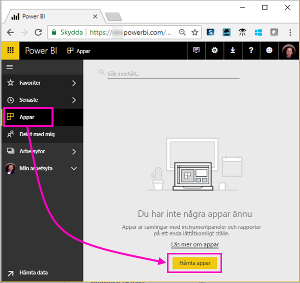
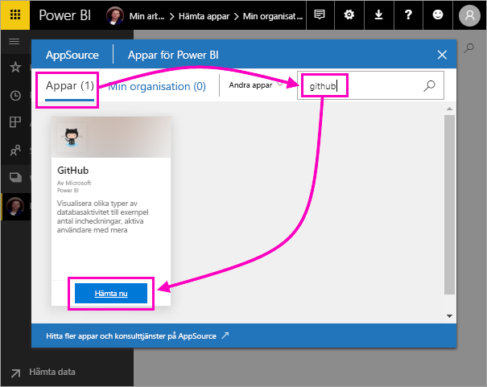
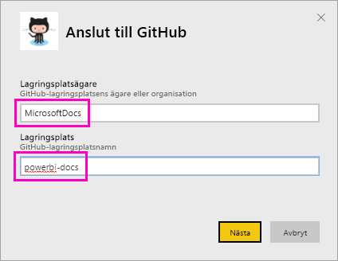
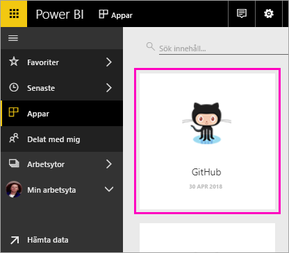
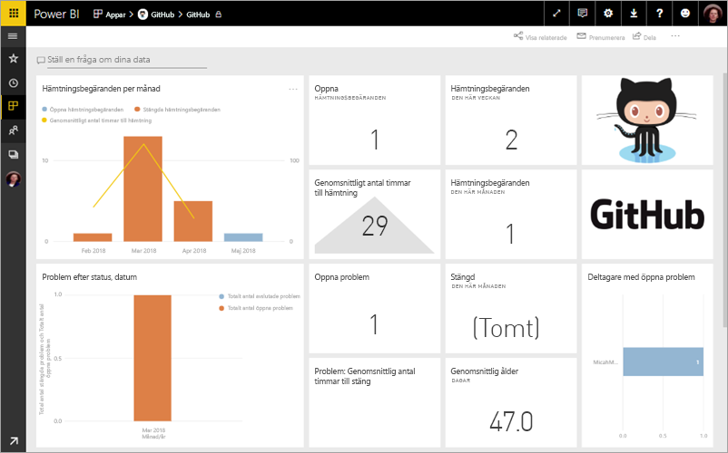
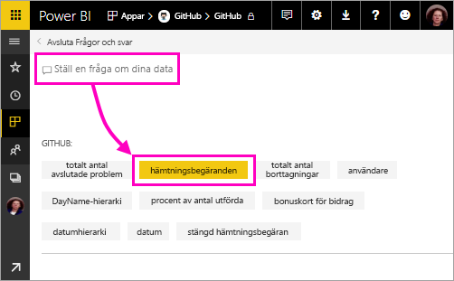
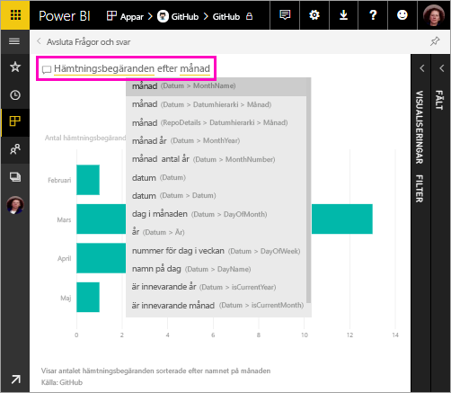
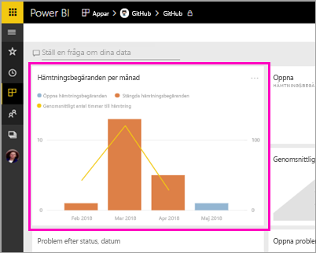
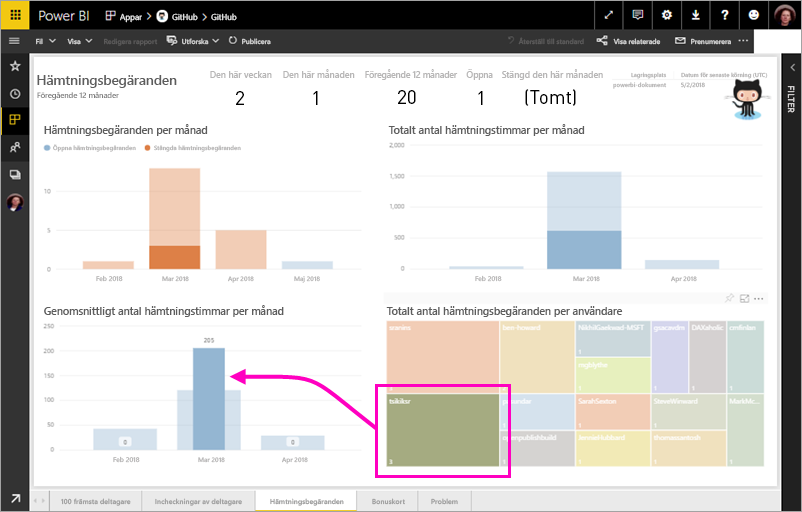

# Självstudie: Ansluta till ett GitHub-exempel med Power BI
I den här självstudien ska du ansluta till verkliga data i GitHub-tjänsten med Power BI, så skapar Power BI automatiskt instrumentpaneler och rapporter. Du ansluter till den offentliga lagringsplatsen (även kallad *databas*) för Power BI-innehåll och kan se information som: Hur många personer bidrar till det offentliga Power BI-innehållet? Vem bidrar med mest innehåll? Vilken dag i veckan har flest bidrag? Och få svar på andra frågor. 

I den här självstudien går du igenom följande steg:

> [!div class="checklist"]
> * Registrera dig för ett GitHub-konto om du inte redan har ett 
> * Logga in på ditt Power BI-konto, eller registrera dig om du inte redan har ett konto
> * Öppna Power BI-tjänsten
> * Leta upp GitHub-appen
> * Ange informationen för den offentliga GitHub-lagringsplatsen för Power BI
> * Visa instrumentpanelen och rapporten med GitHub-data
> * Rensa resurser genom att ta bort appen

Om du inte har registrerat dig för Power BI [registrerar du dig för en kostnadsfri utvärderingsversion](https://app.powerbi.com/signupredirect?pbi_source=web) innan du börjar.

## Förutsättningar

I den här kursen behöver du ett GitHub-konto om du inte redan har ett. 

- Registrera dig för ett [GitHub-konto](https://docs.microsoft.com/contribute/get-started-setup-github)

## Så här ansluter du
1. Logga in till Power BI-tjänsten (http://powerbi.com). 
2. Välj **Appar** i det vänstra navigeringsfönstret och välj sedan **Hämta appar**.
   
    

3. Välj **Appar**, skriv **github** i sökrutan > **Get it now** (Hämta nu).
   
    

4. Ange lagringsplatsens namn och ägare. URL:en för den här lagringsplatsen är https://github.com/MicrosoftDocs/powerbi-docs. **Lagringsplatsägare** är alltså **MicrosoftDocs** och **Lagringsplats** är **powerbi-docs**. 
   
    

5. Ange autentiseringsuppgifterna för GitHub som du skapade. Power BI kan hoppa över det här steget om du redan är inloggad i GitHub i din webbläsare. 

6. Som **autentiseringsmetod** väljer du **oAuth2** \> **Logga in**.

7. Följ autentiseringsskärmarna i GitHub. Ge Power BI behörighet till GitHub-data.
   
   Nu kan Power BI ansluta till GitHub och till informationen.  Data uppdateras en gång om dagen.

8. När data har importerats till Power BI ser du den nya GitHub-panelen. 
 
    

8. Minimera vänster navigeringsfönster så att du får mer plats genom att välja ikonen för global navigering.

    

10. Välj GitHub-panelen från steg 8. 
    
    GitHub-instrumentpanelen öppnas. Eftersom det här är live-data kanske du ser andra värden.

    

    

## Ställ en fråga

11. Placera markören i **Ställ en fråga om dina data** och välj sedan **Pull requests** (Pull-begäranden). 

    

12. Skriv **by month** (efter månad).
 
    

     Power BI skapar ett stapeldiagram som visar antalet pull-begäranden efter månad.

13. Välj **Avsluta Frågor och svar**.

## Visa GitHub-rapporten 

1. Öppna den relaterade rapporten genom att välja det kombinerade stapel- och linjediagrammet **Pull Requests by Month** (Pull-begäranden efter månad) på GitHub-instrumentpanelen.

    

2. Välj ett användarnamn i diagrammet **Total pull requests by user** (Totalt antal pull-begäranden efter användare). Som du ser i det här exemplet är det genomsnittliga antalet timmar större än medelvärdet för mars.

    

3. Visa nästa sida i rapporten genom att välja fliken **Punch Card** (Hålkort). 
 
    

    Tydligen lämnas flest *bidrag* på tisdagar kl. 15, när användarna skickar in arbete.

## Rensa resurser

Nu när du är klar med självstudien kan du ta bort GitHub-appen. 

1. Välj **Appar** i det vänstra navigeringsfältet.
2. Hovra över GitHub-ikonen och välj papperskorgen (**Ta bort**).

    

## Nästa steg

I den här självstudien har du anslutit till en offentlig GitHub-lagringsplats och hämtat data, som konverterades till en instrumentpanel och en rapport i Power BI. Du har besvarat några frågor om informationen genom att utforska instrumentpanelen och rapporten. Nu kan du läsa mer om hur du ansluter till andra tjänster, till exempel Salesforce, Microsoft Dynamics och Google Analytics. 
 
> [!div class="nextstepaction"]
> [Ansluta till onlinetjänster som du använder](./service-connect-to-services.md)

