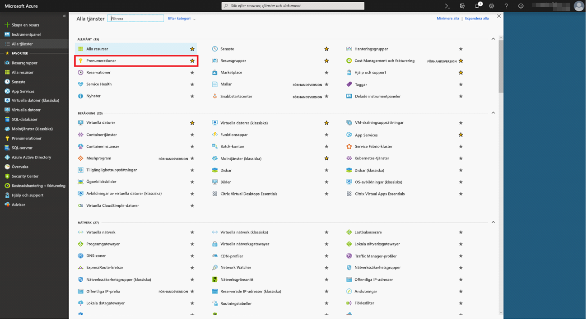
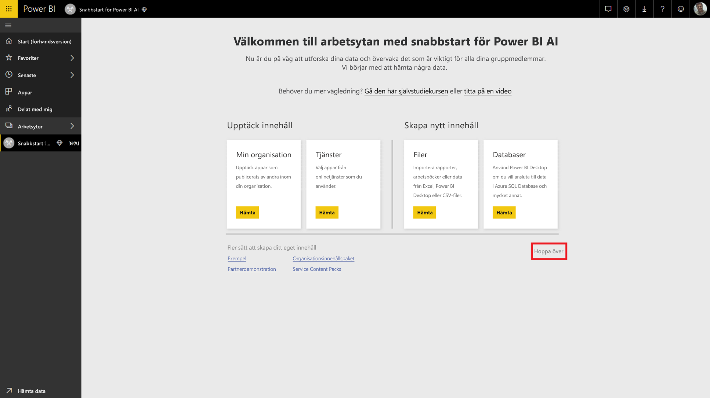
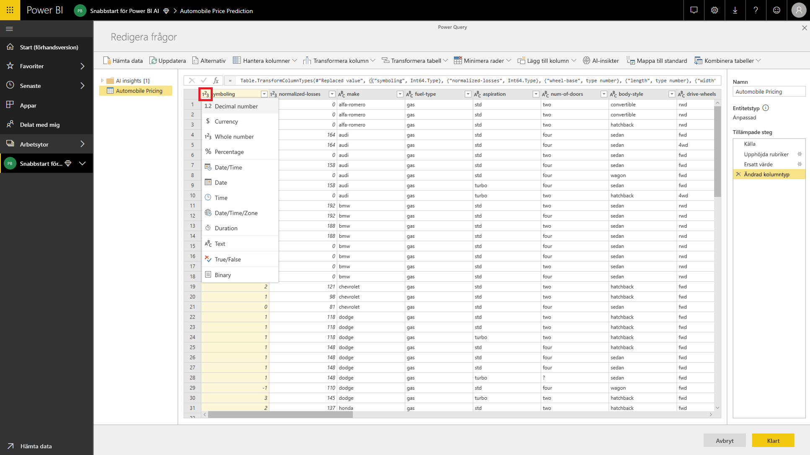
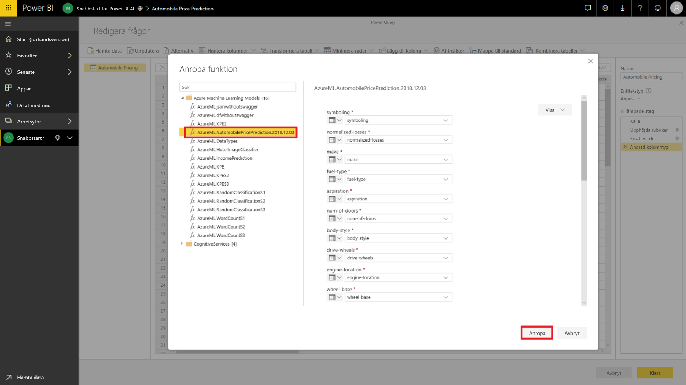
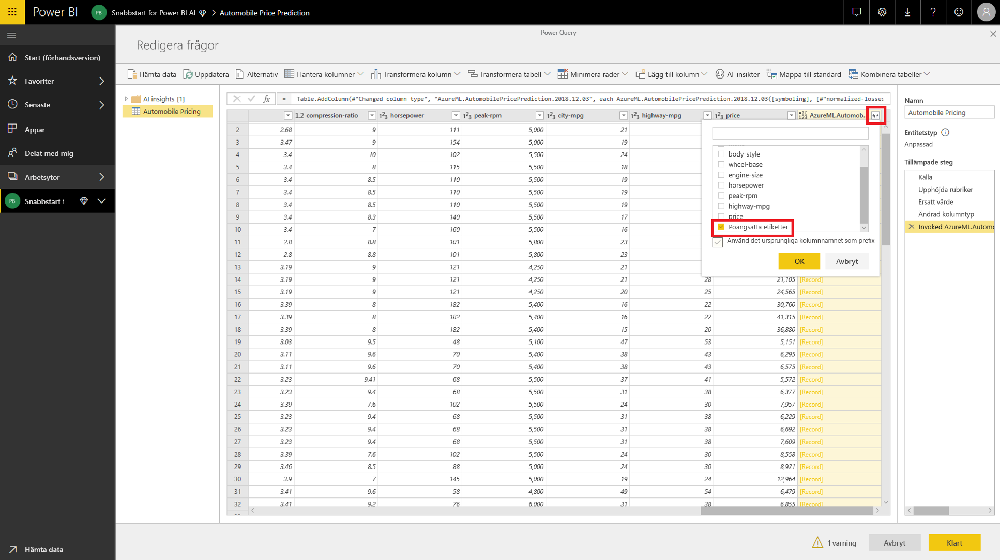

# Självstudie: Anropa en Machine Learning Studio-modell (klassisk) i Power BI (förhandsversion)

I den här självstudien går vi igenom funktionen för att införa insikter från en **Azure Machine Learning Studio-modell (klassisk)** till Power BI. Den här självstudien innehåller vägledning för att bevilja en Power BI-användaråtkomst till en Azure ML-modell, skapa ett dataflöde och tillämpa insikterna från Azure ML-modellen på ditt dataflöde. Den refererar också till snabbstartsguiden för att skapa en Azure ML-modell om du inte redan har en modell.

I självstudien går vi igenom följande steg:

> [!div class="checklist"]
> * Skapa och publicera en Azure Machine Learning-modell
> * Bevilja åtkomst till en Power BI-användare att använda modellen
> * Skapa ett dataflöde
> * Tillämpa insikter från Azure ML-modellen till dataflödet

## Skapa och publicera Azure ML-modell

Följ anvisningarna i [Genomgång steg 1: Skapa en Machine Learning Studio-arbetsyta (klassisk)](https://docs.microsoft.com/azure/machine-learning/studio/walkthrough-1-create-ml-workspace) för att skapa en **Machine Learning**-arbetsyta.

Du kan använda de här stegen med en Azure ML-modell eller datauppsättning som du redan har. Om du inte har en publicerad modell kan du skapa en modell på några minuter genom att referera till [Skapa ditt första dataexperiment i Azure Machine Learning Studio (klassisk)](https://docs.microsoft.com/azure/machine-learning/studio/create-experiment), som konfigurerar en Azure ML-modell för förutsägelser av bilpriser.

Följ stegen i [Distribuera en Azure Machine Learning Studio-webbtjänst (klassisk)](https://docs.microsoft.com/azure/machine-learning/studio/tutorial-part3-credit-risk-deploy) för att publicera Azure ML-modellen som en webbtjänst.

## Ge en Power BI-användare åtkomst

För att komma åt en Azure ML-modell från Power BI, måste du ha **Läs**-åtkomst till Azure-prenumerationen och resursgruppen och **Läs**-åtkomst till Azure Machine Learning Studio-webbtjänsten (klassisk) för Machine Learning Studio-modeller (klassisk).  För Azure Machine Learning-modeller behöver du **Läs**-åtkomst till Machine Learning-arbetsytan.

Följande steg förutsätter att du är medadministratör för Azure-prenumerationen och resursgruppen till vilken modellen publicerades.

Logga in på [Azure Portal](https://portal.azure.com) och navigera till sidan **Prenumerationer** som du hittar med hjälp av listan **Alla tjänster** på navigeringsmenyn.

Välj den prenumeration som du använde för att publicera modellen och välj **Åtkomstkontroll (IAM)** . Sedan väljer du **Lägg till rolltilldelning** och välj sedan rollen **Läsare** och välj Power BI-användaren. Välj **Spara** när du är klar. Följande bild visar dessa val.

Upprepa stegen ovan för att bevilja **Deltagar**-rollåtkomst till Power BI-användare för den specifika Machine Learning-webbtjänsten som Azure ML-modellen har distribuerats till.

## Skapa ett dataflöde

### Hämta data för att skapa dataflödet

Logga in på Power BI-tjänsten med autentiseringsuppgifterna för användaren som du har beviljat åtkomst till Azure ML-modellen i föregående steg.

Det här steget förutsätter att du har de data som du vill bedöma med din Azure ML-modell i CSV-format.  Om du har använt **Experimentet Bilpriser** för att skapa modellen i Machine Learning Studio (klassisk) delas datamängden i följande länk:

* [Azure Learning Studio-exempelmodell (klassisk)](https://github.com/santoshc1/PowerBI-AI-samples/blob/master/Tutorial_MLStudio_model_integration/Automobile%20price%20data%20_Raw_.csv)

### Skapa ett dataflöde

Logga in på Power BI-tjänsten för att skapa entiteter i ditt dataflöde, och navigera till en arbetsyta på din dedikerade kapacitet som har AI-förhandsversionen aktiverad.

Om du inte redan har en arbetsyta kan du skapa en genom att välja **Arbetsytor** i den vänstra menyn och sedan välja **Skapa arbetsyta** på panelen längst ned på sidan.  Då öppnas en panel för att ange arbetsytans information. Ange ett namn på arbetsytan och välj sedan **Spara**.

När arbetsytan har skapats kan du välja **Hoppa över** längst ner till höger på välkomstskärmen.

Välj fliken **Dataflöden (förhandsversion)** och välj sedan knappen **Skapa** längst upp till höger i arbetsytan och välj sedan **Dataflöde**.

Välj **Lägg till nya entiteter**, vilket startar **Power Query Editor** i webbläsaren.

Välj **Text/CSV-fil** som en datakälla.

På nästa skärm uppmanas du att ansluta till en datakälla. Klistra in en länk till de data som du använde för att skapa din Azure ML-modell. Om du har använt data för _Bilpriser_, kan du klistra in följande länk i rutan **Filsökväg eller URL** och sedan **Nästa**.

`https://raw.githubusercontent.com/MicrosoftLearning/Principles-of-Machine-Learning-Python/master/Module7/Automobile%20price%20data%20_Raw_.csv`

Power Query Editor visar en förhandsgranskning av data från CSV-filen. Välj **Transformera tabell** från kommandot i menyfliksområdet och välj sedan **Använd första raden som rubriker**.  Detta lägger till frågesteget _Upphöjda rubriker_ i rutan **Tillämpade steg** till höger. Du kan också byta namn på frågan till ett mer användarvänligt namn som _Bilpriser_ med hjälp av fönstret till höger.

Vår källdatauppsättning har okända värden satta till ”?”.  För att rensa detta vi kan ersätta ”?” med ”0” för att undvika fel senare för enkelhetens skull.  Gör detta genom att markera kolumnerna *normaliserade förluster*, *kaliber*, *slag*, *komprimeringsförhållande*, *hästkrafter* , *högsta rpm* och *pris* genom att klicka på deras namn i en kolumnrubrik, sedan klickar du på ”transformera kolumner” och väljer ”Ersätt värden”.  Ersätt ”?” med ”0”.

Alla kolumner i tabellen från en Text/CSV-källa behandlas som textkolumner.  Därefter behöver vi att ändra de numeriska kolumnerna till deras rätta datatyper.  Du kan göra detta i Power Query genom att klicka på symbolen för datatyp i kolumnrubriken.  Ändra kolumnerna till nedan typer:

- **Heltal**: symboler, normaliserade förluster, tjänstevikt, motorstorlek, hästkrafter, högsta rpm, stad-km/l, motorväg-km/l, pris
- **Decimaltal**: hjulbas, längd, bredd, höjd, kaliber, slag komprimeringsförhållande

Välj **Klar** för att stänga Power Query Editor. Det här alternativet visar entitetslistan med de data för _Bilpriser_ som vi har lagt till. Välj **Spara** i övre högra hörnet, ange ett namn för dataflödet och välj sedan **Spara**.

### Uppdatera dataflödet

När du sparar dataflödet visas ett meddelande om att ditt dataflöde har sparats. Välj **Uppdatera nu** för att mata in data från källan till dataflödet.

Välj **Stäng** i övre högra hörnet och vänta tills dataflödesuppdateringen är färdig.

Du kan också uppdatera ditt dataflöde med hjälp av kommandona **Åtgärder**. Dataflödet visar tidsstämpeln när uppdateringen har slutförts.

## Använd insikter från din Azure ML-modell

För att gå till Azure ML-modellen för _Bilpriser_, kan du redigera entiteten _Bilpriser_ för vilken vi vill lägga till det förväntade priset.

Genom att välja ikonen **Redigera** öppnas Power Query Editor för entiteter i ditt dataflöde.

Välj knappen **Alla insikter** i menyfliksområdet och välj sedan mappen _Azure Machine Learning-modeller_ i navigeringsfönstrets meny.

Azure ML-modeller som du har beviljats åtkomst till visas som Power Query-funktioner med prefixet *AzureML.*  När du klickar på den funktion som motsvarar modellen _AutomobilePricePrediction_, anges parametrarna för modellens webbtjänsten som funktionsparametrar.

Du kan ange någon av den valda entitetens kolumner som indata från listrutan för att anropa en Azure ML-modell. Du kan också ange ett konstant värde som ska användas som indata genom att klicka på kolumnikonen till vänster om dialogrutan Indata. När ett kolumnnamn matchar ett av namnen på funktionsparametrarna föreslås automatiskt kolumnen som indata.  Om kolumnnamnet inte matchar, kan du välja det från listrutan.

I fallet med modellen _Förutsägelse för bilpriser_ är indataparametrarna:

- märke
- karosstil
- hjulbas
- motorstorlek
- hästkrafter
- högsta rpm
- motorväg-km/l

I vårt fall, eftersom vår tabell matchar den ursprungliga datauppsättningen som används för att träna modellen, har alla parametrar redan rätt kolumner valda.

Välj **Anropa** för att visa förhandsversionen av Azure ML-modellens utdatafiler som en ny kolumn i entitetstabellen. Du kommer också att se modellanropet som ett tillämpat steg för frågan.

Utdata från modellen visas som en post i utdatakolumnen. Du kan expandera kolumnen för att skapa enskilda utdataparametrar i separata kolumner. I vårt fall är vi bara intresserade av_Poängsatta etiketter_ som innehåller det förväntade priset på bilen.  Vi avmarkerar resten och väljer **OK**.

Den resulterande kolumnen *Poängsatta etiketter* har prisförutsägelsen från Azure ML-modellen.

När du sparar ditt dataflöde anropas Azure ML-modellen automatiskt när dataflödet uppdateras, för alla nya eller uppdaterade rader i entitetstabellen.

## Rensa resurser

Om du inte längre behöver de resurser som du skapade med hjälp av den här artikeln kan du ta bort dem för att undvika eventuella kostnader.  Du kan också ta bort de dataflöden som du skapade, om du inte längre behöver dem.

## Nästa steg

I den här självstudien skapade du ett enkelt experiment med hjälp av Azure Machine Learning Studio (klassisk) med hjälp av en enkel datamängd med de här stegen:

- Skapa och publicera en Azure Machine Learning-modell
- Bevilja åtkomst till en Power BI-användare att använda modellen
- Skapa ett dataflöde
- Tillämpa insikter från Azure ML-modellen till dataflödet

Läs mer om Azure Machine Learning-integrering i Power BI, [Azure Machine Learning-integrering i Power BI (förhandsversion)](service-machine-learning-integration.md).
