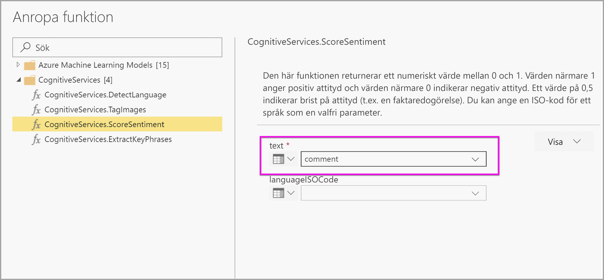
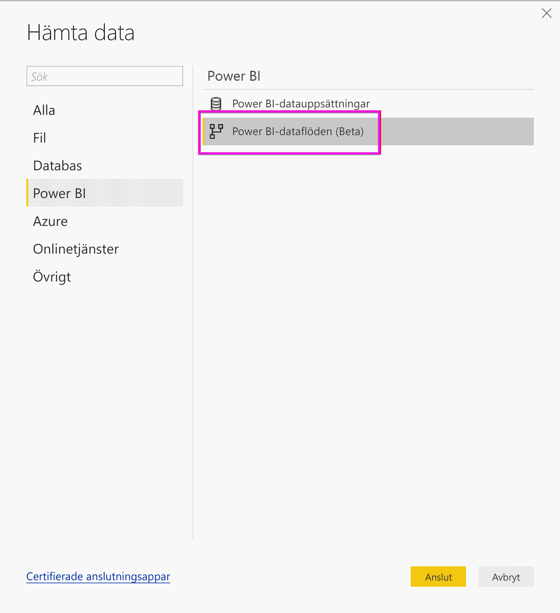
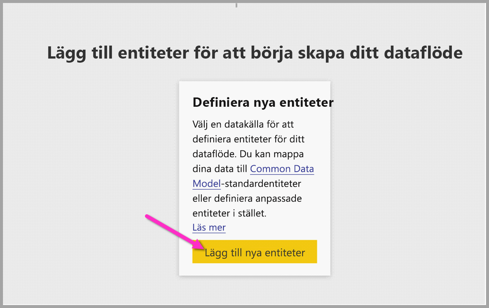
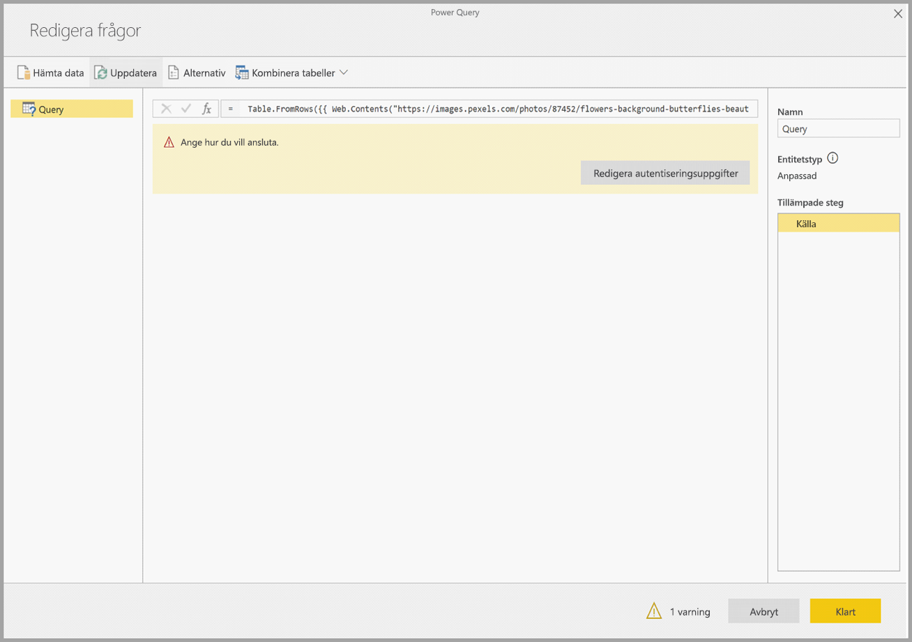
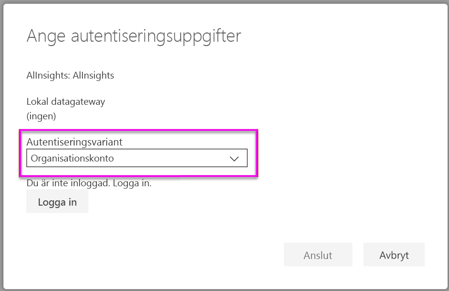
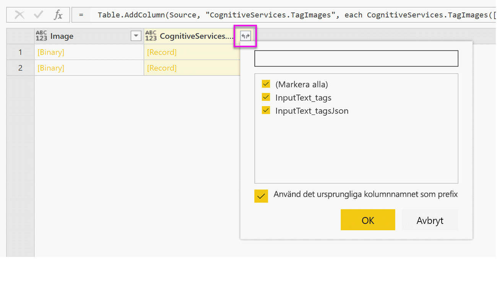

# <a name="tutorial-use-cognitive-services-in-power-bi"></a>Självstudie: Använda Cognitive Services i Power BI

Power BI ger tillgång till en uppsättning funktioner från Azure Cognitive Services för att utöka dina data i självbetjänade dataförberedelser för dataflöden. De tjänster som stöds i dag är [Attitydanalys](https://docs.microsoft.com/azure/cognitive-services/text-analytics/how-tos/text-analytics-how-to-sentiment-analysis), [Extrahering av diskussionsämne](https://docs.microsoft.com/azure/cognitive-services/text-analytics/how-tos/text-analytics-how-to-keyword-extraction), [Språkidentifiering](https://docs.microsoft.com/azure/cognitive-services/text-analytics/how-tos/text-analytics-how-to-language-detection) och [Bildtaggning](https://docs.microsoft.com/azure/cognitive-services/computer-vision/concept-tagging-images). Omvandlingarna utförs i Power BI-tjänsten och kräver inte en Azure Cognitive Services-prenumeration. Den här funktionen kräver Power BI Premium.

Cognitive Services-omvandlingar har stöd i [Självbetjänad dataförberedelse för dataflöden](https://powerbi.microsoft.com/blog/introducing-power-bi-data-prep-wtih-dataflows/). Använd de stegvisa exemplen för textanalys och bildtaggning nedan för att komma igång.

I de här självstudierna får du lära dig att

> [!div class="checklist"]
> * Importera data till ett dataflöde
> * Bedöm sentiment och extrahera nyckelfraser i en textkolumn i ett dataflöde
> * Anslut till resultaten från Power BI Desktop


## <a name="prerequisites"></a>Förutsättningar

För att göra den här självstudien behöver du följande: 

- Ett Power BI-konto. Om du inte har registrerat dig för Power BI [registrerar du dig för en kostnadsfri utvärderingsversion](https://app.powerbi.com/signupredirect?pbi_source=web) innan du börjar.
- Åtkomst till en Power BI Premium-kapacitet med AI-arbetsbelastningen aktiverad. Den här arbetsbelastningen inaktiveras som standard under förhandsversionen. Om du har i en Premium-kapacitet och AI Insights inte visas kontaktar du administratören för Premium-kapaciteten om du vill aktivera arbetsbelastningen AI i administrationsportalen.

## <a name="text-analytics"></a>Textanalys

Följ stegen i det här avsnittet för att slutföra textanalysdelen av självstudien.

### <a name="step-1-apply-sentiment-scoring-in-power-bi-service"></a>Steg 1: Tillämpa sentimentbedömning i Power BI-tjänsten

Navigera till en Power BI-arbetsyta med Premium-kapacitet för att komma igång och skapa ett nytt dataflöde med knappen **Skapa** längst upp till höger på skärmen.


Dialogrutan för dataflödet visar alternativen för att skapa ett nytt dataflöde. Välj **Lägg till nya entiteter.** Välj sedan **Text/CSV** från menyn av datakällor.


Klistra in URL:en i URL-fältet: [https://pbiaitutorials.blob.core.windows.net/textanalytics/FabrikamComments.csv](https://pbiaitutorials.blob.core.windows.net/textanalytics/FabrikamComments.csv) och klicka på **Nästa.**


I det övre menyfliksområdet väljer du **Transformera tabell** och sedan **Använd första raden som rubriker.** Data är nu klar att användas för textanalys och vi kan använda Sentimentbedömning och Extrahering av diskussionsämne på kolumnen Kundkommentarer.

I Power Query Editor väljer du **AI-insikter**


Expandera mappen **Cognitive Services** och välj funktionen som du vill använda. Det här exemplet bedömer sentiment i kommentarkolumnen, men du kan följa samma steg för att prova språkidentifiering och Extrahering av diskussionsämne.


När en funktion är vald visas de obligatoriska och valfria fälten. Välj granskningskolumnen som textinmatning för att bedöma sentiment i exempelgranskningarna. Kulturinformation är en valfri inmatning och kräver ett ISO-format. Ange till exempel ”en” om du vill att texten som ska behandlas som engelska. Om fältet lämnas tomt identifierar Power BI först språket i indatavärdet innan sentimentbedömningen.



Välj nu **Anropa** för att köra funktionen. En ny kolumn med sentimentpoäng för varje rad har lagts till i tabellen. Du kan gå tillbaka till **AI-insikter** för att extrahera nyckelfraser i granskningstexten på samma sätt.

När du är klar med omvandlingarna ändrar du frågans namn till ”kundkommentarer” och väljer **Klar.**


**Spara** sedan dataflödet och ge det namnet Fabrikam. Välj knappen **Uppdatera nu** som visas när du har sparat dataflödet.


När dataflödet sparas och uppdateras, kan du använda det i en Power BI-rapport.

### <a name="step-2-connect-from-power-bi-desktop"></a>Steg 2: Anslut från Power BI Desktop

Öppna Power BI Desktop. I menyfliken Start väljer du **Hämta data**.

Navigera till **Power BI-dataflöden (beta**) i Power BI och välj **Anslut.**



Eftersom det här är en förhandsgranskningsfunktion, blir du ombedd att acceptera villkoren för förhandsversionen. Logga in med ditt organisationskonto efter att du har godkänt.


Välj det dataflöde som du just har skapat. Navigera till tabellen Kundkommentarer och klicka på **Läs in.**


Nu läses data in och du kan börja skapa en rapport.

## <a name="image-tagging"></a>Bildtaggning

Navigera till en Power BI-arbetsyta med Premium-kapacitet. Skapa ett nytt dataflöde med knappen **Skapa** längst upp till höger på skärmen.


Välj **Lägg till nya entiteter**.



När du uppmanas att välja en datakälla, väljer du **Tom fråga.**


Kopiera frågan nedan i frågeredigeraren och klicka på Nästa. Du kan ersätta URL-sökvägarna nedan med andra bilder eller lägga till fler rader. Funktionen *Web.Contents* importerar bild-URL:en som binär. Om du har en datakälla med bilder lagrad som binär, kan du också använda den direkt.


```python
let
  Source = Table.FromRows({
  { Web.Contents("https://images.pexels.com/photos/87452/flowers-background-butterflies-beautiful-87452.jpeg") },
  { Web.Contents("https://upload.wikimedia.org/wikipedia/commons/5/53/Colosseum_in_Rome%2C_Italy_-_April_2007.jpg") }}, { "Image" })
in
  Source
```


När du tillfrågas om autentiseringsuppgifter, välj *anonym*.



Du ser följande bild.


Du uppmanas att ange autentiseringsuppgifter för varje enskild webbsida.

Välj **AI-insikter** i frågeredigeraren.


Logga sedan in med ditt **organisationskonto**.



Välj funktionen tagga bilder, ange _[binära]_ i kolumnfältet och _en_ i fältet kulturinformation. 

> [!NOTE]
> Du kan för närvarande kan inte välja en kolumn med en listruta. Detta kommer att lösas så snart som möjligt under den privata förhandsgranskningen.


Ta bort citattecknen runt kolumnnamnet i funktionsredigeraren. 

> [!NOTE]
> Att ta bort citattecknen är en tillfällig lösning och kommer att åtgärdas så snart som möjligt under förhandsversionen.


Funktionen returnerar en post med både taggarna i CSV-format och som en json-post. Välj Expandera-knappen för att lägga till en eller båda som kolumner i tabellen.



Välj **Klar** och spara dataflödet. När du har uppdaterat dataflödet, kan du ansluta till det från Power BI Desktop med anslutningsappar för dataflöden. (Se steg på sidan 5 i det här dokumentet).

## <a name="clean-up-resources"></a>Rensa resurser

När den inte längre behövs kan du ta bort frågan genom att högerklicka på frågans namn i Power Query-redigeraren och välja **Ta bort**.

## <a name="next-steps"></a>Nästa steg

I den här självstudien har du använt funktioner för bedömning av sentiment och bildtaggning på ett Power BI-dataflöde. Om du vill veta mer om Cognitive Services i Power BI kan du läsa följande artiklar.

* [Cognitive Services i Azure](https://docs.microsoft.com/azure/cognitive-services/)
* Kom igång [med självbetjänad dataförberedelse på dataflöden](service-dataflows-overview.md)
* Mer information om [Power BI Premium](https://powerbi.microsoft.com/power-bi-premium/)

Följande artiklar kan också vara av intresse för dig.

* [Självstudier: Anropa en Machine Learning Studio-modell i Power BI (förhandsgranskning)](service-tutorial-invoke-machine-learning-model.md)
* [Azure Machine Learning-integrering i Power BI (förhandsversion)](service-machine-learning-integration.md)
* [Cognitive Services i Power BI (förhandsversion)](service-cognitive-services.md)