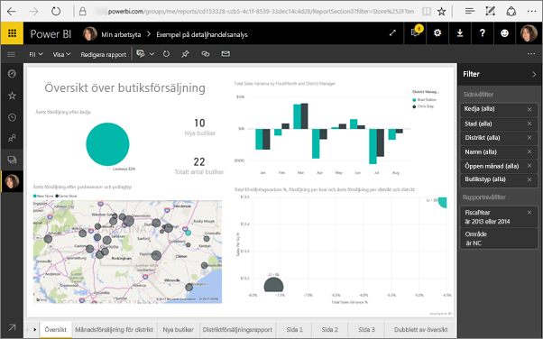

# <a name="filter-a-report-using-query-string-parameters-in-the-url"></a>Filtrera en rapport med frågesträngparametrar i URL:en

När du öppnar en rapport i Power BI-tjänsten har varje sida i rapporten en egen unik URL. Du kan använda filterfönstret på rapportarbetsytan om du vill filtrera rapportsidan.  Eller så kan du lägga till frågesträngsparametrar i URL:en för att förfiltrera rapporten. Du kanske har en rapport som du vill visa dina kolleger men du vill filtrera den först åt dem. Ett sätt att göra detta på är att börja med standard-URL:en för rapporten, lägga till filterparametrar och sedan skicka dem hela den nya URL:en med e-post.


## <a name="uses-for-query-string-parameters"></a>Användningsområden för frågesträngsparametrar

Anta att du arbetar i Power BI Desktop och vill skapa en rapport som har länkar till andra Power BI-rapporter – men du vill visa bara en del av informationen i de andra rapporterna. Först filtrerar du rapporterna med hjälp av frågesträngsparametrarna och sparar URL:erna. Sedan skapar du en tabell i Desktop med dessa nya rapport-URL:er.  Publicera sedan och dela rapporten.

Ett annat användningsområde för frågesträngsparametrar är att någon skapar en avancerad Power BI-lösning.  Med DAX skapar personen en rapport som genererar en filtrerad rapport-URL dynamiskt baserat på det val som kunden gör i den aktuella rapporten. När kunder väljer URL ser de bara den avsedda informationen. 

## <a name="query-string-parameter-syntax-for-filtering"></a>Frågesträngparameterns syntax för filtrering

Med parametrar kan du filtrera rapporten för ett eller flera värden, även om dessa värden innehåller blanksteg eller specialtecken. Syntaxen är ganska enkel: du börjar med rapport-URL:en, lägger till ett frågetecken och lägger sedan till filtersyntaxen.

URL?filter=***Tabell***/***Fält*** eq '***värde***'


* Namnen **Tabell** och **Fält** är skiftlägeskänsliga, men **värde** är det inte.
* Fält som är dolda från rapportvyn kan fortfarande filtreras.

### <a name="field-types"></a>Fälttyper

Fälttypen kan vara ett nummer, en datetime eller en sträng, och den typ som används måste matcha den angivna typen i datamängden.  Till exempel fungerar det inte att ange en tabellkolumn av typen ”string” (sträng) om du vill få en datetime eller ett numeriskt värde i en kolumnuppsättning för en datamängd som ett datum (exempelvis Table/StringColumn eq 1).

* **Strängar** måste omges av enkla citattecken – ”chefsnamn”.
* **Nummer** kräver ingen särskild formatering
* **Datum och tider** måste omges av enkla citattecken och föregås av ordet **DateTime**.

Om du fortfarande tycker det är förvirrande kan du fortsätta läsa så förklarar vi mer.  

## <a name="filter-on-a-field"></a>Filtrera i ett fält

Vi antar att URL:en till vår rapport är följande.


Och vi ser i vår kartvisualisering (ovan) att vi har butiker i North Carolina.

>[!NOTE]
>Det här exemplet är baserat på [Exempel på detaljhandelsanalys](sample-datasets.md).
> 

Filtrera rapporten till att endast visa data för butiker i ”NC” (North Carolina) genom att lägga till följande i URL:en:

?filter=Butik/Område eq 'NC'


>[!NOTE]
>*NC* är ett värde som lagras i fältet **Område** i tabellen **Butik**.
> 

Vår rapport är filtrerad för North Carolina, vilket innebär att alla visualiseringar på rapportsidan endast visar data för North Carolina.



## <a name="filter-on-multiple-fields"></a>Filtrera på flera fält

Du kan också filtrera på flera fält genom att lägga till ytterligare parametrar i URL:en. Nu går vi tillbaka till vår ursprungliga filterparameter.

```
?filter=Store/Territory eq 'NC'
```

Om du vill filtrera på ytterligare fält lägger du till ett **and** (och) och ett till fält i samma format som ovan. Här är ett exempel.

```
?filter=Store/Territory eq 'NC' and Store/Chain eq 'Fashions Direct'
```

<iframe width="640" height="360" src="https://www.youtube.com/embed/0sDGKxOaC8w?showinfo=0" frameborder="0" allowfullscreen></iframe>

## <a name="operators"></a>Operatorer

Power BI stöder många operatorer utöver **and**. I tabellen nedan visas de operatorerna tillsammans med den innehållstyp som de stöder.

|operator  | definition | sträng  | nummer | Datum |  Exempel|
|---------|---------|---------|---------|---------|---------|
|**and**     | och |  ja      | ja |  ja|  produkt/pris le 200 och pris gt 3,5 |
|**eq**     | är lika med |  ja      | ja   |  ja       | Adress/ort eq 'Redmond' |
|**ne**     | inte lika med |   ja      | ja  | ja        |  Adress/ort ne 'London' |
|**ge**     |  större än eller lika med       | nej | ja |ja |  produkt/pris ge 10
|**gt**     | större än        |nej | ja | ja  | produkt/pris ge 20
|**le**     |   mindre än eller lika med      | nej | ja | ja  | produkt/pris le 100
|**lt**     |  mindre än       | nej | ja | ja |  produkt/pris lt 20
|**in****     |  inklusive       | ja | ja |  ja | Student/ålder in (27, 29)


\** Vid användning av **i** kan värden till höger om **in** vara en kommaavgränsad lista som omges av parenteser eller ett enda uttryck som returnerar en samling.

### <a name="numeric-data-types"></a>Numeriska datatyper

Ett Power BI-URL-filter kan innehålla nummer i följande format.

|Nummertyp  |Exempel  |
|---------|---------|
|**integer** (heltal)     |   5      |
|**long**     |   5L eller 5l      |
|**double**     |   5,5 eller 55e-1 eller 0,55e+1 eller 5D eller 5d eller 0,5e1D eller 0,5e1d eller 5,5D eller 5,5d eller 55e-1D eller 55e-1d     |
|**decimal**     |   5M eller 5m eller 5,5M eller 5,5m      |
|**float**     | 5F eller 5f eller 0,5e1F eller 0,5e-1d        |

### <a name="date-data-types"></a>Datatyper för datum

Power BI stöder både OData V3 och V4 för datatyperna **Date** (datum) och **DateTimeOffset**.  Datum representeras med hjälp av EDM-format (2019-02-12T00:00:00). Det innebär att när du anger ett datum som ÅÅÅÅ-MM-DD tolkar Power BI det som ÅÅÅÅ-MM-DDT00:00:00.

Varför är den här skillnaden viktig? Anta att du skapar frågesträngsparametern **tabell/datum gt 2018-08-03**.  Kommer resultatet att innehålla 3 augusti 2018 eller börja med 4 augusti 2018? Eftersom Power BI omvandlar din fråga till **tabell/datum gt 2018-08-03T00:00:00** innehåller resultatet alla datum med en tidsdel som inte är noll eftersom de datumen skulle vara större än **2018-08-03T00:00:00**.

## <a name="special-characters-in-url-filters"></a>Specialtecken i URL-filter

Specialtecken och blanksteg kräver viss ytterligare formatering. När frågan innehåller blanksteg, bindestreck eller andra icke-ASCII-tecken ska du prefigera dessa specialtecken med en *escape-kod* som börjar med ett understreck och ett X (**_x**) och fyrsiffrig **Unicode** följt av ännu ett understreck. Om Unicode är färre än 4 tecken behöver du fylla på det med nollor. Nedan visas några exempel.

|Identifierare  |Unicode  | Kodning för Power BI  |
|---------|---------|---------|
|**Tabellnamn**     | Blanksteg är 0x20        |  Table_x0020_Name       |
|**Kolumn**@**Nummer**     |   @ är 0x40     |  Column_x0040_Number       |
|**[Kolumn]**     |  [ är 0x0058 ] är 0x0050       |  _x0058_Column_x0050       |
|**Column+Plus**     | + är 0x2B        |  Column_x002B_Plus       |

Table_x0020_Name/Column_x002B_Plus eq 3 


Table_x0020_Special/_x005B_Column_x0020_Brackets_x005D_ eq '[C]' 

### <a name="use-dax-to-filter-on-multiple-values"></a>Använda DAX för att filtrera på flera värden

Ett annat sätt att filtrera på flera fält är genom att skapa en beräknad kolumn som sammanfogar två fält till ett enstaka värde. Sedan kan du filtrera efter det värdet.

Vi har till exempel två fält: Område och Kedja. I Power BI Desktop [skapar du en ny beräknad kolumn](desktop-tutorial-create-calculated-columns.md) (fält) med namnet OmrådeKedja. Kom ihåg att namnet **Fält** inte får innehålla några blanksteg. Här är DAX-formeln för kolumnen.

OmrådeKedja = [Område] & " - " & [Kedja]

Publicera rapporten till Power BI-tjänsten och använd sedan URL-frågesträngen för att enbart filtrera och visa data för Lindseys butiker i NC.

    https://app.powerbi.com/groups/me/reports/8d6e300b-696f-498e-b611-41ae03366851/ReportSection3?filter=Store/TerritoryChain eq 'NC–Lindseys'

## <a name="pin-a-tile-from-a-filtered-report"></a>Fästa en panel från en filtrerad rapport

När du har filtrerat rapporten med frågesträngparametrarna kan du fästa visualiseringarna från rapporten på instrumentpanelen.  Panelen på instrumentpanelen visar filtrerade data och när du väljer den instrumentpanelen öppnas rapporten som användes för att skapa den.  Emellertid sparas inte filtreringen som du gjorde med hjälp av URL:en i rapporten och när instrumentpanelen är markerad öppnas rapporten i sitt ofiltrerade tillstånd.  Det innebär att data som visas i instrumentpanelen inte matchar de data som visas i rapportvisualiseringen.

Det här är användbart när du vill se olika resultat: filtrerade på instrumentpanelen och ofiltrerade i rapporten.

## <a name="considerations-and-troubleshooting"></a>Överväganden och felsökning

Det finns några saker som du bör vara medveten om när du använder frågesträngparametrarna.

* Vid användning av *in*-operatorn måste värden till höger om *ii* vara antingen en kommaavgränsad lista som omges av parenteser.    
* I Power BI-rapportservern kan du [skicka rapportparametrar ](https://docs.microsoft.com/sql/reporting-services/pass-a-report-parameter-within-a-url?view=sql-server-2017.md) genom att ta med dem i en rapport-URL. Dessa URL-parametrar har inget prefix eftersom de skickas direkt till rapportbearbetningsmotorn.
* Frågesträngsfiltrering fungerar inte med [Publicera på webben](service-publish-to-web.md).
* [Bädda in med rapportwebbdel i SharePoint Online](service-embed-report-spo.md) har inte stöd för URL-filter.
* Datatypen long är (2^53-1) på grund av begränsningar i Javascript.
* Rapportfilter för URL har en begränsning på 10 uttryck (10 filter som är hopkopplade med AND).

## <a name="next-steps"></a>Nästa steg

[Fästa en visualisering på en instrumentpanel](service-dashboard-pin-tile-from-report.md)  
[Registrera dig för en kostnadsfri utvärderingsversion](https://powerbi.microsoft.com/get-started/)

Har du fler frågor? [Fråga Power BI Community](http://community.powerbi.com/)
