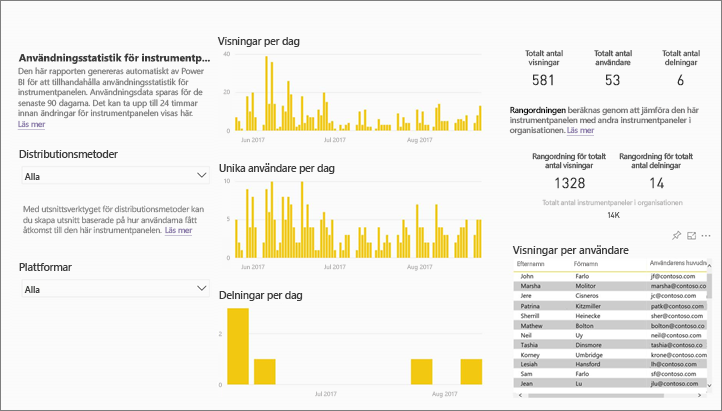
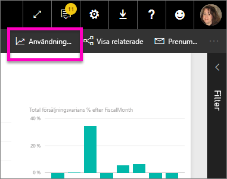
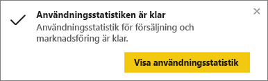
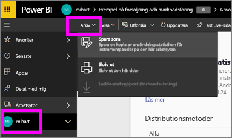
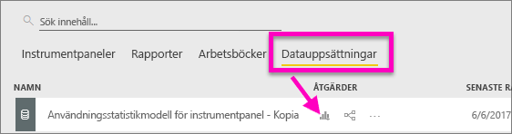
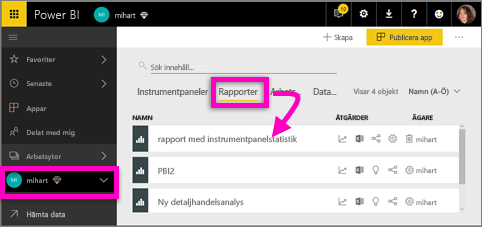
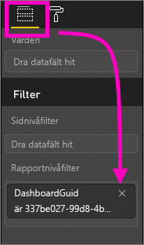
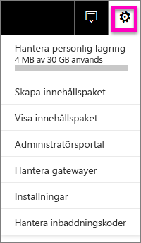
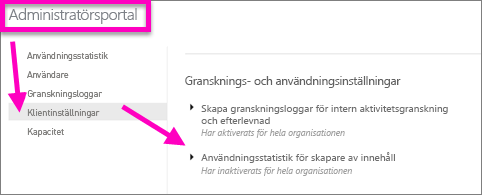

# Övervaka användningsstatistik för Power BI-instrumentpaneler och -rapporter

Om du skapar instrumentpaneler och rapporter kan du med användningsstatistik förstå deras inverkan. Oavsett om du kör användningsstatistik för instrumentpaneler eller rapporter ser du hur dessa instrumentpaneler och rapporter används i hela organisationen – vad som används, av vem och i vilket syfte.  

> [!NOTE]
> Användningsstatistik spårar användningen av rapporter som är inbäddade i SharePoint Online. Dock spårar inte användningsstatistik inbäddning av instrumentpaneler och rapporter via flödena ”användare äger autentiseringsuppgifterna” och ”appen äger autentiseringsuppgifterna”. Användningsstatistik spårar inte heller användning av rapportinbäddning via [publicera till webben](service-publish-to-web.md).

Dessa användningsstatistikrapporter är skrivskyddade. Men du kan anpassa en användningsstatistikrapport med hjälp av ”Spara som”. Detta skapar en helt ny datauppsättning och konverterar den skrivskyddade rapporten till en fullständig Power BI-rapport som du kan redigera. Den anpassade rapporten innehåller inte bara mått för vald instrumentpanel eller rapport, utan genom att ta bort standardfiltret har du nu tillgång till användningsstatistik för alla instrumentpaneler och rapporter i den valda arbetsytan. Du kan även se namnen på dina slutanvändare.

## Varför är användningsstatistik viktigt för mig?

Genom att känna till hur ditt innehåll används ser du vilken inverkan det har och du kan prioritera dina åtgärder. Användningsstatistik kan t.ex. visa att en av dina rapporter används dagligen av en stor del av organisationen eller att en instrumentpanel som du har skapat inte används alls. Den här typen av feedback är ovärderlig vid planeringen av ditt arbete.

Det går bara att köra användningsstatistikrapporter i Power BI-tjänsten.  Men om du sparar användningsstatistikrapporten eller fäster den på en instrumentpanel kan du öppna och interagera med rapporten på mobila enheter.

### Förutsättningar

- Användningsstatistikfunktionen samlar in användningsinformation från alla användare, oavsett vilken licens de har tilldelats. Det krävs dock en Power BI Pro-licens för att kunna köra och få åtkomst till användningsstatistikdata.
- Användningsstatistiken finns i instrumentpaneler och rapporter på den valda arbetsytan. För att få åtkomst till användningsstatistik för en viss instrumentpanel eller rapport, måste du:    
    • Ha redigeringsåtkomst till instrumentpanelen eller rapporten • Ha en Pro-licens

## Om användningsstatistikrapporten

När du väljer **Användningsstatistik** eller ikonen  skapar Power BI en färdig rapport med användningsstatistik för innehållet under de senaste 90 dagarna.  Rapporten liknar de Power BI-rapporter som du redan är bekant med, men den har utformats för att vara informativ – inte interaktiv. Du kommer att kunna segmentera innehållet baserat på hur dina slutanvändare har åtkomst till det, t.ex. via webben eller en mobilapp. Allt eftersom dina instrumentpaneler och rapporter utvecklas, kommer även användningsstatistikrapporten göra det, med dagliga uppdateringar av nya data.  

Användningsstatistikrapporterna visas inte i **Senaste**, **Arbetsytor**, **Favoriter** eller andra innehållslistor. De kan inte läggas till i en app. Om du fäster en panel från en användningsstatistikrapport på en instrumentpanel går det inte att lägga till instrumentpanelen i en app eller ett innehållspaket.

Fördjupa dig i rapportdatan eller skapa egna rapporter mot datauppsättningen med **Spara som** (se [Spara användningsstatistikrapporten som en fullständig Power BI-rapport](#save-the-usage-metrics-report-as-a-full-featured-power-bi-report-personalize)).

## Öppna en användningsstatistikrapport för en instrumentpanel eller rapport

1. Starta från arbetsytan som innehåller instrumentpanelen eller rapporten.
2. Gå antingen till arbetsytans innehållslista, instrumentpanelen eller själva rapporten och välj ikonen **Användningsstatistik** .

    

    
3. Första gången du gör detta skapar Power BI användningsstatistikrapporten och talar om för dig när den är klar.

    
4. Om du vill öppna resultaten väljer du **Visa användningsstatistik**.

    Användningsstatistiken är en kraftfull bundsförvant när du arbetar med att distribuera och underhålla Power BI-instrumentpaneler och rapporter. Undrar du vilka sidor i rapporten som är mest användbara och vilka som du bör fasa ut? Ta ett utsnitt efter **Rapportsida** för att ta reda på det. Undrar du om du ska skapa en mobil layout för instrumentpanelen? Ta ett utsnitt efter **Plattformar** för att upptäcka hur många användare som har åtkomst till ditt innehåll via mobilappar kontra webbläsaren.

5. Du kan även hovra över en visualisering och välja fäst-ikonen för att lägga till visualiseringen på en instrumentpanel. Eller välj **Fäst Live-sidan** från den översta menyraden för att lägga till hela sidan på en instrumentpanel. Från instrumentpanelen kan du övervaka användningsstatistik enklare eller dela dem med andra.

    > [!NOTE]
    > Om du fäster en panel från en användningsstatistikrapport på en instrumentpanel går det inte att lägga till instrumentpanelen i en app eller ett innehållspaket.

## Vilka mått rapporteras?

| Mått | Instrumentpanel | Rapport | Beskrivning |
| --- | --- | --- | --- |
| Distributionsmetod för utsnitt |ja |ja |Hur användare får åtkomst till innehållet. Det finns tre möjliga sätt: Användarna kan få åtkomst till instrumentpanelen eller rapporten genom att vara medlemmar i en [apparbetsyta](consumer/end-user-experience.md), genom att låta innehållet [delas med dem](service-share-dashboards.md) eller genom att installera ett innehållspaket eller en app.  Observera att vyer via en app räknas som ”innehållspaket”. |
| Plattformsutsnitt |ja |ja |Användes instrumentpanelen eller rapporten via Power BI-tjänsten (powerbi.com) eller en mobil enhet? Mobilt innefattar alla våra iOS-, Android- och Windows-appar. |
| Utsnitt för rapportsidan |nej |ja |Om rapporten innehåller mer än en sida kan du dela upp rapporten i den sida eller de sidor som visades. Om du ser listalternativet ”Tom” betyder det att en rapportsida nyligen lagts till (inom 24 timmar kommer det riktiga namnet på den nya sidan visas i listan med utsnitt) och/eller att rapportsidor har tagits bort. I ”Tom” finns dessa typer av situationer. |
| Visningar per dag |ja |ja |Totalt antal visningar per dag – en visning definieras när en användare läser in en rapportsida eller instrumentpanel. |
| Unika användare per dag |ja |ja |Antal *olika* användare som visat instrumentpanelen eller rapporten (baserat på AAD-användarkontot). |
| Visningar per användare |ja |ja |Antal visningar de senaste 90 dagarna, fördelat på enskilda användare. |
| Delningar per dag |ja |nej |Antal gånger som instrumentpanelen har delats med en annan användare eller grupp. |
| Totalt antal visningar |ja |ja |Antal visningar de senaste 90 dagarna. |
| Totalt antal användare |ja |ja |Antal unika användare de senaste 90 dagarna. |
| Totalt antal delningar |ja |nej |Antal gånger instrumentpanelen eller rapporten har delats under de senaste 90 dagarna. |
| Totalt i organisationen |ja |ja |Antal instrumentpaneler och rapporter i hela organisationen som har minst en visning under de senaste 90 dagarna.  Används för att beräkna rangordning. |
| Rangordning: Totalt antal visningar |ja |ja |Visar hur instrumentpanelen eller rapporten rangordnas vid totalt antal visningar för alla instrumentpaneler och rapporter i organisationen under de senaste 90 dagarna. |
| Rangordning: Totalt antal delningar |ja |nej |Visar hur instrumentpanelen eller rapporten rangordnas vid totalt antal delningar för alla instrumentpaneler i organisationen under de senaste 90 dagarna. |

### Användningsstatistikrapport för instrumentpanel

### Användningsstatistikrapport för rapport

## Spara användningsstatistikrapporten som en fullständig Power BI-rapport (anpassa)

Använd **Spara som** för att konvertera användningsstatistikrapporten till en fullständig Power BI-rapport som kan anpassas och delas. När du har skapat en anpassad kopia får du fullständig åtkomst till den underliggande datauppsättningen, så att du kan anpassa användningsstatistikrapporten för dina specifika behov. Du kan även använda Power BI Desktop till att skapa anpassade användningsstatistikrapporter med hjälp av [live-anslutningen till Power BI-tjänstfunktionen](https://powerbi.microsoft.com/blog/connecting-to-datasets-in-the-power-bi-service-from-desktop).

Den underliggande datauppsättningen innehåller dessutom användningsinformation för alla instrumentpaneler och rapporter på arbetsytan. Detta öppnar ännu en värld av möjligheter. Du kan till exempel skapa en rapport som jämför alla instrumentpaneler i arbetsytan baserat på deras användning. Eller skapa en instrumentpanel för användningsstatistik i Power BI-appen genom att sammanställa användningen för allt innehåll som distribueras inom appen.  Se [Ta bort sidnivåfiltret](#remove-the-filter-to-see-all-the-usage-metrics-data-in-the-workspace) nedan.

### Vad skapas när du använder ”Spara som”?

När Power BI skapar den fullständiga rapporten, skapas dessutom en ny datauppsättning **som består av alla instrumentpaneler eller alla rapporter som ingår i den aktuella arbetsytan** och som har använts under de senaste 90 dagarna. Anta exempelvis att du har en arbetsyta med namnet ”Försäljning” med tre instrumentpaneler och två rapporter och du skapar en användningsstatistikrapport på instrumentpanelen ”Nordöst”. Därefter använder du **Spara som** för att anpassa och konvertera den till en fullständig rapport. Datauppsättningen för den nya rapporten innehåller användningsstatistik, *inte bara för den instrumentpanel som har namnet ”Nordöst”* , utan för alla tre instrumentpanelerna i arbetsytan ”Försäljning”. Som standard visar rapporten data för instrumentpanelen ”Nordöst” och du måste [ta bort ett filter](#remove-the-filter-to-see-all-the-usage-metrics-data-in-the-workspace) (enkel klickning) för att visa data för alla tre instrumentpaneler.

### Skapa en kopia av användningsrapporten med ”Spara som”

När du skapar en kopia med ”Spara som” (anpassa), konverterar Power BI den skrivskyddade färdiga rapporten till en fullständig rapport.  Vid en första titt ser den exakt likadan ut. Men nu kan du öppna rapporten i vyn Redigering, lägga till nya visualiseringar, filter och sidor, ändra eller ta bort befintliga visualiseringar och mycket mer. Power BI sparar den helt nya rapporten och datauppsättningen i den aktuella arbetsytan. I exemplet nedan är den aktuella arbetsytan **mihart**.

1. Från den färdiga användningsstatistikrapporten väljer du **Arkiv > Spara som**. Power BI konverterar användningsstatistikrapporten till en fullständig Power BI-rapport. Detta kallas en *anpassad* användningsstatistikrapport. Den anpassade användningsrapporten och datauppsättningen sparas i den aktuella arbetsytan som heter **mihart*.

    
2. Öppna rapporten i redigeringsvyn och [interagera med den precis som med andra Power BI-rapporter](service-interact-with-a-report-in-editing-view.md). Du kan till exempel lägga till nya sidor och skapa nya visualiseringar, lägga till filter, formatera teckensnitt och färger etc.

    
3. Alternativt kan du starta med den nya datauppsättningen och skapa en rapport från grunden.

    
4. Den nya rapporten sparas i den aktuella arbetsytan (miheart) och läggs också till i innehållslistan **Senaste**.

    

### Ta bort filtret för att se ***all*** användningsstatistik i arbetsytan

Om du vill visa mått för alla instrumentpaneler eller för alla rapporter i arbetsytan måste du ta bort ett filter. Som standard filtreras den anpassade rapporten till att visa mått för enbart den instrumentpanel eller rapport som användes för att skapa den.

Om du t.ex. använde instrumentpanelen med namnet ”Europeisk försäljning” till att skapa den nya anpassade rapporten, kommer endast användningsdata från instrumentpanelen ”Europeisk försäljning” att visas. Ta bort filtret och aktivera data från alla instrumentpaneler i arbetsytan:

1. Öppna den anpassade rapporten i redigeringsvyn.

    
2. I fönstret Filter letar du reda på **Rapportnivåfilter** och tar bort filtret genom att välja ”x”.

    

    Din anpassade rapport visar nu mått för hela arbetsytan.

## Administratörskontroller för användningsstatistik – för Power BI-administratörer

Användningsstatistikrapporter är en funktion som Power BI- eller Office 365-administratören kan aktivera eller inaktivera. Administratörerna har detaljerad kontroll över vilka användare som har åtkomst till användningsstatistiken. De är aktiverade som standard för alla användare i organisationen.

1. Öppna administrationsportalen genom att välja kugghjulsikonen i det översta högra hörnet av Power BI-tjänsten. Välj sedan **Administratörsportalen**.

    
2. Från Administratörsportalen väljer du **Klientinställningar** och **Användningsstatistik för skapare av innehåll**.

    
3. Aktivera (eller inaktivera) användningsstatistik och välj **Tillämpa**.

    

Som standard är data per användare aktiverat för användningsstatistik, och kontoinformation om skapare av innehåll ingår i statistikrapporten. Om du inte vill inkludera den här informationen för vissa eller alla användare kan du inaktivera funktionen för specifika säkerhetsgrupper eller hela organisationen. Kontoinformation visas sedan i rapporten som *Namnlös*.

När du inaktiverar användningsstatistik för hela organisationen kan administratörerna använda alternativet **Ta bort allt befintligt innehåll för användningsstatistik** för att ta bort alla befintliga rapporter och instrumentpaneler som har skapats med användningsstatistikrapporter och datauppsättningar. Det här alternativet tar bort all åtkomst till användningsstatistiken för alla användare i organisationen som kanske redan använder den. Var försiktig, eftersom det inte går att ångra när du har tagit bort befintligt användningsstatistikinnehåll.

## Använda statistik i nationella moln

Power BI finns tillgängligt i enskilda nationella moln. Molnen ger samma nivåer av säkerhet, sekretess, efterlevnad och transparens som den globala versionen av Power BI, kombinerat med en unik modell för lokala föreskrifter om tillhandahållande av tjänster, datahemvist, åtkomst och kontroll. Tack vare denna unika modell för lokala föreskrifter är inte användningsstatistik tillgänglig i nationella moln. Mer information finns i artikeln om [nationella moln](https://powerbi.microsoft.com/clouds/).

## Överväganden och begränsningar

Det är viktigt att förstå att skillnader kan uppstå när du jämför användningsstatistik och spårningsloggar och varför. *Spårningsloggar* samlas in med data från Power BI-tjänsten och *Användningsstatistik* samlas in på klienten. På grund av denna skillnad kanske det sammanställda antalet aktiviteter i spårningsloggarna inte alltid överensstämmer med användningsstatistiken på grund av följande:

* Användningsstatistik kan ibland underberäkna aktiviteter på grund av inkonsekventa nätverksanslutningar, reklamblockering eller andra problem som kan störa skickandet av händelser från klienten.
* Vissa typer av vyer ingår inte i användningsstatistiken, vilket beskrivs tidigare i den här artikeln.
* Användningsstatistiken kan ibland överberäkna aktiviteter i situationer där klienten uppdateras utan att en begäran behöver skickas tillbaka till Power BI-tjänsten.

## Vanliga frågor och svar

Förutom eventuella skillnader mellan användningsstatistik och spårningsloggar så följande frågor och svar om användningsstatistik vara hjälpsamma för användare och administratörer:

**F:**    Jag kan inte köra användningsstatistik i en instrumentpanel eller rapport

**S:**    Du kan endast se användningsstatistik för innehåll som du äger eller har behörighet att redigera.

**F:**    Hämtar användningsstatistiken visningar från inbäddade instrumentpaneler och rapporter?

**S:**    Användningsstatistiken stöder för närvarande inte att hämta användning för inbäddade instrumentpaneler, rapporter och flödet [publicera till webben](service-publish-to-web.md).          I sådana fall rekommenderar vi att du använder befintliga webbanalysplattformar till att spåra användningen för värdappen eller portalen.

**F:**    Jag kan inte köra användningsstatistik på något innehåll alls.

**S1:**    Administratörer kan stänga av den här funktionen för organisationen.  Kontakta administratören för att ta reda på om detta är fallet.

**S2:**    Användningsstatistik är en funktion i Power BI Pro.

**F:**    Mina data verkar inte vara uppdaterade. Till exempel visas inte fördelningsmetoderna och rapportsidor saknas.

**S:**    Det kan ta upp till 24 timmar innan data uppdateras.

**F:**    Det finns fyra rapporter på arbetsytan men användningsstatistikrapporten visar endast tre.

**S:**    Användningsstatistikrapporten innehåller endast rapporter (eller instrumentpaneler) som har använts under de senaste 90 dagarna.  Om en rapport (eller instrumentpanel) inte visas har den sannolikt inte använts de senaste 90 dagarna.

## Nästa steg

[Favoritmarkera en instrumentpanel](consumer/end-user-favorite.md)

Har du fler frågor? [Prova Power BI Community](http://community.powerbi.com/)
