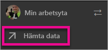
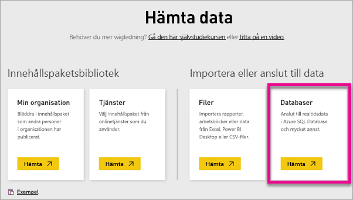
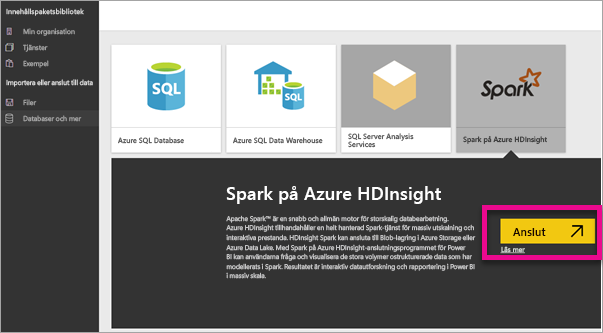
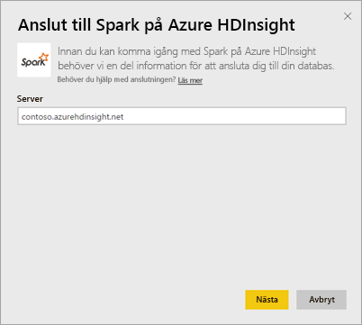
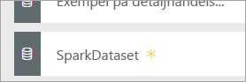
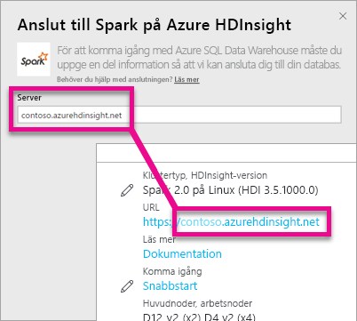
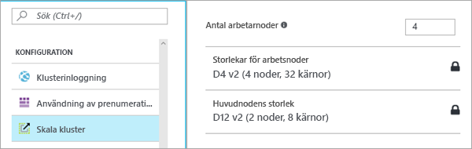

# Apache Spark i HDInsight med DirectQuery
Med Apache Spark på Azure HDInsight med DirectQuery kan du skapa dynamiska rapporter baserade på data och mått som du redan har i ditt Apache Spark-kluster. Med DirectQuery skickas frågor tillbaka till ditt Azure HDInsight Apache Spark-kluster medan du utforskar dessa data i rapportvyn. Den här användningen föreslås för användare som är bekanta med de enheter som de ansluter till.

> [!WARNING]
> Automatisk paneluppdatering har inaktiverats för instrumentpanelens paneler som bygger på Apache Spark-baserade datauppsättningar. Du kan välja **Uppdatera instrumentpanel** för att uppdatera manuellt. Rapporter påverkas inte och bör även fortsatt vara uppdaterade. 
> 
> 

Du kan använda följande steg för att ansluta till din Apache Spark på Azure HDInsight-datakälla med hjälp av DirectQuery i Power BI-tjänsten.

1. Välj **Hämta data** längst ned i det vänstra navigeringsfönstret.
   
     
2. Välj **Databaser och mer**.
   
     
3. Välj anslutningen **Apache Spark i HDInsight** och sedan **Anslut**.
   
     
4. Ange namnet på den **server** som du vill ansluta till, samt ditt **användarnamn** och ditt **lösenord**. Servern anges alltid i formatet \<klusternamn\>.azurehdinsight.net, mer information om hur du hittar de här värdena visas nedan.
   
     
   
     
5. När du är ansluten, visas en ny datauppsättning med namnet ”Apache SparkDataset”. Du kan också komma åt datauppsättningen via den platshållarpanel som har skapats.
   
     
6. Genom att granska datauppsättningen kan du utforska alla tabeller och kolumner i databasen. Genom att markera en kolumn skickas en fråga tillbaka till källan, vilket dynamiskt skapar ditt visuella objekt. Detta visuella objekt kan sparas i en ny rapport och fästas igen på instrumentpanelen.

## Hitta dina Apache Spark på HDInsight-parametrar
Servern är alltid i formatet \<klusternamn\>.azurehdinsight.net, och du hittar den i Azure-portalen.

Även användarnamn och lösenord finns i Azure-portalen.

## Begränsningar
Dessa begränsningar och kommentarer kan komma att ändras eftersom vi fortsätter att förbättra upplevelsen. Ytterligare dokumentation finns i [Använda BI-verktyg med Apache Spark på Azure HDInsight](https://azure.microsoft.com/documentation/articles/hdinsight-apache-spark-use-bi-tools/)

* Power BI-tjänsten stöder bara konfiguration av Apache Spark 2.0 och HDInsight 3.5.
* Varje åtgärd, som att markera en kolumn eller lägga till ett filter, skickar tillbaka en fråga till databasen – var noga med att välja en lämplig visuell typ innan du väljer mycket stora fält.
* Frågor och svar-rutan är inte tillgänglig för DirectQuery-datauppsättningar.
* Schemaändringar plockas inte upp automatiskt.
* Power BI stöder 16 000 kolumner **för alla tabeller** i en datauppsättning. Power BI innehåller också en intern radnummerkolumn per tabell. Det innebär att om du har 100 tabeller i datauppsättningen, är det tillgängliga antalet kolumner 15 900. Beroende på mängden data som du arbetar med från Apache Spark-datakällan, kan du stöta på den här begränsningen.

## Felsökning
Om du får problem med att köra frågor mot ditt kluster, ska du kontrollera att programmet fortfarande körs och starta om det vid behov.

Du kan också allokera fler resurser i Azure-portalen under **Konfiguration** > **Skala kluster**:

## Nästa steg
[Kom igång: Skapa Apache Spark-kluster på HDInsight Linux och köra interaktiva frågor med Apache Spark SQL](https://azure.microsoft.com/documentation/articles/hdinsight-apache-spark-jupyter-spark-sql)  
[Kom igång med Power BI](service-get-started.md)  
[Hämta data för Power BI](service-get-data.md)  
Har du fler frågor? [Prova Power BI Community](http://community.powerbi.com/)

