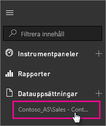

# SQL Server Analysis Services-realtidsdata i Power BI

Det finns två sätt att ansluta till en SQL Server Analysis Services-realtidsserver i Power BI. I **hämta data**, kan du ansluta till en SQL Server Analysis Services-server, eller så kan du ansluta till en [Power BI Desktop-fil](service-desktop-files.md), eller [Excel-arbetsbok](service-excel-workbook-files.md) som redan ansluter till en Analysis Services-server. Som bästa praxis rekommenderar Microsoft användning av Power BI Desktop på grund av den kompletta verktygsuppsättningens och möjligheten att upprätthålla en säkerhetskopia av Power BI Desktop-filen lokalt.

>[!IMPORTANT]
> * Om du vill ansluta till en Analysis Services-realtidsserver, måste en lokal datagateway installeras och konfigureras av en administratör. Mer information finns i [lokal datagateway](service-gateway-onprem.md).
> * När du använder gatewayen, blir dina data kvar lokalt.  Alla rapporter du skapar baserat på dessa data, sparas i Power BI-tjänsten. 
> * [Frågor och svar frågor med naturligt språk](service-q-and-a-direct-query.md) är i förhandsvisning för Analysis Services-realtidsanslutningar.

## Om du vill ansluta till en modell från hämta data

1. I **min arbetsyta** väljer du **hämta data**. Du kan också ändra till en grupparbetsyta om det finns en.

   

2. Välj **Databaser och mer**.

   

3. Välj **SQL Server Analysis Services** > **Anslut**.

   

4. Välj en server. Om du inte ser några servrar listade här, betyder det antingen att ingen gateway och datakälla har konfigurerats, eller att ditt konto inte listas i fliken **användare** för datakällan i gatewayen. Kontrollera med din administratör.

5. Välj den modell du vill ansluta till. Det kan antingen vara tabell eller flerdimensionell.

När du ansluter till modellen, visas den i din Power BI-plats i **min arbetsyta/datauppsättningar**. Om du växlades till en grupparbetsyta, visas datauppsättningen i gruppen.

## Paneler på instrumentpanelen

Om du fäster visuella objekt från en rapport på instrumentpanelen, uppdateras de fästa panelerna automatiskt var tionde minut. Om data i din lokala Analysis Services-server uppdateras, blir panelerna automatiskt uppdaterade efter 10 minuter.

## Vanliga problem

* Det går inte att läsa in modellschemat – det här felet inträffar när användaren som ansluter till SSAS inte har åtkomst till SSAS-databasen, SSAS-kuben eller SSAS-modellen.

## Nästa steg

* [Lokal datagateway](service-gateway-onprem.md)  
* [Hantera Analys Services-datakällor](service-gateway-enterprise-manage-ssas.md)  
* [Felsöka den lokala datagatewayen](service-gateway-onprem-tshoot.md)  

Har du fler frågor? [Prova Power BI Community](http://community.powerbi.com/)