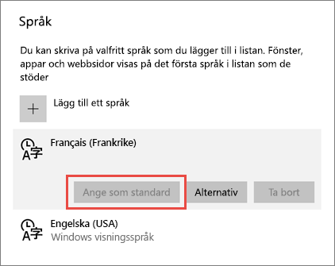
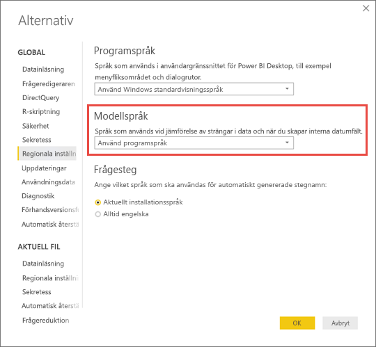

# Språk och länder/regioner som stöds för Power BI

I den här artikeln finns listor med de språk som stöds och länder/regioner för Power BI-tjänsten, Power BI Desktop och Power BI-dokumentationen.

## Länder och regioner där Power BI är tillgängligt
En lista med de länder och regioner där Power BI är tillgängligt finns i [listan för internationell tillgänglighet](https://products.office.com/business/international-availability). 

## Språk för Power BI-tjänsten
Power BI-tjänsten (i webbläsaren) finns på följande 44 språk:

* Arabiska
* Baskiska – Basque
* Bulgariska – Български
* Katalanska – català
* Kinesiska (förenklad) – 中文(简体)
* Kinesiska (traditionell) – 中文(繁體)
* Kroatiska – hrvatski
* Tjeckiska – čeština
* Danska – dansk
* Nederländska – Nederlands
* Engelska – English
* Estniska – eesti
* Finska – suomi
* Franska – français
* Galiciska – galego
* Tyska – Deutch
* Grekiska – Ελληνικά
* Hebreiska
* Hindi – हिंदी
* Ungerska – magyar
* Indonesiska – Bahasa Indonesia
* Italienska – italiano
* Japanska – 日本語
* Kazakiska – Қазақ
* Koreanska – 한국어
* Lettiska – latviešu
* Litauiska – lietuvių
* Malajiska – Bahasa Melayu
* Norska (bokmål) – norsk (bokmål)
* Polska – Polski
* Portugisiska (Brasilien) – Português
* Portugisiska (Portugal) – português
* Rumänska – română
* Ryska – Русский
* Serbiska (kyrillisk) – српски
* Serbiska (latinsk) – srpski
* Slovakiska – slovenčina
* Slovenska – slovenski
* Spanska – español
* Svenska – svenska
* Thailändska – ไทย
* Turkiska – Türkçe
* Ukrainska – українська
* Vietnamesiska – Tiếng Việt

### Vad är översatt?
Power BI översätter menyer, knappar, meddelanden och andra delar av upplevelsen till ditt språk. Rapportinnehåll såsom automatiskt genererade titlar, filter och knappbeskrivningar översätts, men dina data översätts inte automatiskt. Inuti rapporter ändras inte layouten för visuella objekt om du använder ett höger-till-vänster-språk, till exempel hebreiska.

För tillfället är endast några funktioner enbart tillgängliga på engelska:

* Instrumentpaneler och rapporter som Power BI skapar när du ansluter till tjänster som Microsoft Dynamics CRM, Google Analytics och Salesforce. Du kan ändå skapa dina egna instrumentpaneler och rapporter på ditt eget språk.
* Utforska dina data med Frågor och svar.

Håll ögonen öppna – snart kommer det fler funktioner på andra språk. 

### Välja språk i Power BI-tjänsten
1. I Power BI-tjänsten väljer du ikonen **Inställningar** > **Inställningar**.
2. På fliken **Allmänt** > **Språk**.
3. Välj språk > **Tillämpa**.

### Välja språk i webbläsaren
Power BI identifierar språket baserat på datorns språkinställningar. Hur du kommer åt och ändrar dessa inställningar kan variera beroende på operativsystem och webbläsare. Nedan visas hur du får åtkomst till dessa inställningar i Internet Explorer och Google Chrome.

#### Internet Explorer (version 11)
1. Klicka på knappen **Verktyg** i det övre högra hörnet i webbläsarfönstret:
   
   
2. Klicka på **Internetalternativ**.
3. I dialogrutan Internetalternativ klickar du på knappen **Språk** på fliken Allmänt under Utseende.

#### Google Chrome (version 42)
1. Klicka på menyknappen i det övre högra hörnet i webbläsarfönstret:
   
   
2. Klicka på **Inställningar**.
3. Klicka på **Visa avancerade inställningar**.
4. Under Språk klickar du på knappen **Inställningar för språk och inmatning**.
5. Klicka på **Lägg till**, välj ett språk och klicka på **OK**.
   
   
   
   Det nya språket finns i slutet av listan. 
6. Dra det nya språket överst i listan och klicka på **Visa Google Chrome på detta språk**.
   
   
   
   Du kan behöva stänga och öppna webbläsaren igen för att se ändringen.

## Välj språk eller språkversion för Power BI Desktop
Det finns två sätt att skaffa Power BI Desktop: Du kan ladda ned det som ett fristående installationsprogram eller installera det från Windows Store.

* När du installerar Power BI Desktop från Windows Store, installeras alla språk och det språk som motsvarar standardspråket för Windows visas som standard.
* När du laddar ned Power BI Desktop som fristående installationsprogram väljer du standardspråk när du kör installationsprogrammet och kan ändra det vid ett senare tillfälle.
* Du kan också [välja en språkversion som ska användas när du importerar data](#choose-the-locale-for-importing-data-into-power-bi-desktop) för en viss rapport.

> [!NOTE]
> Om du installerar den version av Power BI Desktop som har optimerats för Power BI-rapportserver väljer du språk vid nedladdningen. Mer information finns i [Installera Power BI Desktop optimerad för Power BI-rapportserver](report-server/install-powerbi-desktop.md).

### Välj ett språk för Power BI Desktop 
1. Installera Power BI Desktop [från Windows Store](https://aka.ms/pbidesktopstore) eller som ett [fristående installationsprogram](https://aka.ms/pbiSingleInstaller).
2. Ändra språk i din datorsökning efter **Windows-inställningar**. 
3. Välj **Tid och språk**.
   
     
4. Välj **Region och språk**, välj ett språk och välj **Ange som standard**.
   
     
   
     Nästa gång du startar Power BI Desktop används det språk som du angav som standard. 

Om du vill åsidosätta standardvärdet och använda Power BI Desktop på ett annat språk än ditt Windows-språk gör du följande.
1. I Power BI Desktop går du till **Arkiv** > **Alternativ och inställningar** > **Alternativ**.
2. Under **Globala inställningar** väljer du **Regionala inställningar**.
3. I rutan **Programspråk** väljer du ett annat språk. 

Språkstöd i Power BI Desktop är begränsat till de språk som visas i listrutan Programspråk.

### Välja språk för import av data till Power BI Desktop
Oavsett om du laddar ned Power BI Desktop eller installerar det från Windows Store, kan du välja att ett språk för en viss rapport ska vara något annat än språket i din version av Power BI Desktop. Språkinställningen påverkar hur data tolkas när de importeras från datakällan, till exempel om ”3/4/2017” ska tolkas som 3 april eller 4 mars. 

1. I Power BI Desktop går du till **Arkiv** > **Alternativ och inställningar** > **Alternativ**.
2. Under **Aktuell fil**väljer du **Regionala inställningar**.
3. Välja andra nationella inställningar för import i rutan **Nationella inställningar**. 
   
   
4. Välj **OK**.

### Välja språk för modellen i Power BI Desktop

Utöver att ställa in språket för Power BI Desktop-programmet kan du också ange språk för modellen. Modellspråket påverkar huvudsakligen två saker:

- Hur vi jämför och sorterar strängar. Eftersom turkiska har två bokstaven ”i”, kan som exempel dessa två hamna i olika ordning vid sortering, beroende på databasens sortering. 
- Det språk som Power BI Desktop använder vid skapande av dolda datumtabeller från datumfält. Fälten kallas till exempel Månad/Monat/Mois och så vidare.

> [!NOTE]
> Power BI-modellen använder för närvarande ett språk som inte är skiftlägeskänsligt (eller kana-känslig) så att ”ABC” och ”abc” behandlas som likvärdiga. Om ”ABC” läses in i databasen först kommer andra strängar som endast skiljer sig åt i skiftläge såsom ”Abc” inte att läsas in som ett separat värde.
> 
>

Så här ställer du in modellspråket.

1. I Power BI Desktop går du till **Arkiv** > **Alternativ och inställningar** > **Alternativ**.
2. Under **Global** väljer du **Regionala inställningar**.
3. I rutan **Modellspråk** väljer du ett annat språk. 

    

> [!NOTE]
> När det skapats kan inte språket för en Power BI-modell ändras.
> 
>

## Språk för hjälpdokumentation
Hjälpen är översatt på följande 10 språk: 

* Kinesiska (förenklad) – 中文(简体)
* Kinesiska (traditionell) – 中文(繁體)
* Franska – français
* Tyska – Deutch
* Italienska – italiano
* Japanska – 日本語
* Koreanska – 한국어
* Portugisiska (Brasilien) – Português
* Ryska – Русский
* Spanska – español

## Nästa steg
* Använder du någon av Power BI-mobilapparna? Se [Språk som stöds i Power BI-mobilapparna](consumer/mobile/mobile-apps-supported-languages.md) för mer information.
* Har du några frågor? Fråga [Power BI Community](https://community.powerbi.com/).
* Har du fortfarande problem? Besök [Power BI-supportsidan](https://powerbi.microsoft.com/support/).

