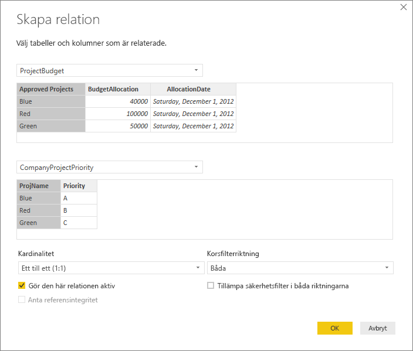
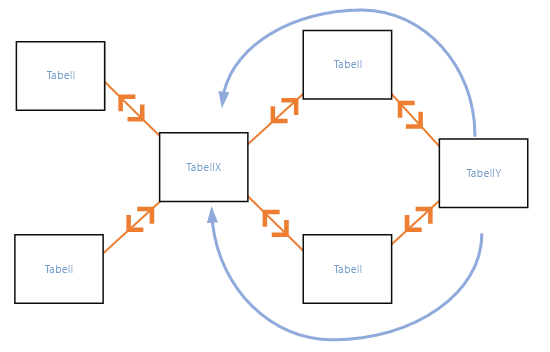

# Skapa och hantera relationer i Power BI Desktop
När du importerar flera tabeller är det möjligt att du kommer att utföra analyser med data från alla tabellerna. Det måste finnas relationer mellan dessa tabeller för korrekt beräkning av resultat och för att rätt information ska visas i dina rapporter. Med Power BI Desktop blir det enkelt att skapa dessa relationer. I de flesta fall behöver du faktiskt inte behöver göra något alls. Funktionen Identifiera automatiskt gör det åt dig. I vissa fall kan du dock behöva skapa relationerna själv eller göra ändringar i en relation. Oavsett vilket är det viktigt att förstå relationer i Power BI Desktop, samt hur du skapar och redigerar dem.

## Identifiera automatiskt under inläsning
Om du skickar frågor till två eller flera tabeller samtidigt försöker Power BI Desktop hitta och skapa relationer åt dig när data läses in. Relationsalternativen **Kardinalitet**, **Korsfilterriktning** och **Gör den här relationen aktiv** anges automatiskt. Power BI Desktop kontrollerar kolumnnamnen i tabellerna för att avgöra om det finns några möjliga relationer. Om det finns det skapas dessa relationer automatiskt. Om Power BI Desktop inte säkert kan fastställa att det finns en matchning skapas inte relationen. Dock kan du fortfarande använda dialogrutan **Hantera relationer** för att manuellt skapa eller redigera relationer.

## Skapa en relation med Identifiera automatiskt
På fliken **Start** väljer du **Hantera relationer** \> **Identifiera automatiskt**.

## Skapa en relation manuellt
1. På fliken **Start** väljer du **Hantera relationer** \> **Ny**.

2. I dialogrutan **Skapa relation** går du till listrutan för den första tabellen och väljer en tabell. Välj den kolumn som du vill använda i relationen.

3. I listrutan för den andra tabellen väljer du den andra tabellen som du vill ha i relationen. Välj den andra kolumnen som du vill använda och välj sedan **OK**.

   

Som standard konfigurerar Power BI Desktop automatiskt alternativen **Kardinalitet** (riktning), **Korsfilterriktning** och **Gör den här relationen aktiv** för den nya relationen. Du kan dock ändra inställningarna om det behövs. Mer information finns i [Förstå ytterligare alternativ](#understanding-additional-options).

Om ingen av de tabeller som har valts för relationen har unika värden visas följande fel: *En av kolumnerna måste ha unika värden*. Minst en tabell i en relation *måste* har en distinkt, unik lista med nyckelvärden, vilket är ett vanligt krav för relationsdatabaser. 

Om felet visas kan du åtgärda det på ett par olika sätt:

* Använd **Ta bort dubbletter** för att skapa en kolumn med unika värden. Nackdelen med den här metoden är att du kan förlora information när dubblettrader tas bort. Ofta finns det en dubblett av en nyckel (rad) av en särskild anledning.
* Lägg till en mellanliggande tabell som består av listan med distinkta nyckelvärden i modellen, som sedan kopplas till de båda ursprungliga kolumnerna i relationen.

Se det här [blogginlägget](https://blogs.technet.microsoft.com/cansql/2016/12/19/relationships-in-power-bi-fixing-one-of-the-columns-must-have-unique-values-error-message/) för mer information.

## Redigera en relation
1. På fliken **Start** väljer du **Hantera relationer**.

2. I dialogrutan **Hantera relationer** markerar du relationen och väljer sedan **Redigera**.

## Konfigurera ytterligare alternativ
Du kan konfigurera ytterligare alternativ när du skapar eller redigerar en relation. Som standard konfigurerar Power BI Desktop ytterligare alternativ automatiskt baserat på en bästa gissning, som kan vara olika för varje relation baserat på data i kolumnerna.

### Kardinalitet
Alternativet **Kardinalitet** kan ha en av följande inställningar:

**Många till en (\*:1)** : Många-till-en är den vanligaste standardtypen av relation. Det innebär att en kolumn i en given tabell kan ha fler än en instans av ett värde och att den andra relaterade tabellen, som ofta kallas för uppslagstabell, endast har en instans av ett värde.

**En till en (1:1)** : I en en-till-en-relation har kolumnen i en tabell endast en instans av ett visst värde, och den andra relaterade tabellen har endast en instans av ett visst värde.

**En till många (1:*)** : I en en-till-många-relation har kolumnen i en tabell endast en instans av ett visst värde, och den andra relaterade tabellen kan ha fler än en instans av ett visst värde.

**Många till många (\*:\*)** : Med sammansatta modeller kan du upprätta en många-till-många-relation mellan tabeller, vilket eliminerar kravet på unika värden i tabeller. Det tar också bort behovet av tidigare lösningar. Du behöver till exempel inte lägga till nya tabeller bara för att skapa relationer. Mer information finns i [Relationer med många-många-kardinalitet](https://docs.microsoft.com/power-bi/desktop-many-to-many-relationships). 

Mer information om de fall då kardinaliteten bör ändras finns i [Förstå ytterligare alternativ](#understanding-additional-options).

### Korsfilterriktning
Alternativet **Korsfilterriktning** kan ha en av följande inställningar:

**Båda**: För filtreringsändamål innebär detta att båda tabellerna behandlas som om de vore en enda tabell. Inställningen **Båda** fungerar bra med en enskild tabell som omges av ett antal uppslagstabeller. Ett exempel är en försäljningstabell med en uppslagstabell för avdelningar. Den här konfigurationen kallas ofta en star-schemakonfiguration (en central tabell med flera uppslagstabeller). Men om du har två eller fler tabeller med uppslagstabeller (där några är gemensamma) bör du inte använda inställningen **Båda**. För att fortsätta med det tidigare exemplet har du i det här fallet också en budgetförsäljningstabell med målbudgeten för varje avdelning. Och avdelningstabellen är kopplad till både försäljnings- och budgettabellen. Undvik inställningen **Båda** för den här typen av konfiguration.

**Enskild**: Den vanligaste riktningen, som även är standard. Det innebär att filtrerade val i kopplade tabeller fungerar i den tabell där värden aggregeras. Om du importerar en Power Pivot i Excel 2013 eller tidigare datamodell har alla relationer en enda riktning. 

Mer information om de fall då korsfilterriktningen bör ändras finns i [Förstå ytterligare alternativ](#understanding-additional-options).

### Gör den här relationen aktiv
När alternativet är markerat fungerar relationen som aktiv standardrelation. I de fall där det finns fler än en relation mellan två tabeller, ger den aktiva relationen ett sätt för Power BI Desktop att automatiskt skapa visualiseringar som innehåller båda tabellerna.

Mer information om de fall då en viss relation bör göras aktiv finns i [Förstå ytterligare alternativ](#understanding-additional-options).

## Förstå relationer
När du har kopplat ihop två tabeller med en relation kan du arbeta med data i båda tabellerna som om de vore en enskild tabell. Därför behöver du inte bekymra dig om relationsinformation eller slå ihop tabellerna till en enda tabell innan du importerar dem. I många situationer kan Power BI Desktop automatiskt skapa relationer. Men om Power BI Desktop inte säkert kan avgöra om det ska finnas en relation mellan två tabeller skapar den inte någon relation automatiskt. I så fall måste du göra det. 

Vi går igenom en snabb självstudie för att bättre se hur relationer fungerar i Power BI Desktop.

>[!TIP]
>Du kan slutföra den här lektionen själv: 
>
> 1. Kopiera följande **ProjectHours**-tabell till ett Excel-kalkylblad (exklusive rubriken), markera alla cellerna och välj sedan **Infoga** \> **Tabell**. 
> 2. I dialogrutan **Skapa tabell** väljer du **OK**. 
> 3. Markera en tabellcell, välj **Tabelldesign** \> **Tabellnamn** och ange sedan *ProjectHours*. 
> 4. Gör samma sak för tabellen **CompanyProject**. 
> 5. Importera data med hjälp av **Hämta data** i Power BI Desktop. Välj de två tabellerna som datakälla och välj sedan **Läs in**.

Den första tabellen, **ProjectHours**, är ett register för arbetsbiljetter med antal timmar som en person har arbetat med ett visst projekt. 

**ProjectHours**

| **Ticket** | **SubmittedBy** | **Hours** | **Project** | **DateSubmit** |
| ---:|:--- | ---:|:--- | ---:|
| 1001 |Brewer, Alan |22 |Blå |1/1/2013 |
| 1002 |Brewer, Alan |26 |Röd |2/1/2013 |
| 1003 |Ito, Shu |34 |Gul |12/4/2012 |
| 1004 |Brewer, Alan |13 |Orange |1/2/2012 |
| 1005 |Bowen, Eli |29 |Lila |01-10-2013 |
| 1006 |Bento, Nuno |35 |Grön |2/1/2013 |
| 1007 |Hamilton, David |10 |Gul |01-10-2013 |
| 1008 |Han, Mu |28 |Orange |1/2/2012 |
| 1009 |Ito, Shu |22 |Lila |2/1/2013 |
| 1010 |Bowen, Eli |28 |Grön |10/1/2013 |
| 1011 |Bowen, Eli |9 |Blå |10/15/2013 |

Den andra tabellen, **CompanyProject**, är en lista över projekt med en tilldelad prioritet: A, B eller C. 

**CompanyProject**

| **ProjName** | **Priority** |
| --- | --- |
| Blå |A |
| Röd |B |
| Grön |C |
| Gul |C |
| Lila |B |
| Orange |C |

Observera att varje tabell har en projektkolumn. Alla har lite olika namn, men värdena ser ut som om de är samma. Det här är viktigt och vi kommer tillbaka till det snart.

Nu när vi har importerat våra två tabeller till en modell kan vi skapa en rapport. Det första vi ska hämta är det antal timmar som skickats in efter projektprioritet, så vi väljer **Priority** (Prioritet) och **Hours** (Timmar) från fönstret **Fält**.

I tabellen på rapportarbetsytan ser du att antalet timmar är 256 för varje projekt, vilket även är det totala antalet. Det här antalet stämmer förstås inte. Varför? Det beror på att vi inte kan beräkna en totalsumma för värdena i en tabell (**Hours** i tabellen **Project**), segmenterade efter värden i en annan tabell (**Priority** i tabellen **CompanyProject**) utan att ha en relation mellan de två tabellerna.

Därför ska vi nu skapa en relation mellan de två tabellerna.

Kommer du ihåg de kolumner som vi såg i båda tabellerna med ett projektnamn, men med värden som såg likadana ut? Vi ska använda de här två kolumnerna för att skapa en relation mellan tabellerna.

Varför dessa kolumner? Om vi tittar på kolumnen **Project** i tabellen **ProjectHours** ser vi värden som Blue, Red, Yellow, Orange (Blå, Röd, Gul, Orange) och så vidare. Vi ser i själva verket flera rader som har samma värde. Det innebär att vi har många färgvärden för **Project**.

Om vi tittar på kolumnen **ProjName** i tabellen **CompanyProject** ser vi att det bara finns ett av varje färgvärde för projektnamnet. Varje färgvärde i den här tabellen är unikt och det är viktigt, eftersom vi då kan skapa en relation mellan de två tabellerna. I det här fallet en många-till-en-relation. I en många-till-en-relation måste minst en kolumn i någon av tabellerna innehålla unika värden. Det finns ytterligare alternativ för vissa relationer som vi ska titta på senare. Nu skapar vi en relation mellan projektkolumnerna i var och en av de två tabellerna.

### Skapa en ny relation
1. Välj **Hantera relationer** på fliken **Start**.
2. I **Hantera relationer** väljer du **Ny** för att öppna dialogrutan **Skapa relation**, där vi kan välja tabeller, kolumner och ytterligare inställningar som vi vill ha för relationen.
3. I listrutan för den första tabellen väljer du **ProjectHours** som den första tabellen och väljer kolumnen **Project**. Den här sidan är relationens *många-sida*.
4. I den andra listrutan är **CompanyProject** förvalt som den andra tabellen. Välj kolumnen **ProjName**. Den här sidan är relationens *en-sida*. 
5. Acceptera standardinställningarna för relationsalternativen och välj sedan **OK**.

   

6. I dialogrutan **Hantera relationer** väljer du **Stäng**.

Vi kan berätta att du nu har skapat relationen på det svåra sättet. Du kunde helt enkelt ha valt **Identifiera automatiskt** i dialogrutan **Hantera relationer**. Faktum är att Identifiera automatiskt skulle ha skapat relationen automatiskt när du läste in data ifall båda kolumnerna hade haft samma namn. Men vad finns det för utmaning då?

Nu tittar vi på tabellen på rapportarbetsytan igen.

Visst ser det betydligt bättre ut nu?

När vi summerar timmarna efter **Priority** letar Power BI Desktop efter varje förekomst av de unika färgvärdena i uppslagstabellen **CompanyProject** och sedan efter varje instans av de värdena i tabellen **ProjectHours** samt beräknar totalsumman för varje unikt värde.

Det var enkelt. Med Identifiera automatiskt hade du förmodligen inte behövt göra ens så här mycket.

## Förstå ytterligare alternativ
När en relation skapas, antingen med Identifiera automatiskt eller manuellt, konfigurerar Power BI Desktop automatiskt ytterligare alternativ baserat på data i tabellerna. De här ytterligare relationsalternativen finns i den nedersta delen av dialogrutorna **Skapa relation** och **Redigera relation**.

 

Power BI anger vanligtvis de här alternativen automatiskt, och du behöver inte justera dem. Det finns dock flera situationer där det kan vara bra att själv konfigurera de här alternativen.

## Automatiska relationsuppdateringar

Du kan hantera hur Power BI behandlar och automatiskt justerar relationer i dina rapporter och modeller. Om du vill ange hur Power BI ska hantera relationsalternativ väljer du **Arkiv** > **Alternativ och inställningar** > **Alternativ** i Power BI Desktop och väljer sedan **Datainläsning** i det vänstra fönstret. Alternativen för **Relationer** visas.

   

Det finns tre alternativ som kan väljas och aktiveras: 

- **Importera relationer från datakällor vid första inläsning**: Det här alternativet är markerat som standard. När det här väljs söker Power BI efter relationer som definierats i din datakälla, till exempel relationer för sekundärnyckel/primärnyckel i ditt informationslager. Om sådana relationer finns speglas de i Power BI-datamodellen när du läser in data för första gången. Med det här alternativet kan du snabbt börja arbeta med din modell i stället för att behöva hitta eller definiera dessa relationer själv.

- **Uppdatera eller ta bort relationer vid uppdatering av data**: Det här alternativet är avmarkerat som standard. Om du väljer det söker Power BI efter ändringar i datakällans relationer när datamängden uppdateras. Om dessa relationer ändras eller tas bort speglar Power BI de ändringarna i sin egen datamodell genom att uppdatera eller ta bort dem för att matcha.

   > [!WARNING]
   > Om du använder säkerhet på radnivå som är beroende av de definierade relationerna rekommenderar vi inte att du väljer det här alternativet. Om du tar bort en relation som dina RLS-inställningar använder kan din modell bli mindre säker. 

- **Identifiera nya relationer automatiskt när data har lästs in**: Det här alternativet beskrivs i [Identifiera automatiskt under inläsning](#autodetect-during-load). 

## Framtida uppdateringar av datan kräver en annan kardinalitet
Power BI Desktop kan normalt sett avgöra den bästa kardinaliteten för relationen automatiskt. Om du behöver åsidosätta den automatiska inställningen eftersom du vet att data kommer att ändras i framtiden kan du ändra det i kontrollen **Kardinalitet**. Nu ska vi titta på ett exempel där vi måste välja en annan kardinalitet.

Tabellen **CompanyProjectPriority** är en lista över alla företagsprojekt och deras prioritet. Tabellen **ProjectBudget** är uppsättningen med projekt där en budget har godkänts.

**CompanyProjectPriority**

| **ProjName** | **Priority** |
| --- | --- |
| Blå |A |
| Röd |B |
| Grön |C |
| Gul |C |
| Lila |B |
| Orange |C |

**ProjectBudget**

| **Approved Projects** | **BudgetAllocation** | **AllocationDate** |
|:--- | ---:| ---:|
| Blå |40 000 |12/1/2012 |
| Röd |100 000 |12/1/2012 |
| Grön |50,000 |12/1/2012 |

Om vi skapar en relation mellan kolumnen **Approved Projects** i tabellen **ProjectBudget** och kolumnen **ProjectName** i tabellen **CompanyProjectPriority** anger Power BI automatiskt **Kardinalitet** till **En till en (1:1)** och **Korsfilterriktning** till **Båda**. 

 

Orsaken till att Power BI gör dessa inställningar är att den kombination av de två tabellerna som är bäst för Power BI Desktop är följande:

| **ProjName** | **Priority** | **BudgetAllocation** | **AllocationDate** |
|:--- | --- | ---:| ---:|
| Blå |A |40 000 |12/1/2012 |
| Röd |B |100 000 |12/1/2012 |
| Grön |C |50 000 |12/1/2012 |
| Gul |C |  |  |
| Lila |B |  |  |
| Orange |C |  |  |

Det finns en en-till-en-relation mellan de två tabellerna eftersom det inte finns några upprepade värden i den kombinerade tabellens kolumn **ProjName**. Kolumnen **ProjName** är unik eftersom varje värde bara förekommer en gång. Därför kan raderna från de två tabellerna kombineras direkt utan duplicering.

Men vi antar att du vet att datan kommer att ändras nästa gång du uppdaterar den. I en uppdaterad version av tabellen **ProjectBudget** finns det nu nya rader för projekten Blue och Red:

**ProjectBudget**

| **Approved Projects** | **BudgetAllocation** | **AllocationDate** |
| --- | ---:| ---:|
| Blå |40 000 |12/1/2012 |
| Röd |100 000 |12/1/2012 |
| Grön |50,000 |12/1/2012 |
| Blå |80 000 |6/1/2013 |
| Röd |90 000 |6/1/2013 |

 De här ytterligare raderna innebär att den bästa kombinationen av de två tabellerna nu ser ut så här: 

| **ProjName** | **Priority** | **BudgetAllocation** | **AllocationDate** |
| --- | --- | ---:| ---:|
| Blå |A |40 000 |12/1/2012 |
| Röd |B |100 000 |12/1/2012 |
| Grön |C |50 000 |12/1/2012 |
| Gul |C |  |  |
| Lila |B |  |  |
| Orange |C |  |  |
| Blå |A |80000 |6/1/2013 |
| Röd |B |90000 |6/1/2013 |

I den här nya kombinerade tabellen innehåller kolumnen **ProjName** upprepade värden. De två ursprungliga tabellerna kommer inte ha någon En-till-en-relation när tabellen har uppdaterats. I det här fallet vet vi att de framtida uppdateringarna kommer göra så att kolumnen **ProjName** innehåller dubbletter. Därför vill vi ange **Kardinalitet** till **Många till en (\*:1)** med sidan *många* i **ProjectBudget** och sidan *en* i **CompanyProjectPriority**.

## Ändra korsfilterriktningen för en komplex uppsättning tabeller och relationer
I de flesta relationer anges korsfilterriktningen till **Båda**. Det finns dock vissa ovanliga situationer där du kan behöva ange alternativet på ett annat sätt än standardvärdet, till exempel om du importerar en modell från en äldre version av Power Pivot där varje relation är inställd på en enda riktning. 

Med inställningen **Båda** kan Power BI Desktop hantera alla aspekter av de kopplade tabellerna som om de vore en enda tabell. Det finns dock vissa situationer där Power BI Desktop inte kan ange korsfilterriktningen för en relation till **Båda** och samtidigt behålla en entydig uppsättning standardvärden i rapporteringssyfte. Om korsfilterriktningen för en relation inte är inställd på **Båda** beror det vanligtvis på att det skulle skapa tvetydighet. Om standardinställningen för korsfiltrering inte fungerar för dig kan du prova att ange den för en viss tabell eller till **Båda**.

En korsfiltrering i en riktning fungerar i många situationer. Om du har importerat en modell från Power Pivot i Excel 2013 eller tidigare, är faktiskt alla relationer i en enda riktning. Enkel riktning innebär att valen som filtreras i anslutna tabeller fungerar i den tabell där värdena aggregeras. Ibland kan det vara svårt att förstå korsfiltrering, så vi tittar på ett exempel.

Med korsfiltrering i en riktning gäller att om du skapar en rapport som sammanfattar projekttimmarna så kan du välja att sammanfatta (eller filtrera) efter tabellen **CompanyProject** och dess kolumn **Priority** eller tabellen **CompanyEmployee** och dess kolumn **City**. Men om du vill räkna antalet medarbetare per projekt (en mindre vanlig fråga) fungerar det inte. Du får en kolumn med likadana värden. I följande exempel har båda relationernas korsfilterriktning angetts till en enkel riktning: mot tabellen **ProjectHours**. I källan **Värden** är fältet **Projekt** inställt på **Antal**:

 

Filterspecifikationen flödar från **CompanyProject** till **ProjectHours** (enligt följande bild), men den kommer inte att flöda upp till **CompanyEmployee**. 

 

Om du däremot anger korsfilterriktningen till **Båda** fungerar det. Med inställningen **Båda** kan filterspecifikationen flöda upp till **CompanyEmployee**.

 

Nu när korsfilterriktningen är inställd på **Båda** ser rapporten korrekt ut:

 

Korsfiltrering i båda riktningarna fungerar bra för mönster för tabellrelationer i stil med ovanstående. Det här schemat kallas vanligtvis för ett star-schema, som detta:

 

Korsfiltreringens riktning fungerar inte särskilt bra med mer allmänna mönster som ofta finns i databaser, som i det här diagrammet:

 

Om du har ett tabellmönster med loopar som detta, kan korsfiltreringen skapa en tvetydig uppsättning relationer. Om du exempelvis summerar ett fält från TableX och sedan väljer att filtrera efter ett fält i TableY, är det oklart hur filtret ska färdas – via den översta tabellen eller den nedre tabellen. Ett vanligt exempel på den här typen av mönster är med TableX som en försäljningstabell med faktiska data och där TableY ska innehålla budgetdata. Sedan blir tabellerna i mitten uppslagstabeller som båda tabellerna använder, till exempel division eller region. 

Liksom med aktiva/inaktiva relationer tillåter Power BI Desktop inte att en relation anges till **Båda** om det kommer att skapa tvetydighet i rapporterna. Det finns flera olika sätt att hantera den här situationen. Här är de två vanligaste sätten:

* Ta bort eller markera relationer som inaktiva för att minska tvetydighet. Sedan kan du kanske ange relationens korsfiltrering till **Båda**.
* Hämta en tabell två gånger (med ett annat namn den andra gången) för att undvika loopar. När du gör det skapas ett relationsmönster som ett star-schema. Med ett star-schema kan alla relationer anges som **Båda**.

## Fel aktiv relation
När Power BI Desktop skapar relationer automatiskt, påträffas ibland mer än en relation mellan två tabeller. När den här situationen inträffar anges endast en av relationerna som aktiv. Den aktiva relationen fungerar som standardrelation, så när du väljer fält från två olika tabeller kan Power BI Desktop automatiskt skapa en visualisering. I vissa fall kan den automatiskt valda relationen dock vara fel. Använd dialogrutan **Hantera relationer** för att ange en relation som aktiv eller inaktiv, eller ange den aktiva relationen i dialogrutan **Redigera relation**. 

För att se till att detta är standardrelationen tillåter Power BI Desktop bara att det finns en enda aktiv relation mellan två tabeller samtidigt. Därför måste du först ange den aktuella relationen som inaktiv och sedan ange den relation som du vill ska vara aktiv.

Låt oss titta på ett exempel. Den första tabellen är **ProjectTickets**, och den andra tabellen är **EmployeeRole**.

**ProjectTickets**

| **Ticket** | **OpenedBy** | **SubmittedBy** | **Hours** | **Project** | **DateSubmit** |
| ---:|:--- |:--- | ---:|:--- | ---:|
| 1001 |Perham, Tom |Brewer, Alan |22 |Blå |1/1/2013 |
| 1002 |Roman, Daniel |Brewer, Alan |26 |Röd |2/1/2013 |
| 1003 |Roth, Daniel |Ito, Shu |34 |Gul |12/4/2012 |
| 1004 |Perham, Tom |Brewer, Alan |13 |Orange |1/2/2012 |
| 1005 |Roman, Daniel |Bowen, Eli |29 |Lila |01-10-2013 |
| 1006 |Roth, Daniel |Bento, Nuno |35 |Grön |2/1/2013 |
| 1007 |Roth, Daniel |Hamilton, David |10 |Gul |01-10-2013 |
| 1008 |Perham, Tom |Han, Mu |28 |Orange |1/2/2012 |
| 1009 |Roman, Daniel |Ito, Shu |22 |Lila |2/1/2013 |
| 1010 |Roth, Daniel |Bowen, Eli |28 |Grön |10/1/2013 |
| 1011 |Perham, Tom |Bowen, Eli |9 |Blå |10/15/2013 |

**EmployeeRole**

| **Employee** | **Role** |
| --- | --- |
| Bento, Nuno |Projektledare |
| Bowen, Eli |Projektledare |
| Brewer, Alan |Projektledare |
| Hamilton, David |Projektledare |
| Han, Mu |Projektledare |
| Ito, Shu |Projektledare |
| Perham, Tom |Projektsponsor |
| Roman, Daniel |Projektsponsor |
| Roth, Daniel |Projektsponsor |

Det finns faktiskt två relationer här:
- Mellan **Employee** i tabellen **EmployeeRole** och **SubmittedBy** i tabellen **ProjectTickets**.
- Mellan **OpenedBy** i tabellen **ProjectTickets** och **Employee** i tabellen **EmployeeRole**.

 

Om vi lägger till båda relationerna i modellen (**OpenedBy** först) visar dialogrutan **Hantera relationer** att **OpenedBy** är aktiv:

 

Om vi nu skapar en rapport som använder fälten **Role** och **Employee** från **EmployeeRole** och fältet **Hours** från **ProjectTickets** i en tabellvisualisering på rapportarbetsytan ser vi endast projektsponsorerna eftersom de är de enda som har öppnat en projektbiljett.

 

Vi kan ändra den aktiva relationen och hämta **SubmittedBy** i stället för **OpenedBy**. I **Hantera relationer** avmarkerar vi relationen **ProjectTickets(OpenedBy)** till **EmployeeRole(Employee)** och markerar sedan relationen **EmployeeRole(Employee)** till **Project Tickets(SubmittedBy)** .

## Se alla dina relationer i vyn Relation
Ibland kan din modell innehålla flera tabeller och komplexa relationer mellan dem. Vyn **Relation** i Power BI Desktop visar alla relationer i din modell samt deras riktning och kardinalitet i ett anpassningsbart diagram som är lätt att förstå. 

Mer information finns i [Arbeta med vyn Relationer i Power BI Desktop](desktop-relationship-view.md).

