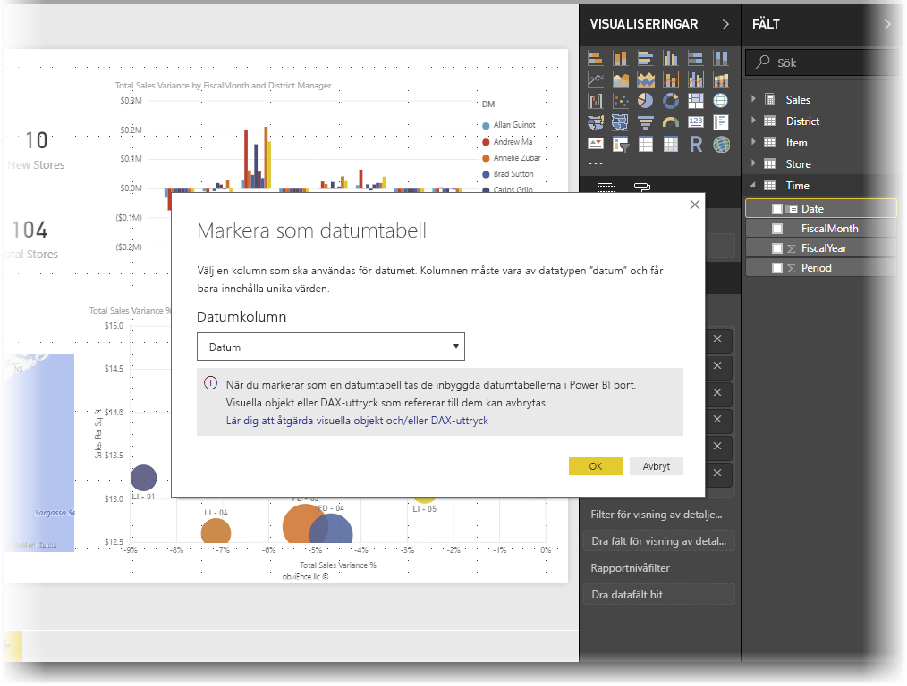
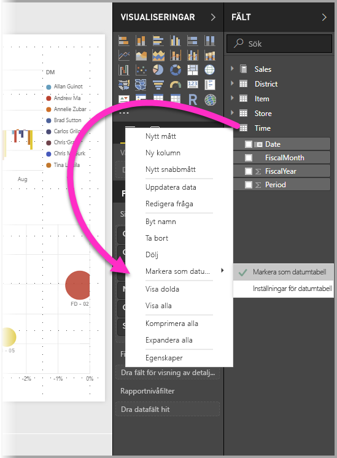
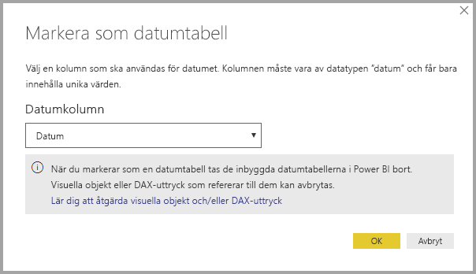
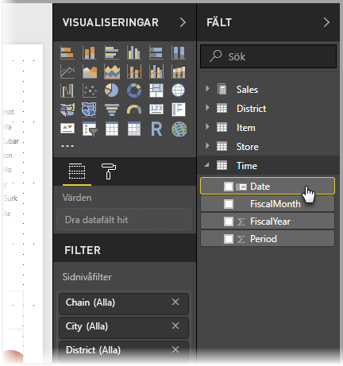
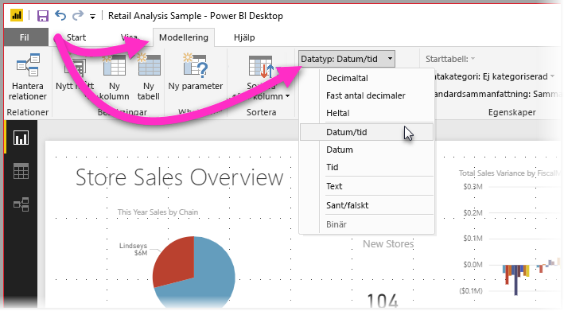

# Konfigurera och använda datumtabeller i Power BI Desktop

**Power BI Desktop** arbetar i bakgrunden med att automatiskt identifiera kolumner som representerar datum, och skapar sedan för din räkning datumhierarkier och andra aktiverande metadata för din modell. Du kan sedan använda dessa inbyggda hierarkier när du skapar rapportenfunktioner som t.ex. visuella objekt, tabeller, snabbåtgärder, utsnitt osv. Power BI Desktop gör detta genom att för din räkning skapa dolda tabeller, vilka du sedan kan använda för rapporter och DAX-uttryck.

Mer information om det här automatiska beteendet finns i artikeln [Automatisk datum/tid i Power BI Desktop](desktop-auto-date-time.md).

Många dataanalytiker föredrar att skapa egna datumtabeller, vilket är helt OK. I **Power BI Desktop** kan du ange vilken tabell som du vill att din modell ska använda som sin **datumtabell**, och därefter skapa datumrelaterade visuella objekt, tabeller, snabbmått osv med hjälp av tabellens datuminformation. När du anger din egen datumtabell kan du kontrollera de datumhierarkier som skapas i din modell och använda dem i **snabbåtgärder** och andra åtgärder som använder din modells datumtabell.

## Konfigurera din egen datumtabell

Om du vill konfigurera en **datumtabell** markerar du den tabell som du vill använda som en datumtabell i fönstret **Fält**, högerklickar på tabellen och väljer sedan **Markera som datumtabell > Markera som datumtabell** på den meny som visas som på följande bild.

Du kan också markera tabellen och sedan välja **Markera som datumtabell** i menyfliksområdet **Modellering**, som visas här.

När du anger en egen **datumtabell** genomför Power BI Desktop följande verifieringar av kolumnen och dess data för att säkerställa om dessa data:

* innehåller unika värden
* inte innehåller några nullvärden
* innehåller sammanhängande datumvärden (från början till slut)
* är av datatypen **Datum/tid**, har samma tidsstämpel för alla värden

Det finns två sannolika scenarier för hur du kan skapa din egen datumtabell, och båda är rimliga:

* Det första scenariot är att du använder en kanonisk eller grundläggande datumtabell och hierarki. Det här är en tabell i dina data som uppfyller de tidigare beskrivna verifieringsvillkoren för datumtabeller. 

* Det andra scenariot är att du använder en tabell från t.ex. Analysis Services med ett *dim-datumfält* som du vill använda som datumtabell. 

När du har angett en datumtabell kan du välja vilken kolumn i tabellen som ska vara datumkolumn. Du kan ange vilken kolumn som ska användas genom att markera tabellen i fönstret **Fält**, högerklicka på tabellen och sedan välja **Markera som datumtabell > Datumtabellsinställningar**. Följande fönster visas, i vars listruta du kan välja vilken kolumn som ska användas som datumtabell.

Det är viktigt att du tänker på att när du anger din egen datumtabell så skapar inte **Power BI Desktop** automatiskt de hierarkier som det i normala fall skapar för dig i din modell. Om du senare avmarkerar datumtabellen (och inte längre har någon manuellt konfigurerad datumtabell) återskapar Power BI Desktop för din räkning de automatiskt skapade inbyggda datumtabellerna för tabellens datumkolumner.

Något som också är viktigt att notera är att när du har markerat en tabell som en datumtabell, så tas den inbyggda (automatiskt skapade) tabell som skapats av Power BI Desktop bort, och alla eventuella visuella objekt eller DAX-uttryck som du tidigare har skapat utifrån dessa inbyggda tabeller kommer inte längre att fungera korrekt. 

## Markera din datumtabell som korrekt datatyp

När du anger din egen **datumtabell** måste du försäkra dig om att datatypen har konfigurerats korrekt. Du vill konfigurera **datatypen** till **Datum/tid** eller **Datum**. Gör följande:

1. Välj din **datumtabell** i rutan **Fält**, utvidga den om så behövs, och markera sedan den kolumn som ska användas som datum.
   
     

2. Välj **Datatyp:** på fliken **Modellering** och visa sedan tillgängliga datatyper genom att klicka på listrutepilen.

    

3. Ange kolumnens datatyp. 

## Nästa steg

Mer information om ämnet i den här artikeln finns i följande resurser:

* [Automatisk datum/tid i Power BI Desktop](desktop-auto-date-time.md)
* [Skapa datumtabeller i Power BI Desktop](../guidance/model-date-tables.md)
* [Datatyper i Power BI Desktop](../connect-data/desktop-data-types.md)
* Har du några frågor? [Fråga Power BI Community](https://community.powerbi.com/)
* Har du förslag? [Bidra till att förbättra Power BI](https://ideas.powerbi.com/)
