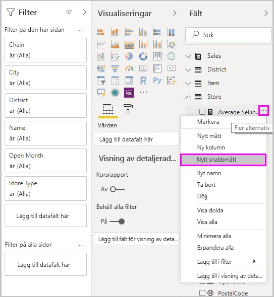
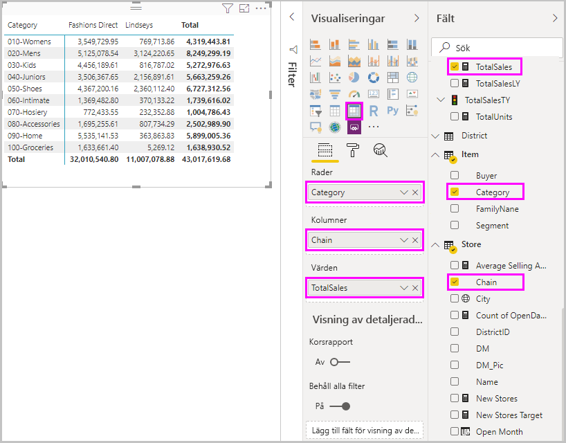
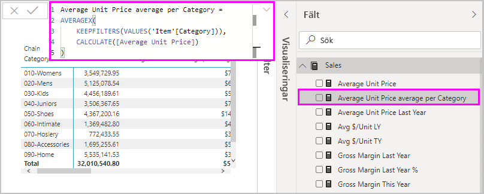
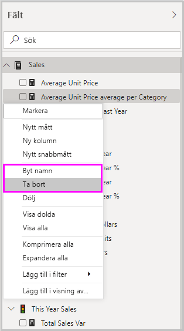

# Använd snabbmått för vanliga beräkningar
Du kan använda *snabbmått* när du snabbt och enkelt vill utföra vanliga och kraftfulla beräkningar. Ett snabbmått kör en uppsättning kommandon för dataanalysuttryck (DAX) i bakgrunden och visar sedan de resultat som du kan använda i rapporten. Du behöver inte skriva DAX, det är klart baserat på det du skriver i en dialogruta. Det finns många tillgängliga kategorier för beräkningar och sätt att ändra varje beräkningen så att den passar dina behov. Det bästa kanske är att du kan se de DAX-kommandon som körs av snabbmåttet och komma igång med eller utöka dina egna DAX-kunskaper.

## Skapa ett snabbmått

För att skapa ett snabbmått i Power BI Desktop högerklickar eller markerar du de tre punkterna **...** bredvid ett objekt i fönstret **Fält** och väljer **Nytt snabbmått** på menyn som visas. 

Du kan också högerklicka eller välja den nedrullningsbara pilen bredvid ett värde i området **Värde** för ett befintligt visuellt objekt och välja **Nytt snabbmått** på menyn. 

När du väljer **Nytt snabbmått** visas fönstret **Snabbmått**, så att du kan välja den beräkning som du vill använda och fälten att köra beräkningen mot. 

Markera fältet **Välj en beräkning** för att se en lång lista över tillgängliga snabbmått. 

De fem måttberäkningstyperna, med deras beräkningar, är:

* **Sammanställ per kategori**
  * Genomsnitt per kategori
  * Avvikelsen inom kategorin
  * Max per kategori
  * Minimum per kategori
  * Viktat genomsnitt per kategori
* **Filter**
  * Filtrerat värde
  * Skillnad från filtrerat värde
  * Procentuell skillnad från filtrerat värde
  * Försäljning från nya kunder
* **Tidsintelligens**
  * Summa hittills det här året
  * Summa hittills det här kvartalet
  * Summa hittills den här månaden
  * Ändring från år till år
  * Ändring från kvartal till kvartal
  * Förändring månad för månad
  * Rullande medelvärde
* **Summor**
  * Löpande summa
  * Summa för kategorin (filter applicerade)
  * Summan för kategorin (filter ej applicerade)
* **Matematiska operationer**
  * Addition
  * Subtraktion
  * Multiplikation
  * Division
  * Procentuell skillnad
  * Korrelationskoefficient
* **Text**
  * Omdöme i stjärnor
  * Sammanlänkad lista med värden

Information om hur du skickar in dina idéer om nya snabbmått som du vill se, underliggande DAX-formler eller andra snabbmåttsidéer finns i slutet av den här artikeln.

> [!NOTE]
> När du använder SQL Server Analysis Services (SSAS) live-anslutningar är vissa snabbmått tillgängliga. Power BI Desktop visar endast de snabbmått som stöds för versionen av SSAS som du ansluter till. Om du är ansluten till en SSAS live-datakälla och du inte ser vissa snabbmått i listan beror det på att den SSAS-version som du är ansluten till inte stöder DAX-kommandona som används för att implementera snabbmåtten.

När du har valt de beräkningar och fält som du vill använda för snabbmåttet väljer du **OK**. Det nya snabbmåttet visas i fönstret **Fält**, och den underliggande DAX-formeln visas i formelfältet. 

## Exempel på nytt snabbmått
Låt oss ta en titt på en snabbmåttsåtgärd.

Följande matris innehåller en tabell med försäljning för olika produkter. Det är en enkel tabell som innehåller det totala sålda antalet för varje kategori.

Med matrisen synlig väljer du den nedrullningsbara pilen bredvid **TotalSales** i området **Värden** väljer **Nytt snabbmått**. 

I fönstret **Snabbmått**, under **Beräkning**, väljer du **Genomsnitt per kategori**. 

Dra **Genomsnittligt enhetspris** från fönstret **Fält** till fältet **Basvärde**. Lämna **Kategori** i fältet **Kategori** och välj **OK**. 

När du väljer **OK**sker flera intressanta saker.

1. Matrisvisualiseringen har en ny kolumn som visar beräknat **Average Unit Price average per Category** (Genomsnittligt pris per enhet per kategori).
   
2. DAX-formeln för det nya snabbmåttet visas i formelfältet. Mer information om DAX-formeln finns i [nästa avsnitt](#learn-dax-by-using-quick-measures).
   
3. Det nya snabbmåttet visas markerat i fönstret **Fält**. 

Det nya snabbmåttet är tillgängligt för alla visuella objekt i rapporten, inte bara det visuella objekt som du skapade den för. Följande bild visar ett visuellt stapeldiagram-objekt som skapats med hjälp av det nya snabbmåttsfältet.

## Lär dig DAX med snabbmått
En bra fördel med snabbmått är att de visar DAX-formeln som implementerar måttet. När du väljer ett snabbmått i fönstret **Fält** visas **formelfältet**, vilket visar DAX-formeln som Power BI skapade för att verkställa måttet.

Formelfältet visar inte bara formeln bakom måttet utan visar hur du skapar DAX-formlernas underliggande snabbmått, som kanske är ännu viktigare.

Anta att du behöver göra en beräkning som jämför två år, men du vet inte hur du ska strukturera DAX-formeln, eller du vet inte var du ska börja. Istället för att slå huvudet mot skrivbordet kan du skapa ett snabbmått med beräkningen **årsvis förändring** och se hur det visas i ditt visuella objekt och hur DAX-formler fungerar. Sedan kan du antingen göra ändringar direkt i DAX-formeln eller skapa ett liknande mått som uppfyller dina behov och förväntningar. Det är som att ha en lärare som svarar omedelbart på hypotetiska frågor med några få klickningar. 

Du kan alltid ta bort snabbmått från din modell om du inte gillar dem. Det är lika enkelt att högerklicka eller välja **...** bredvid måttet och välja **Ta bort**. Du kan också byta namn på ett snabbmått om du vill genom att välja **Byt namn** på menyn. 

## Begränsningar och överväganden
Det finns några begränsningar och saker du bör tänka på.

- Du kan använda snabbmått som har lagts till i fönstret **Fält** med valfritt visuellt objekt i rapporten.
- Du kan se DAX-uttryck som är associerade med ett snabbmått genom att välja det skapade måttet i listan **Fält**. Titta sedan på formeln i formelfältet.
- Snabbmått är bara tillgängliga om du kan ändra modellen. Det är inte fallet när du arbetar med vissa Live-anslutningar. Realtidsanslutningar i SSAS-tabeller stöds, enligt beskrivningen ovan.
- Du kan inte skapa snabbmått för tidsinformation när du arbetar i DirectQuery-läge. DAX-funktionerna som används i dessa snabbmått påverkar prestanda när de översätts till T-SQL-uttryck som skickas till datakällan.

> [!IMPORTANT]
> DAX-instruktioner för snabbmått använder bara kommatecken som argumentavgränsare. Om din version av Power BI Desktop är på ett språk som använder kommatecken som decimalavgränsare kommer snabbmått inte att fungera korrekt.

### Tidsinformation och snabbmått
Du kan använda dina egna anpassade datumtabeller med tidsinformationens snabbmått. Om du använder en extern tabellmodell kontrollerar du att den primära kolumnen i tabellen markerades som en datumtabell när modellen skapades. Mer information om detta finns i [Specify Mark as Date Table for use with time-intelligence](https://docs.microsoft.com/sql/analysis-services/tabular-models/specify-mark-as-date-table-for-use-with-time-intelligence-ssas-tabular) (Ange Markera som datumtabell för användning med tidsinformation). Om du importerar en egen datumtabell är det viktigt att du markerar den som en datumtabell enligt anvisningarna i [Konfigurera och använda datumtabeller i Power BI Desktop](desktop-date-tables.md).

### Ytterligare information och exempel
Har du en idé för ett snabbmått som inte redan finns? Toppen! Kolla in sidan med [Power BI-idéer](https://go.microsoft.com/fwlink/?linkid=842906) och skicka dina idéer och DAX-formler för snabbmått som du vill se i Power BI Desktop. Vi tänker lägga till dem i listan med snabbmått i en framtida version.

