# Självstudie: Skapa dina egna mått i Power BI Desktop
Med mått kan du skapa några av de mest kraftfulla lösningarna för analys i Power BI Desktop. Mått hjälper dig genom att utföra beräkningar på dina data medan du interagerar med dina rapporter. I den här självstudien får du hjälp att förstå mått och skapa dina egna grundmått i Power BI Desktop.

## Förutsättningar

- Den här självstudien är avsedd för Power BI-användare som redan är bekanta med Power BI Desktop och som vill skapa mer avancerade modeller. Du bör redan känna till hur man använder Hämta data och Frågeredigeraren för att importera data, att arbeta med flera relaterade tabeller och att lägga till fält på rapportarbetsytan. Om du är nybörjare i Power BI Desktop bör du läsa [Komma igång med Power BI Desktop](../fundamentals/desktop-getting-started.md).
  
- I den här självstudien används [Contoso försäljningsexempel för Power BI Desktop](https://download.microsoft.com/download/4/6/A/46AB5E74-50F6-4761-8EDB-5AE077FD603C/Contoso%20Sales%20Sample%20for%20Power%20BI%20Desktop.zip) som innehåller onlineförsäljningsdata från det fiktiva företaget Contoso. Eftersom data importeras från en databas kan du inte ansluta till datakällan eller visa den i frågeredigeraren. Ladda ned och extrahera filen på din dator.

## Automatiska mått

När Power BI Desktop skapar ett mått skapas det oftast automatiskt åt dig. Följ dessa steg om du vill se hur Power BI Desktop skapar ett mått:

1. I Power BI Desktop väljer du **Arkiv** > **Öppna**, bläddrar till filen *Contoso Sales Sample for Power BI Desktop.pbix* och väljer sedan **Öppna**.

2. I fönstret **Fält** expanderar du tabellen **Försäljning**. Markera sedan kryssrutan bredvid fältet **SalesAmount** eller dra **SalesAmount** på rapportarbetsytan.

    En ny visualisering av ett kolumndiagram visas med summan av alla värden i kolumnen **SalesAmount** i tabellen **Försäljning**.

    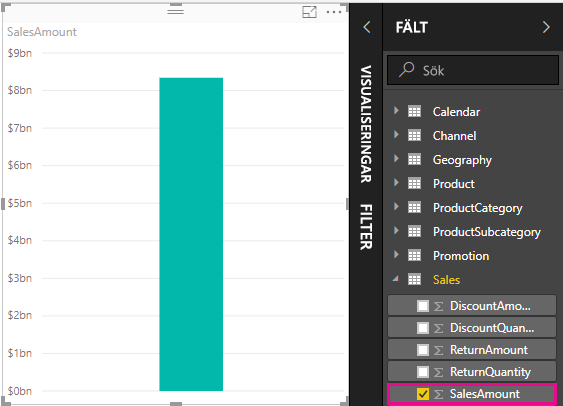

Alla fält (kolumner) i fönstret **Fält** med en sigmaikon  är numeriska, och dess värden kan aggregeras. I stället för att visa en tabell med många värden (två miljoner rader i **SalesAmount**) skapar och beräknar Power BI Desktop automatiskt ett mått för att aggregera data om en numerisk datatyp upptäcks. Summan är standardaggregering för en numerisk datatyp, men du lätt kan använda olika aggregeringar som medelvärde eller antal. Att förstå sig på aggregeringar är av avgörande betydelse om man vill förstå mått, eftersom varje mått utför någon typ av aggregering. 

Följ dessa steg om du vill ändra diagramaggregeringen:

1. Välj visualiseringen **SalesAmount** på rapportarbetsytan.  

1. I rutan **Värde** i fönstret **Visualiseringar** väljer du nedåtpilen till höger om **SalesAmount**. 

1. Välj **Medelvärde** på menyn som visas. 

    Visualiseringen ändras till ett medelvärde för alla försäljningsvärden i fältet **SalesAmount**.

    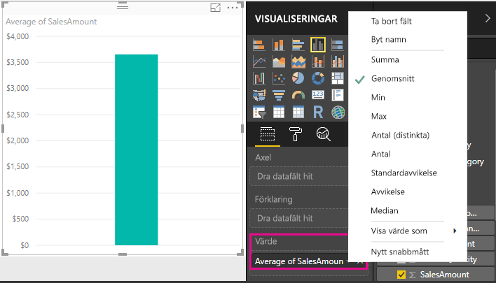

Du kan ändra typ av aggregering, beroende på vilket resultat du vill ha. Alla typer av aggregeringar gäller dock för alla numeriska datatyper. För till exempel fältet **SalesAmount** är Summa och Genomsnitt användbara, och Maximum och Maximum har sin plats. Men Count är inte begripligt för fältet **SalesAmount**, eftersom värdena, även om de är numeriska, i själva verket är valutavärden.

Värden som beräknats från mått ändras som svar på dina interaktioner med rapporten. Om du t. ex. drar fältet **RegionCountryName** från tabellen **Geografi** till ditt befintliga **SalesAmount**-diagram ändras det för att visa de genomsnittliga försäljningsbeloppen för varje land.

När resultatet av måttet ändras på grund av en interaktion med din rapport, så påverkas måttets *kontext*. Varje gång du interagerar med rapportvisualiseringar, ändrar du faktiskt den kontext i vilken ett mått beräknar och visar sina resultat.

## Skapa och använda egna mått

I de flesta fall beräknar Power BI Desktop automatiskt värdena och returnerar värden enligt de typer av fält och aggregeringar som du väljer. Men i andra fall kan du behöva skapa dina egna mått om du vill utföra mer komplexa och unika beräkningar. Med Power BI Desktop kan du skapa egna åtgärder med dataanalysuttryck (DAX). 

DAX använder ofta samma funktioner, operatorer och syntax som används i Excel-formler. Dock är DAX-funktionerna utformade för att fungera med relationella data och utföra mer dynamiskt beräkningar när vi interagerar med dina rapporter. Det finns över 200 DAX-funktioner som gör allt från enkla aggregeringar som Sum och Average till mer avancerade funktioner för statistik och filtrering. Det finns många resurser som hjälper dig att lära dig mer om DAX. När du har slutfört den här kursen bör du läsa [DAX-grunder i Power BI Desktop](desktop-quickstart-learn-dax-basics.md).

När du skapar egna mått, läggs de till i **fältlistan** för tabellen du väljer och kallas för ett *modell*mått. Några av fördelarna med modellmått är att du kan kalla dem vad du vill, vilket gör dem mer identifierbara. Du kan använda dem som argument i andra DAX-uttryck och du kan få dem att snabbt utföra komplexa beräkningar.

### Snabbmått

Från och med Power BI Desktop-utgåvan från februari 2018, finns många vanliga beräkningar tillgängliga som *snabbmått*, vilka skriver DAX-formler automatiskt baserat på dina indata till ett fönster. Dessa snabba och kraftfulla beräkningar är också bra för att lära sig DAX eller för att ange egna anpassade mått. 

Skapa ett snabbmått med någon av följande metoder: 
 - Från en tabell i fönstret **Fält** högerklickar du på eller väljer **Fler alternativ** ( **...** ) och väljer sedan **Nytt snabbmått** i listan.

 - Under **Beräkningar** på fliken **Start** i menyfliksområdet för Power BI Desktop väljer du **Nytt snabbmått**.

I [Använda snabbmått](desktop-quick-measures.md) hittar du mer information om hur du skapar och använder snabbmått.

### Skapa ett mått

Anta att du vill analysera nettoförsäljningen genom att subtrahera rabatter och avkastningar från de totala försäljningsbeloppen. För kontexten som finns i din visualisering behöver du ett mått som subtraherar summan av DiscountAmount och ReturnAmount från summan av SalesAmount. Det finns inget fält för NetSales i **fältlistan**, men du har byggblock för att skapa egna mått för att beräkna nettoförsäljning. 

Följ stegen nedan för att skapa ett mått:

1. Högerklicka på tabellen **Försäljning** i fönstret **Fält** eller hovra över tabellen och välj **Fler alternativ** ( **...** ). 

1. Välj **Nytt mått** på menyn som visas. 

    Den här åtgärden sparar ditt nya mått i tabellen **Försäljning** där det är enkelt att hitta.
    
    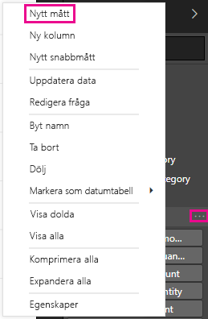
    
    Du kan också skapa ett nytt mått genom att välja **Nytt mått** i gruppen **Beräkningar** på fliken **Start** i menyfliksområdet i Power BI Desktop.
    
    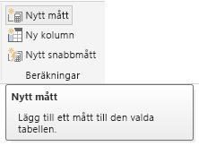
    
    >[!TIP]
    >När du skapar ett mått från menyfliksområdet kan det skapas i vilken som helst av tabellerna, men det är lättare att hitta om du har skapat det där du planerar att använda det. I det här fallet välj först tabellen **Försäljning** för att aktivera den och välj sedan **Nytt mått**. 
    
    Formelfältet visas överst i rapportarbetsytan, där du kan byta namn på ditt mått och ange en DAX-formel.
    
    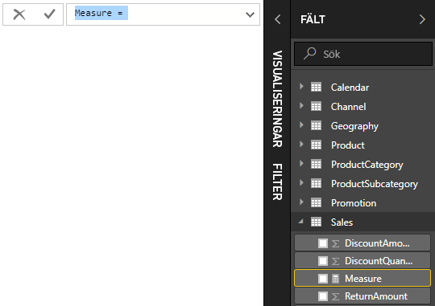
    
1. Som standard döps varje nytt mått helt enkelt till *Mått*. Om du inte byter namn kommer ytterligare mått att döpas till *Mått 2,* , *Mått 3* och så vidare. Eftersom vi vill att måttet ska vara mer identifierbart markerar du *Mått* i formelfältet och skriver sedan *NetSales*.
    
1. Börja ange din formel. Efter likhetstecknet, börja skriva *Sum*. När du skriver visas en listruta med förslag på alla DAX-funktionerna som börjar på de bokstäver som du anger. Bläddra ner vid behov för att välja **SUM** i listan och tryck på **RETUR**.
    
    
    
    En vänsterparentes visas tillsammans med en nedrullningsbar förslagslista över tillgängliga kolumner som du kan överföra till SUM-funktionen.
    
    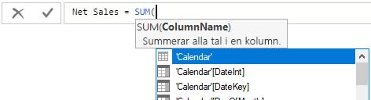
    
1. Uttryck visas alltid mellan en vänster- och högerparentes. I det här exemplet innehåller uttrycket ett argument som ska skickas till funktionen SUM: kolumnen **SalesAmount**. Börja skriva *SalesAmount* tills **Sales(SalesAmount)** är det enda värdet som är kvar i listan. 

    Kolumnnamnet som föregås av tabellnamnet kallas fullständigt kvalificerat namn för kolumnen. Fullständigt kvalificerat kolumnnamn gör det lättare att läsa formler.
    
    
    
1. Välj **Sales[SalesAmount]** i listan och skriv sedan en avslutande parentes.
    
    > [!TIP]
    > Syntaxfel orsakas oftast av att en avslutande parentes saknas eller är felplacerad.
    
    
    
1. Subtrahera de två kolumnerna i formeln:

    a. Efter den avslutande parentesen för det första uttrycket, skriv ett mellanslag, en minusoperatör (-) och ett till blanksteg. 

    b. Ange en annan SUM-funktion och börja skriva *DiscountAmount* tills du kan välja kolumnen **Sales[DiscountAmount]** som argument. Lägg till en avslutande parentes. 

    c. Skriv ett mellanslag, en minusoperatör, blanksteg, en till SUM-funktion med **Sales [ReturnAmount]** som argument och sedan en avslutande parentes.
    
    
    
1. Slutför genom att trycka på **RETUR** eller välj **Incheckning** (bockmarkeringen) i formelfältet för att slutföra och validera formeln. 

    Det validerade **Net Sales**-måttet är nu klart att användas i **Försäljnings**-tabellens fönster **Fält**.
    
    
    
1. Om du har slut på utrymme för att ange en formel eller om den ska vara på separata rader, väljer du nedåtpilen till höger i formelfältet för att skapa mer utrymme. 

    Nedåtpilen förvandlas till en uppåtpil och en stor ruta visas.

    

1. Separera delar av formeln genom att trycka på **Alt** + **RETUR** för separata rader eller tryck på **Tabb** för att lägga till tabbar.

   

### Använd ditt mått i rapporten
Lägg till ditt nya **NetSales**-mått i rapportarbetsytan och beräkna nettoförsäljning för de fält som du lägger till i rapporten. 

För att visa nettoförsäljning per land:

1. Välj måttet **Net Sales** från tabellen **Sales** och dra det till rapportarbetsytan.
    
1. Välj fältet **RegionCountryName** från tabellen **Geography** eller dra det till diagrammet **Net Sales**.
    
    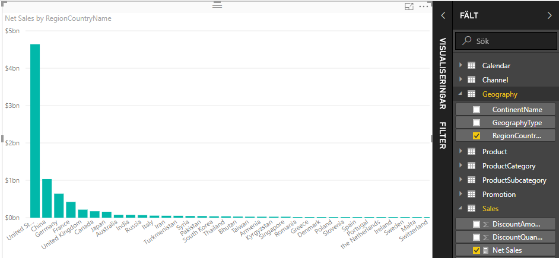
    
1. Om du vill se skillnaden mellan netto- och total försäljning efter land, välj fältet **SalesAmount** eller dra det till diagrammet. 

    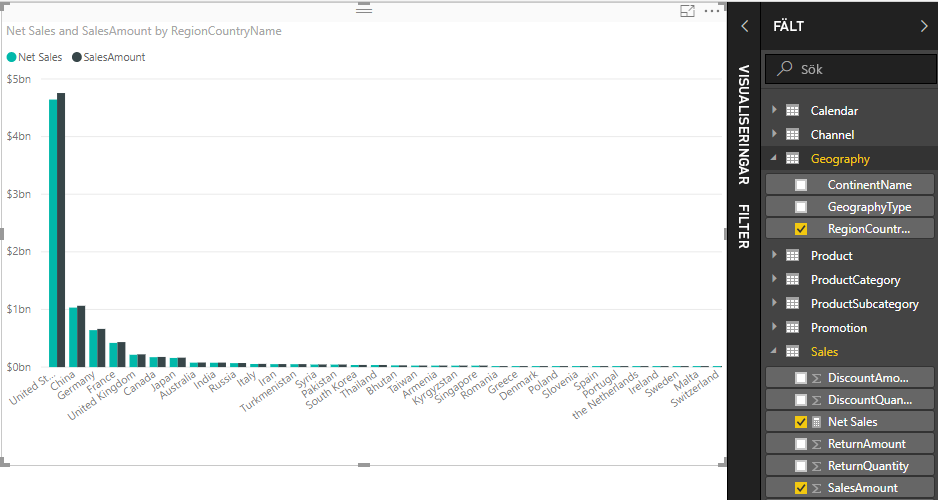

    Diagrammet använder nu två mått: **SalesAmount**, som Power BI summerade automatiskt, och **Net Sales**-måttet som du skapade manuellt. Varje mått beräknas i samband med ett annat fält, **RegionCountryName**.
    
### Använd måttet med ett utsnitt

Lägg till ett utsnitt för att filtrera ytterligare nettoförsäljning och försäljningsbelopp per kalenderår:
    
1. Välj ett tomt utrymme bredvid diagrammet. I **visualiseringspanelen** väljer du visualiseringen **Tabell**. 

    Detta skapar en tom tabellvisualisering på rapportarbetsytan.
    
    
    
1. Dra fältet **År** från tabellen **Kalender** till en ny tom tabellvisualisering. 
    
    Eftersom **År** är ett numeriskt fält summerar Power BI Desktop dess värden. Den här summan fungerar inte bra som en aggregering. Vi går igenom det i nästa steg.

    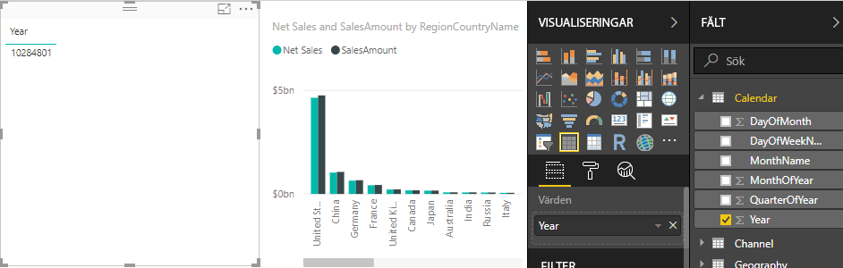
    
3. I rutan **Värden** i fönstret **Visualiseringar** väljer du nedåtpilen bredvid **År** och därefter **Sammanfatta inte** på listan. Tabellen innehåller nu individuella år.
    
    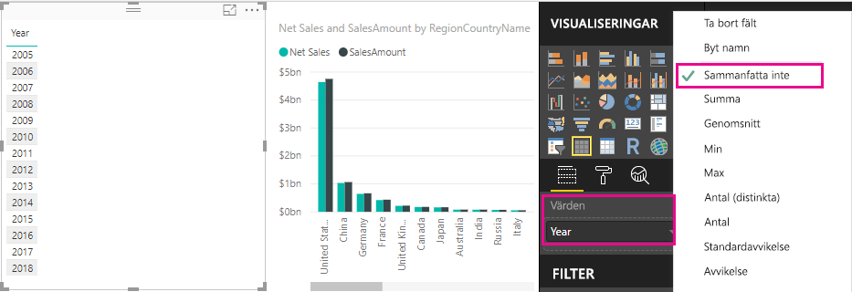
    
4.  Konvertera tabellen till ett utsnitt genom att välja ikonen **Utsnitt** i fönstret **Visualiseringar**. Om visualiseringen visar ett skjutreglage i stället för en lista väljer du **Lista** från nedåtpilen i skjutreglaget.

    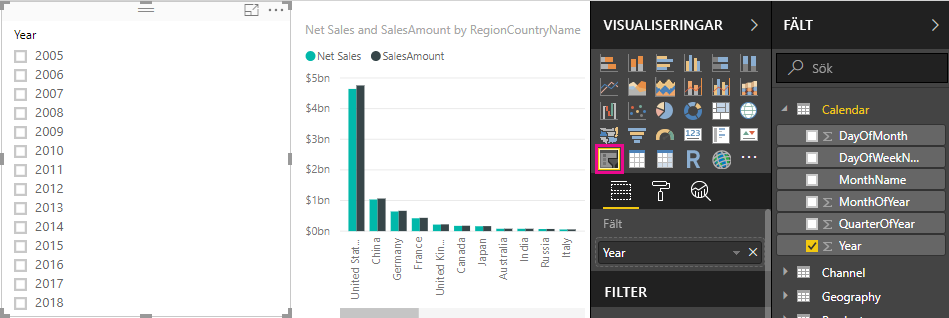
    
5.  Välj ett värde i utsnittet **År** för att filtrera diagrammet **Net Sales and Sales Amount by RegionCountryName** i enlighet med detta. **Net Sales**- och **SalesAmount**-måtten beräknas om och visar resultaten i kontexten för det markerade **År**-fältet. 
    
    

### Använd ditt mått i ett annat mått

Anta att du vill ta reda på vilka produkter som har det högsta nettoförsäljningsbeloppet per såld enhet. Du behöver ett mått som delar nettoförsäljningen med antalet sålda enheter. Skapa ett nytt mått som delar resultatet av dina **Net Sales**-mått med summan av **Sales[SalesQuantity]** .

1.  I fönstret **Fält** skapar du en ny åtgärd med namnet **Nettoförsäljning per enhet** i tabellen **Försäljning**.
    
1. Börja skriva *NetSales* i formelfältet. Förslagslistan visar vad du kan lägga till. Välj **[Net Sales]** .
    
    
    
1. Du kan också referera till ett mått genom att helt enkelt skriva en inledande hakparentes ( **[** ). Listan över förslag visar endast mått att lägga till i formeln.
    
    
    
1. Ange ett blanksteg, en divisionsoperatör (/), ett till blanksteg, SUM-funktionen och skriv sedan *Quantity*. Listan över förslag visar alla kolumner med *Quantity* i namnet. Välj **Sales [SalesQuantity]** , ange den avslutande parentesen och tryck på **RETUR** eller välj **Incheckning** (bockmarkeringen) för att verifiera formeln. 

    Den resulterande formeln bör visas som:
    
    `Net Sales per Unit = [Net Sales] / SUM(Sales[SalesQuantity])`
    
1. Välj måttet **Net Sales per Unit** från tabellen **Försäljning**, eller dra det till ett tomt område i rapportarbetsytan. 

    Diagrammet visar nettoförsäljning per enhet över alla produkter som säljs. Diagrammet är inte så informativt. Vi tar upp det i nästa steg.
    
    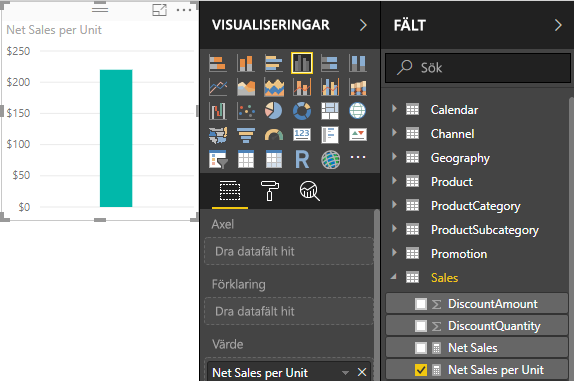
    
1. För ett annat utseende, ändra diagramvisualiseringens typ till **Trädkarta**.
    
    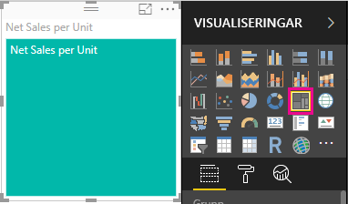
    
1. Välj fältet **Produktkategori** eller dra det till trädkartan eller till fältet **Grupp** i **visualiseringsfönstret**. Nu har du lite bra information!
    
    
    
7. Försök att ta bort fältet **ProductCategory** och dra fältet **ProductName** till diagrammet i stället. 
    
    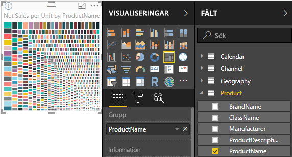
    
   Ok, nu leker vi bara lite men medge att det är rätt häftigt! Experimentera med andra sätt att filtrera och formatera visualiseringen.

## Vad du har lärt dig
Mått ger dig stor förmåga att skaffa dig de insikter som du vill från dina data. Du har lärt dig hur du skapar mått med hjälp av formelfältet, döper dem till lämpligt namn, och hittar och väljer rätt formelelement med hjälp av DAX-förslagslistor. Du har också insett betydelsen av den kontext i vilken resultaten av måttberäkningarna kan ändras beroende på andra fält eller uttryck i din formel.

## Nästa steg
- Läs mer om snabbmått i Power BI Desktop, som ger många vanliga måttberäkningar i [Använda snabbmått för att enkelt utföra vanliga och kraftfulla beräkningar](desktop-quick-measures.md).
  
- Om du vill ha en grundligare genomgång av DAX-formler och skapa mer avancerade mått, kan du läsa mer i [DAX-grunder i Power BI Desktop](desktop-quickstart-learn-dax-basics.md). Den här artikeln handlar om grundläggande begrepp i DAX, till exempel syntax, funktioner och en mer omfattande beskrivning av kontext.
  
- Det kan vara bra att lägga till [Referens för dataanalysuttryck (DAX)](https://docs.microsoft.com/dax/index) i dina Favoriter. I den här referensen hittar du detaljerad information om DAX-syntax, operatorer och drygt 200 DAX-funktioner.
