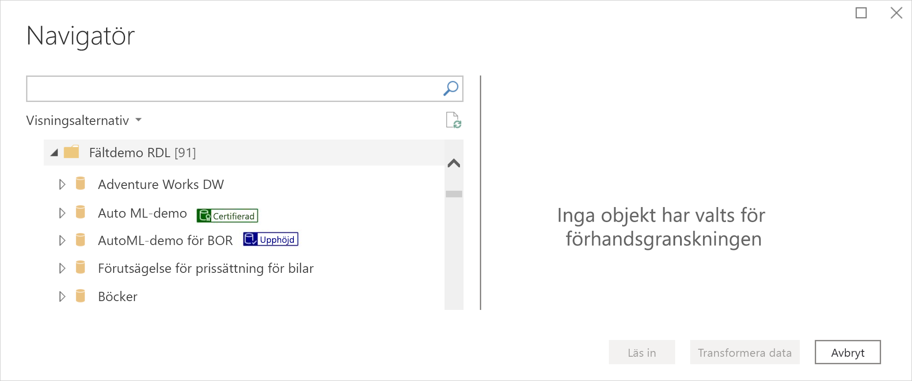
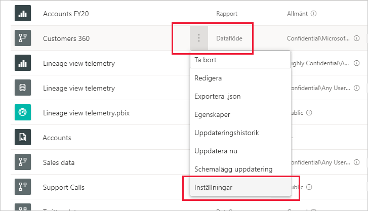
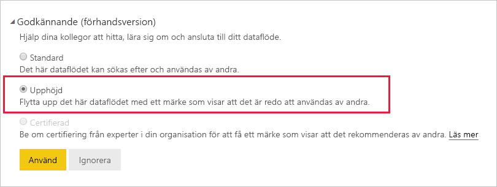
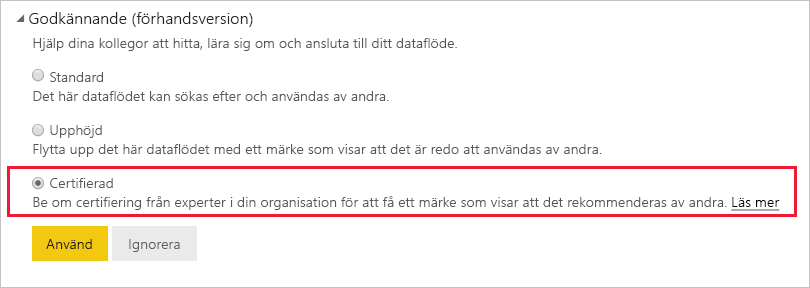

# Höja upp eller certifiera dataflöden (förhandsversion)

Det finns två sätt att öka synligheten för dina värdefulla, högkvalitativa dataflöden i Power BI: **upphöjning** och **certifiering**.

* **Upphöjning**: Med upphöjning kan användare lyfta fram dataflöden som de tror kan vara värdefulla och användbara för andra. På så sätt kan dataflödena spridas och användas mer i organisationen. Alla dataflödesägare, och alla medlemmar med skrivbehörighet för arbetsytan där dataflödet finns, kan enkelt höja upp dataflödet när det är tillräckligt bra för att delas.

* **Certifiering**: Certifiering innebär att ett dataflöde har kontrollerats av en auktoriserad granskare och verkligen är en tillförlitlig datakälla som är redo att användas i hela organisationen. En utvald grupp av granskare som definieras av administratören för Power BI-klientorganisationen bestämmer vilka dataflöden som ska certifieras. En användare som anser att ett visst dataflöde bör certifieras, men inte har behörighet att certifiera det, ska kontakta administratören för klientorganisationen.

  Dataflöden kan bara certifieras om [administratören för klientorganisationen har aktiverat den här funktionen](../admin/service-admin-setup-certification.md).

Att höja upp eller certifiera ett dataflöde kallas för att *bekräfta* det. De som skapar Power BI-rapporter har ofta många olika dataflöden att välja bland, och via rekommendationer kan de hitta dataflöden som är tillförlitliga och betrodda.

Rekommenderade dataflöden är tydligt utmärkta på många ställen i Power BI, så att rapportförfattare enkelt kan hitta dem när de söker efter tillförlitliga data, och så att administratörer och rapportförfattare kan spåra hur de används i organisationen.

I bilden nedan ser du hur upphöjda och certifierade dataflöden enkelt kan identifieras i Power Query.

I den här artikeln beskrivs hur du:
* höjer upp ett dataflöde (dataflödesägaren eller en användare med medlemsbehörighet för arbetsytan där dataflödet finns)
* certifierar ett dataflöde (godkänd certifierare utsedd av administratören för klientorganisationen)

Information om hur du konfigurerar dataflödescertifieringen (administratören för klientorganisationen) finns i [Konfigurera certifiering av datamängder dataflöden](../admin/service-admin-setup-certification.md)

## Höja upp ett dataflöde

För att kunna höja upp ett dataflöde måste du ha skrivbehörighet för arbetsytan där dataflödet du vill höja upp finns.

1. Gå till listan med dataflöden på arbetsytan.
 
1. Välj **Fler alternativ** (...) för det dataflöde du vill höja upp och välj sedan **Inställningar**.

    

1. Expandera rekommendationsavsnittet och välj **Upphöjt**.

    

1. Välj **Tillämpa**.

## Certifiera ett dataflöde

Det här avsnittet är avsett för användare som administratören för klientorganisationen har utsett till certifierare av dataflöden. Certifiering av dataflöden är ett stort ansvar. I det här avsnittet beskrivs den certifieringsprocess du går igenom.

1. Se till att få skrivbehörighet för arbetsytan där det dataflöde du vill certifiera finns. Du kan få det från dataflödesägaren eller någon annan med administratörsbehörighet för arbetsytan. 

1. Granska dataflödet noga och avgör om det är värt en certifiering.

1. Om du bestämmer dig för att certifiera dataflödet går du till arbetsytan där det finns.
 
1. Leta rätt på dataflödet du söker, klicka på **Fler alternativ** (...) och välj sedan **Inställningar**.

    

1. Expandera rekommendationsavsnittet och välj **Certifierat**. 

    

2. Klicka på **Godkänn**.

## Nästa steg

* [Konfigurera certifiering av datamängder och dataflöden](../admin/service-admin-setup-certification.md)
* Har du några frågor? [Fråga Power BI Community](https://community.powerbi.com/)