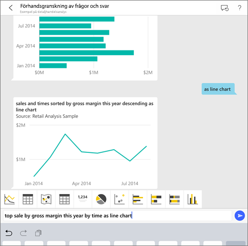
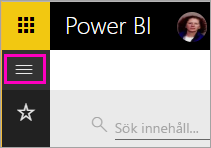
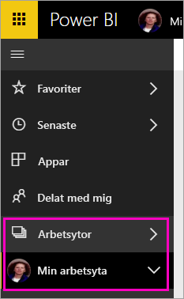
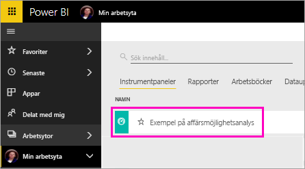

# Självstudie: Ställ frågor om dina data med det virtuella analysverktyget Frågor och svar i iOS – Power BI

Det enklaste sättet att lära dig om dina data är att ställa frågor om dem med dina egna ord. I den här självstudien, ställer du frågor och visar aktuella insikter om exempeldata med det virtuella analysverktyget Frågor och svar i Microsoft Power BI-mobilappen på din iPad, iPhone och iPod Touch. 

Gäller för:

|  |  |
|:--- |:--- |
| iPhone-telefoner |iPad-surfplattor |

Det virtuella analysverktyget Frågor och svar är en Bi-upplevelse av konversationstyp som använder sig av underliggande frågor och svar-data i Power BI-tjänsten [(https://powerbi.com)](https://powerbi.com). Det föreslår datainsikter och du kan skriva in eller ställa egna frågor muntligt.

I den här självstudien kommer vi att:

> [!div class="checklist"]
> * Installera Power BI-mobilappen för iOS
> * Ladda ned en Power BI-exempelinstrumentpanel och -rapport
> * Se vilka aktuella insikter som mobilappen föreslår

Om du inte har registrerat dig för Power BI [registrerar du dig för en kostnadsfri utvärderingsversion](https://app.powerbi.com/signupredirect?pbi_source=web) innan du börjar.

## Förutsättningar

### Installera Power BI för iOS-appen
[Hämta iOS-appen](http://go.microsoft.com/fwlink/?LinkId=522062 "Hämta iPhone-appen") från Apples App Store till din iPad, iPhone eller iPod Touch.

Dessa versioner stöder Power BI för iOS-appen:
- iPad med iOS 10 eller senare.
- iPhone 5 och senare, med iOS 10 eller senare. 
- iPad med iOS 10 eller senare.

### Hämta exemplet på affärsmöjlighetsanalys
Det första steget i självstudiekursen är att hämta exemplet på affärsmöjlighetsanalys i Power BI-tjänsten.

1. Öppna Power BI-tjänsten i din webbläsare (app.powerbi.com) och logga in.

1. Välj den globala navigeringsikonen för att öppna det vänstra navigeringsfönstret.

    

2. I det vänstra navigeringsfönstret väljer du **Arbetsytor** > **Min arbetsyta**.

    

3. Längst ned i vänster hörn väljer du **Hämta data**.
   
    

3. På sidan Hämta data väljer du ikonen **Exempel**.
   
   

4. Välj **Exempel på affärsmöjlighetsanalys**.
 
    
 
8. Välj **Anslut**.  
  
   
   
5. Power BI importerar exemplet och lägger till en ny instrumentpanel, rapport och datauppsättning till din Min arbetsyta.
   
   

OK, nu är du redo att visa exemplet på din iOS-enhet.

## Testa aktuella insikter
1. Öppna Power BI-appen på din iPhone eller iPad och logga in med dina Power BI-kontouppgifter, samma som du använde i Power BI-tjänsten i webbläsaren.

1.  Tryck på den globala navigeringsknappen  > **Arbetsytor** > **Min arbetsyta** och öppna instrumentpanelen Exempel på affärsmöjlighetsanalys.

2. Peka på ikonen för Frågor och svar  från åtgärdsmenyn längst ner på sidan (överst på sidan om du använder en iPad).

     

     Det virtuella analysverktyget Frågor och svar för Power BI erbjuder några förslag för att komma igång.

     
3. Tryck på **aktuella insikter**.

     Den virtuella analysen Q & A föreslår vissa insikter.
4. Bläddra till höger och tryck på **Insikt 2**.

    

     Det virtuella analysverktyget Frågor och svar visas Insikt 2.

    
5. Tryck på diagrammet för att öppna det i fokusläge.

    
6. Tryck på pilen i det övre vänstra hörnet att gå tillbaka till Frågor och svar.

## Rensa resurser

När du är klar med självstudien kan du ta bort instrumentpanelen, rapporter och datauppsättningen för exemplet på affärsmöjlighetsanalys.

1. Öppna Power BI-tjänsten (app.powerbi.com) och logga in.

2. I det vänstra navigeringsfönstret väljer du **Arbetsytor** > **Min arbetsyta**.

3. På fliken **Instrumentpaneler** väljer du papperskorgens **Ta bort**-ikon bredvid instrumentpanelen för Exempel på affärsmöjlighetsanalys.

    

4. Välj fliken **Rapporter** och gör samma sak för rapporten för affärsmöjlighetsanalys.

5. Välj fliken **Datauppsättningar** och gör samma sak för datauppsättningen för affärsmöjlighetsanalys.

## Nästa steg

Du har nu testat den virtuella assistenten Frågor och svar i Power BI-appar för iOS. Läs mer om Frågor och svar i Power BI-tjänsten.
> [!div class="nextstepaction"]
> [Frågor och svar i Power BI-tjänsten](power-bi-q-and-a.md)

