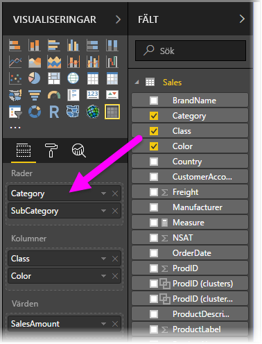
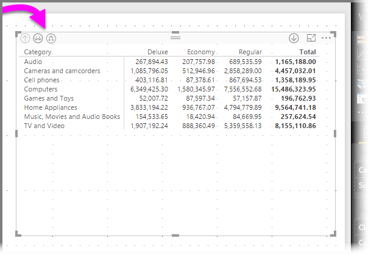
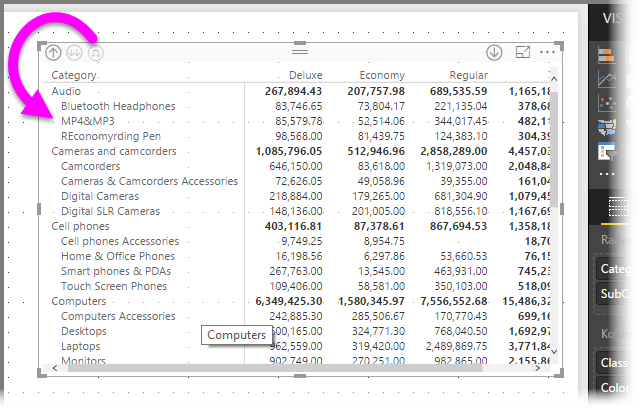
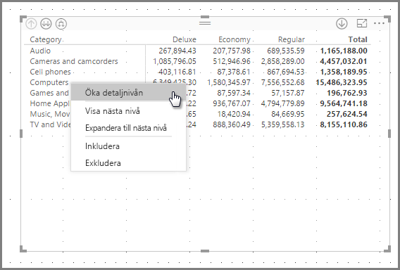
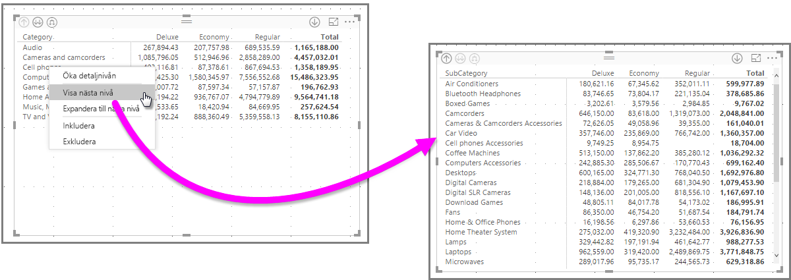
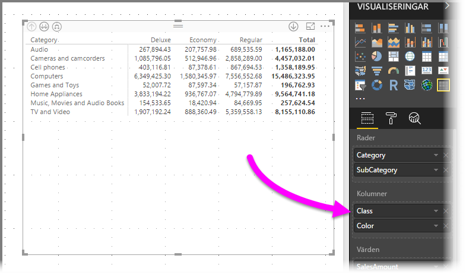
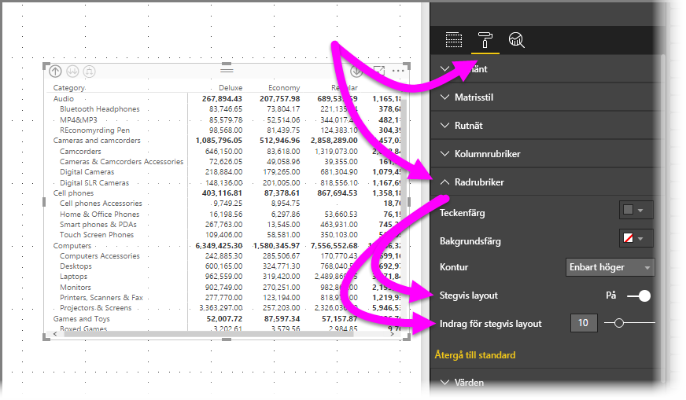
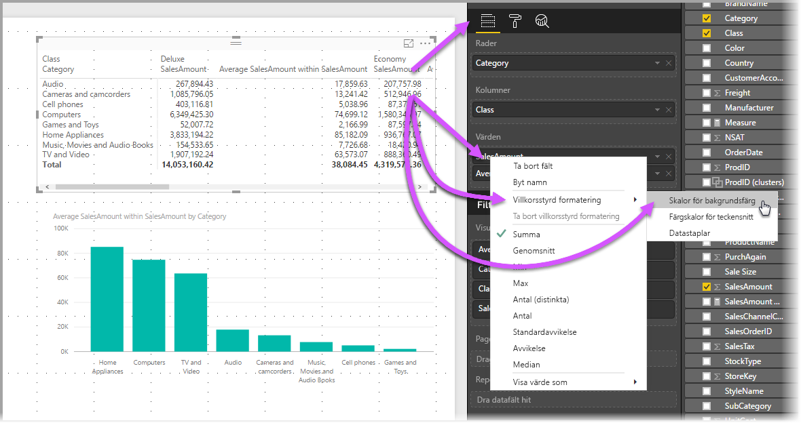
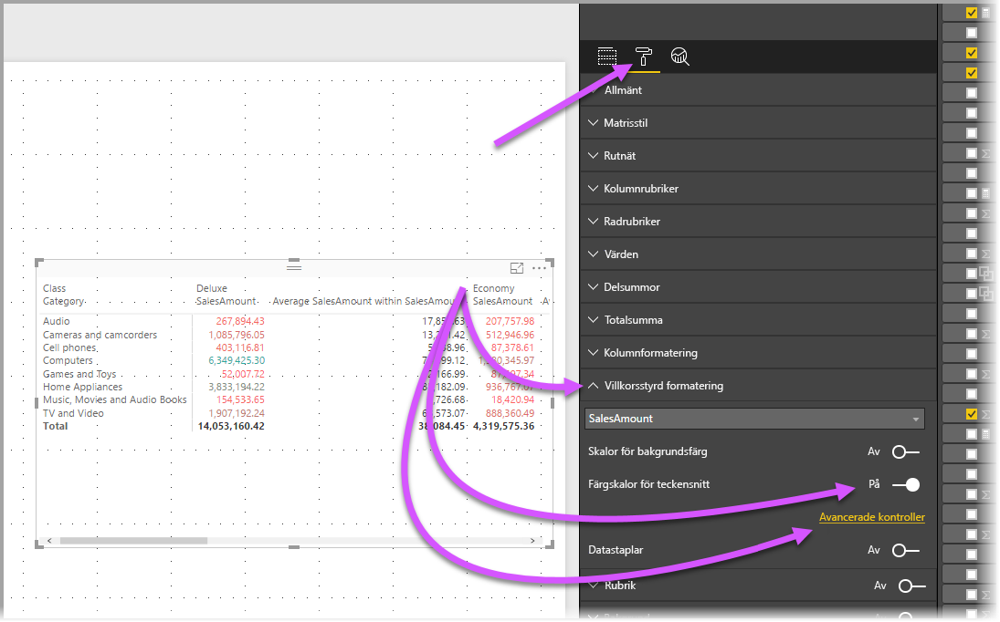
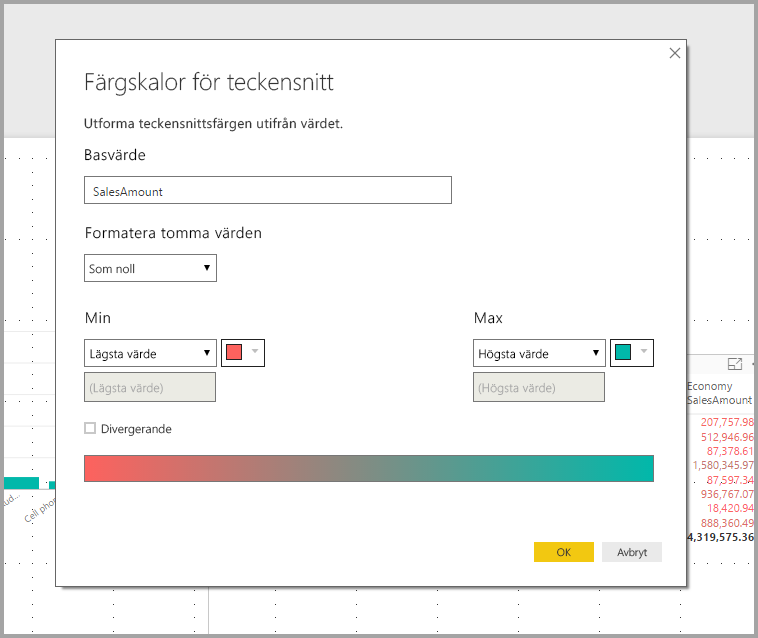

# Använd det visuella matrisobjektet i Power BI
Med den visuella **matris**-funktionen kan du skapa visuell matrisinformation (kallas ibland också *tabeller*) i **Power BI Desktop**-rapporter och **Power BI-tjänst**rapporter och markera flera element i matrisen med andra visuella objekt. Dessutom kan du välja rader, kolumner och även enskilda celler och korsmarkeringar. Du kan kopiera enskilda celler och markeringar av flera celler och klistra in dem i andra program. Matrisen har dessutom stöd för stegvis layout för optimal användning av utrymmet.

Det finns många funktioner som är kopplade till matrisen och vi ska gå igenom dem i följande avsnitt i den här artikeln.

## Rapportteman
Både matriser och tabeller speglar formatmallar (inklusive färger) från den kopplade **rapportens tema**. Dessa kanske inte är de färger som du förväntar dig för din matris, vilket kan ändras i konfigurationen för ditt **Rapporttema**. Se [**Använda rapportteman i Power BI Desktop**](../desktop-report-themes.md) för mer information om teman.

## Beräkning av summor i Power BI

Innan vi går vidare till hur man använder det visuella **matris**objektet är det viktigt att du förstår hur Power BI beräknar total- och delsummor i tabeller och matriser. När det gäller summa- och delsummarader utvärderas måttet för alla rader i underliggande data – det handlar *inte* bara om att lägga till värdena i de tabellrader som syns eller visas. Detta innebär att du kan få andra värden än vad du räknat med i totalsummaraden. 

Ta en titt på följande visuella **matris**objekt. 

I det här exemplet visar varje rad i det visuella **matris**objektet längst till höger *Belopp* för varje kombination säljare/datum. Men eftersom en säljare visas för flera datum kan siffrorna visas mer än en gång. Den korrekta totalsumman för underliggande data och en enkel addering av de synliga värdena överensstämmer därmed inte. Detta är ett vanligt mönster när det värde som du summerar finns på ”ett”-sidan i ett ett-till-många-samband.

Tänk på att dessa värden, när du arbetar med total- och delsummor, baseras på underliggande data och inte enbart på de värden som visas. 

<!-- use Nov blog post video

## Expanding and collapsing row headers
There are two ways you can expand row headers. The first is through the right-click menu. You’ll see options to expand the specific row header you clicked on, the entire level or everything down to the very last level of the hierarchy. You have similar options for collapsing row headers as well.

You can also add +/- buttons to the row headers through the formatting pane under the row headers card. By default, the icons will match the formatting of the row header, but you can customize the icons’ color and size separately if you want. 
Once the icons are turned on, they work similarly to the icons from PivotTables in Excel.

The expansion state of the matrix will save with your report. It can be pinned to dashboards as well, but consumers will need to open up the report to change the state. Conditional formatting will only apply to the inner most visible level of the hierarchy. Note that this expand/collapse experience is not currently supported when connecting to AS servers older than 2016 or MD servers.

Watch the following video to learn more about expand/collapse in the matrix:

-->
## Öka detaljnivån i den visuella matrisen
Det finns en mängd intressanta aktiviteter som ökar detaljnivån i **matrisen** som inte var tillgängliga tidigare. Detta inkluderar möjligheten att öka detaljnivån för rader, kolumner och även i enskilda avsnitt och celler. Nu ska vi titta på hur var och en av dessa fungerar.

### Öka detaljnivån för radrubriker
Gå till fönstret **Visualiseringar**. När du lägger till flera fält i avsnittet **Rader** i brunnen **Fält** aktiveras granskning nedåt på raderna i matrisen. Detta påminner om hur du skapar en hierarki som sedan låter dig öka detaljnivån (och återgå) i hierarkin och analysera data på varje nivå.

I följande bild skapar avsnittet **Rader** *Kategori* och *Underkategori* en gruppering (eller hierarki) i de rader som vi kan se i större detalj.

När en gruppering har skapats i avsnittet **Rader** visar det visuella objektet ikonerna *detaljgranska* och *expandera* i det övre vänstra hörnet.

På samma sätt som du kan använda funktionerna för att öka detaljnivån och expandera beteendet för andra visuella objekt, kan vi öka detaljnivån i hierarkin (eller återgå) med dessa knappar. I det här fallet kan vi gå från *Kategori* till *Underkategori*, vilket visas i följande bild, där ikonen för att öka detaljnivån (högaffeln) har valts.

Förutom dessa ikoner kan du högerklicka på någon av dessa radrubriker och öka detaljnivån genom att välja från menyn som visas.

Observera att det finns flera alternativ på menyn som visas, vilket genererar olika resultat:

Genom att välja den **detaljnivån** expanderas matrisen för *den* radnivån, *exklusive* radrubriken som högerklickades. I följande bild högerklickade du på *datorer* och valde **detaljnivån**. Observera att andra topprader inte längre visas i matrisen. Detta är en mycket användbar funktion och som är särskilt fiffig när det är dags att **korsmarkera** avsnitt.

Du kan klicka på ikonen **Minska detaljnivån** för att gå tillbaka till föregående toppnivån. Om du sedan väljer **Visa nästa nivå** från snabbmenyn ser du en alfabetisk lista över alla objekt på nästa nivå (i det här fallet fältet *underkategori*) utan kategoriseringen för nästa hierarkinivå.

När du klickar på ikonen **Minska detaljnivån** i det övre vänstra hörnet av matrisen visas alla toppkategorier. Högerklicka igen och välj **Expandera till nästa nivå**, så visas följande visuella objekt.

Du kan också använda menyalternativen **Inkludera** och **Undanta** för att behålla (eller ta bort, respektive) raden du högerklickade på (och eventuella underkategorier) från matrisen.

### Öka detaljnivån för kolumnrubriker
På samma sätt som du kan öka detaljnivån för rader kan du göra samma med **Kolumner**. I följande bild ser du att det finns två fält i fältbrunnen **kolumner**, vilket skapar en hierarki som liknar den som vi använder för rader tidigare i den här artikeln. I fältbrunnen **Kolumner**har vi *Klass* och *Färg*.

När vi högerklickar på en kolumn i **matrisen** visas alternativet att öka detaljnivån. I följande bild, högerklickar vi på *Deluxe* och väljer **Öka detaljnivån**.

När du väljer **Öka detaljnivån** visas nästa nivå i hierarkin för kolumnen *Deluxe*, vilken i detta fall är *Färg*.

Resten av alternativen i högerklicksmenyn fungerar för kolumner på samma sätt som de gör för rader (mer information finns i föregående avsnitt **Öka detaljnivån för radrubriker**). Du kan **Visa nästa nivå**, **Expandera till nästa nivå**, **Inkludera** eller **Undanta** för dina kolumner på samma sätt som för rader.

> [!NOTE]
> Ikonerna för att öka och minska detaljnivån längst upp till vänster på matrisen gäller endast för rader. Du måste använda högerklicksmenyn för att öka detaljnivån i kolumner.
> 
> 

## Stegvis layout med matriser
**Matriser** har automatiskt indrag för underkategorier i en hierarki när de visas under en överordnad kategori. Detta kallas **Stegvis layout**.

I den *ursprungliga* versionen av matrisen visades underkategorier i en helt annan kolumn och tog upp mer utrymme i det visuella objektet. Följande bild visar tabellen i den ursprungliga **matrisen**. Observera underkategorierna i en separat kolumn.

I följande bild visas en **Matris** med **Stegvis layout**. Lägg märke till kategorin *datorer* visar underkategorierna något indragna (tillbehör för datorer, stationära datorer, bärbara datorer, skärmar och så vidare) vilket är tydligare och mycket mer komprimerat.

Du kan enkelt ändra inställningarna för stegvis layout. Expandera området **radrubriker** i **format**-området (rollerikonen) i fönstret **Visuella objekt** för den valda **matrisen**. Du har två alternativ: knappen **Stegvis layout** (som aktiverar eller inaktiverar funktionen) och **stegvis layoutindrag** (anger indrag i bildpunkter).

Om du inaktiverar **stegvis layout** visas underkategorierna har i en annan kolumn snarare än under överordnad kategori.

## Delsummor med matriser
Du kan aktivera eller inaktivera delsummor i matriser, för såväl rader som kolumner. I följande bild ser du att raddelsummor är inställda på **På**.

I avsnittet **Format** i fönstret **Visualiseringar** expanderar du kortet **Delsummor** och sätter skjutreglaget **Raddelsummor** till **Inaktivera**. När du gör det visas inte delsummor.

Samma sak gäller för kolumndelsummor.

## Korsmarkering med matriser
Med visualiseringen **Matris** kan du välja alla element i matrisen som grund för korsmarkering. Markera en kolumn i en **matris** för att markera den och alla andra visuella objekt på rapportsidan. Den här typen av korsmarkering har varit en vanlig funktion för andra visuella objekt och val av datapunkter, så nu har det visuella objektet **Matris** samma funktion.

Dessutom fungerar Ctrl + klicka för korsmarkering. I följande bild valdes till exempel en samling av underkategorier från **matrisen**. Observera hur objekt som inte var markerat från det visuella objektet är nedtonade och hur övriga visuella objekt på sidan återspeglar de val du gjorde i **matrisen**.

## Kopiera värdena från Power BI så att du kan använda dem i andra program

Din matris eller en tabell kan ha innehåll som du vill använda i andra program som Dynamics CRM eller Excel eller t.o.m. i andra Power BI-rapporter. Genom att högerklicka i Power BI kan du kopiera en cell eller ett cellurval till Urklipp och klistra in informationen i det andra programmet.

* Om du vill kopiera en enskild cells värde markerar du cellen, högerklickar och väljer **Kopiera värde**. Med det oformaterade cellvärdet i Urklipp kan du nu klistra in det i ett annat program.

    

* Om du vill kopiera mer än en enskild cell markerar du ett cellområde eller markerar en eller flera celler med hjälp av CTRL. Kopian inkluderar kolumn- och radrubrikerna.

    

## Fyllning och teckenfärger med matriser
Med visualiseringen **Matris** kan du använda **villkorsstyrd formatering** (färger och fyllning) för cellernas bakgrundsfärger samt på själva texten och värdena.

Om du vill tillämpa villkorsstyrd formatering, kan du göra något av följande när en matris väljs:

* I fönstret **Fält** högerklickar du på fältet och väljer **Villkorsstyrd formatering** på menyn.
  
  
* Alternativt kan du gå till fönstret **Format** och expandera kortet **Villkorsstyrd formatering** och flytta skjutreglaget till **på** för antingen **Bakgrundsfärgskalor** eller **Teckensnittfärgskalor**. När du aktiverar något av dessa alternativ visas en länk till *Avancerade kontroller*, där du kan anpassa färger och värden för formatering av färg.
  
  

Båda metoder ger samma resultat. Om du väljer *avancerade kontroller* visas följande dialogruta där du kan göra justeringar:

## Nästa steg

[Punktdiagram och bubbeldiagram i Power BI](power-bi-visualization-scatter.md)

[Visualiseringstyper i Power BI](power-bi-visualization-types-for-reports-and-q-and-a.md)