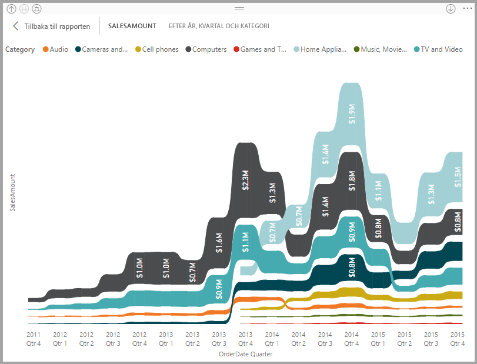
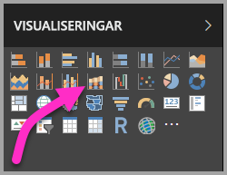
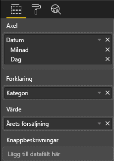
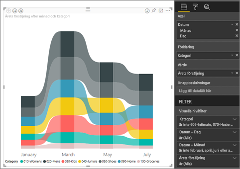
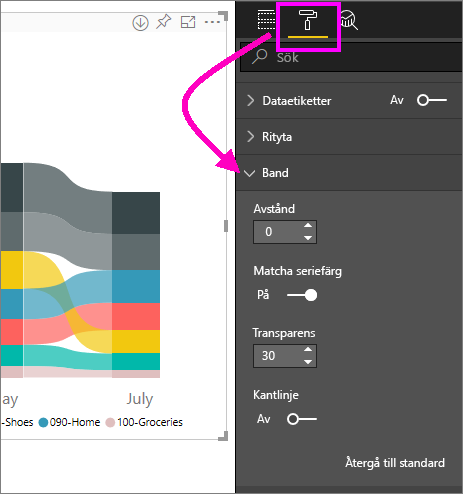
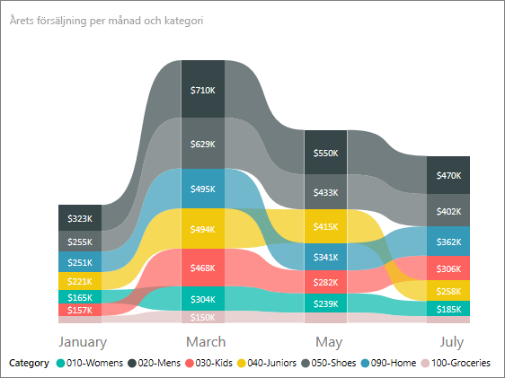

# Använda banddiagram i Power BI
Du kan använda banddiagram för att visualisera data och snabbt avgöra vilken datakategori som har högst rangordning (störst värde). Banddiagram är effektiva för att visa en rangordningsförändring med den högsta rangordningen (värdet) längst upp för varje tidsperiod. 

## Skapa ett banddiagram
Om du vill följa med, kan du öppna [exempelrapporten över detaljhandelsanalys](../sample-retail-analysis.md). 

1. Skapa ett banddiagram genom att välja **Banddiagram** i fönstret **Visuella objekt**.

    

    Banddiagram jämför en datakategori under en tidsperiod med band, vilket innebär att du kan se vilken rangordning en viss kategori har under loppet av diagrammets x-axel (vanligtvis tidslinjen).

2. Välj fält för **Axel**, **Förklaring** och **Värde**.  I det här exemplet har vi valt: **Date** (Datum), **Category** (Kategori) och **This year sales** (Det här årets försäljning).  

    

    Eftersom datauppsättningen bara innehåller data för ett år har vi tagit bort fältet **Year** (År) från **Axel**. 

3. Banddiagrammet visar rangordningen för varannan månad. Observera hur rangordningen ändras över tid.  Till exempel flyttar kategorin Home (Hem) från tredje till fjärde och tillbaka till tredje igen. Kategorin Juniors (Juniorsäljare) från tredje till femte i July (juli). 

    

## Formatera ett banddiagram
När du skapar ett diagram i menyfliksområdet har du formateringsalternativ som är tillgängliga i området **Format** i fönstret **Visuella objekt**. Formateringsalternativen för banddiagram liknar dem för ett stående stapeldiagram med extra formateringsalternativ som är specifika för band.

Med formateringsalternativen för banddiagram kan du göra justeringar.

* **Med avstånd** kan du styra hur mycket utrymme som ska visas mellan banden. Numret är i procent av kolumnens maximala höjd.
* **Med matcha seriefärg** kan du matcha färg i menyfliksområdet med seriefärg. Banden är grå när detta är **avaktiverat**.
* **Genomskinlighet** anger hur genomskinligt menyfliksområdet är. Standardvärdet är 30.
* **Kantlinje** kan du placera en mörk kantlinje högst upp och längst ned på banden. Kantlinjer är inaktiverade som standard.

Eftersom banddiagrammet inte har några y-axeletiketter kan du vilja lägga till dataetiketter. Välj **Dataetiketter** i formateringsfönstret. 

Ange formateringsalternativ för dina dataetiketter.  I det här exemplet har vi ställt in textfärgen på vit, decimaler på noll och visningsenheter på tusental. 

## Nästa steg

[Punktdiagram och bubbeldiagram i Power BI](power-bi-visualization-scatter.md)

[Visualiseringstyper i Power BI](power-bi-visualization-types-for-reports-and-q-and-a.md)