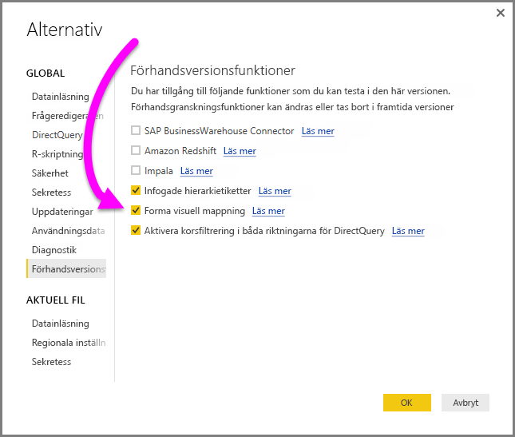
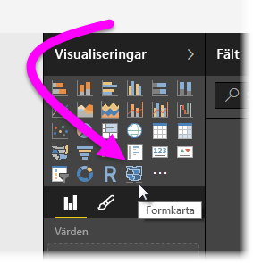
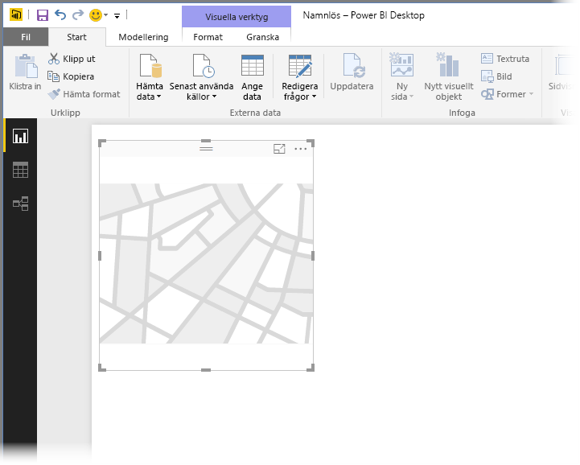
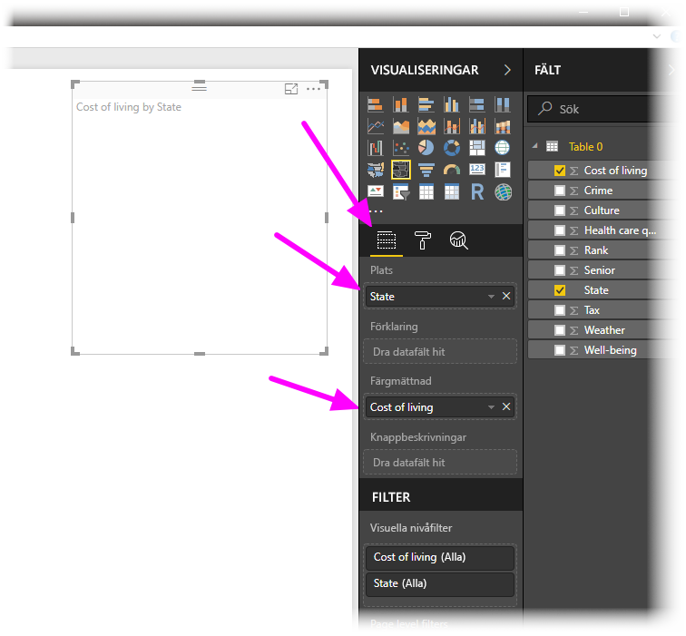
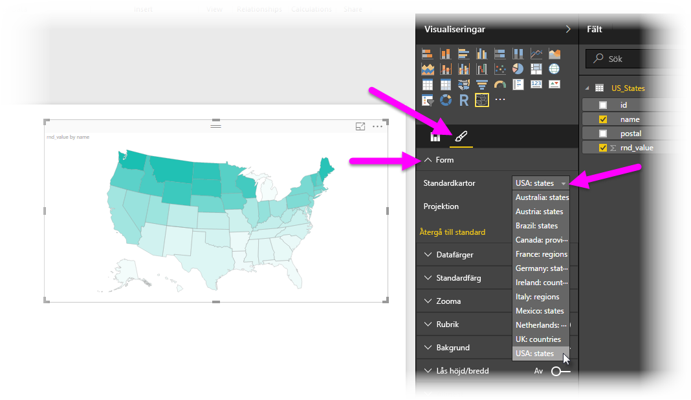
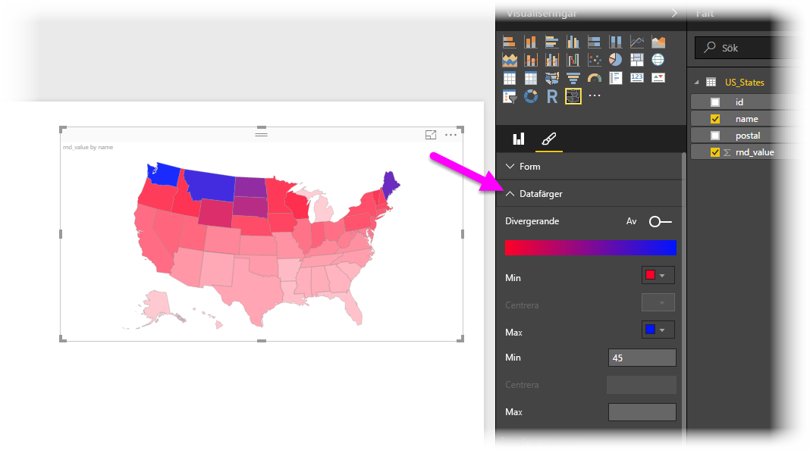
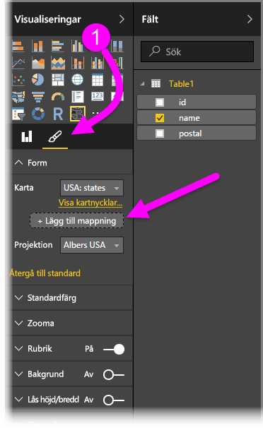
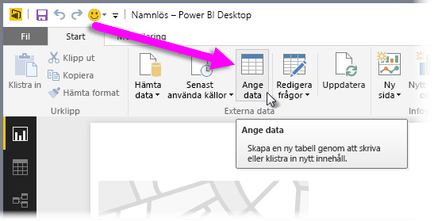
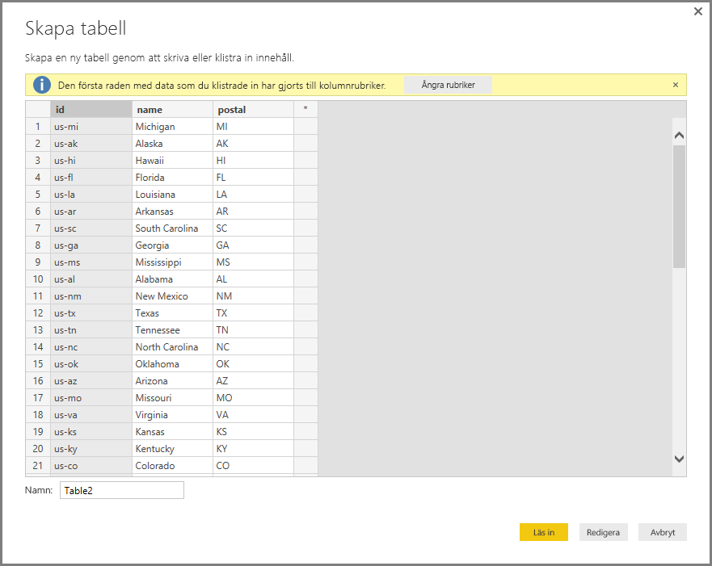

# Formkartor i Power BI Desktop (förhandsgranskning)
I Power BI Desktop skapar du en **formkartan** för att visa relativa jämförelser mellan områden på en karta genom att använda olika färger i olika områden. Jämfört med **kartor** kan **formkartor** inte visa exakta geografiska platser för datapunkter på en karta. Dess huvudsakliga syfte är att visa relativa jämförelser för regioner på en karta genom att markera dem med olika färger.

**Formkartor** är baserade på ESRI/TopoJSON-kartor som kan använda anpassade som du kan skapa, till exempel geografiska kartor, placeringskartor, plankartor med mera. Möjligheten att använda anpassade kartor är inte tillgänglig i den här förhandsversionen av **Formkarta**.

## Skapa formkartor
Du kan testa kontrollen **Formkarta** med kartorna som levereras med den här förhandsversionen använda dina egna anpassade kartor förutsatt att de uppfyller kraven som anges i följande avsnitt: **Använda anpassade kartor**.

**Formkartor** är en förhandsversion och måste aktiveras i Power BI Desktop. För att aktivera **Formkartor** väljer du **Arkiv > Alternativ och inställningar > Alternativ > Förhandsversionsfunktioner** och markerar sedan kryssrutan bredvid **Forma visuell mappning**. Du måste starta om Power BI Desktop när du har gjort valet.

När **formkartor** har aktiverats klickar du på kontrollen **Formkarta** från fönstret **Visuella objekt**.

Power BI Desktop skapar en tom arbetsyta för **Formkarta**.

Vidta följande steg för att skapa en **Formkarta**:

1. I rutan **Fält** drar du ett datafält som har ett regionnamn (eller förkortning) till **plats**bucketen och datafältet i bucketen **Färgmättnad** (du kommer inte se en karta ännu).

   > [!NOTE]
   > Se avsnittet **Hämta kartdata** nedan för information om hur du snabbt hämtar kartdata för att testa **formkartan**.
   > 
   > 

   
2. I inställningsfönstret **Format** expanderar du **Form** och väljer från listrutan **Standardkartor** för att visa dina data. Nu visas renderingen som i följande bild.

   

   > [!NOTE]
   > I avsnittet **Regionnycklar** i slutet av den här artikeln finns en uppsättning tabeller som har kartregionnycklar som du kan använda för att testa **Formkartan**.
   > 
   > 
3. Du kan ändra kartans projektion och zoomningsinställningar samt färger för datapunkter, från inställningsfönstret **Format**. Du kan också ändra inställningarna för zoomning. Du kan till exempel ändra färger, ange max- och minimivärdena och så vidare.

   
4. Du kan också lägga till en kategoridatakolumn till **förklarings**bucketen och klassificera kartregioner utifrån kategorier.

## Använda anpassade kartor
Du kan använda anpassade kartor med **Formkarta** så länge som de finns i **TopoJSON**-format. Om kartan är i ett annat format kan du använda onlineverktyg som [**Kartformaren**](http://mapshaper.org/) för att konvertera dina *formfiler* eller *GeoJSON*-mappar till **TopoJSON**-format.

För att använda din **TopoJSON**-kartfil, lägger du till ett visuellt ShapeMap-objekt i rapporten och lägger till vissa data i bucketarna *Plats* och *Färgmättning*. I rutan **Visualiseringar** med avsnittet **Format** markerat (visas som (1) i följande bild) expanderar du området **Form** och väljer **+ Lägg till karta**.

## Exempel på egen karta
*Offices of the United States Attorneys* publicerar varje år en finansiell rapport med information om deras tvister och ärenden.  Följ länken nedan om du vill se alla deras rapporter.

https://www.justice.gov/usao/resources/annual-statistical-reports

Eftersom delstater kan vara indelade i flera distrikt måste vi ha en anpassad formkarta.  Genom att importera **TopoJSON**-kartan över USA:s domkretsar till **Power BI Desktop** kan vi visualisera årliga finansiella data för distriktsåklagarna.  Bilden nedan visar ett exempel på en sådan karta.

Man kan också göra intressanta saker med enskilda delstatskartor och visa mer information beroende på vilka distrikt den innehåller. 

Om du vill experimentera med datauppsättningen och visualiseringen kan du hämta den ursprungliga PBIX-filen som användes för att generera rapporten med hjälp av följande länk.

* [PBIX-fil för demonstration av anpassad formkarta](http://download.microsoft.com/download/1/2/8/128943FB-9231-42BD-8A5D-5E2362C9D589/DistrictAttorneyFiscalReport.pbix)

## Hämta kartdata
För att snabbt hämta data till en modell så att du kan testa **formkartan** kan du kopiera en av tabellerna i slutet av den här artikeln och sedan markera **Ange data** från menyfliksområdet **Start**.

Om dina data har flera kolumner, behöver du använda en redigerare som Excel för att klistra in data och sedan kopiera varje datakolumn separat. Du kan sedan klistra in data i Power BI Desktop. Den översta raden identifieras automatiskt som en rubrik.

Du kan ange en ny kolumn genom att skriva ett nytt kolumnnamn (i den tomma kolumnen till höger) och sedan lägga till värden i varje cell, precis som du kan göra i Excel. När du är klar väljer du **Överför** så läggs tabellen till i datamodellen för Power BI Desktop.

> [!NOTE]
> När du arbetar med länder eller regioner, så använd ländernas trebokstavsförkortningar, vilket säkerställer att geokodningen fungerar korrekt i kartvisualiseringarna. Använd *inte* tvåbokstavsförkortningar, eftersom vissa länder eller regioner i så fall kanske inte kan identifieras.
> 
> Om du bara har tvåbokstavsförkortningar, så läs [det här externa blogginlägget](https://blog.ailon.org/how-to-display-2-letter-country-data-on-a-power-bi-map-85fc738497d6#.yudauacxp) med stegvisa anvisningar om hur du kan associera dina tvåbokstavsförkortningar för länder/regioner med motsvarande trebokstavsförkortningar.
> 
> 

## Förhandsgranskningens beteende och krav
Det finns några överväganden och krav för den här förhandsversionen av **Formkarta**:

* **Formkartor** är en förhandsversion och måste aktiveras i Power BI Desktop. För att aktivera **Formkartor** väljer du **Arkiv > Alternativ och inställningar > Alternativ > Förhandsversionsfunktioner** och markerar sedan kryssrutan bredvid **Forma visuell mappning**.
* För närvarande måste bucketen **Färgmättnad** vara inställd för att klassificeringen **Förklaring** ska fungera korrekt.
* Den slutliga versionen av **Formkartan** har ett användargränssnitt som visar kartnycklarna för aktuellt vald karta (inget datum har angetts för slutlig utgåva och **Formkarta** är fortfarande i förhandsversion). I den här förhandsversionen kan du referera till kartans regionsnycklar i tabellerna som du hittar i följande avsnitt för **Regionsnycklar** i den här artikeln.
* Det visuella objektet **Formkarta** ritar upp till 1 000 datapunkter.

## Regionsnycklar
Använd följande **Regionsnycklar** i den här förhandsversionen för att testa **formkartan**.

### Australien: delstater

| ID | förkortn. | ISO | namn | postnummer |
| --- | --- | --- | --- | --- |
| au-wa |WA |AU-WA |Western Australia |WA |
| au-vic |Vic |AU-VIC |Victoria |VIC |
| au-tas |Tas |AU-TAS |Tasmanien |TAS |
| au-sa |SA |AU-SA |South Australia |SA |
| au-qld |Qld |AU-QLD |Queensland |QLD |
| au-nt |NT |AU-NT |Northern Territory |NT |
| au-nsw |NSW |AU-NSW |New South Wales |NSW |
| au-act |ACT |AU-ACT |Australian Capital Territory |ACT |

### Österrike: förbundsländer

| ID | ISO | namn | namn-en | postnummer |
| --- | --- | --- | --- | --- |
| at-wi |AT-9 |Wien |Wien |WI |
| at-vo |AT-8 |Vorarlberg |Vorarlberg |VO |
| at-tr |AT-7 |Tirol |Tyrolen |TR |
| at-st |AT-6 |Steiermark |Steiermark |ST |
| at-sz |AT-5 |Salzburg |Salzburg |SZ |
| at-oo |AT-4 |Oberösterreich |Övre Österrike |OO |
| at-no |AT-3 |Niederösterreich |Nedre Österrike |NO |
| at-ka |AT-2 |Kärnten |Kärnten |KA |
| för |AT-1 |Burgenland |Burgenland |BU |

### Brasilien: delstater

| ID |
| --- |
| Tocantins |
| Pernambuco |
| Goias |
| Sergipe |
| Sao Paulo |
| Santa Catarina |
| Roraima |
| Rondonia |
| Rio Grande do Sul |
| Rio Grande do Norte |
| Rio de Janeiro |
| Piaui |
| Parana |
| Paraiba |
| Para |
| Minas Gerais |
| Mato Grosso |
| Maranhão |
| Mato Grosso Sul |
| Distrito Federal |
| Ceara |
| Espirito Santo |
| Bahia |
| Amazonas |
| Amapa |
| Alagoas |
| Acre |
| Litigated Zone 1 |
| Litigated Zone 2 |
| Litigated Zone 3 |
| Litigated Zone 4 |

### Kanada: provinser

| ID | ISO | namn | postnummer |
| --- | --- | --- | --- |
| ca-nu |CA-NU |Nunavut |NU |
| ca-nt |CA-NT |Northwest Territories |NT |
| ca-yt |CA-YT |Yukon |YT |
| ca-sk |CA-SK |Saskatchewan |SK |
| ca-qc |CA-QC |Quebec |QC |
| ca-pe |CA-PE |Prince Edward Island |PE |
| ca-on |CA-ON |Ontario |ON |
| ca-ns |CA-NS |Nova Scotia |NS |
| ca-nl |CA-NL |Newfoundland and Labrador |NL |
| ca-nb |CA-NB |New Brunswick |NB |
| ca-mb |CA-MB |Manitoba |MB |
| ca-bc |CA-BC |British Columbia |BC |
| ca-ab |CA-AB |Alberta |AB |

### Frankrike: regioner

| ID | namn | namn-en |
| --- | --- | --- |
| Alsace |Alsace |Alsace |
| Rhone Alpes |Rhône Alpes |Rhone Alpes |
| Provence-Alpes-Cote d'Azur |Provence-Alpes-Côte d'Azur |Provence-Alpes-Cote d'Azur |
| Poitou-Charentes |Poitou-Charentes |Poitou-Charentes |
| Picardie |Picardie |Picardie |
| Pays de la Loire |Pays de la Loire |Pays de la Loire |
| Nord-Pas-de-Calais |Nord-Pas-de-Calais |Nord-Pas-de-Calais |
| Midi-Pyrenees |Midi-Pyrénées |Midi-Pyrenees |
| Lorraine |Lorraine |Lorraine |
| Limousin |Limousin |Limousin |
| Languedoc-Roussillon |Languedoc-Roussillon |Languedoc-Roussillon |
| Ile-del-France |Île-de-France |Ile-de-France |
| Haute-Normandie |Haute-Normandie |Haute-Normandie |
| Franche-Comte |Franche-Comté |Franche-Comte |
| Corse |Corse |Korsika |
| Champagne-Ardenne |Champagne-Ardenne |Champagne-Ardenne |
| Centre-Val de Loire |Centre-Val de Loire |Centre-Val de Loire |
| Bretagne |Bretagne |Bretagne |
| Bourgogne |Bourgogne |Bourgogne |
| Basse-Normandie |Basse-Normandie |Basse-Normandie |
| Auvergne |Auvergne |Auvergne |
| Aquitaine |Aquitaine |Aquitaine |

### Tyskland: delstater

| ID | ISO | namn | namn-en | postnummer |
| --- | --- | --- | --- | --- |
| de-be |DE-BE |Berlin |Berlin |BE |
| de-th |DE-TH |Thüringen |Thüringen |TH |
| de-st |DE-ST |Sachsen-Anhalt |Sachsen-Anhalt |ST |
| de-sn |DE-SN |Sachsen |Sachsen |SN |
| de-mv |DE-MV |Mecklenburg-Vorpommern |Mecklenburg-Vorpommern |MV |
| de-bb |DE-BB |Brandenburg |Brandenburg |BB |
| de-sh |DE-SH |Schleswig Holstein |Schleswig Holstein |SH |
| de-sl |DE-SL |Saarland |Saarland |SL |
| de-rp |DE-RP |Rheinland-Pfalz |Rhenland-Pfalz |RP |
| de-nw |DE-NW |Nordrhein-Westfalen |Nordrhein-Westfalen |NW |
| de-ni |DE-NI |Niedersachsen |Niedersachsen |NI |
| de-he |DE-HE |Hessen |Hessen |HE |
| de-hh |DE-HH |Hamburg |Hamburg |HH |
| de-hb |DE-HB |Bremen |Bremen |HB |
| de-by |DE-BY |Bayern |Bayern |BY |
| de-bw |DE-BW |Baden-Württemberg |Baden-Württemberg |BW |

### Irland: grevskap

| ID |
| --- |
| Wicklow |
| Wexford |
| Westmeath |
| Waterford |
| Sligo |
| Tipperary |
| Roscommon |
| Offaly |
| Monaghan |
| Meath |
| Mayo |
| Louth |
| Longford |
| Limerick |
| Leitrim |
| Laoighis |
| Kilkenny |
| Kildare |
| Kerry |
| Galway |
| Dublin |
| Donegal |
| Cork |
| Clare |
| Cavan |
| Carlow |

### Italien: regioner

| ID | ISO | namn | namn-en | postnummer |
| --- | --- | --- | --- | --- |
| it-vn |IT-34 |Veneto |Veneto |VN |
| it-vd |IT-23 |Valle d'Aosta |Aosta-dalen |VD |
| -um |IT-55 |Umbrien |Umbrien |UM |
| it-tt |IT-32 |Trentino-Alto Adige |Trentino-Alto Adige |TT |
| it-tc |IT-52 |Toscana |Toskana |TC |
| it-sc |IT-82 |Sicilia |Sicilien |SC |
| it-sd |IT-88 |Sardegna |Sardinien |SD |
| it-pm |IT-21 |Piemonte |Piemonte |PM |
| it-ml |IT-67 |Molise |Molise |ML |
| it-mh |IT-57 |Marche |Marche |MH |
| it-lm |IT-25 |Lombardia |Lombardiet |LM |
| it-lg |IT-42 |Liguria |Liguria |LG |
| it-lz |IT-62 |Lazio |Lazio |LZ |
| it-fv |IT-36 |Friuli-Venezia Giulia |Friuli-Venezia Giulia |FV |
| it-er |IT-45 |Emilia-Romagna |Emilia-Romagna |ER |
| it-cm |IT-72 |Campania |Campania |CM |
| it-lb |IT-78 |Calabria |Calabria |Lastbalanserare |
| it-bc |IT-77 |Basilicata |Basilicata |BC |
| it-pu |IT-75 |Apulia |Apulien |PU |
| it-ab |IT-65 |Abruzzo |Abruzzo |AB |

### Mexiko: delstater

| ID | förkortning | ISO | namn | namn-en | postnummer |
| --- | --- | --- | --- | --- | --- |
| mx-zac |Zac. |MX-ZAC |Zacatecas |Zacatecas |ZA |
| mx-yuc |Yuc. |MX-YUC |Yucatán |Yucatán |YU |
| mx-ver |Ver. |MX-VER |Veracruz |Veracruz |VE |
| mx-tla |Tlax. |MX-TLA |Tlaxcala |Tlaxcala |TL |
| mx-tam |Tamps. |MX-TAM |Tamaulipas |Tamaulipas |TM |
| mx-tab |Tab. |MX-TAB |Tabasco |Tabasco |TB |
| mx-son |Son. |MX-SON |Sonora |Sonora |SO |
| mx-sin |Sin. |MX-SIN |Sinaloa |Sinaloa |SI |
| mx-slp |S.L.P. |MX-SLP |San Luis Potosí |San Luis Potosí |SL |
| mx-roo |Q.R. |MX-ROO |Quintana Roo |Quintana Roo |QR |
| mx-que |Qro. |MX-QUE |Querétaro |Querétaro |QE |
| mx-pue |Pue. |MX-PUE |Puebla |Puebla |PU |
| mx-oax |Oax. |MX-OAX |Oaxaca |Oaxaca |OA |
| mx-nle |N.L. |MX-NLE |Nuevo León |Nuevo León |NL |
| mx-nay |Nay. |MX-NAY |Nayarit |Nayarit |NA |
| mx-mor |Mor. |MX-MOR |Morelos |Morelos |MR |
| mx-mic |Mich. |MX-MIC |Michoacán |Michoacan |MC |
| mx-mex |Méx. |MX-MEX |Estado de México |Staten Mexico |MX |
| mx-jal |Jal. |MX-JAL |Jalisco |Jalisco |JA |
| mx-hid |Hgo. |MX-HID |Hidalgo |Hidalgo |HI |
| mx-gro |Gro. |MX-GRO |Guerrero |Guerrero |GR |
| mx-gua |Gto. |MX-GUA |Guanajuato |Guanajuato |GT |
| mx-dur |Dgo. |MX-DUR |Durango |Durango |DU |
| mx-dif |Col. |MX-DIF |Ciudad de México |Mexico City |DF |
| mx-col |Coah. |MX-COL |Colima |Colima |CL |
| mx-coa |Chis. |MX-COA |Coahuila |Coahuila |CA |
| mx-chh |Chih. |MX-CHH |Chihuahua |Chihuahua |CH |
| mx-chp |CDMX. |MX-CHP |Chiapas |Chiapas |CP |
| mx-cam |Camp. |MX-CAM |Campeche |Campeche |CM |
| mx-bcs |B.C.S. |MX-BCS |Baja California Sur |Baja California Sur |BS |
| mx-bcn |B.C. |MX-BCN |Baja California |Baja California |BN |
| mx-agu |Ags. |MX-AGU |Aguascalientes |Aguascalientes |AG |

### Nederländerna: provinser

| ID | ISO | namn | namn-en |
| --- | --- | --- | --- |
| nl-zh |NL-ZH |Zuid-Holland |Zuid-Holland |
| nl-ze |NL-ZE |Zeeland |Zeeland |
| nl-ut |NL-UT |Utrecht |Utrecht |
| nl-ov |NL-OV |Overijssel |Overijssel |
| nl-nh |NL-NH |Noord-Holland |Noord-Holland |
| nl-nb |NL-NB |Noord-Brabant |Noord-Brabant |
| nl-li |NL-LI |Limburg |Limburg |
| nl-gr |NL-GR |Groningen |Groningen |
| nl-ge |NL-GE |Gelderland |Gelderland |
| nl-fr |NL-FR |Fryslân |Friesland |
| nl-fl |NL-FL |Flevoland |Flevoland |
| nl-dr |NL-DR |Drenthe |Drenthe |

### Storbritannien: länder

| ID | ISO | namn |
| --- | --- | --- |
| gb-wls |GB-WLS |Wales |
| gb-sct |GB-SCT |Skottland |
| gb-nir |GB-NIR |Nordirland |
| gb-eng |GB-ENG |England |

### USA: delstater

| ID | namn | postnummer |
| --- | --- | --- |
| us-mi |Michigan |MI |
| us-ak |Alaska |AK |
| us-hi |Hawaii |HI |
| us-fl |Florida |FL |
| us-la |Louisiana |LA |
| us-ar |Arkansas |AR |
| us-sc |South Carolina |SC |
| us-ga |Georgia |GA |
| us-ms |Mississippi |MS |
| us-al |Alabama |AL |
| us-nm |New Mexico |NM |
| us-tx |Texas |TX |
| us-tn |Tennessee |TN |
| us-nc |North Carolina |NC |
| us-ok |Oklahoma |OK |
| us-az |Arizona |AZ |
| us-mo |Missouri |MO |
| us-va |Virginia |VA |
| us-ks |Kansas |KS |
| us-ky |Kentucky |KY |
| us-co |Colorado |CO |
| us-md |Maryland |MD |
| us-wv |West Virginia |WV |
| us-de |Delaware |DE |
| us-dc |District of Columbia |DC |
| us-il |Illinois |IL |
| us-oh |Ohio |OH |
| us-ca |California |CA |
| us-ut |Utah |UT |
| us-nv |Nevada |NV |
| us-in |Indiana |IN |
| us-nj |New Jersey |NJ |
| us-ri |Rhode Island |RI |
| us-ct |Connecticut |CT |
| us-pa |Pennsylvania |PA |
| us-ny |New York |NY |
| us-ne |Nebraska |NE |
| us-ma |Massachusetts |MA |
| us-ia |Iowa |IA |
| us-nh |New Hampshire |NH |
| us-or |Oregon |OR |
| us-mn |Minnesota |MN |
| us-vt |Vermont |VT |
| us-id |Idaho |ID |
| us-wi |Wisconsin |WI |
| us-wy |Wyoming |WY |
| us-sd |South Dakota |SD |
| us-nd |North Dakota |ND |
| us-me |Maine |ME |
| us-mt |Montana |MT |
| us-wa |Washington |WA |

