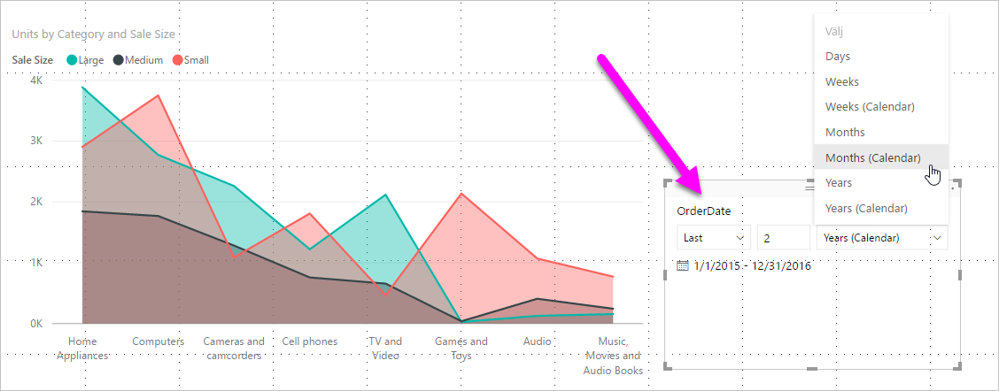
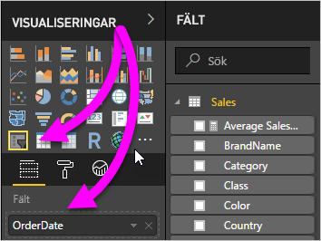
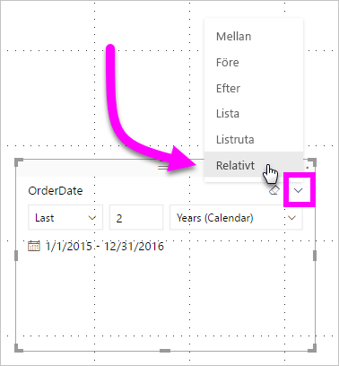
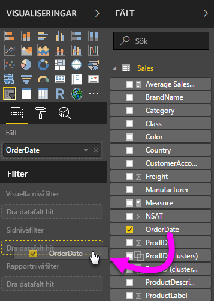
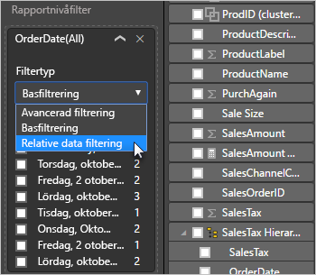
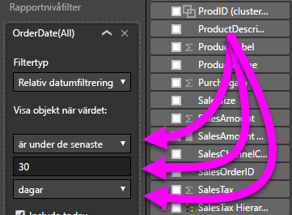

# Skapa ett relativt datumutsnitt eller filter i Power BI

[!INCLUDE[consumer-appliesto-nyyn](../includes/consumer-appliesto-nyyn.md)]

Med ett **relativt datumutsnitt** eller **relativt datumfilter** kan du använda tidsbaserade filter på kolumner i datamodellen. Du kan till exempel använda ett **relativt datumutsnitt** för att bara visa försäljningsdata inom de senaste 30 dagarna (eller månad, kalendermånad och så vidare). När du uppdaterar data tillämpas den relativa tidsperioden automatiskt.

För att dela en rapport med en Power BI-kollega krävs att du både har individuella Power BI Pro-licenser eller att rapporten har sparats med Premium-kapacitet.

## Skapa relativt datumutsnitt

Du kan använda utsnittet relativt datum precis som andra utsnitt. Skapa ett **utsnitt** för rapporten och välj sedan ett datumvärde för värdet **Fält**. I följande bild har vi valt fältet *OrderDate*.

Välj utsnittet på arbetsytan och sedan cirkumflex i det övre högra hörnet av visualiseringen av utsnittet. Om det finns datumdata för det visuella objektet visas alternativen för **Relativt** på menyn.

Välj *Relativt* för det relativa datumutsnittet.

Sedan kan du välja inställningarna.

För den första inställningen i det *relativa datumutsnittet* finns följande alternativ:

* Sista

* Nästa

* Den här

Med den andra inställningen (i mitten) i *det relativa datumutsnittet* kan du ange ett värde för att definiera det relativa datumintervallet.

Du kan välja datummåttet i den tredje inställningen. Du har följande val:

* Dagar

* Veckor

* Veckor (kalender)

* Månader

* Månader (kalender)

* År

* År (kalender)

Om du till exempel väljer **Månader** i listan och anger *2* i den mellersta inställningen får du följande resultat:

* om dagens datum är 20 juli

* data i det visuella objektet för utsnittet kommer innehålla data för de föregående två månaderna

* från och med 21 maj och till och med 20 juli (dagens datum)

Som jämförelse visas data från 1 maj till och med 30 juni (de sista två fullständiga kalendermånaderna) om du väljer *Månader (kalender)* .

## Skapa relativt datumfilter

Du kan också skapa ett filter för relativt datumintervall för rapportsidan eller hela rapporten. För att göra detta drar du ett datumfält till källan **Sidnivåfilter** eller **Rapportnivåfilter** i fönstret **Fält**:

När det väl ligger på plats kan du ändra det relativa datumintervallet. Det är samma tillvägagångssätt som när du anpassar det **relativa datumutsnittet**. Välj **Relativt datumfilter** från listrutan **Filtertyp**.

När du har valt **Relativ datumfiltrering** visas tre områden för redigering, med en numerisk ruta i mitten, precis som för utsnittet.

## Begränsningar och överväganden

Följande begränsningar och överväganden kan användas för utsnitt och filter **relativt datumintervall**.

* Datamodeller i **Power BI** omfattar inte tidszonsinformation. Modeller kan lagra tidpunkter, men det finns inget som indikerar vilken tidszonen de befinner sig i.

* Utsnitt och filter baseras alltid på tiden i UTC. Om du skapar ett filter i en rapport och skickar rapporten till en kollega i en annan tidszon så kommer ni båda att se samma data. Om ni inte befinner er i tidszonen UTC så måste ni justera för tidsförskjutningen.

* Du kan konvertera data som hämtats i en lokal tidszon till UTC med hjälp av **Frågeredigeraren**.

## Nästa steg

- [Använda ett relativt datumutsnitt eller filter i Power BI](desktop-slicer-filter-date-range.md)
- [Utsnitt i Power BI](power-bi-visualization-slicers.md)
