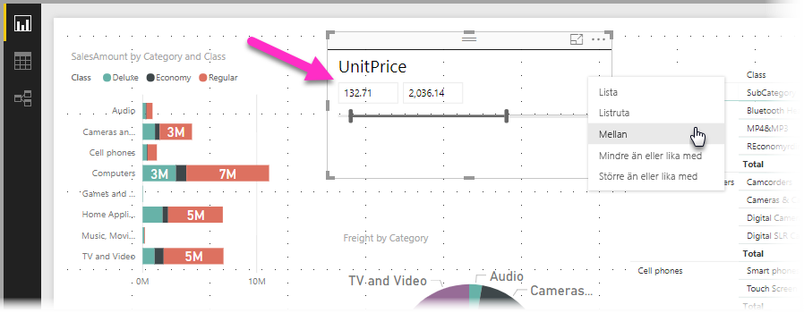
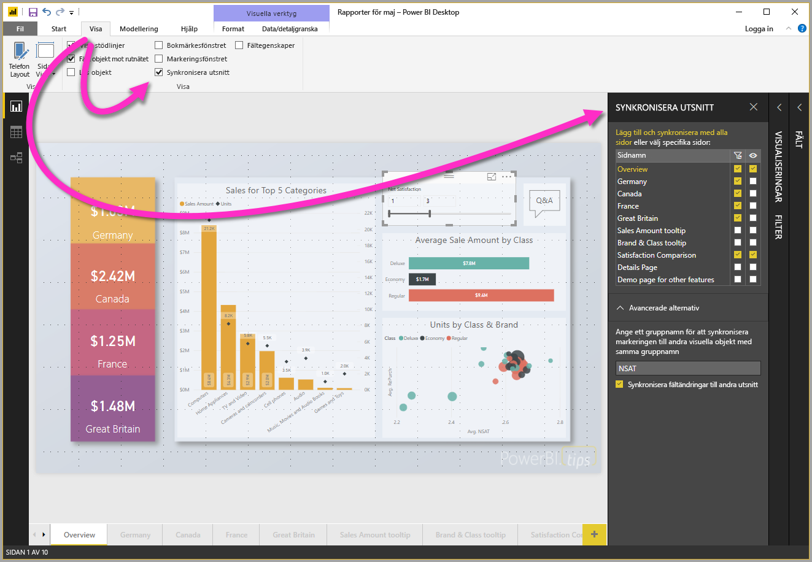
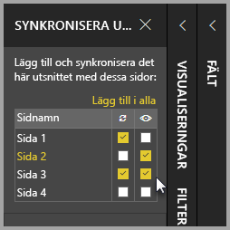
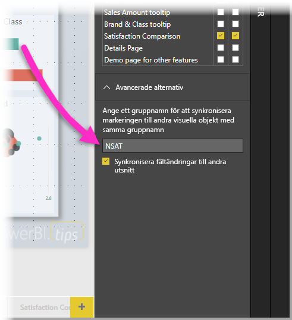

# Använda utsnitt i Power BI Desktop

Du kan använda ett **utsnitt** i **Power BI Desktop** för att filtrera resultaten av visualiseringar på rapportsidan. Med utsnitt kan du enkelt ändra de filter som används genom att interagera med själva utsnittet. Du kan också ange alternativ för hur ditt utsnitt visas och hur du interagerar med det. Följande bild visar ett utsnitt med dess *typ* av listruta synlig. 

Ett utsnitt kan visas från någon av flera olika typer:

* Lista
* Listruta
* Mellan
* Mindre än eller lika med
* Större än eller lika med

Du kan lägga till ett utsnitt i en rapport genom att klicka på visualiseringen **utsnitt** i fönstret **Visualiseringar**.

Utsnitt fungerar på liknande sätt i både **Power BI Desktop** och **Power BI-tjänsten**. Information om hur du använder utsnitt finns i artikeln [Utsnitt i Power BI-tjänsten](power-bi-visualization-slicers.md).

## Synkronisera utsnitt mellan rapportsidor

I **Power BI Desktop** kan du synkronisera utsnitt över flera rapportsidor. För att synkronisera utsnitt väljer du **synkronisera utsnitt** i rutan **Visa** i menyfliken. När du synkroniserar utsnitt, visas fönstret **Synkronisiera utsnitt** såsom det visas på följande bild.

I fönstret **Synkronisera utsnitt** kan du ange hur utsnittet ska synkroniseras mellan rapportsidor. Du kan ange om varje utsnitt ska **tillämpas** på varje enskild rapportsida, och om utsnittet ska vara **synligt** på varje enskild rapportsida.

Du kan till exempel placera ett utsnitt på **sidan 2** i rapporten, enligt följande bild. Sedan kan du välja om det utsnittet bör *gälla* på alla valda sidor, och om det utsnittet ska vara *synligt* på alla valda sidor i rapporten. Du kan använda en valfri kombination av dessa för varje utsnitt. 

Med länken **Lägg till i alla** i fönstret appliceras alla valda utsnitt på alla sidor i rapporten.

Observera att inställningarna som visas i fönstret **Synkronisera utsnitt** endast gäller för det *valda utsnittet*. Du kan använda flera utsnitt på olika sidor och använda fönstret för att definiera hur varje utsnitt tillämpas individuellt på olika sidor i rapporten. 

När valet av utsnitt kan synkroniseras, synkroniseras *inte* andra alternativ, såsom stil, redigera och ta bort. 

## Avancerade alternativ för utsnitt

Du kan också använda ett **gruppnamn** för en samling utsnitt i avsnittet **Avancerade alternativ** i fönstret **Synkronisera utsnitt** om du vill synkronisera utsnitt i samma grupp mellan sidor. 

Med den här funktionen kan du skapa en anpassad grupp med utsnitt som ska synkroniseras. Ett standardnamn anges, men du kan använda valfritt namn som du föredrar. 

Gruppnamnet ger ytterligare flexibilitet när du arbetar med utsnitt. Du kan skapa separata grupper om du vill synkronisera utsnitt som använder samma fält, eller om du vill placera utsnitt som använder olika fält i samma grupp. 

## Hur filtrering påverkar val i utsnitt

Om du gör ett val i ett utsnitt och sedan använder ett filter som normalt skulle ta bort det valda objektet, förblir det längst ned i listan över objekt i utsnittet. Om filtret tas bort, är markeringen kvar i utsnittet. Lägg märke till att om du avmarkerar alternativet från utsnittet försvinner det från listan.

## Nästa steg

Följande artiklar kan också vara av intresse för dig:

* [Utsnitt i Power BI-tjänsten](power-bi-visualization-slicers.md)
* [Använd numeriska intervallutsnitt i Power BI Desktop](../desktop-slicer-numeric-range.md)
* [Använda ett relativt datumutsnitt och filter i Power BI Desktop](desktop-slicer-filter-date-range.md)

