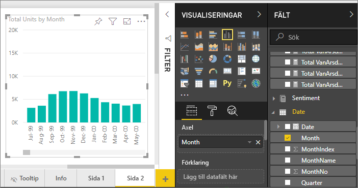
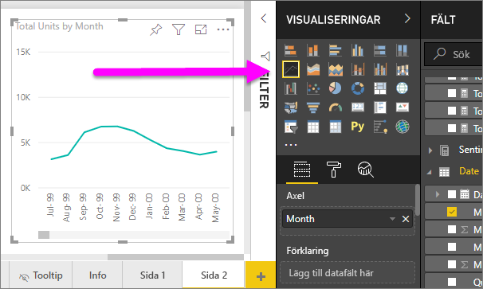
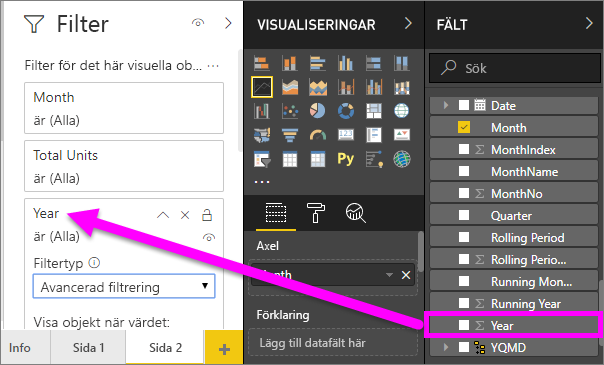
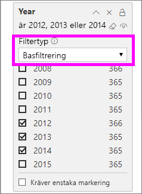
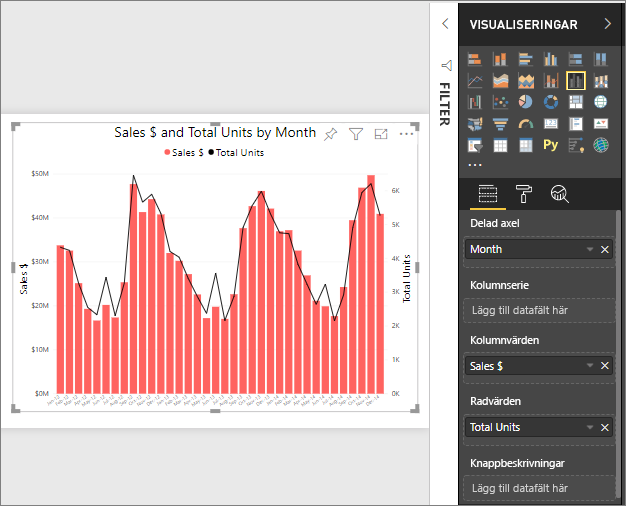
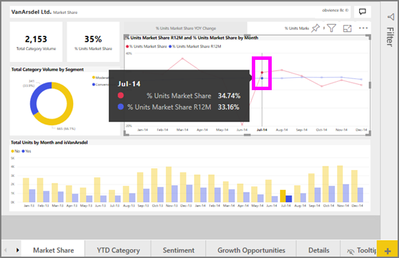

# Linjediagram i Power BI
Ett linjediagram är en serie datapunkter som representeras av prickar som är anslutna via raka linjer. Ett linjediagram kan innehålla en eller flera linjer. Linjediagram har en X- och en Y-axel. 

## Skapa ett linjediagram
De här anvisningarna använder appen Exempel på försäljning och marknadsföring för att skapa ett linjediagram som visar årets försäljning efter kategori. Om du vill följa med kan du hämta exempelappen från appsource.com.

1. Börja med en tom rapportsida. Om du inte använder Power BI-tjänsten, se till att du öppnar rapporten i [redigeringsvyn](../service-interact-with-a-report-in-editing-view.md).

2. I fönstret Fält väljer du **SalesFact** \> **Totalt antal enheter** och sedan **Datum** > **Månad**.  Power BI skapar ett kolumndiagram på rapportarbetsytan.

    

4. Konvertera till ett linjediagram genom att välja linjediagramsmallen från fönstret Visualiseringar. 

    
   

4. Filtrera ditt linjediagram för att visa data för åren 2012–2014. Om ditt filterfönstret är minimerat expanderar du det nu. Välj **Datum** \> **År** i fönstret Fält och dra det till fönstret Filter. Släpp den under rubriken **Filter för det här visuella objektet**. 
     
    

    Ändra **Avancerade filter** till **Grundläggande filter** och välj **2012**, **2013** och **2014**.

    

6. Du kan också [justera storlek och färg för diagramtexten](power-bi-visualization-customize-title-background-and-legend.md). 

    

## Lägga till ytterligare linjer i diagrammet
Linjediagram kan ha många olika linjer. Och i vissa fall kan linjernas värden vara så avvikande att de inte visas bra tillsammans. Nu ska vi titta närmare på att lägga till ytterligare linjer till vårt aktuella diagram och sedan får du lära dig att formatera diagrammet när de värden som representeras av linjerna skiljer sig åt i hög grad. 

### Lägga till ytterligare linjer
I stället för att titta på totalt antal enheter för alla regioner som en enskild linje i diagrammet, ska vi dela upp det totala antalet enheter efter region. Lägg till ytterligare linjer genom att dra **Geo** > **Region** till området Förklaring.

   

### Använda två Y-axlar
Vad händer om man vill titta på total försäljning och totalt antal enheter i samma diagram? Försäljningssiffrorna är mycket högre än antalet enheter, vilket gör linjediagrammet oanvändbart. Den röda linjen för totalt antal enheter verkar faktiskt vara noll.

   

Använd ett kombinationsdiagram för att visa mycket divergerande värden i ett diagram. Du kan lära dig allt om kombinationsdiagram genom att läsa [Kombinationsdiagram i Power BI](power-bi-visualization-combo-chart.md). I vårt exempel nedan kan vi visa försäljning och totalt antal enheter tillsammans i ett diagram genom att lägga till en andra Y-axel. 

   

## Markering och korsfiltrering
Information om hur du använder filterfönstret finns i [Lägg till ett filter i en rapport](../power-bi-report-add-filter.md).

Om du väljer en datapunkt i ett kombinationsdiagram så korsmarkeras och korsfiltreras de övriga visualiseringarna på rapportsidan och vice versa. Om du vill följa med öppnar du fliken **Marknadsandel**.  

På ett linjediagram är en enskild datapunkt skärningspunkten för en punkt på X-axeln och Y-axeln. När du väljer en datapunkt, lägger Power BI till markörer som anger vilken punkt (för en enskild linje) eller punkter (om det finns två eller fler linjer) som är källan för korsmarkeringen och korsfiltreringen av de övriga visuella objekten på rapportsidan. Om ditt visuella objekt är mycket kompakt, väljer Power BI den punkt som är närmast där du klickar på det visuella objektet.

I det här exemplet har vi valt en datapunkt som omfattar juli 2014, % enheter marknadsandel R12 av 33,16 och % enheter marknadsandel av 34,74.

Observera hur kolumndiagrammet är korsmarkerat och mätaren är korsfiltrerad.

För att hantera hur diagram korsmarkeras och korsfiltrerar varandra, se [Visualiseringsinteraktioner i en Power BI-rapport](../service-reports-visual-interactions.md)

## Överväganden och felsökning
* Ett linjediagram kan inte ha dubbla Y-axlar.  Du måste använda ett kombinationsdiagram i stället.
* I exemplen ovan har diagrammen formaterats med ökad teckenstorlek, ändrad teckenfärg, tillägg av axelrubriker, centrering av diagramrubrik och -förklaring, start för båda axlarna på noll och mycket annat. Formateringsfönstret (rollerikonen) har en till synes ändlös uppsättning alternativ för att få dina diagram att se ut som du vill. Det bästa sättet att lära sig är att öppna formateringsfönstret och börja utforska.

## Nästa steg

[Visualiseringstyper i Power BI](power-bi-visualization-types-for-reports-and-q-and-a.md)

