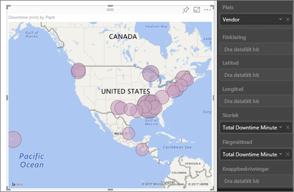
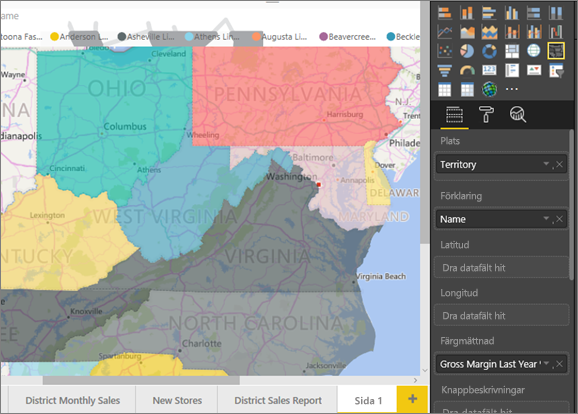
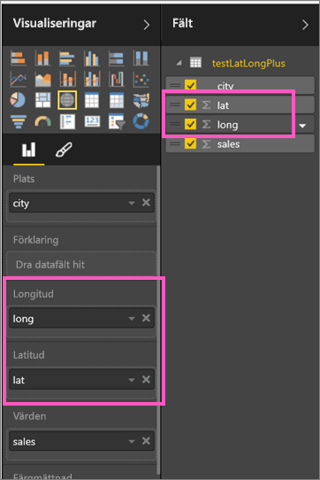
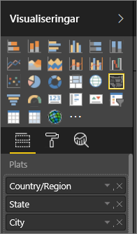

# Tips för Power BI-kartvisualiseringar
Power BI integrerar med Bing Maps för att tillhandahålla kartkoordinater av standardtyp (en process som kallas geokodning), vilket gör det enklare att skapa kartor. Tillsammans använder de algoritmer för att identifiera rätt plats, men är det mest en gissning. Om Power BI inte kan skapa en karta på egen hand använder den Bing Maps. 

Du eller din administratör kan behöva uppdatera brandväggen för att tillåta åtkomst till de URL:er Bing använder för geokodning.  Dessa URL:er är:
* https://dev.virtualearth.net/REST/V1/Locations
* https://platform.bing.com/geo/spatial/v1/public/Geodata
* https://www.bing.com/api/maps/mapcontrol

Du kan använda följande tips för att öka sannolikheten för rätt geo-kodning. Du kan skaffa den första uppsättningen tips för att få åtkomst till datauppsättningen. Den andra uppsättningen tips är saker du kan göra i Power BI om du inte har åtkomst till datauppsättningen. Och den slutgiltiga uppsättningen är en lista med URL:er

## Vad skickas till Bing Maps?
Power BI-tjänsten och Power BI Desktop skickar Bing geoinformation som behövs för att skapa kartvisualiseringen. Detta kan omfatta data i bucketarna **plats**, **latitud** och **longitud** och geofälten och i någon av filterbucketarna **Rapportnivå**, **Sidonivå** eller **Visualiseringsnivå**. Exakt vad som skickas beror på karttypen. Läs mer i [Bing Maps-sekretess](https://go.microsoft.com/fwlink/?LinkID=248686).

* Om longitud och latitud anges i kartor (bubbelkartor) kommer data inte att skickas till Bing. Annars kommer data i Plats (och filter) skickas till Bing.     
* Fyllda kartor kräver ett fält i Plats, även om latitud och longitud anges. Data i Plats, Latitud och Longitud skickas till Bing.
  
    I exemplet nedan används fältet **leverantör**för geokodning. Därför skickas alla leverantörsdata till Bing. Data från **Storlek** och **Färgmättnad** skickas inte till Bing.
  
    
  
    I det andra exemplet nedan används fältet **Region**för geokodning. Därför skickas alla regionsdata till Bing. Data från **Förklaring** och **Färgmättnad** skickas inte till Bing.
  
    

## I datauppsättningen: tips för att förbättra den underliggande datauppsättningen
Om du har åtkomst till datamängden som används för att skapa kartan finns några saker du kan göra för att öka sannolikheten för rätt geokodning.

**1. Kategorisera geografiska fält i Power BI Desktop**

Du kan kontrollera att fält är korrekt geokodade i Power BI Desktop genom att ställa in *Datakategori* i datafälten. Välj önskad tabell, gå till menyfliksområdet **Avancerat** och ange sedan **Datakategorin** till **adress**, **ort**, **kontinent**, **land/region**, **land**, **postnummer**, **delstat** eller **provins**. Dessa datakategorier hjälper Bing att korrekt koda datumet. Läs mer i [kategorisering av data i Power BI Desktop](../desktop-data-categorization.md). Om du ansluter i realtid till SQL Server Analysis Services behöver du ange datakategorisering utanför Power BI med hjälp av [SQL Server Data Tools (SSDT)](https://docs.microsoft.com/sql/ssdt/download-sql-server-data-tools-ssdt).

**2. Använda mer än en platskolumn.**    
 Ibland räcker det inte att ställa in datakategorier för kartor för att Bing ska kunna gissa din avsikt. Vissa benämningar är tvetydiga eftersom platsen som finns i flera länder eller regioner. ***Southampton*** finns till exempel i England, Pennsylvania och New York.

Power BI använder Bings [Ostrukturerade URL-malltjänst](https://msdn.microsoft.com/library/ff701714.aspx) för att hämta latitud- och longitudkoordinater baserat på en uppsättning adressvärden för valfritt land. Om dina data inte innehåller tillräckligt med platsdata kan du lägga till dessa kolumner och kategorisera dem korrekt.

 Om du bara har en stadskolumn blir geokodningen svår för Bing. Lägga till ytterligare geokolumner om du vill att platsen ska vara entydig.  Ibland räcker det att lägga till en platskolumn i datauppsättningen, i det här fallet en stat/provins. Glöm inte att kategorisera den korrekt, se nr 1 ovan.

Kontrollera när varje fält endast har den information som är knuten till kategoriseringen.  Till exempel ska stad automatiskt vara **Southampton**, inte **Southampton, New York**.  Och platsadressfältet ska vara **1 Microsoft Way** och inte **1 Microsoft sätt, Redmond, WA**.

**3. Använd specifik latitud och longitud**

Lägg till latitud- och longitud i datauppsättningen. Detta tar bort all tvetydighet och returnerar resultatet snabbare. Latitud- och longitudfält måste vara i *decimaltal* format, vilket du kan ange i datamodellen.

<iframe width="560" height="315" src="https://www.youtube.com/embed/ajTPGNpthcg" frameborder="0" allowfullscreen></iframe>

**4. Använd platskategorin för kolumner med fullständig platsinformation**

Medan vi rekommenderar att du använder geohierarkier i dina kartor om du måste använda en enda platskolumn med fullständig geografisk information kan du ange datakategorisering och **plats**. Till exempel om data i kolumnen består av fullständiga adresser, till exempel 1 Microsoft Way, Redmond i delstaten Washington 98052, fungerar den generaliserade datakategorin bäst med Bing. 

## I Power BI: Tips för att få bättre resultat när du använder kartor
**1. Använd latitud- och longitudfälten (om de finns)**

I Power BI om datauppsättningen som du använder har fält för longitud och latitud--använd dem!  Power BI har särskilda buckets för att göra kartdata entydiga. Du behöver bara dra fältet som innehåller dina latituddata till området **Visualiseringar > Latitud**.  Gör sedan samma sak för dina longituddata. När du gör det också måste du fylla i fältet *plats* när du skapar din visualiseringar. Annars sammanställs informationen som standard, till exempel latitud och longitud skulle länkas på delstatsnivå, inte stadsnivå.

 

## Använda geohierarkier för att öka detaljnivån till olika ”nivåer” för platsen
När din datauppsättning redan har flera nivåer för platsdata kan du och dina kollegor använda Power BI för att skapa *geo-hierarkier*. Gör detta genom att dra mer än ett fält till **Plats**. Tillsammans blir fälten då en geo-hierarki. I nedanstående exempel har vi lagt till geo-fält för: Land/Region, tillstånd och stad. I Power BI kan du och dina kollegor detaljgranska uppåt och nedåt med hjälp av den här geo-hierarkin.

  

   

När du ändrar detaljnivån med geo-hierarkier är det viktigt att veta hur varje detaljnivåknapp fungerar och vad som skickas till Bing Maps. 

* Borrknappen längst till höger kallas för Detaljgranskningsläge  och låter dig välja en kartplats och se mer detaljer om den specifika platsen en nivå i taget. Till exempel om du aktiverar detaljnivån och klickar på Nordamerika flyttar du nedåt i hierarkin till nästa nivå – delstater i Nordamerika. För geo-kodning skickar Power BI endast land- och delstatsinformation för Nordamerika till Bing Maps.  
* Till vänster finns ytterligare 2 alternativ för att ändra detaljnivå. Det första alternativet,  , växlar till nästa nivå i hierarkin för alla platser på samma gång. Om du för närvarande tittar på länder och sedan använder det här alternativet för att ändra till nästa nivå, delstater, så visar Power BI delstatsdata för alla länder. Power BI skickar delstatsdata till Bing Maps (inga landdata) för alla platser för geo-kodning. Det här alternativet är användbart om varje nivå i hierarkin är inte relaterat till nivån ovanför. 
* Det andra alternativet,  , påminner om att ändra detaljnivån, men du behöver inte klicka på kartan.  Den expanderas till nästa nivå i hierarkin och kommer ihåg den aktuella nivåns kontext. Till exempel, om du för tillfället tittar på länder och väljer den här ikonen kommer du att hamna på nästa nivå i hierarkin – delstater. Power BI skickar data för varje delstat och dess motsvarande land att hjälpa Bing Maps att geokoda med större precision. Det här alternativet eller alternativet öka detaljnivå längst till höger används med de flesta kartorna, så att du kan skicka så mycket information som möjligt till Bing för att få noggrann platsinformation. 

## Nästa steg
[Öka detaljnivån i en visualisering i Power BI](../consumer/end-user-drill.md)

[Visualiseringar i Power BI](power-bi-report-visualizations.md)

Har du fler frågor? [Prova Power BI Community](http://community.powerbi.com/)

