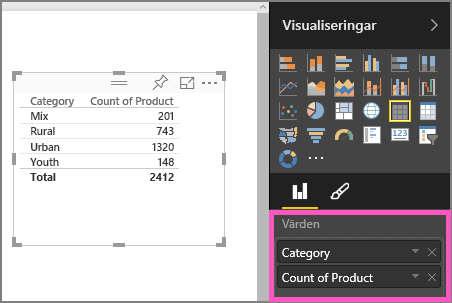
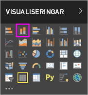
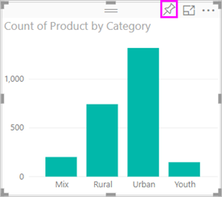

# Del 1, Lägg till visualiseringar i en Power BI-rapport

Den här artikeln ger en snabb introduktion till att skapa en visualisering i en rapport. Den gäller för både Power BI-tjänsten och Power BI Desktop. För mer avancerat innehåll, [se del 2](power-bi-report-add-visualizations-ii.md) i den här serien. Amanda visar ett par sätt att skapa, redigera och formatera visuella objekt på rapportarbetsytan. Prova sedan att skapa en egen rapport med hjälp av den [Försäljning- och marknadsföringsexempel](../sample-datasets.md).

<iframe width="560" height="315" src="https://www.youtube.com/embed/IkJda4O7oGs" frameborder="0" allowfullscreen></iframe>

## Öppna en rapport och lägg till en ny sida

1. Öppna en rapport i [redigeringsvyn](../service-interact-with-a-report-in-editing-view.md).

    Den här kursen använder exemplet för [försäljning och marknadsföring](../sample-datasets.md).

1. Om fönstret **Fält** inte visas, väljer du pilikonen för att öppna det.

   

1. Lägg till en tom sida i rapporten.

## Lägg till visuella objekt i rapporten

1. Skapa ett visuellt objekt genom att välja ett fält från fönstret **Fält**.

    Börja med ett numeriskt fält som **SalesFact** > **Försäljning i USD**. Power BI skapar ett stapeldiagram med en enda kolumn.

    

    Eller börja med ett kategorifält, till exempel **Namn** eller **Produkt**. Power BI skapar en tabell och lägger till fältet till området **Värden**.

    

    Eller börja med ett geografiskt fält, till exempel **Geo** > **Stad**. Power BI och Bing Maps skapar en kartvisualisering.

    

1. Skapa en visualisering och ändra dess typ. Välj **Produkt** > **Kategori** och sedan **Produkt** > **Antal produkter** för att lägga till dem i området **Värden**.

   

1. Ändra visualiseringen till ett kolumndiagram genom att välja ikonen för **staplade kolumndiagram**.

   

1. När du skapar visualiseringar i rapporten kan du [fästa dem på din instrumentpanel](../service-dashboard-pin-tile-from-report.md). Välj fästikonen för att fästa visualiseringen 

   
  
## Nästa steg

 Fortsätt till:

* [Del 2: Lägg till visualiseringar i en Power BI-rapport](power-bi-report-add-visualizations-ii.md)

* [Interagera med visualiseringar](../consumer/end-user-reading-view.md) i rapporten.

* [Gör ännu mer med visualiseringar](power-bi-report-visualizations.md).

* [Spara rapporten](../service-report-save.md).
