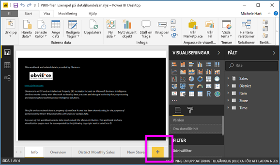
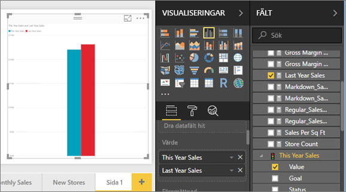
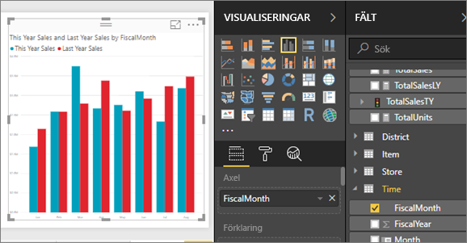
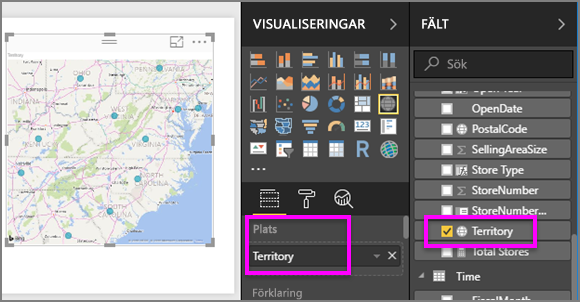
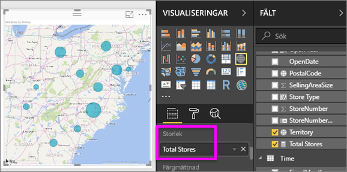
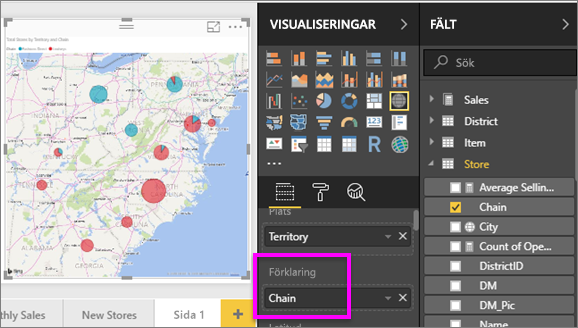

# Del 2, lägg till visualiseringar i en Power BI-rapport
I [del 1](power-bi-report-add-visualizations-ii.md) skapade du en grundläggande visualisering genom att markera kryssrutorna bredvid fältnamnen.  I del 2 får du lära dig hur du använder dra och släpp och drar nytta av panelerna **Fält** och **Visualiseringar** för att skapa och modifiera visualiseringar.

### Förutsättningar
- [Del 1](power-bi-report-add-visualizations-ii.md)
- Power BI Desktop – visualiseringar kan läggas till i rapporter med Power BI-tjänsten eller Power BI Desktop. Den här självstudien använder Power BI Desktop. 
- [Exempel på detaljhandelsanalys](http://download.microsoft.com/download/9/6/D/96DDC2FF-2568-491D-AAFA-AFDD6F763AE3/Retail%20Analysis%20Sample%20PBIX.pbix)

## Skapa en ny visualisering
I de här självstudierna tar vi hjälp av vår Retail Analysis-datauppsättning för att skapa några viktiga visualiseringar.

### Öppna en rapport och lägg till en ny tom sida.
1. Öppna PBIX-filen Exempel på detaljhandelsanalys i Power BI Desktop. 
      

2. Lägg till en ny sida genom att välja den gula plus-ikonen längst ned på arbetsytan.

### Lägg till en visualisering som tittar på det här årets försäljning jämfört med föregående års.
1. I tabellen **Försäljning** väljer du **This Year Sales (Årets försäljning)** > **Värde** och **Last Year Sales (Förra årets försäljning)**. Power BI skapar ett kolumndiagram.  Detta är något som är intressant och vi vill veta mer om. Hur ser den månadsvisa försäljningen ut?  
   
   
2. Från tidtabellen drar du **FiscalMonth** till **Axel**-området.  
   
3. [Ändra visualiseringen](power-bi-report-change-visualization-type.md) till ett ytdiagram.  Det finns många visualiseringstyper att välja bland – titta närmare på [beskrivningarna för var och en, tipsen om bästa praxis och självstudierna](power-bi-visualization-types-for-reports-and-q-and-a.md) för hjälp med att bestämma vilken typ som ska användas. På panelen Visualiseringar väljer du ytdiagramikonen .
4. Sortera visualiseringen genom att välja ellipserna och därefter **Sortera efter FiscalMonth**.
5. [Ändra storlek på visualiseringen](power-bi-visualization-move-and-resize.md) genom att välja visualiseringen, ta tag i en av konturens cirklar och dra. Gör den tillräckligt bred för att eliminera rullningslisten och tillräckligt liten för att ge oss tillräckligt med utrymme för att lägga till ytterligare en visualisering.
   
   
6. [Spara rapporten](../service-report-save.md).

### Lägga till en kartvisualisering som visar försäljningen efter plats
1. I tabellen **Butik** väljer du **Territorium**. Power BI identifierar att Territorium är en plats och skapar en kartvisualisering.  
   
2. Dra **Totalt antal butiker** till området Storlek.  
   
3. Lägg till en förklaring.  Om du vill visa dina data efter butiksnamn, drar du **Kedja** i till förklaringsområdet.  
   

## Nästa steg
* Du hittar mer i [Visualiseringar i Power BI-rapporter](power-bi-report-visualizations.md).  
* Har du fler frågor? [Prova Power BI Community](http://community.powerbi.com/)

