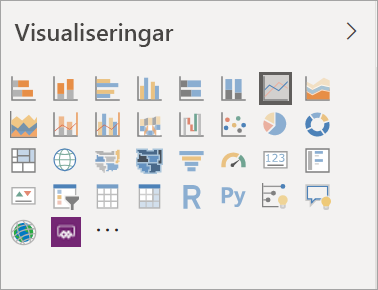
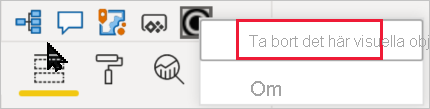

# Visualiseringar i Power BI-rapporter

[!INCLUDE[consumer-appliesto-yyyn](../includes/consumer-appliesto-yyyn.md)]    

Visualiseringar (visuella objekt) visar insikter som har upptäckts i data. En Power BI-rapport kan ha en enda sida med ett visuellt objekt eller en mängd sidor med visuella objekt. I Power BI-tjänsten kan visuella objekt [fästas från rapporter på instrumentpaneler](../create-reports/service-dashboard-pin-tile-from-report.md).

Det är viktigt att skilja mellan *de som designar rapporten* och de som *använder den*.  Om du skapar eller ändrar rapporten är du designer.  Designer har redigeringsbehörighet för rapporten och dess underliggande datauppsättning. I Power BI Desktop, innebär det att du kan öppna datauppsättningen i Datavyn och skapa visuella objekt i Rapportvyn. I Power BI-tjänsten innebär det att du kan öppna datauppsättningen eller rapporten i rapportredigeraren i [Redigeringsvyn](../consumer/end-user-reading-view.md). Om en rapport eller instrumentpanel har [delats med dig](../consumer/end-user-shared-with-me.md) är du en rapport*konsument*. Du kan visa och interagera med rapporten och dess visuella objekt, men du kan inte göra lika många ändringar som en *designer*.

Många olika typer av visuella objekt är tillgängliga direkt från Power BI-fönstret Visualiseringar.

Du hittar fler visuella Power BI-objekt via community-webbplatsen [Microsoft AppSource](https://appsource.microsoft.com). I AppSource kan du söka efter och [Ladda ned](https://appsource.microsoft.com/marketplace/apps?page=1&product=power-bi-visuals) [Visuella Power BI-objekt](../developer/visuals/custom-visual-develop-tutorial.md) från Microsoft och communityn.

Om du inte har arbetat med Power BI tidigare eller behöver en uppfräschning, kan du använda länkarna nedan för att läsa om grunderna i Power BI-visualiseringar.  Alternativt, kan du använda vår innehållsförteckning (till vänster om den här artikeln) för att hitta ännu mer användbar information.

## Lägg till en visualisering i Power BI

[Skapa visualiseringar](power-bi-report-add-visualizations-i.md) på sidorna i dina rapporter. Bläddra igenom [listan över tillgängliga visualiseringar och tillgängliga visualiseringssjälvstudier.](power-bi-visualization-types-for-reports-and-q-and-a.md) 

## Ladda upp en visualisering från en fil eller från AppSource

Lägg till en visualisering som du har skapat själv eller som du hittat på [Microsoft AppSource community-webbplatsen](https://appsource.microsoft.com/marketplace/apps?product=power-bi-visuals). Känner du dig kreativ? Ta en närmare titt på vår källkod och använd våra [utvecklarverktyg](../developer/visuals/custom-visual-develop-tutorial.md) om du vill skapa nya visualiseringstyper och [dela dem med communityn](../developer/visuals/office-store.md). Om du vill veta mer om hur man utvecklar visuella Power BI-objekt kan du läsa [Utveckla ett visuellt objekt i Power BI](../developer/visuals/custom-visual-develop-tutorial.md).

## Anpassa visualiseringsfönstret

Du kan anpassa visualiseringsfönstret genom att lägga till och ta bort visuella objekt i Power BI från det. Om du har tagit bort visuella standardobjekt från visualiseringsfönstret, kan du återställa fönstret till standard och ta tillbaka alla visuella objekt.

### Lägga till ett visuellt objekt i visualiseringsfönstret

Om du märker att du använder samma visuella objekt i många rapporter kan du lägga till visualiseringen i ditt visualiseringsfönster. Att lägga till visuella objekt gäller för AppSource-visualiseringar, organisatoriska visualiseringar och visuella objekt från filer. Om du vill lägga till ett visuellt objekt högerklickar du på det visuella objektet.

När ett visuellt objekt har fästs flyttas det upp till de andra visuella standardobjekten. Det här visuella objektet är nu kopplat till kontot du är inloggad på, och alla nya rapporter du skapar kommer automatiskt innehålla det här visuella objektet förutsatt att du är inloggad. Du behöver inte längre lägga till en viss visuell information som du använder ofta för varje enskild rapport.

### Ta bort ett visuellt objekt från visualiseringsfönstret

Om du slutar använda ett visuellt objekt regelbundet kan du högerklicka på det och ta bort det från visualiseringsfönstret. Alla typer av visuella objekt kan tas bort från visualiseringsfönstret, inklusive visuella standard-, fil-, organisations- och AppSource-objekt.

### Återställ visualiseringsfönstret

Återställning av visualiseringsfönstret gäller endast för standardvisualiseringar. Visuella objekt som har lagts till i visualiseringsfönstret påverkas inte och kommer att vara tillgängliga från visualiseringsfönstret. Om du vill ta bort AppSource- eller filvisualiseringar från visualiseringsfönstret måste du göra det manuellt.

Om du vill återställa visualiseringsfönstret till standard klickar du på fler alternativ och väljer **Återställa visuella standardobjekt**.

## Ändra visualiseringstyp

Försök att [ändra visualiseringstypen](power-bi-report-change-visualization-type.md) för att se vilken som fungerar bäst med dina data.

## Fäst visualiseringen

När du har fått till visualiseringen som du vill ha den i Power BI-tjänsten, kan du [fästa den på en instrumentpanel](../create-reports/service-dashboard-pin-tile-from-report.md) som en panel. Om du ändrar visualiseringen som används i rapporten efter att du fäst den, ändras inte panelen på instrumentpanelen. Om det var ett linjediagram förblir det ett linjediagram, även om du har ändrat det till ett ringdiagram i rapporten.

## Begränsningar och överväganden
- De visuella objekten kan läsas in långsamt, beroende på datakällan och antalet fält (mått eller kolumner).  Vi rekommenderar att du begränsar antalet visuella objekt till totalt 10–20 fält, för bättre läsbarhet och prestanda. 

- Den övre gränsen för visuella objekt är 100 fält (mått eller kolumner). Om dina visuella objekt inte kan läsas in måste du minska antalet fält.

## Nästa steg

* [Visualiseringstyper i Power BI](power-bi-visualization-types-for-reports-and-q-and-a.md)
* [Visuella objekt för Power BI](../developer/visuals/power-bi-custom-visuals.md)
