# <a name="best-design-practices-for-reports-and-visuals"></a>Metodtips för design av rapporter och visuella objekt

Den här artikeln innehåller metodtips för att utforma rapporter i Power BI. Här diskuteras designprinciper som du kan använda i dina rapporter och för de sidor och enskilda visuella objekt som utgör rapporten. Många av dessa bästa praxis gäller även för utformning av instrumentpaneler.

> [!NOTE]
> Rekommendationerna i den här artikeln är riktlinjer som du kan använda när det känns lämpligt. För varje princip som beskrivs nedan finns det oftast ett bra skäl att ”bryta regeln”.

Vi hoppas att artikeln blir en startpunkt för dig, att du kan använda det som du har lärt dig för dina egna rapporter och visualiseringar och att du fortsätter konversationen i [Microsoft Power BI Community](http://community.powerbi.com/). Design och visualisering av BI-rapporter är ett hett ämne just nu. Det finns många tankeledare, bloggare och webbplatser som tittar närmare på BI-rapportdesign på både bredden och tvären. Vi har listat några i slutet av artikeln.

> *Vi översvämmas med information – inte för att det finns för mycket, utan för att vi inte vet hur vi ska hantera den.*
– Stephen Few

## <a name="a-look-at-the-landscape-and-terminology"></a>En titt på miljö och terminologi

I Power BI kan en rapport ha en eller flera rapportsidor. Alla sidor tillsammans kallas gemensamt för rapporten. Grundelementen i rapporten är visuella objekt (också kända som visualiseringar), fristående bilder och textrutor. Det finns oräkneliga formateringsalternativ, från enskilda datapunkter till rapportelement och själva rapportsidan.

Vi börjar med rapportplaneringsfasen, fortsätter med grundläggande rapportdesignprinciper, diskuterar visuella designprinciper och avslutar med en diskussion om metodtips för enskilda visuella typer.

Detaljerad vägledning och anvisningar för att skapa och använda Power BI-rapporter finns tillgängliga på [Lär dig Power BI](https://powerbi.microsoft.com/learning/).

## <a name="before-you-build-your-first-visualization-focus-on-requirements"></a>Innan du skapar din första visualisering – fokusera på kraven

Skapandet av en rapport startar innan du skapar ditt första visuella objekt. En bra rapport kräver planering. Ta reda på vilka data som du ska arbeta med och skriv ner kraven för rapporten. Ställ dig själv följande frågor:

* Vad behöver verksamheten?

* Hur kommer läsarna att använda dessa data?

* Vem ska använda dem?

* Vilka beslut kommer läsaren att vilja fatta utifrån den här rapporten?

Svaren på dessa frågor kommer att påverka din design. Varje rapport har ett budskap. Se till att budskapet stämmer överens med företagets behov. Det kan vara frestande att lägga till visuella objekt som visar dramatiska insikter, men om dessa insikter inte stämmer överens med företagets behov är rapporten inte användbar. Du kan faktiskt distrahera användarna med sådana visuella objekt. Dessutom kanske du märker att du inte kan samla ihop dina data för att fatta beslutet utifrån dem. Kan du använda rapporten för att mäta det som du behöver mäta?

Du kan använda rapporter för att övervaka, upptäcka, spåra, förutsäga, mäta, hantera, testa med mera. Företaget kan till exempel ha behov av en försäljningsrapport som mäter resultat. Du kan utforma en rapport som redovisar aktuell försäljning och jämför den med tidigare försäljning och konkurrenter och visar på de KPI:er som fungerar som varningstecken. Kanske läsarna kan granska nedåt i försäljningssiffrorna för att se butikens öppettider eller leveransproblem som kan påverka försäljningen. En annan nedbrytning kan vara möjligheten att titta på försäljning per butik, region, produkt, säsong med mera.

Var medveten om vilka rapportens kunder är. Utforma en rapport som använder bekant terminologi och tillhandahåller data med en detaljnivå och komplexitet som motsvarar kundernas kunskapsnivå. Har du mer än en typ av kund? En storlek passar inte alltid alla. Utforma separata rapportsidor som baseras på expertis. Tänk på att märka varje sida tydligt så att kunderna kan sköta identifieringen själva. Ett annat alternativ är att använda utsnitt för att kunderna ska kunna anpassa sidan på ett sätt som passar dem. Engagera kunden i planeringsfasen och undvik att skapa vad du tror att de behöver. Förbered dig på att börja om från början och på att iterera om du gör det misstaget.

När du har identifierat vilka av företagets behov, kunder eller mått som du vill inkludera, är nästa steg att välja rätt visuella objekt för budskapet. Ta reda på hur du kan presentera dessa visuella objekt på effektivast möjliga sätt. Vi börjar med några grundläggande principer för rapportdesign.

## <a name="principles-of-report-design"></a>Principer för rapportdesign

En rapportsida har begränsat utrymme och något av det svåraste är att få plats med alla element som du vill få med på ytan – och fortfarande kunna presentera information som är lätt att förstå. Dessutom ska du inte underskatta värdet av en visuellt tilltalande rapport. Nyckeln är att hitta balansen mellan en rapport som är tilltalande och en som är användbar.

Låt oss ta en titt på layout, tydlighet och estetik.

### <a name="layout-of-the-report-canvas"></a>Layout för rapportarbetsytan

Rapportarbetsytan har ett begränsat utrymme. Om du inte får plats med alla element på en enda rapportsida, kan du dela upp rapporten på flera sidor. Du kan anpassa en rapportsida för en specifik målgrupp (t.ex. HR, IT-avdelningen, försäljningen eller högsta ledningen). Om du vill kan du skräddarsy den efter en specifik affärsfråga:

* ”Hur påverkar defekter vår stilleståndstid”?

* ”Vilken påverkan har marknadsföringskampanjen på Sentiment”?

Det kan vara klokt att agera förebyggande. Kanske är den första sidan en översikt eller iögonfallande och fångar läsaren. Den andra sidan fortsätter att förmedla databudskapet och den tredje utforskar budskapet mer i detalj och så vidare. Om hela rapporten får plats på en enda sida, går det också bra. Om inte kan du skapa du separata rapportsidor som logiskt delar upp innehållet. Glöm inte att ge sidorna beskrivande och användbara namn.

Tänk dig att du fyller ett konstgalleri. Du skulle inte placera 50 konstverk i ett litet rum, fylla det med stolar och måla varje vägg i olika färg. Som museiintendent skulle du bara välja de konstverk som har ett gemensamt tema. Du skulle placera ut dem i rummet med tillräckligt med utrymme för att besökare skulle kunna röra sig fritt och tänka. Du kanske till och med skulle placera ut informationskort som beskriver vad de tittar på. Det finns en anledning till att de flesta moderna gallerier har vita väggar!

I den här artikeln börjar vi med ett rapportexempel som kräver mycket arbete. Allt eftersom att vi använder våra metodtips och designprinciper förbättras vår rapport.


**Bild 1: Den här fula rapportsidan kräver mycket arbete**

Exemplet ovan har många utrymmesrelaterade (layout) designproblem som beskrivs nedan:

* Justering, ordning och användning av närhet

* Bristfällig användning av utrymme och sortering

* Oreda

### <a name="alignment-order-and-proximity"></a>Justering, ordning och närhet

Layouten för dina rapportelement påverkar läsarens förståelse och vägleder honom eller henne genom rapportsidan. Hur du placerar och positionerar element skapar ett budskap. Budskapet kan vara ”Börja här och titta sedan här” eller ”Dessa tre element är relaterade till varandra”.

* I många kulturer läser man från vänster till höger samt uppifrån och ned. Placera det viktigaste elementet i det övre vänstra hörnet av rapporten. Organisera sedan resten av de visuella objekten på ett sätt som medför en logisk navigering och förståelse av informationen.

* Placera element som kräver att läsaren gör ett val till vänster om de visualiseringar som valet påverkar, exempelvis utsnitt.

* Placera lägesrelaterade element nära varandra. Närheten visar på relationen mellan elementen.

* Ett annat sätt att visa relationer är att lägga till en ram eller färgad bakgrund för relaterade element. Omvänt kan du lägga till en avgränsare för att skilja mellan olika delar i en rapport.

* Använd den vita ytan för att visuellt dela in avsnitt på rapportsidan.

* Fyll rapportsidan. Om du har för mycket tomt utrymme kan du göra dina visualiseringar större eller arbetsytan mindre.

* Tänk efter innan du ändrar storlek på rapportelementen. Låt inte tillgängligt utrymme styra storleken på en visualisering.

* Gör viktiga element större än andra eller lägg till ett visuellt element som t.ex. en pil för att dra uppmärksamhet till dem.

* Justera elementen på rapportsidan, antingen symmetriskt eller avsiktligt asymmetriskt.

Låt oss ta en närmare titt på justering.

#### <a name="alignment"></a>Justering

Justering innebär inte att de olika komponenterna måste ha samma storlek. Det betyder inte att du måste ha samma antal komponenter på varje rad i rapporten. Det betyder bara att det ska finnas en struktur på sidan som underlättar navigering och läsbarhet.

Vi kan se i den uppdaterade rapporten att vi har justerat rapportkomponenterna i vänster och höger kant. Vi justerade också varje rapportrad vågrätt och lodrätt. Våra utsnitt ligger till vänster om de visuella objekt de påverkar.


**Bild 2: Vårt fula rapportexempel förbättrades med layoutredigeringarna**

Power BI innehåller verktyg som hjälper dig att justera dina visuella objekt. Om flera visuella objekt har markerats i Power BI Desktop kan du använda alternativen **Justera** och **Fördela** på fliken **Visuella verktyg** i menyfliksområdet för att matcha positionen för de visuella objekten.

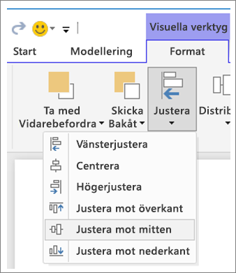

**Bild 3a: Justera visuella verktyg i Power BI Desktop**


**Bild 3b: Justera visuella verktyg i Power BI-tjänsten**

I Power BI-tjänsten och Power BI Desktop har du också fullständig kontroll över storlek och placering av visuella objekt. Du hittar den här kontrollen på fliken **Allmänt** i fönstret **Format** för alla visuella objekt:

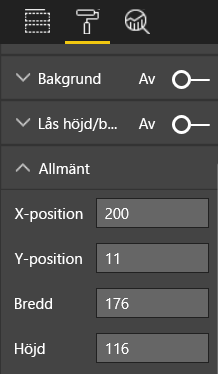

**Bild 4: Ange exakt placering för ditt visuella objekt**

På vår exempelrapportsida (bild 2) har Power BI justerat de två korten och den breda ramen till **X-positionen** 200.

#### <a name="fit-to-the-space"></a>Anpassa till utrymmet

Använd utrymmet som finns på bästa sätt. Om du vet hur människor kommer att visa och läsa rapporten ska du utforma den med det i åtanke. Minska det tomma utrymmet genom att fylla i arbetsytan. Gör allt du kan för att minska behovet av rullningslister i enskilda visuella objekt. Fyll utrymmet utan att de visuella objekten verkar vara hopträngda.

##### <a name="adjust-the-page-size"></a>Ändra sidstorleken

Om du minskar sidstorleken blir enskilda element större i förhållande till sidan. Rensa valet av visuella objekt på sidan och använd fliken **Sidstorlek** i fönstret **Format**.

Här är en rapportsida som först använder sidstorleken **4:3** och sedan **16:9**. Observera att layouten passar mycket bättre i 16:9. Det finns även tillräckligt med utrymme för att ta bort rullningslisten från det andra visuella objektet.

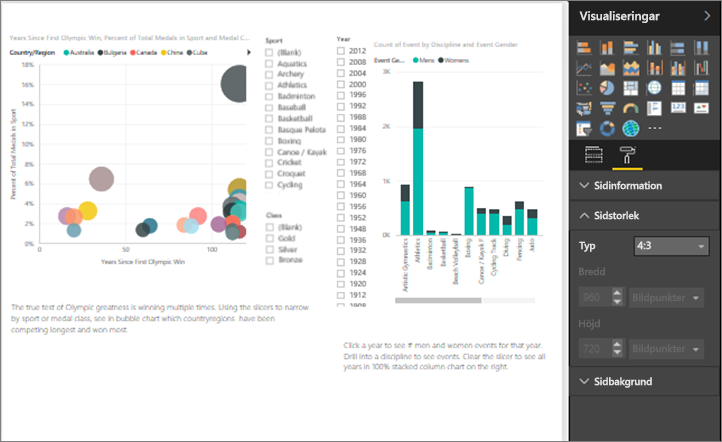

**Bild 5a: Rapporten med sidstorlek 4:3**

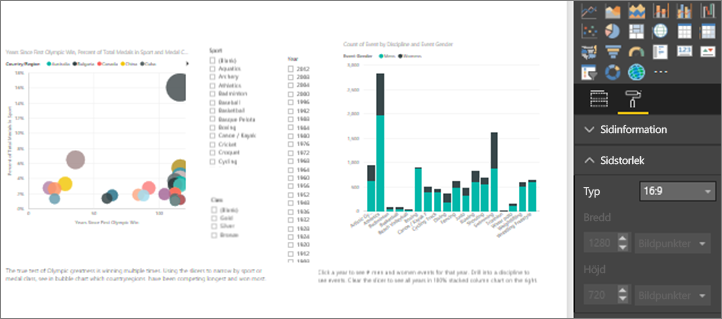

**Bild 5b: Rapporten med sidstorlek 16:9**

Kommer användarna att läsa rapporten i 4:3, 16:9 eller något annat bildförhållande? På små skärmar eller stora skärmar? Kommer de att läsa rapporten med alla möjliga olika skärmproportioner och -storlekar? Designa med detta i åtanke.

Sidan med vår exempelrapport ser lite hopträngd ut. Med inget visuellt objekt valt:

1. Välj  för att öppna fönstret **Format**.

1. Visa **Sidstorlek**.

1. För **Typ**väljer du **Anpassad**.

1. Ändra **Höjd** till **900**.

    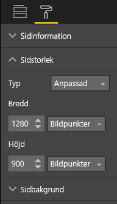

**Bild 6: Öka sidhöjden**

#### <a name="reduce-clutter"></a>Minska oreda

En stökig rapportsida är svår att förstå vid en snabb titt och kan vara så överväldigande att läsaren inte ens försöker. Ta bort alla rapportelement som inte är nödvändiga. Lägg inte till funktioner som varken förbättrar förståelsen eller navigeringen. Rapportsidan måste visa informationen så tydligt, snabbt och sammanhängande som möjligt.

Edward Tufte kallar det ”data to ink ratio” i sin bok *The Visual Display of Quantitative Information*. I princip ska du ta bort allt som inte är nödvändigt.

Oredan som du tar bort ökar det tomma utrymmet på rapportsidan. Det kommer att ge dig mer utrymme för att tillämpa de metodtips som vi lärde oss i avsnittet [Justering, ordning och närhet](#alignment-order-and-proximity).

Vårt exempel ser redan bättre ut. Vi har tagit bort oredan och lagt till figurer som grupperar elementen. Bakgrundsbilden, den onödiga pilen och textrutan är borta, vi har flyttat ett visuellt objekt till en annan sida i rapporten osv. Vi har också förlängt sidstorleken för att öka det tomma utrymmet.


**Bild 7: Vårt fula rapportexempel är inte längre stökigt**

### <a name="tell-a-story-at-a-glance"></a>Berätta en historia i korthet

Ett övergripande test är att någon utan tidigare erfarenhet snabbt ska kunna förstå rapporten utan att få någon som helst förklaring. Med en snabb blick kan läsaren se vad sidan handlar om och vad varje diagram/tabell innehåller.

När läsarna tittar på rapporten, bör deras ögon fokusera på det element som du vill att de ska titta på först. Ögonen ska sedan fortsätta från vänster till höger och uppifrån och ned. Ändra detta genom att lägga till visuella tips som t.ex. etiketter i textrutor, figurer, ramar, storlek och färg.

#### <a name="text-boxes"></a>Textrutor

Ibland räcker det inte med visualiseringarnas rubriker för att få fram budskapet. Lägg till textrutor som kommunicerar med de som läser rapporterna. Använd textrutor för att beskriva rapportsidan, en gruppering av visuella objekt eller beskriv ett individuellt visuellt objekt. De kan förklara resultat eller ge en bättre definition av ett visuellt objekt, komponenter i det visuella objektet eller relationer mellan visuella objekt. Du kan använda textrutor för att väcka uppmärksamhet baserat på olika kriterier som framhävs i textrutan.

Välj **Textruta** i den översta menyraden i Power BI-tjänsten. (I Power BI Desktop väljer du **Textruta** i området **Infoga** i menyfliksområdet.)

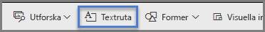

**Bild 8: Lägga till en textruta i Power BI-tjänsten**

Ange text i den tomma rutan. Använd därefter kontrollerna för att ange teckensnitt, storlek, justering med mera. Använd handtagen för att ändra storlek på rutan.

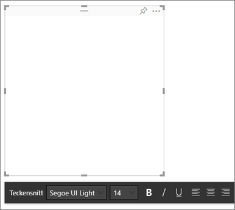

**Bild 9: Formatera textrutan**

Men överdriv inte! För mycket text i en rapport drar uppmärksamheten från de visuella objekten. Om du upptäcker att rapportsidan kräver massor av text för att man ska förstå den, bör du börja om från början. Kan du välja ett annat visuellt objekt presenterar budskapet bättre på egen hand? Kan du ändra det visuella objektets rubrik så att den blir mer begriplig?

#### <a name="text"></a>Text

Skapa en textstilguide och tillämpa den på alla sidor i rapporten. Använd bara ett fåtal teckensnitt, textstorlekar och färger. Använd den här stilguiden på textelement. Tillämpa den även på de teckensnittsval som du gör för dina visualiseringar. Mer information finns i avsnittet [Rubriker och etiketter som ingår i visualiseringarna](#titles-and-labels-that-are-part-of-the-visualizations). Ange regler för när du ska använda fetstil, kursiv stil, ökad teckenstorlek, vissa färger med mera. Försök att undvika enbart versaler eller understrykningar.

#### <a name="shapes"></a>Former

Figurer kan också underlätta navigering och förståelse. Använd figurer för att gruppera relaterad information och markera viktiga data och använd pilarna för att dirigera ögat. Med figurer kan läsarna få hjälp med var de ska börja och hur de ska tolka rapporten. I designtermer kallas detta ofta för *kontrast*.

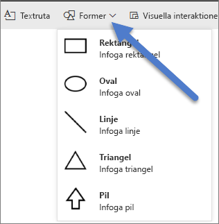

**Bild 10a: Figurer i Power BI-tjänsten**

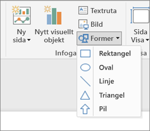

**Bild 10b: Figurer i Power BI Desktop**

Hur ser vår exempelsida ut nu? Bild 11 visar en renare och mindre rörig sida med en konsekvent användning av textstorlek, teckensnitt och färger. Sidrubriken i det övre vänstra hörnet visar vad sidan handlar om.


**Bild 11: Rapportexemplet med textriktlinjerna tillämpade och en tillagd rubrik**

I vårt exempel lade vi till en rubrik för rapportsidan i det övre vänstra hörnet, vilket är den första plats som läsaren ser. Teckenstorleken är 28 punkter och teckensnittet är Segoe Bold, vilket skiljer texten åt från resten av sidan. Enligt vår stilguide behövs inga bakgrunder, svarta rubriker, förklaringar eller etiketter. Vi har tillämpat detta för alla visuella objekt på sidan där det var möjligt (kombinationsdiagrammets axlar och etiketter kan inte redigeras). De här elementen konfigurerades dessutom efter stilguidens specifikationer:

* Kort: **Kategorietikett** inställd på **Av**, **Rubrik** inställd på **På**, 12 punkter, svart och centrerad.

* Visuella objekts rubriker: Om sådana är **aktiverade** ska de vara inställda på 12 punkter och vänsterjusterade.

* Utsnitt: **Rubrik** inställt på **Av**, **Rubrik** inställt på **På**. Lämna **Objekt** > **Text** grått och i 10 punkter.

* Punkt- och kolumndiagram: Svart teckensnitt för X- och Y-axlarna samt X- och Y-axlarnas rubriker, om de används.

#### <a name="color"></a>Färg

Använd färger konsekvent. Vi kommer att prata mer om färg i [Principer för visuell design](#principles-of-visual-design). Där berättar vi mer om att välja särskilda färger med avsikt. Du vill ju inte störa läsarens förmåga att få en snabb översikt över rapporten. För många starka färger hindrar sinnena. Det här avsnittet handlar mer om vad du inte ska göra med färg.

#### <a name="backgrounds"></a>Bakgrunder

När du ställer in bakgrunder för rapportsidor bör du välja färger som inte överskuggar rapporten, krockar med andra färger på sidan eller minskar synvänligheten. Tänk på att vissa färger har en särskild betydelse. I USA tolkas t.ex. färgen röd i rapporter i allmänhet som något dåligt.

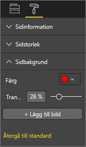

**Bild 12: Ställ in rapportens bakgrund**

Du skapar inte ett konstverk utan en funktionell rapport. Välj en färg som förbättrar läsbarhet och tydlighet för rapportelementen. En undersökning av användningen av färg och visualiseringar på webbsidor fann att större kontrast mellan färger påskyndar förståelsen. Två vitböcker utforskar det här ämnet:

* [The effect of text and background color on visual search of Web pages](https://www.sciencedirect.com/science/article/pii/S0141938202000410)

* [Determining Users’ Perception of Web Page Visual Complexity and Aesthetic Characteristics](https://www.researchgate.net/publication/301362579_Determining_Users'_Perception_of_Web_Page_Visual_Complexity_and_Aesthetic_Characteristics)

Vi har använt några metodtips för färgval i vår exempelrapport (bild 20 och 21) nedan. Det mest anmärkningsvärda var att vi ändrade bakgrundsfärgen till svart. Den gula var för ljus och tröttade våra ögon. I diagrammet **Antal idrottare per år och klass** försvann dessutom den gula delen av staplarna in i den gula bakgrunden. Med hjälp av en svart (eller vit) bakgrund får vi maximal kontrast och de visuella objekten blir fokus för uppmärksamheten.

Här är ytterligare steg som vi tog för att förbättra exempelrapporten:

#### <a name="page-title"></a>Sidrubrik

När vi ändrade bakgrunden till svart försvann vår rubrik eftersom textrutans fält bara tillåter ett svart teckensnitt. Lös problemet genom att lägga till en rubrik i en textruta i stället:

1. Radera texten med textrutan markerad.

1. På fliken **Visualiseringar** väljer du **Rubrik** och ställer den i läge **På**.

1. Välj pilen för att visa alternativen för **Rubrik** .

1. Ange **Sommar-OS** i fältet **Rubriktext**.

1. Välj vit för **Teckenfärg**.

    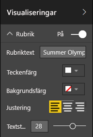

    **Bild 13: Lägg till en sidrubrik**

#### <a name="cards"></a>Kort

För visuella kortobjekt:

1. Välj  för att öppna fönstret **Format**.

1. Ange läget för **Bakgrund** till **På**.

1. Välj vit med en **genomskinlighet** på **0 %** .

    

1. Ange sedan **Rubrik** som **På**.

1. Välj vit för **Teckenfärg** och svart för **Bakgrundsfärg**.

    

#### <a name="slicers"></a>Utsnitt

Fram tills nu har de två utsnitten haft olika formatering. Det verkar inte riktigt vettigt, designmässigt. För båda utsnitten: 

1. Ändra bakgrundsfärgen till 74 % turkos.

    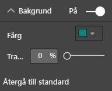

    **Bild 14: Ändra utsnittets bakgrundsfärg**

    Turkos är ett bra val eftersom det ingår i sidans färgpalett – färgen finns i koropletkartan, trädkartan och kolumndiagrammet.

1. Lägg till en tunn vit kantlinje.

    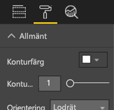

    **Bild 15: Lägg till en kantlinje i utsnittet**

1. Det grå teckensnittet är svårt att se mot turkos, så ändra färgen för **Objekt** till vit.

    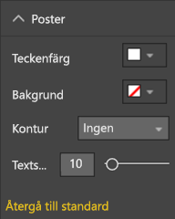

    **Bild 16: Ändra utsnittets teckenfärg**

1. Gå till slut till **Rubrik** och ändra **Teckenfärg** till vit samt lägg till svart som **Bakgrundsfärg**.

    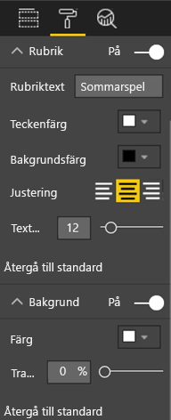

    **Bild 17: Formatera utsnittets rubrik**

#### <a name="rectangle-shape"></a>Rektangelfigur

Rektangeln har också försvunnit in i den svarta bakgrunden. För att åtgärda det här problemet:

1. Välj formen.

1. I fönstret **Formatera figur** ändrar du **Bakgrund** till **På**.

    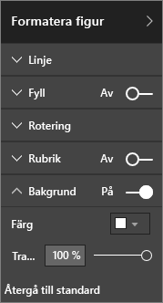

    **Bild 18: Formatera figuren**

#### <a name="column-charts-bubble-chart-filled-map-and-treemap"></a>Kolumndiagram, bubbeldiagram, koropletkarta och trädkarta

Lägg till en vit bakgrund i återstående visuella objekt på rapportsidan. Från fönstret **Format**:

1. Expandera alternativet **Bakgrund**.

1. Ange **Färg** till vit.

1. Ändra **genomskinligheten** till 0.

    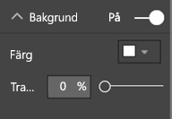

    **Bild 19: Lägg till en vit bakgrund i återstående visualiseringar**

Så här ser rapporten ut efter omformateringen:


**Bild 20: Rapportexempel med färgmetodtips tillämpade (svart bakgrund)**


**Bild 21: Rapportexempel med färgmetodtips tillämpade (vit bakgrund)**

### <a name="aesthetics"></a>Estetik

Mycket av vad vi anser vara estetiskt har redan diskuterats ovan: justering, färg, alternativ för teckensnitt, oreda osv. Det finns några fler metodtips för rapportdesign som är värda att ta upp. De handlar om rapportens övergripande utseende.

Kom ihåg att rapportens funktion är att uppfylla företagets behov, inte att vara snygg. Vissa skönhetskrav finns, särskilt när det gäller första intrycket. Nashville-konsulten Tony Bodoh menar att ”känslor utlöses en halv sekund innan logiken kickar in”. Läsarna kommer först att reagera på en känslomässig nivå på rapportsidan. Sedan tar de längre tid på sig för att gå på djupet. Om sidan ser oordnad, förvirrande och oprofessionell ut kanske läsaren aldrig upptäcker vilket kraftfullt budskap den har.

Bloggaren och TechTarget-branschanalytikern Wayne Eckerson har en bra liknelse. Att utforma en rapport är som att dekorera ett rum. Ibland köper du en vas, en soffa, ett bord eller en tavla. Du gillar alla dessa saker var för sig. Även om varje enskilt val är klokt, kanske de inte passar ihop eller konkurrerar med varandra om uppmärksamheten.

Koncentrera dig på detta:

* Skapa ett gemensamt tema eller utseende på rapporten och tillämpa det på alla rapportsidorna.

* Använd fristående bilder och annan grafik som ger stöd, i stället för att dra uppmärksamhet från det verkliga budskapet.

* Tillämpa alla de metodtips som har beskrivits hittills i artikeln.

## <a name="principles-of-visual-design"></a>Principer för visuell design

Vi har tittat på principerna för rapportdesign och du har lärt dig att ordna rapportelementen på ett sätt som gör det enkelt att snabbt förstå rapporten. Nu ska vi titta på designprinciper för de visuella objekten. I nästa avsnitt fortsätter vi med enskilda visuella objekt och diskuterar metodtips för vissa av de vanligaste typerna.

Vi ska lämna exempelrapportsidan ett tag och titta på andra exempel. När vi har gått igenom principerna för visuell design går vi tillbaka till sidan med vår exempelrapport och tillämpar det som vi har lärt oss. Vi kommer att tillhandahålla stegvisa anvisningar.

### <a name="planning--choose-the-right-visual"></a>Planera – Välj rätt visuellt objekt

På samma sätt som det är viktigt att planera rapporten innan du börjar skapa den, kräver varje visuellt objekt också planering. Fråga dig själv: ”Vilket budskap försöker jag förmedla med det här visuella objektet?” och ta sedan reda på vilken visuell typ som kan förmedla det bäst. Du kan visa framstegen med en försäljningscykel som ett stapeldiagram, men kanske skulle ett vattenfalls- eller trattdiagram illustrera det bättre? Läs det sista avsnittet, [Visuella typer och metodtips](#visual-types-and-best-practices), i den här artikeln för hjälp med den här processen. Där beskrivs metodtips för några av de vanligaste typerna av visuella objekt. Bli inte förvånad om den första visuella typ som du väljer inte visar sig vara det bästa alternativet. Testa mer än en visuell typ om du vill se vilken som är bäst för budskapet.

Förstå skillnaden mellan kategoriska och kvantitativa data och vilka visuella typer som fungerar bäst med vilken typ av data. Kvantitativa data kallas ofta för mått och är vanligtvis numeriska. Kategoriska data kallas ofta för dimensioner och kan klassificeras. Detta beskrivs mer ingående i avsnittet [Välja rätt mått](#choose-the-right-measure).

Undvik frestelsen att använda avancerade eller mer komplexa visuella typer bara för att göra din rapport mer imponerande. Det du söker är det enklaste alternativet för att förmedla budskapet. Vågräta stapeldiagram och enkla linjediagram kan förmedla information snabbt. De är välbekanta och bekväma och tolkas enkelt av de flesta läsare. En annan fördel är att de flesta läser från vänster till höger och uppifrån och ned och snabbt kan söka av dessa två diagramtyper och förstå informationen snabbt.

Kräver ditt visuella objekt att man använder en rullningslist? Undvik rullningslister om det går. Försök använda filter och tillämpa hierarkier/öka detaljnivån. Om de elementen inte medför att rullningslisten försvinner, kan du överväga att välja en annan visuell typ. Om du inte kan utesluta rullning, tolererar läsarna vågrät rullning bättre än lodrät rullning.

Även om du väljer det absolut bästa visuella objektet för budskapet, kan du fortfarande behöva hjälp med att förmedla det. Det är där etiketter, rubriker, menyer, färg och storlek kommer in. Vi diskuterar dessa designelement senare i avsnittet [Designelement](#design-elements).

### <a name="choose-the-right-measure"></a>Välja rätt mått

Är budskapet som ditt visuella objekt förmedlar tilltalande? Spelar det någon roll? Skapa inte visuella objekt bara för att du kan. Du kanske tycker det är datan som ger budskapet, men det är inte. Var inte rädd för att börja om från början och leta efter ett intressantare sätt att få fram budskapet. Kanske budskapet finns där, men det måste mätas på ett annat sätt.

Anta att du vill mäta hur framgångsrika dina försäljningschefer är. Vilka mått ska du använda för att göra detta? Vill du mäta genom att titta på total försäljning eller total vinst, tillväxt under föregående år eller resultat mot ett uppsatt mål? Säljaren Sally kanske har den största vinsten. Om du visade vinst per säljare i ett stapeldiagram skulle hon framstå som en stjärna jämfört med de andra säljarna. Om Sally har en hög försäljningskostnad (resekostnader, leveranskostnader, tillverkningskostnader osv.) räcker det inte att bara titta på försäljningen.

#### <a name="reflect-reality-dont-distort-reality"></a>Återspegla verkligheten, förvräng den inte

Det går att skapa ett visuellt objekt som förvränger sanningen. Det finns en webbplats där dataentusiaster delar vad de betraktar som dåliga visuella objekt. Det allmänna temat i kommentarerna är besvikelse på företaget som skapat och distribuerat det visuella objektet. Ett dåligt visuellt objekt förmedlar budskapet att företaget inte är att lita på.

Så skapa visuella objekt som inte avsiktligt förvränger verkligheten och som inte har ändrats för att ge det budskap som du vill få fram. Här är ett exempel:


**Bild 22: Diagram med förvrängd verklighet**

Det verkar som om det är stor skillnad mellan de fyra företagen och att CorpB lyckas mycket bättre än de andra tre i det här exemplet. Observera att X-axeln inte börjar på noll och att skillnaderna mellan företagen sannolikt ligger inom felmarginalen. Här är samma data med en X-axel som startar på noll.


**Bild 23: Realistiskt diagram**

Läsarna förväntar sig och förutsätter ofta att X-axeln startar på noll. Om du bestämmer dig för att inte börja på noll, bör du göra det på ett sätt som inte förvränger resultaten. Överväg att lägga till en visuell ledtråd eller en textruta som påpekar avvikelsen från normen.

### <a name="design-elements"></a>Designelement

När du har valt en typ och ett mått samt skapat det visuella objektet är det dags att finjustera visningen för att få maximal effektivitet. Det här avsnittet beskriver:

* Layout, utrymme och storlek

* Textelement: etiketter, kommentarer, menyer, rubriker

* Sortering

* Visuell interaktion

* Färg

#### <a name="tweaking-visuals-for-best-use-of-space"></a>Modifiera visuella objekt för att utnyttja utrymmet på bästa sätt

Om du försöker få plats med flera diagram i en rapport kan det hjälpa att maximera förhållandet mellan data och text för att budskapet i dina data ska nå fram. Som nämnts ovan myntade Edward Tufte uttrycket ”data-ink ratio”. Målet är att ta bort så mycket som möjligt från ett diagram utan att försämra läsarens möjlighet att tolka aktuella data.

I den första uppsättningen diagram nedan finns det överflödiga axeletiketter: **januari 2014**, **april 2014**och så vidare. I rubrikerna upprepas **efter datum**. Rubrikerna för varje diagram kräver dessutom ett dedikerat vågrätt utrymme över varje diagram. Genom att ta bort diagramrubrikerna och aktivera separata axeletiketter försvinner viss text och vi kan använda det totala utrymmet på ett bättre sätt. Vi kan ta bort axeletiketterna för de två översta diagrammen för att få bort ytterligare text och få mer utrymme för datan.

Om det finns vissa tidsperioder som du vill lyfta fram, kan du rita linjer eller rektanglar bakom alla diagrammen. Detta kommer att hjälpa till att dra ögat uppåt och nedåt, vilket underlättar jämförelser.

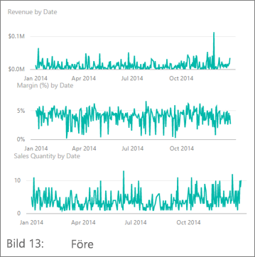

**Bild 24: Före**


**Bild 25: Efter**

**Att aktivera eller inaktivera axelrubriker**

1. Välj det visuella objektet för att aktivera det.

1. Välj  för att öppna fönstret **Format**.

1. Visa alternativen för **X-axeln** eller **Y-axeln**.

1. För skjutreglaget för **Rubrik** till läget På eller Av.

    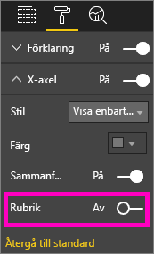

    **Bild 26: Aktivera eller inaktivera axelrubriker**

##### <a name="to-turn-axis-labels-on-and-off"></a>För att aktivera eller inaktivera axeletiketter

1. Välj det visuella objektet för att aktivera det.

1. Välj  för att öppna fönstret **Format**.

1. Skjutreglagen finns bredvid **X-axeln** och **Y-axeln**.

1. Dra i skjutreglaget för att stänga på och av axelrubrikerna.

    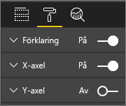

    **Bild 27: Aktivera eller inaktivera axeletiketter**

    > [!TIP]
    > Ett scenario där du kan inaktivera Y-axelns etiketter är om du har stängt av **Dataetiketter**.

##### <a name="to-remove-visual-titles"></a>För att ta bort rubriker för visuella objekt

1. Välj det visuella objektet för att aktivera det.

1. Välj  för att öppna fönstret **Format**.

1. För skjutreglaget för **Rubrik** till läget **Av**.

    

    **Bild 28: Ta bort rubriker från visuella objekt**

Fundera över hur läsarna kommer att visa rapporten. Se till att dina visuella objekt och texter är tillräckligt stora och mörka för att användarna ska kunna läsa dem. Om du har ett proportionellt större visuellt objekt på sidan, kommer läsarna förutsätta att det är det viktigaste objektet. Ha tillräckligt med utrymme mellan de visuella objekten så att rapporten inte ser stökig och förvirrande ut. Justera de visuella objekten så att läsarna vet var de ska rikta blicken.

##### <a name="to-resize-a-visual"></a>För att ändra storlek på ett visuellt objekt

1. Välj det visuella objektet för att aktivera det.

1. Dra i ett av handtagen för att justera storleken.

    

    **Bild 29: Ändra storlek på visuellt objekt**

##### <a name="to-move-a-visual"></a>För att flytta ett visuellt objekt

1. Välj det visuella objektet för att aktivera det.

1. Välj och ta tag i handtagslisten överst i mitten på det visuella objektet.

1. Dra det visuella objektet till den nya platsen.

    

    **Bild 30: Flytta ett visuellt objekt**

#### <a name="titles-and-labels-that-are-part-of-the-visualizations"></a>Rubriker och etiketter som ingår i visualiseringarna

Se till att rubriker och etiketter är enkla att läsa och självförklarande. Texten i rubriker och etiketter måste ha en optimal storlek och färger som står ut. Kommer du ihåg vår stilguide (se [Text](#text) tidigare i artikeln)? Begränsa antalet färger och storlekar – för många olika teckenstorlekar och färger gör utseendet stökigt och förvirrande. Överväg att använda samma teckenfärg och -storlek till rubriken för alla visuella objekt på en rapportsida. Välj även samma justering för alla titlar på en rapportsida.

**Fönstret Format**

Välj rollerikonen  för varje formateringsjustering som visas nedan. för att öppna fönstret **Format**.

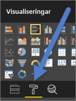

**Bild 31: Öppna fönstret Format**

Välj sedan det visuella element som ska justeras och kontrollera att det är inställt på **På**. Exempel på visuella element är: **X-axeln**, **y-axeln**, **rubrik**, **dataetiketter**, och **förklaring**. Exemplet nedan visar elementet **Rubrik**.

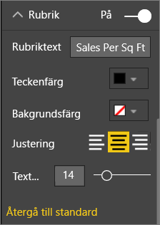

**Bild 32: Formatera en visuell rubrik**

##### <a name="set-the-text-size"></a>Ställa in textstorleken

Textstorleken kan justeras för rubriker och dataetiketter, men inte för X- eller Y-axlar eller förklaringar. Specifikt för dataetiketter är det en bra idé att leka med **visningsenheter** och antalet **decimaler**. Så småningom hittar du den optimala detaljnivån för att visa information i rapporten.

##### <a name="set-the-text-alignment"></a>Ställa in textjusteringen

Du kan välja att centrera eller vänster- eller högerjustera en rubrik. Välj samma inställning för alla visuella objekt på sidan.

##### <a name="set-the-text-position"></a>Ställa in textplaceringen

Textplaceringen kan justeras för vissa Y-axlar och för förklaringen. Beroende på vad du väljer gör du samma sak för de andra Y-axlarna och eventuella andra förklaringar på sidan.

##### <a name="set-the-title-and-label-length"></a>Ställa in längd för rubrik och etikett

Justera längden på rubriker, axelrubriker, dataetiketter och förklaringar. Om du vill visa något av elementen justerar du längden (tillsammans med textstorleken) så att Power BI inte trunkerar värdena:

* För **Rubrik** och **Förklaring** är inställningen **Rubriktext**. Ange den faktiska rubrik som ska visas på det visuella objektet.

* För **X-axeln** och **Y-axeln** är inställningen **Stil** och du väljer alternativ i en listruta.

* För **Dataetiketter** är inställningarna **Visa** och **Decimal**. Använd listrutan **Visa** för att välja måttenheter: **miljoner**, **tusen**, **ingen**, **automatisk** osv. Använd fältet **Decimal** för att tala om för Power BI hur många decimaler som ska visas.

##### <a name="set-the-text-color"></a>Ställ in textfärgen

Textfärgen kan justeras för rubriker, axlar och dataetiketter.

#### <a name="titles-and-labels-that-arent-part-of-the-visualizations"></a>Rubriker och etiketter som inte ingår i visualiseringarna

Tidigare i den här artikeln visade vi hur man lägger till textrutor på rapportsidor. Ibland räcker det inte med visualiseringarnas rubriker för att få fram budskapet. Lägg till textrutor för att ge ytterligare information till läsarna av dina rapporter.

Se till att rapportsidan inte ser förvirrande eller stökig ut genom att vara konsekvent med din användning av textrutans teckensnitt, storlek, färger och justering. Om du vill göra en ändring av texten i en textruta väljer du textrutan för att visa formateringsmenyn.


**Bild 33: Formatera teckensnittet som används i en textruta**

#### <a name="sorting"></a>Sortering

Ett enkelt sätt att ge snabbare insikter är att ställa in sorteringen av visuella objekt. Genom att exempelvis sortera stapeldiagram i fallande eller stigande ordning baserat på värdet i staplarna, kan du snabbt visa viktig information utan att använda mer utrymme.

För att sortera ett diagram:

1. Välj ellipsen i det övre högra hörnet av diagrammet.

1. Välj **Sortera**.

1. Välj det fält som du vill sortera efter och riktning.

Mer information finns i [Ändra hur ett visuellt objekt sorteras](../consumer/end-user-change-sort.md).

#### <a name="chart-interaction-and-interplay"></a>Interaktion och samspel i diagram

En av de mest praktiska funktionerna i Power BI är möjligheten att ändra hur diagram interagerar med varandra. Som standard är diagram korsmarkerade: när du markerar en datapunkt tänds relaterade data i andra diagram och orelaterade data tonas ned. Du kan åsidosätta detta beteende om du vill använda alla diagram som ett sant filter. Det sparar utrymme på sidan. I Power BI-tjänsten väljer du **Visuella interaktioner** på menyraden för att genomföra ändringen.

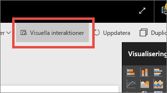

**Bild 34: Visuella interaktioner**

För varje visuellt objekt bestämmer du sedan om du vill att det valda objektet ska filtrera, markera eller inte göra någonting. Du kan inte markera alla visuella objekt. För visuella objekt som du inte kan markera kommer markeringskontrollen inte att vara tillgänglig. Mer information finns i [Visuella interaktioner i Power BI](../consumer/end-user-interactions.md).

> [!TIP]
> Den här möjligheten att välja och interagera med rapporter kanske inte är omedelbart uppenbar för läsare som inte har använt Power BI förut. Lägg till textrutor som hjälper dem att förstå vad de kan välja för att finna fler insikter.

#### <a name="the-use-of-color-in-visuals"></a>Användning av färg i visuella objekt

Tidigare i den här artikeln talade vi om vikten av att ha en plan för hur du ska använda färg i en rapport. Det här avsnittet har vissa överlappningar men gäller främst för hur du använder färg i enskilda visuella objekt. Samma principer gäller: Använd färg för att knyta ihop rapporten, lyfta fram viktiga data och förbättra läsarens förståelse av det visuella objektet. Det kan vara distraherande om du använder för många olika färger. Det gör det svårt för läsaren att veta var man ska se titta. Låt inte skönhet gå före förståelse. Lägg bara till färg om det förbättrar förståelsen.

> [!TIP]
> Tänk på vilken målgrupp du har och eventuella färgregler som finns. I USA innebär exempelvis grönt ofta ”bra” och rött innebär ofta ”dåligt”.

Följande avsnitt beskriver:

* Datafärg

* Färg på dataetikett

* Färg för kategoriska värden

* Färg för numeriska värden

##### <a name="use-colors-to-highlight-interesting-data"></a>Lyft fram intressanta data med hjälp av färger

Det enklaste sättet att använda färg är att ändra en eller flera datapunktsfärger för att skapa uppmärksamhet. I det här exemplet ändras färgen när OS-spelen går från en 4-årscykel till en 2-årscykel för sommar- respektive vinterspelen.


**Bild 35: Använd färg för att få fram ett budskap**

Du kan ändra datapunktsfärgerna på fliken **Datafärger** i fönstret **Formatering**. Om du vill anpassa varje datapunkt separat kontrollerar du att **Visa alla** är inställt som **På**.

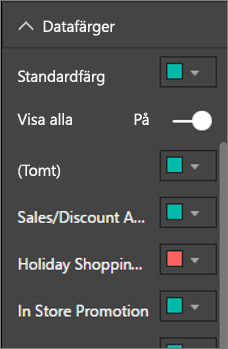

**Bild 36: Ange datapunktsfärger**

> [!NOTE]
> Power BI använder ett standardtema för rapportens visuella objekt. Designerna har valt temafärgerna för att ge variation och kontrast. Om du vill använda ett annat tema väljer du **Anpassad färg**.
>
> 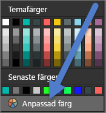
>
> **Bild 37: Välj en anpassad färg**

I Power BI Desktop kan du även markera **extremvärden** eller en del av en linje med hjälp av en andra serie:


**Bild 38: Använd Power BI Desktop för att rita extremvärden**

I det här exemplet finns det endast värden i serien **Extremvärden** när medeltemperaturen i augusti sjunker under 60 grader Fahrenheit. Vi åstadkom detta genom att skapa en DAX-beräknad kolumn med följande formel:

```
Outliers = if(Editions[Temp]<60, Editions[Temp], BLANK())
```

I vårt exempel finns det tre extremvärden: **1952**, **1956** och **2000**.

##### <a name="colors-for-labels-and-titles"></a>Färger för etiketter och rubriker

När du går igenom alla tillgängliga formateringsalternativ ser du att det finns många olika platser där du kan lägga till färg i rubriker och beskrivningar. Du kan till exempel ändra färgen på dataetiketter och axelrubriker. Var dock försiktig. I allmänhet bör du använda en enda färg för alla visuella objekts rubriker. Precis som i förhållande till de övriga riktlinjerna i den här artikeln, finns det alltid situationer och skäl för att bryta mot reglerna. Om du bestämmer dig för att bryta mot reglerna, ska du göra det av en bra anledning.

##### <a name="colors-for-categorical-values"></a>Färger för kategoriska värden

Diagram med en serie har vanligtvis ett kategoriskt värde i förklaringen. Varje färg i förklaringen nedan motsvarar exempelvis en annan kategori för Land/region.


**Bild 39: Standardfärger som används**

Designers väljer de färger som används som standard i Power BI för att ge en bra färgseparation mellan kategoriska värden så att de är lätta att skilja åt. Ibland händer det att företag ändrar de här färgerna för att matcha sin företagsprofil t.ex., men det kan orsaka problem.


**Bild 40: Användning av nyanser av en enda färg**

Genom att en enda nyans med varierande intensitet av en färg används, finns det i det här visuella objektet en falsk känsla av ordning mellan kategorierna. Man tolkar det gärna som att mörkare bubblor ligger högre eller lägre på en skala än de ljusare nyanserna. Förutom alfabetiskt finns det vanligtvis ingen inbyggd ordning i den här typen av kategoriska värden.

Om du vill ändra standardfärgerna väljer du  Öppna fönstret **Formatering** och välj **Datafärger**.

##### <a name="colors-for-numerical-values"></a>Färger för numeriska värden

För fält som har en inbyggd ordning och numeriska värden, kan du också färgsätta datapunkterna efter värdet. Att ge de olika datapunkterna olika färger kan vara bra för att visa spridningen av datavärden och för att låta Power BI visa två variabler i ett och samma diagram. Följande diagram gör det tydligt i det här diagrammet att även om Kina har det högsta medaljantalet, har Japan och Thailand deltagit i fler olympiska spel.


**Bild 41: Färgsätta datapunkter efter värde**

För att skapa det här diagrammet:

1. Välj det visuella objektet för att aktivera det.

1. Välj  för att öppna fönstret **Format**.

1. Välj **Datafärger** > alternativ > **Villkorsstyrd formatering**:

    

    **Bild 42: Välj Villkorsstyrd formatering**

1. Justera färgerna i dialogrutan **Standardfärg – *Datafärger*** .

    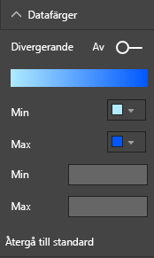

    **Bild 43: Justera de färger som används för färgmättnaden**

Du kan också använda färg för att betona avvikelser från ett centralt värde. Till exempel kan positiva värden vara gröna och negativa värden röda. Tänk på kulturella skillnader när du tilldelar färger till positiva eller negativa värden. Inte alla kulturer använder rött för något dåligt och grönt för något bra.


**Bild 44: Färg som lyfter fram avvikelser runt ett centralt värde**

### <a name="principles-of-visual-design--applied-to-example-report-page"></a>Principer för visuell design – tillämpat på en exempelrapportsida

Nu ska vi ta de visuella principer som beskrevs ovan och använda dem i vår exempelrapport.


**Bild 45: Vår exempelrapport (före)**


**Bild 46: Vår exempelrapport (efter)**

#### <a name="what-did-we-do"></a>Vad har vi gjort?

| Objekt | Beskrivning |
| ---- | ----------- |
| Utsnitt | Tog bort tomma värden från utsnitten genom att lägga till ett sidnivåfilter och välja endast **Guld**, **Silver** och **Brons**. <br> Ändrade **Valkontroller** till **Av** för **Markera enstaka** och **Markera alla**. |
| Bubbeldiagram | Det finns så många objekt i förklaringen att de inte får plats på skärmen. Tog bort förklaringen och aktiverade **Kategorietiketter** i stället. Kunderna kan hovra över bubblorna för att se informationen.<br> Förkortade rubriken och tog bort ”per landsregion” eftersom det verkar självklart. <br> **Aktiverade** båda axeletiketterna för att göra det lättare att förstå diagrammet. |
| Ifylld karta | Ändrade **Datafärger** så att det framhävs bättre. <br> Aktiverade **Divergerande** och angav **Minimum** till rosa och **Maximum** till röd.
| Trädkarta | Tog bort filtret som var inställt bara för USA. <br> Ställde in **Dataetiketter** till en decimal. <br> Det visuella objektet använde fältet **Klass** som inte är användbart eftersom det nästan alltid kommer att vara 33 % för de tre medaljerna guld, silver och brons. <br> Valde ett annat, mer intressant fält, nämligen **Kön**. Ändrade Vattensport till blå och Friidrott till grå i designen.
| Övre stapeldiagram | Förkortade rubriken, tog bort dataetiketter, inaktiverade förklaringsrubriken. <br> Ändrade ordföljden i rubriken för att matcha diagrammet nedan.
| Undre stapeldiagram | Sorterade stigande efter år för att matcha diagrammet ovan. <br> Ändrade färger för att matcha klassen. <br> Ändrade rubriken. <br> Stängde av förklaringen för att få mer datautrymme. <br> Aktiverade dataetiketter. De visas inte i rapporten eftersom det visuella objektet är för litet för att etiketterna ska vara lätta att läsa. De visas när läsaren öppnar det visuella objektet i **fokusläge**. Lär dig mer om [fokusläget](../consumer/end-user-focus.md). <br> Lagt till **antal (distinkta) händelser** till **Knappbeskrivningar**. Nu när man hovrar över en staplad kolumn, visar även knappbeskrivningarna hur många event som personerna tävlade i det aktuella året. |
| Visuella interaktioner | Inaktiverade interaktioner för båda korten eftersom vi vill att de alltid ska visa totalt antal matcher och sporter. |

## <a name="visual-types-and-best-practices"></a>Visuella typer och metodtips

Power BI innehåller många inbyggda visuella typer. Om vi skulle lägga till listan över anpassade visuella objekt som finns tillgängliga från Microsoft och Power BI Community, skulle det totala antalet alternativ bli allt för många för att kunna beskrivas här. Låt oss i stället titta på några av de mest använda inbyggda visuella typerna.

### <a name="line-charts"></a>Linjediagram


Linjediagram är ett kraftfullt sätt att visa data över tid. När man tittar på data i tabeller går det inte lika snabbt att upptäcka toppar, dalar, cykler och mönster. I exemplet nedan visas trender i antalet medaljer som delats ut och antalet idrottare som vunnit dessa medaljer.


**Bild 47: Linjediagram**

#### <a name="best-practices"></a>Metodtips

* När man ser ett linjediagram brukar man notera formen på kurvan först. Du behöver ha en X-axel som gör kurvan meningsfull, som exempelvis tid eller fördelningskategorier. Om du placerar kategoriska fält som produkt eller geografi på X-axeln blir linjediagrammet inte intressant. Formen på kurvan skulle inte ge någon meningsfull information.

* Om du väljer att placera flera diagram över och under varandra så här för att göra det lättare att göra jämförelser mellan serier på det här viset ska du justera X-axeln. Använd filter för att se till att Power BI visar samma värdeintervall. Om du tittar på datumintervall måste du säkerställa att diagrammen har samma datumintervall. Till exempel 1896 till 2012 i båda diagrammen.

* Utnyttja utrymmet. Om det passar för dina data kan du ange **start**- och **slutpunkterna** för Y-axeln så att du eliminerar det tomma utrymmet högst upp och längst ned i diagrammet. Det hjälper också det visuella objektet att fokusera på de faktiska datapunkterna. För att ange **start**- och **slutpunkter**:

  1. Välj det visuella objektet för att aktivera det.

  1. Välj  för att öppna fönstret **Format**.
  
  1. Expandera området **Y-axel** och ange **Start**- och **Slut**punkterna.
  
      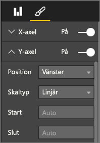
  
      **Bild 48: Ange start- och slutpunkter**

* Ett annat skäl till att ange **start**- och **slutpunkter** är om du ska jämföra två eller flera diagram på samma sida med samma Y-axelfält. Om du till exempel tittar på kumulativa händelseantal och Storbritannien har ett antal mellan 1 och 70 och Australien har ett antal mellan 1 och 12, kommer de två linjediagrammen att visa mycket olika Y-axlar (bild 49). Det gör det svårt att jämföra dem med en snabb blick. Ange i stället att diagrammen ska använda samma Y-axelintervall (bild 50).
  
  
  
  **Bild 49: Linjediagram med olika Y-axlar**
  
  
  
  **Bild 50: Linjediagram med matchande Y-axlar**

Mer information finns i:

* [Anpassa egenskaper för X-axel och Y-axel](power-bi-visualization-customize-x-axis-and-y-axis.md)

* [Linjediagram och oregelbundna intervall: ett inkompatibelt partnerskap](http://www.perceptualedge.com/articles/visual_business_intelligence/line_graphs_and_irregular_intervals.pdf)

* [Grundläggande datavisualisering: linjediagram](http://www.columnfivemedia.com/data-visualization-101-line-charts)

### <a name="bar-and-column-charts"></a>Stapel- och kolumndiagram


Om linjediagram är standard för att granska data över tid, är stapeldiagram standarden för att titta på ett specifikt värde i olika kategorier. Om du sorterar staplarna baserat på antal ser du omedelbart de högsta värdena och fördelningen. Vågräta stapeldiagram fungerar bra med långa etiketter.


**Bild 51: Vågrätt stapeldiagram**

#### <a name="best-practices"></a>Metodtips

* Visa dataetiketter för värden. Detta gör det enklare att identifiera specifika värden. För att visa dataetiketter: 

  1. Välj det visuella objektet för att aktivera det.

  1. Välj  för att öppna fönstret **Format**.
  
  1. Ställ in **Dataetiketter** till **På**.

      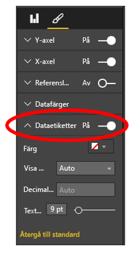

      **Bild 52: Aktivera dataetiketter**

* Stapeldiagrammet ovan är användbart när man ska jämföra ett mått med många mått vid en enskild tidpunkt. Medan linjediagrammet visade oss en trend över tid, visar stapeldiagrammet oss trenden för en enskild kategori vid en viss tidpunkt. Vid en snabb blick visar vårt stapeldiagram oss att Spanien har den värsta arbetslösheten i världen med 24,70 %.

* När ett helt stapel- eller kolumndiagram inte får plats i det tilldelade utrymmet, lägger Power BI dit rullningslister. Vid behov bör du strukturera det visuella objektet och rapporten så att hela diagrammet visas. Då får läsaren en översikt över hela fördelningen. Detta är tyvärr inte möjligt i vårt exempel på grund av det stora antalet länder i världen.

  Ett sätt att begränsa de värden som ingår är att använda ett filter. Man kan till exempel lägga till ett filter på **visuell nivå** som endast visar landet om arbetslösheten är högre än 20 %.

* Du kan öka detaljnivån (och gå tillbaka upp igen) i stapel- och kolumndiagram. Det är ett bra sätt att få in mer information i ett visuellt objekt utan att ta upp mer utrymme. I exemplet nedan finns en hierarki för Regioner > Länder. Om du dubbelklickar på ett regionsfält ökas detaljnivån till de länder som utgör den regionen. Mer information om granskningsläget finns i [Granskningsläge i en visualisering i Power BI](../consumer/end-user-drill.md).
  
  
  
  **Bild 53: Öka detaljnivån**

Mer information om stapel-/kolumndiagram:

* [Grundläggande datavisualisering: stapeldiagram](https://insights.newscred.com/data-visualization-101-bar-charts/)

* [Datavisualiseringskatalog: Stapeldiagram](http://www.datavizcatalogue.com/methods/bar_chart.html#.VYV-hY3bLJw)

* [Datavisualiseringskatalog: Multimängdstapeldiagram](http://www.datavizcatalogue.com/methods/multiset_barchart.html#.VYV_gI3bLJw)

### <a name="stacked-bar-and-column-charts"></a>Staplade stapel- och kolumndiagram


Lägg till en annan dimension till dina stapel- och kolumndiagram genom att stapla olika kategorier i stapeln eller kolumnen. Nu visar diagrammet information om en övergripande trend (baserat på höjd och längd), men också påverkan på kategorierna i denna trend. I diagrammet nedan visas den övergripande tillväxten för elitfotbollslagens intäkter över 6 miljarder 2014.


**Bild 54: Stående stapeldiagram**

I det staplade kolumndiagrammet ser vi att **de totala intäkterna** ökar med tiden och att kategorierna **Kommersiella intäkter** och **Sändningsintäkter** växer stadigt över tid – vilket bidrar till ökade övergripande intäkter. Men det här diagrammet gör inte det lätt att jämföra den effekt som de tre kategorierna har på varandra. Exempel: ”Hur står sig tillväxten för Kommersiella intäkter jämfört med tillväxten för Sändningsintäkter Eller Matchdagsintäkter?” Ett bättre alternativ för dessa data, eller ett åtföljande visuellt objekt för dessa data, skulle vara ett linjediagram.

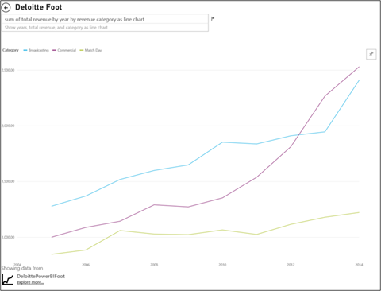

**Bild 55: Konvertera till ett linjediagram**

I det här linjediagrammet är det lättare att se hur de kommersiella intäkterna har växt mest, följt av intäkterna från sändningar och matchdagar.

#### <a name="best-practices"></a>Metodtips

* Precis som med kolumn- och stapeldiagram kan du välja att visa diagrammet vågrätt eller lodrätt. Vågrätt är bättre om du har långa etiketter och lodrätt passar bra om du har tidsseriedata.

* Undvik staplade stapel- kolumndiagram om du vill visa trender och andra mönster för förändringar över tid. Andra diagram, som exempelvis linjediagram, är mycket bättre.

* Du kan också låta fördelningen baseras på total volym eller vara en procentandel av summan.

* Som Few noterade:

    > *... det svårt att jämföra segmenten i en staplad stapel. Om segmenten har ordnats sida vid sida och alla går upp från samma baslinje är det enkelt att jämföra deras höjd, men när de staplas ovanpå varandra blir det svårt. Plus att även om det är ganska enkelt att se hur intäkterna ändrats från månad till månad, är det mycket svårt att se hur intäkterna i de andra kategorierna ändrats*.

* 100 % diagram är ett bra val när du använder procenttal som tillsammans utgör 100. I exemplet nedan visas kategorifördelningen per lag. Procenttalen är relativa och innebär att vi ser mönstren på ett ögonblick. Evertons intäkter kommer främst från sändningar (drygt 70 %), medan bara 20 % av PSG:s intäkter kommer från sändningar. Valet av en vågrät visning gör det enklare att få plats med lagetiketterna och se effekten av intäktstypen.

  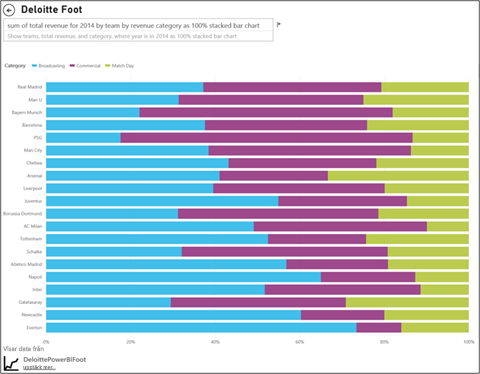

  **Bild 56: Vågrätt stapeldiagram**

För mer information om staplade diagram:

* [Datavisualiseringskatalog: Staplade stapeldiagram](http://www.datavizcatalogue.com/methods/stacked_bar_graph.html#top)

* [När är 100 % liggande stapeldiagram användbara?](http://www.perceptualedge.com/blog/?p=2239)

### <a name="combo-bar-and-column-charts"></a>Kombinerade stapel- och kolumndiagram


I Power BI kan du kombinera kolumn- och linjediagram till ett kombinationsdiagram. Alternativen är: 

* Linje- och staplat kolumndiagram 

* Linje- och grupperat kolumndiagram

Spara värdefull arbetsyta genom att kombinera två separata visuella objekt till ett.

Nästa två skärmbilder visar en före- och en efterbild.


 **Bild 57: Som två separata diagram**

På den första finns två separata visuella objekt: ett kolumndiagram som visar befolkning över tid och ett linjediagram som visar BNP över tid. Dessa diagram skulle passa bra som kombinationsdiagram eftersom de har samma X-axel (år) och värden (2002 till 2012). Varför inte kombinera dem och jämföra dessa två trender i ett enda visuellt objekt? Om du kombinerar de två diagrammen kan du göra en snabbare jämförelse av dessa data.


 **Bild 58: Som ett enda kombinationsdiagram**

Den nya rapportsidan har ett enda visuellt objekt: ett linje- och staplat kolumndiagram. Vi kunde enkelt ha skapat ett linje- och grupperat kolumndiagram. Nu är det ännu enklare att söka efter en relation mellan de två trenderna. Vi kan se att fram till 2008 följde befolkning och BNP ungefär samma trend. Men från och med 2009 när befolkningstillväxten planade ut, blev BNP:n rörligare.

#### <a name="best-practices"></a>Metodtips

* Kombinationsdiagram fungerar bäst när minst en axel är gemensam för båda visuella objekten.

* Ha koll på din axlar! Är ditt kombinationsdiagram enkelt att läsa och tolka? Använder det olika intervall och värden? Om skalan för kolumndiagrammets Y-axel är mycket mindre än skalan för Y-axeln i linjediagrammet, kommer kombinationsdiagrammet inte vara meningsfullt. Se exempelvis den tredje linjen (turkos) i nederkant.

   

   **Bild 59: Ett misslyckat linjediagram**

  Ditt kombinationsdiagram blir inte heller meningsfullt om ditt kolumndiagram och linjediagram använder två olika mått och du inte skapar dubbla axlar. Till exempel dollar jämfört med procent. Se till att inkludera båda axlarna för att läsaren ska förstå diagrammet och lägg gärna till axeletiketter också.

  För att skapa dubbla axlar:

    1. Välj det visuella objektet för att aktivera det.

    1. Välj  för att öppna fönstret **Format**.

    1. Expandera **Y-axeln** och ange **Visa sekundär** till **På**.

          

          **Bild 60: Visa sekundär axel**

    1. Ange **Y-axel (kolumn)**  > **Rubrik** till **på**.

    1. Ange **Y-axel (rad)**  > **Rubrik** till **På**.

  Så här kommer diagrammet att se ut:

  

  **Bild 61: Skapa ett kombinationsdiagram i stället**

* Dra nytta av dubbla axlar. Detta är ett bra sätt för att jämföra flera mått med olika värdeintervall. Det hjälper till att illustrera sambandet mellan två mätvärden i ett visuellt objekt.

Mer information finns i:

* [Kombinationsdiagram i Power BI](power-bi-visualization-combo-chart.md)

* [Axlar med dubbel skalning i grafer: Är de någonsin den bästa lösningen? ](http://www.perceptualedge.com/articles/visual_business_intelligence/dual-scaled_axes.pdf)

### <a name="scatter-chart"></a>Punktdiagram


Ibland kan vi ha många variabler som vi vill se tillsammans. Då kan ett punktdiagram vara ett praktiskt sätt att få en övergripande bild. Punktdiagram visar relationer mellan två (punkter) eller tre (bubblor) kvantitativa mått. Ett punktdiagram har alltid två värdeaxlar som visar en uppsättning numeriska data längs en vågrät axel och en annan uppsättning numeriska värden längs en lodrät axel. Diagrammet visar punkter i skärningspunkten för ett numeriskt X- och Y-värde och kombinerar dessa värden till separata datapunkter. Power BI kan distribuera dessa datapunkter jämnt eller ojämnt på den vågräta axeln. Det beror på dina data.

Ett bubbeldiagram ersätter datapunkterna med bubblor, med en bubbelstorlek som motsvarar en dimension av datan.

Nedanstående bubbeldiagram visar Sydamerika och jämför BNP per capita (Y-axeln), summan av BNP (X-axeln) och befolkning per sydamerikanskt land.


**Bild 62: Sydamerikas BNP och befolkning som bubbeldiagram**

Storleken på bubblorna motsvarar den totala befolkningen för landet i fråga. Brasilien har den största befolkningsmängden (bubbelstorleken) och den största andelen av Sydamerikas BNP. Det är längst bort på X-axeln. Men observera att BNP per capita för Uruguay, Chile och Argentina är högre än för Brasilien. De är längre upp på Y-axeln.

Om du lägger till en uppspelningsaxel kan du låtsas att du är Hans Rosling och visa budskapet över tid: [From Data to Insight & Impact: Showing Africa's Progress with Power View and PPI by Microsoft](https://www.youtube.com/watch?v=PbaDBJWCeD4). Lägg till en uppspelningsaxel genom att dra ett datumtid-fält till **Uppspelningsaxel**.

#### <a name="best-practices"></a>Metodtips

* Punktdiagram och bubbeldiagram är bra när man ska få fram ett budskap. Men de är inte så användbara när man ska utforska data. Som Stephen Few påpekar:

    > *Styrkan hos den här metoden är när den används för att få fram ett budskap. När Rosling tolkar vad som händer i diagrammet medan bubblorna flyttas runt och ändrar värden, pekar han på det han vill att vi ska se vilket gör informationen levande. Animerade bubbeldiagram är dock mycket mindre effektiva när vi vill granska datan och få en uppfattning om den. Jag tvivlar på att Rosling använde den här metoden för att identifiera budskapet, utan endast använde den för att informera om det när det var känt. Vi kan inte fokusera på mer än en bubbla i taget eftersom de flyttas runt, så vi måste köra animeringen flera gånger att få en uppfattning om vad som händer. Vi kan lägga till spår till valda bubblor för att kunna granska hela sökvägen för bubblorna, men om du använder spår för flera bubblor blir diagrammet snabbt för stökigt. I princip anser jag att detta inte är det bästa sättet för att visa information vid analys och undersökning.*

* Lägg till X- och Y-axeletiketter som stöd. Särskilt i bubbeldiagram finns det många komponenter med i spelet och etiketter som hjälper läsarna att förstå det visuella objektet.

* Genom att lägga till dataetiketter blir det lättare att tolka det visuella objektet. Särskilt i bubbeldiagram, när man har många objekt i förklaringen, kan det vara svårt att skilja mellan liknande färger. I det visuella objektet ovan är förklaringsfärgerna för Surinam, Columbia och Ecuador lika varandra.

* Har du skapat ett punktdiagram där du bara ser en datapunkt som aggregerar alla värdena på X- och Y-axlarna? Aggregerar diagrammet alla värden längs en enda vågrät eller lodrät linje? Lös problemet genom att lägga till ett fält i området **Information** som talar om för Power BI hur värdena ska grupperas. Fältet måste vara unikt för varje punkt som du vill rita. Mer hjälp finns i [Självstudie för Power BI:s punkt- och bubbeldiagram](power-bi-visualization-scatter.md).

### <a name="treemap-charts"></a>Trädkartsdiagram


Trädkartor kan vara användbara för att ge en bra översikt över den relativa storleken på olika komponenter som utgör en helhet, särskilt när du kan gruppera dem i kategorier. När du tittar på ett nytt företag är en trädkarta med huvudkomponenterna användbar för att se den övergripande fördelningen.

I det första diagrammet nedan ser du direkt att Brasilien utgör cirka hälften av Sydamerikas BNP. Du kan också se att Columbia och Chile är av ungefär samma storlek.

Vi antar att du vill se ett större sammanhang och fortfarande få en uppfattning om de största bidragande ländernas påverkan. Skapa visuella hierarkier med kategorimedlemmar (länder) inkapslade i regioner. Främst ger den andra trädkartan oss en uppfattning om regionernas relativa storlek. Därefter kan vi i varje region se vilka enskilda länder som bidrar mest. Vi ser att det finns tre stora regioner: Europa, Asien och Nordamerika. Vi kan enkelt se de främsta länderna/regionerna i de här områdena.

Den största begränsningen för en trädkarta är att det är svårt att jämföra de mindre rektanglarna. Det är ett bra diagram för att få översikt, men kolumn- och stapeldiagram är förmodligen ett bättre alternativ om man vill få bättre uppfattning om den relativa storleken på olika komponenter.

Den första trädkartan ger en övergripande indikation på ordningen för BNP-storlek. Det är dock svårt att identifiera specifika skillnader mellan länderna, särskilt de mindre omärkta bladen. För dessa data där en enda gruppering jämförs, kan ett stapel- eller kolumndiagram vara ett bättre alternativ.

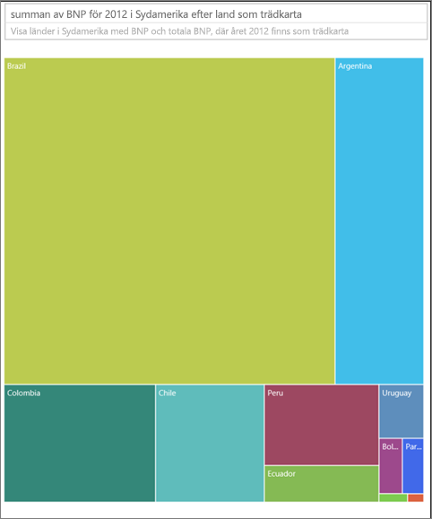

**Bild 63: BNP-jämförelse för Sydamerika med en trädkarta**

Därefter lade vi till Region som ytterligare en datanivå. Vi kan se det övergripande bidraget till BNP efter region. Vi kan också se den relativa påverkan som finns inom regionerna. Var försiktig om du gör detta med icke-summerade mått (till exempel medelvärden) eftersom summan av detaljerna kanske inte motsvarar det faktiska värdet på aggregerad nivå.


**Bild 64: BNP per region och land med en trädkarta**

För mer information om trädkartor:

* [Identifiera Business Intelligence med trädkartsvisualiseringar](http://www.perceptualedge.com/articles/b-eye/treemaps.pdf)

* [Datavisualiseringskatalog: Trädkarta](http://www.datavizcatalogue.com/methods/treemap.html#.VYhylI3bL7Y)

### <a name="other-charts"></a>Andra diagram

#### <a name="pie-or-donut-charts"></a>Cirkel- eller ringdiagram


Stapel-, kolumn- och linjediagram fungerar i allmänhet för de flesta ändamål. Det är välkänt att cirkel- och ringdiagram är svåra att tolka på rätt sätt. I själva verket kan de ofta förvränga data. Undvik dem om möjligt. Stephen Few har en utmärkt beskrivning av historien och farorna i [Save the Pies for Dessert](https://www.perceptualedge.com/articles/08-21-07.pdf).

Stephen förklarar att den enda gång när cirkeldiagram kan vara användbara är när man jämför relationer mellan delar och helheter. Det är sällan bättre än ett 100 % staplat stapeldiagram.

En annan rolig artikel (och animering) om cirkeldiagram finns på [Darkhorse Analytics webbplats](http://www.darkhorseanalytics.com/blog/salvaging-the-pie).

#### <a name="radial-gauges--kpis"></a>Radiella mätare och KPI:er


Radiella mätare verkar vara ett bra visuellt objekt för att visa prestanda mot ett mål och de är populära i ledningsgruppers instrumentpaneler. Men de har två brister. Precis som med cirkeldiagram är det svårt att tolka vinkeln för det skuggade området jämfört med en fullständig 180 graders båge eller mållinje. Dessutom används mycket utrymme för att visa ett enda mått.

Ett bra alternativ är ett enkelt visuellt KPI-objekt:


KPI:er visar värde, status, mål, målavvikelse och trend på samma mängd utrymme. Den gröna färgen blir röd om målet inte uppfylls och kan bli gul om vissa mellanliggande mål uppnås. De är mycket enklare att läsa och tolka än mätaren.

Mer information finns i:

* [Diagram med radiella mätare i Power BI](power-bi-visualization-radial-gauge-charts.md)

* [Visuella KPI-objekt](power-bi-visualization-kpi.md)

## <a name="conclusion"></a>Slutsats

Nu är det dags att börja använda dessa metodtips. Håll kontakten med oss och dela med dig av dina egna metodtips. Är du inte överens med oss om våra rekommendationer eller har du en bra anledning till att ”bryta mot reglerna”? Vi vill gärna höra om de erfarenheterna också.

Har du fler frågor? [Prova Power BI Community](http://community.powerbi.com/)

### <a name="book-recommendations"></a>Boktips

Det finns många bra böcker i dag som kan hjälpa team att uppdatera sina kunskaper om tekniker för att designa visuella objekt. Stephen Fews bok *Information Dashboard Design* är en av de bästa. Han går även på djupet i två andra böcker: *Show Me the Numbers* och *Now You See It*. Både Few och andra författare har hämtat inspiration från Edward R. Tufte, vars bok *The Visual Display of Quantitative Information* betraktas som en klassiker inom detta område. Tufte har också skrivit *Visual Explanations*, *Envisioning Information* och *Beautiful Evidence*. Andy Kirks nya bok *Data Visualization: A Handbook for Data Driven Design* är ett annat bra alternativ. Några andra författare vi rekommenderar: Lachlan James, William McKnight och Boris Evelson (Forrester), Darkhorse Analytics.
