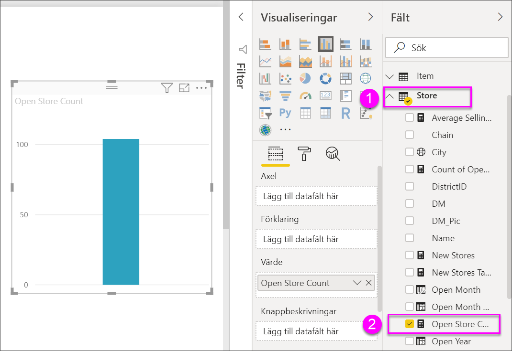
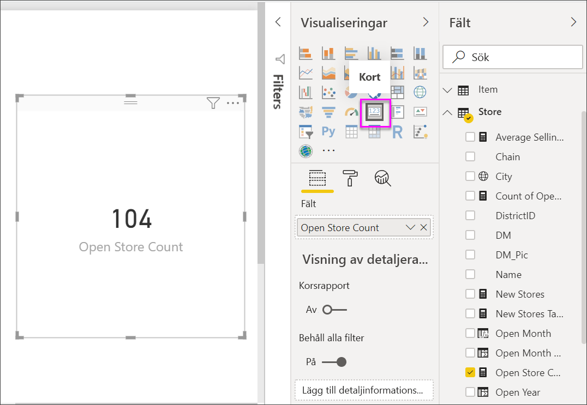
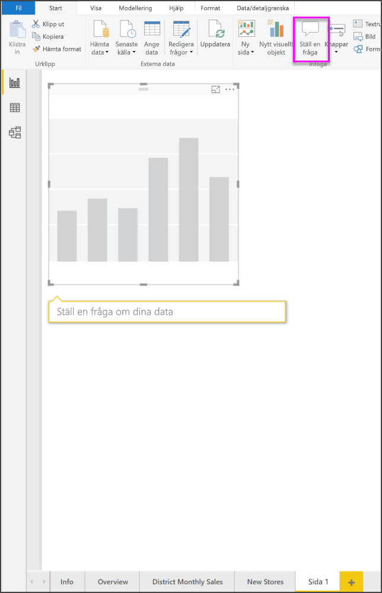
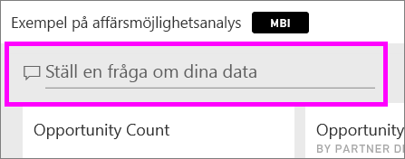
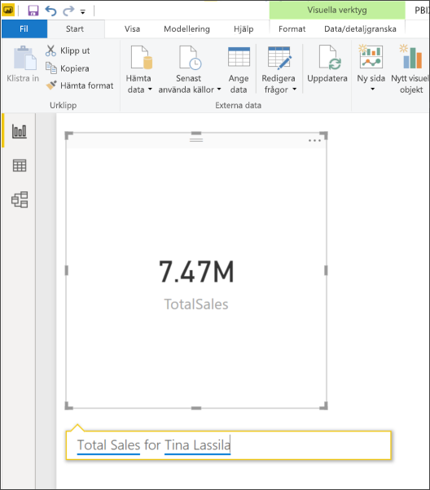
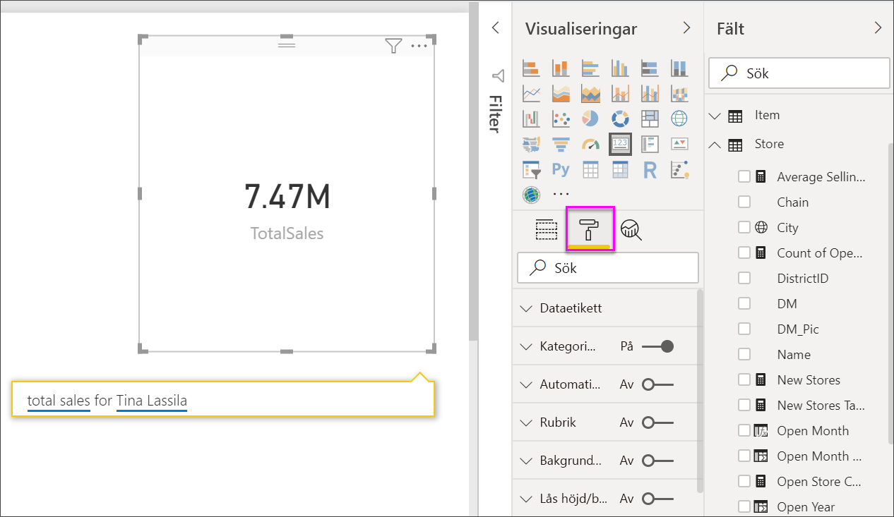
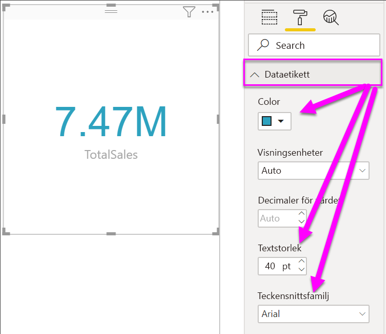
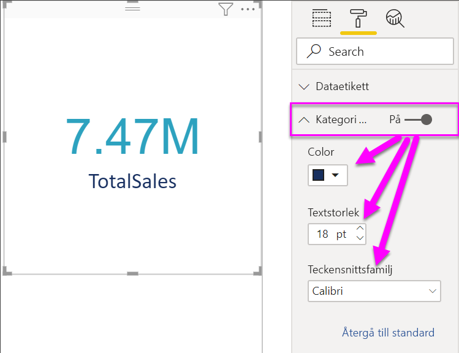
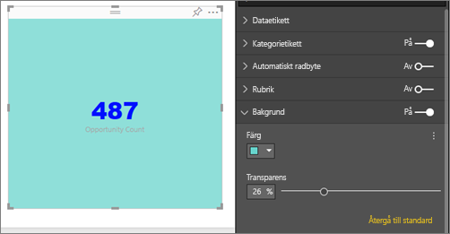

# Skapa kortvisualiseringar

[!INCLUDE[consumer-appliesto-nyyn](../includes/consumer-appliesto-nyyn.md)]

[!INCLUDE [power-bi-visuals-desktop-banner](../includes/power-bi-visuals-desktop-banner.md)]

Ett enda tal kan ibland vara det viktigaste du vill spåra i Power BI-instrumentpanelen eller -rapporten, till exempel total försäljning, marknadsandel år för år eller totala affärsmöjligheter. Den här typen av visualisering kallas ett *kort*. Som nästan alla ursprungliga Power BI-visualiseringar, kan kort skapas med hjälp av rapportredigeraren eller Frågor och svar.

> [!NOTE]
> För att dela en rapport med en Power BI-kollega krävs att du både har individuella Power BI Pro-licenser eller att rapporten har sparats med Premium-kapacitet.

## Förutsättning

De här självstudierna använder sig av [PBIX-filen Exempel på detaljhandelsanalys](https://download.microsoft.com/download/9/6/D/96DDC2FF-2568-491D-AAFA-AFDD6F763AE3/Retail%20Analysis%20Sample%20PBIX.pbix)

1. Välj **Arkiv** \> **Öppna** uppe till vänster på menyraden
   
2. Leta reda på kopian av **PBIX-filen Exempel för detaljhandelsanalys**

1. Öppna **PBIX-filen Exempel för detaljhandelsanalys** i rapportvyn .

1. Välj  för att lägga till en ny sida.

## Alternativ 1: Skapa ett kort med hjälp av rapportredigeraren

Den första metoden för att skapa ett kort är att använda rapportredigeraren i Power BI Desktop.

1. Börja med en tom rapportsida och välj fältet **Butik** \> **Antal öppna butiker**.

    Power BI skapar ett stapeldiagram med ditt tal.

   

2. I fönstret Visualiseringar väljer du kortikonen.

   

Nu har du skapat ett kort med rapportredigeraren. Nedan är det andra alternativet för att skapa ett kort med frågerutan för frågor och svar.

## Alternativ 2: Skapa ett kort från frågerutan för frågor och svar
Frågerutan för frågor och svar är ett annat alternativ för dig att använda när du skapar ett kort. Frågerutan för frågor och svar är tillgänglig i Power BI Desktop-rapportvyn.

1. Börja med en tom rapportsida

1. Välj ikonen **Ställ en fråga** högst upp i fönstret. 

    Power BI skapar ett kort och en ruta för din fråga. 

   

2. Skriv till exempel ”Total försäljning för Tina” i frågerutan.

    Frågerutan hjälper dig med förslag och rättelser och visar slutligen det totala antalet.  

   

   

Nu har du skapat ett kort med frågerutan för frågor och svar. Nedan visa stegen för formatering av ditt kort efter dina specifika behov.

## Formatera ett kort
Du har många alternativ för att ändra etiketter, text, färg med mera. Det bästa sättet att lära dig är att skapa ett kort och sedan utforska formateringsfönstret. Här följer några tillgängliga formateringsalternativ. 

Formateringsfönstret är tillgängligt när du interagerar med kortet i en rapport. 

1. Börja med att välja färgrollerikonen för att öppna formateringsfönstret. 

    

2. Låt kortet vara markerat, expandera **Dataetikett** och ändra färg, storlek och teckensnittsfamilj. Om du har tusentals butiker, kan du använda **Visningsenheter** för att visa antal butiker med tusentalsavgränsare och kontrollera antalet decimaler också. Till exempel 125,8K i stället för 125 832,00.

    

3.  Expandera **Kategorietikett** och ändra storlek och färg.

    

4. Expandera **Bakgrund** och flytta skjutreglaget till På.  Nu kan du ändra bakgrundsfärgen och transparensen.

    

5. Fortsätt att utforska formateringsalternativen tills kortet är exakt som du vill. 

## Överväganden och felsökning
Om du inte ser någon frågeruta, kontakta din system- eller klientadministratör.    

## Nästa steg
[Kombinationsdiagram i Power BI](power-bi-visualization-combo-chart.md)

[Visualiseringstyper i Power BI](power-bi-visualization-types-for-reports-and-q-and-a.md)
