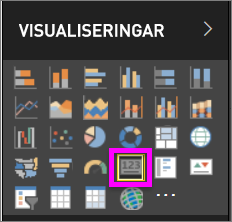
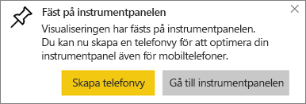
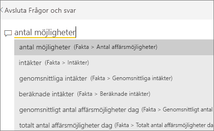
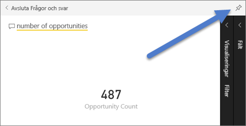
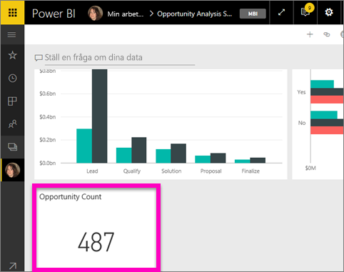
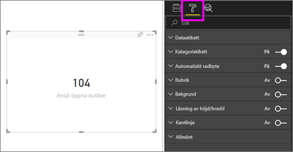
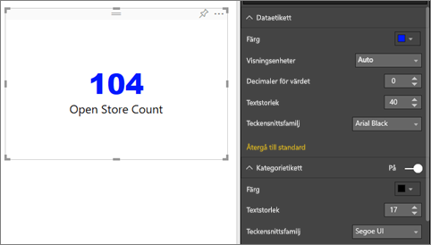
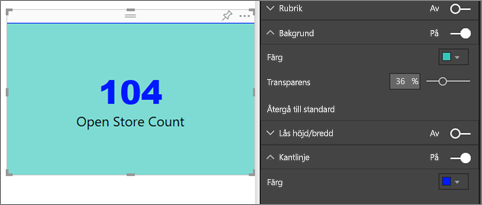

# Kortvisualiseringar
Ett enda tal kan ibland vara det viktigaste du vill spåra i Power BI-instrumentpanelen eller -rapporten, till exempel total försäljning, marknadsandel år för år eller totala affärsmöjligheter. Den här typen av visualisering kallas ett *kort*. Som nästan alla ursprungliga Power BI-visualiseringar, kan kort skapas med hjälp av rapportredigeraren eller Frågor och svar.

## Skapa ett kort med hjälp av rapportredigeraren
Dessa anvisningar använder sig av Exempel på detaljhandelsanalys. Om du vill följa med kan du [hämta exemplet](../sample-datasets.md) för Power BI-tjänsten (app.powerbi.com) eller Power BI Desktop.   

1. Börja med en tom rapportsida och välj fältet **Butik** \> **Antal öppna butiker**. Om du använder Power BI-tjänsten måste du öppna rapporten i [redigeringsvyn](../service-interact-with-a-report-in-editing-view.md).

    Power BI skapar ett stapeldiagram med ditt tal.

   
2. I fönstret Visualiseringar väljer du färgrollerikonen.

   
6. Hovra över kortet och välj stiftikonen  för att lägga till visualiseringen på instrumentpanelen.

   
7. Fäst panelen på en befintlig eller ny instrumentpanel.

   * Befintlig instrumentpanel: välj instrumentpanelens namn i listrutan.
   * Ny instrumentpanel: Skriv instrumentpanelens namn.
8. Välj **Fäst**.

   Genom ett meddelande (nära det övre högra hörnet) får du reda på att visualiseringen har lagts till, som en panel, på instrumentpanelen.

   
9. Välj **Gå till instrumentpanelen**. Där kan du [redigera och flytta](../service-dashboard-edit-tile.md) den fästa visualiseringen.

## Skapa ett kort från frågerutan för frågor och svar
Att använda frågerutan för frågor och svar är den enklaste metoden för att skapa ett kort. Frågerutan för frågor och svar är tillgänglig i Power BI-tjänsten från en instrumentpanel eller rapport samt i rapportvyn Desktop. Stegen nedan beskriver hur du skapar ett kort från en instrumentpanel i Power BI-tjänsten. Om du vill skapa ett kort med Frågor och svar i Power BI Desktop [, följer du nedanstående instruktioner](https://powerbi.microsoft.com/en-us/blog/power-bi-desktop-december-feature-summary/#QandA) för Frågor och svar-förhandsgranskning för Desktop-rapporter.

1. Skapa en [instrumentpanel](../service-dashboards.md) och [hämta data](../service-get-data.md). Det här exemplet använder sig av [exemplet affärsmöjlighetsanalys](../sample-opportunity-analysis.md).

1. Börja skriva vad du vill veta om dina data i frågerutan överst på instrumentpanelen. 

   

> [!TIP]
> Gå till redigeringsvyn i Power BI-tjänsterapporten och välj **Ställ en fråga** på den översta menyraden. I en Power BI Desktop-rapport letar du upp ett öppet utrymme i en rapport och dubbelklickar för att öppna en frågeruta.

3. Skriv till exempel ”antal affärsmöjligheter” i frågerutan.

   

   Frågerutan hjälper dig med förslag och rättelser och visar slutligen det totala antalet.  
4. Välj stiftikonen  i det övre högra hörnet för att lägga till kortet på en instrumentpanel.

   
5. Fäst kortet, som en panel, på en befintlig eller ny instrumentpanel.

   * Befintlig instrumentpanel: välj instrumentpanelens namn i listrutan. Dina val begränsas till instrumentpanelerna inom den aktuella arbetsytan.
   * Ny instrumentpanel: ange namnet på den nya instrumentpanelen så läggs den till din aktuella arbetsyta.
6. Välj **fäst**.

   Genom ett meddelande (nära det övre högra hörnet) får du reda på att visualiseringen har lagts till, som en panel, på instrumentpanelen.  

   
7. Välj **gå till instrumentpanel** för att se den nya panelen. Där kan du [byta namn på, ändra storlek, lägga till en hyperlänk och flytta panelen och mer](../service-dashboard-edit-tile.md) på din instrumentpanel.

   

## Överväganden och felsökning
- Om du inte ser någon frågeruta, kontakta din system- eller klientadministratör.    
- Om du använder Desktop och Frågor och svar inte öppnas när du dubbelklickar på ett tomt utrymme i en rapport, kan du behöva aktivera funktionen.  Välj **Fil > Alternativ och inställningar > Alternativ > Förhandsversionsfunktioner > Frågor och svar** och starta om Desktop.

## Formatera ett kort
Du har många alternativ för att ändra etiketter, text, färg med mera. Det bästa sättet att lära dig är att skapa ett kort och sedan utforska formateringsfönstret. Här följer några tillgängliga formateringsalternativ. 

1. Börja genom att välja färgrollerikonen för att öppna formateringsfönstret. 

    
2. Expandera **Dataetikett** och ändra färg, storlek och teckensnittsfamilj. Om du har tusentals butiker, kan du använda **Visningsenheter** för att visa antal butiker med tusentalsavgränsare och kontrollera antalet decimaler också. Till exempel 125,8K i stället för 125 832,00.

3.  Expandera **Kategorietikett** och ändra storlek och färg.

    

4. Expandera **Bakgrund** och flytta skjutreglaget till På.  Nu kan du ändra bakgrundsfärgen och transparensen.

    

5. Fortsätt att utforska formateringsalternativen tills kortet är exakt som du vill. 

    

## Nästa steg
[Kombinationsdiagram i Power BI](power-bi-visualization-combo-chart.md)

[Visualiseringstyper i Power BI](power-bi-visualization-types-for-reports-and-q-and-a.md)
