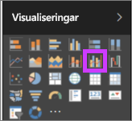
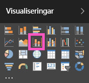

# Kombinationsdiagram i Power BI

I Power BI är ett kombinationsdiagram en enskild visualisering som kombinerar ett linjediagram med ett stapeldiagram. Om du kombinerar de två diagrammen till ett kan du göra en snabbare jämförelse av dina data.

Kombinationsdiagram kan ha en eller två Y-axlar.

## När du ska använda ett kombinationsdiagram

Kombinationsdiagram är ett bra alternativ:

* när du har ett linjediagram och ett kolumndiagram med samma X-axel

* för att jämföra flera mått med olika värdeintervall

* för att illustrera sambandet mellan två mätvärden i en visualisering

* för att kontrollera om ett mätvärde uppfyller det mål som definieras av ett annat mätvärde

* för att spara utrymme på arbetsytan.

## Förutsättningar

Kombinationsdiagram finns tillgängliga i Power BI-tjänsten och Power BI Desktop. De här självstudierna använder Power BI-tjänsten för att skapa ett kombinationsdiagram. Kontrollera att du har autentiseringsuppgifter för användare för att logga in till Power BI.

Se hur Will skapar ett kombinationsdiagram med exemplet på försäljning och marknadsföring.

<iframe width="560" height="315" src="https://www.youtube.com/embed/lnv66cTZ5ho?list=PL1N57mwBHtN0JFoKSR0n-tBkUJHeMP2cP" frameborder="0" allowfullscreen></iframe>  

## Skapa ett grundläggande kombinationsdiagram med en axel

Om du vill följa med, öppnar du Power BI-tjänsten och ansluter till **Exempel på detaljhandelsanalys**. Om du vill skapa ett eget kombinationsdiagram, loggar du in till Power BI-tjänsten och väljer **Hämta data** > **Exempel** > **Exempel på detaljhandelsanalys** > **Anslut**. Instrumentpanelen **Exempel på detaljhandelsanalys** visas.

1. Välj panelen **Totalt antal butiker** från instrumentpanelen ”Exempel på detaljhandelsanalys” för att öppna rapporten **Översikt över butiksförsäljning**.

1. Välj **Redigera rapport** för att öppna rapporten i redigeringsvyn.

1. Längst ned på sidan väljer du **+** för att lägga till en ny rapportsida.

1. Skapa ett kolumndiagram som visar årets försäljning och bruttomarginal per månad.

    1. Välj **Försäljning** \> **This Year Sales (Årets försäljning)**  > **Värde** i fönstret Fält.

    1. Dra **Försäljning** \> **Gross Margin This Year (Årets bruttomarginal)** till området **Värde**.

    1. Välj **Tid**\>**FiscalMonth (Räkenskapsmånad)** och lägg till det i området **Axel**.

        

1. Välj ellipsen i det övre högra hörnet av visualiseringen och välj **Sortera efter > FiscalMonth** (Räkenskapsmånad). Om du vill ändra sorteringsordningen väljer du ellipsen igen och väljer antingen **Sort ascending (Sortera stigande)** eller **Sort descending (Sortera fallande)** .

1. Konvertera stapeldiagrammet till ett kombinationsdiagram. Det finns två kombinationsdiagram: **Linjediagram och stående stapeldiagram** samt **Linjediagram och grupperat stående stapeldiagram**. Välj **Linje- och grupperat stapeldiagram** i fönstret **Visualiseringar** med stapeldiagrammet markerat.

    

1. Från panelen **Fält** drar du **Försäljning**  >  **Senaste årets försäljning** till området **Radvärden**.

    

    Kombinationsdiagrammet bör se ut ungefär så här:

    

## Skapa ett kombinationsdiagram med två axlar

I det här steget ska vi jämföra bruttomarginal och försäljning.

1. Skapa ett nytt linjediagram som spårar **Bruttomarginal förra året %** efter **Månad**. Välj ellipserna för att sortera efter **Month** (Månad) och **Ascending** (Stigande).

    

     I januari var bruttomarginal % 35 %, med en topp på 45 % i april som sjönk i juli och fick ytterligare en topp igen i augusti. Ser vi ett liknande mönster för försäljningen föregående år och det här året?

1. Lägg till **Försäljning detta år** > **Värde**och **Senaste årets försäljning** till linjediagrammet. Skalan för **Bruttomarginal förra året %** är mycket mindre än skalan för **Försäljning**. Det är svårt att jämföra.

    

1. Konvertera linjediagrammet till ett Linjediagram och stående stapeldiagram om du vill göra det visuella objektet lättare att läsa och tolka.

    

1. Dra **Gross Margin% Last Year (Bruttomarginal % förra året)** från **Kolumnvärde** till **Radvärden**. 

    

    Power BI skapar två axlar så att tjänsten kan skala datamängderna på olika sätt. Den vänstra mäter försäljningen i dollar och den högra procentandelen. Och vi ser svaret på vår fråga: Ja, vi ser ett liknande mönster.

## Lägga till rubriker på axlarna

1. Välj rollerikonen  för att öppna formateringsfönstret.

1. Välj nedpilen för att expandera alternativen för **y-axeln**.

1. För **Y-axel (kolumn)** , väljer du dessa alternativ:

    | Inställning | Värde |
    | ------- | ----- |
    | Position | Välj **Vänster**. |
    | Visningsenheter | Välj **Miljoner**. |
    | Rubrik | Flytta skjutreglaget till **På**. |
    | Stil | Välj **Visa enbart rubrik**. |
    | Visa sekundär | Flytta skjutreglaget till **På**.  Detta visar alternativ för att formatera linjediagramsdelen av kombinationsdiagrammet. |

1. För **Y-axel (rad)** , väljer du dessa alternativ:

    | Inställning | Värde |
    | ------- | ----- |
    | Position | Välj **Höger**. |
    | Rubrik | Flytta skjutreglaget till **På**. |
    | Stil | Välj **Visa enbart rubrik**. |

    Kombinationsdiagrammet visar nu dubbla axlar, båda med rubriker.

    

1. Du kan också ändra teckensnitt, storlek och färg och ställa in andra formateringsalternativ för att förbättra diagrammets visning och läsbarhet.

Härifrån kan du vilja:

* [lägga till kombinationsdiagrammet som en panel på instrumentpanelen](../service-dashboard-tiles.md),

* [Spara rapporten](../service-report-save.md).

* [göra rapporten mer lättillgänglig för personer med funktionshinder](../desktop-accessibility.md).

## Korsmarkering och korsfiltrering

Om du markerar en kolumn eller linje i ett kombinationsdiagram, korsmarkeras och korsfiltreras de övriga visualiseringarna på rapportsidan. Använd [visuella interaktioner](../service-reports-visual-interactions.md) för att ändra det här standardbeteendet.

## Nästa steg

[Ringdiagram i Power BI](power-bi-visualization-doughnut-charts.md)

[Visualiseringstyper i Power BI](power-bi-visualization-types-for-reports-and-q-and-a.md)