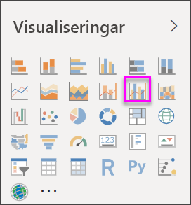
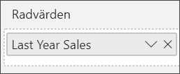
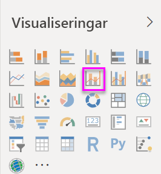
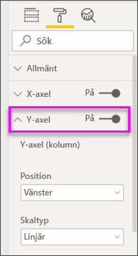
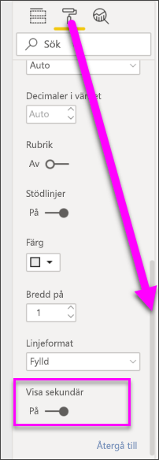

# Skapa och använda kombinationsdiagram i Power BI

[!INCLUDE [power-bi-visuals-desktop-banner](../includes/power-bi-visuals-desktop-banner.md)]

I Power BI är ett kombinationsdiagram en enskild visualisering som kombinerar ett linjediagram med ett stapeldiagram. Om du kombinerar de två diagrammen till ett kan du göra en snabbare jämförelse av dina data.

Kombinationsdiagram kan ha en eller två Y-axlar.

## När du ska använda ett kombinationsdiagram
Kombinationsdiagram är ett bra alternativ:

* när du har ett linjediagram och ett stapeldiagram med samma X-axel,
* för att jämföra flera mått med olika värdeintervall,
* för att illustrera sambandet mellan två mätvärden i en visualisering,
* för att kontrollera om ett mätvärde uppfyller det mål som definieras av ett annat mätvärde,
* för att spara utrymme på arbetsytan.

### Förutsättningar
De här självstudierna använder sig av [PBIX-filen Exempel på detaljhandelsanalys](https://download.microsoft.com/download/9/6/D/96DDC2FF-2568-491D-AAFA-AFDD6F763AE3/Retail%20Analysis%20Sample%20PBIX.pbix).

1. Välj **Arkiv** > **Öppna** uppe till vänster på menyraden
   
2. Leta reda på kopian av **PBIX-filen Exempel för detaljhandelsanalys**

1. Öppna **PBIX-filen Exempel för detaljhandelsanalys** i rapportvyn .

1. Välj  för att lägga till en ny sida.

## Skapa ett grundläggande kombinationsdiagram med en axel
Se hur Will skapar ett kombinationsdiagram med exemplet på försäljning och marknadsföring.
   > [!NOTE]
   > Den här videon använder en äldre version av Power BI Desktop.
   > 
   > 
<iframe width="560" height="315" src="https://www.youtube.com/embed/lnv66cTZ5ho?list=PL1N57mwBHtN0JFoKSR0n-tBkUJHeMP2cP" frameborder="0" allowfullscreen></iframe>  

1. Börja med en tom rapportsida och skapa ett stapeldiagram som visar årets försäljning och bruttomarginal per månad.

    a.  Välj **Försäljning** \> **This Year Sales (Årets försäljning)**  > **Värde** i fönstret Fält.

    b.  Dra **Försäljning** \> **Gross Margin This Year (Årets bruttomarginal)** till området **Värde**.

    c. Välj **Tid** \> **FiscalMonth** och lägg till det i **Axel**.

    
5. Välj **Fler alternativ** uppe till höger i visualiseringen och välj **Sortera efter > FiscalMonth** (Räkenskapsmånad). Om du vill ändra sorteringsordningen väljer du ellipsen igen och väljer antingen **Sort ascending (Sortera stigande)** eller **Sort descending (Sortera fallande)** . I det här exemplet väljer vi **Sortera stigande**.

6. Konvertera stapeldiagrammet till ett kombinationsdiagram. Det finns två kombinationsdiagram: **linjediagram och stående stapeldiagram** samt **linjediagram och grupperat stående stapeldiagram**. Välj **Linje- och grupperat stapeldiagram** i fönstret **Visualiseringar** med stapeldiagrammet markerat.

    
7. Från panelen **Fält** drar du **Försäljning** \> **Last Years Sales (Förra årets försäljning)** till behållaren **Radvärden**.

   

   Kombinationsdiagrammet bör se ut ungefär så här:

   

## Skapa ett kombinationsdiagram med två axlar
I det här steget ska vi jämföra bruttomarginal och försäljning.

1. Skapa ett nytt linjediagram som spårar **Bruttomarginal förra året %** efter **FiscalMonth** (Räkenskapsmånad). Välj ellipserna för att sortera efter **Month** (Månad) och **Ascending** (Stigande).  
I januari var bruttomarginal % 35 %, med en topp på 45 % i april som sjönk i juli och fick ytterligare en topp igen i augusti. Ser vi ett liknande mönster för försäljningen föregående år och det här året?

   
2. Lägg till **This Year Sales (Årets försäljning) > Värde** och **Last Years Sales (Förra årets försäljning)** till linjediagrammet. Skalan för **Bruttomarginal förra året %** är mycket mindre än skalan för **Försäljning** vilket gör det svårt att jämföra.      

   
3. Konvertera linjediagrammet till ett stående linje- och stapeldiagram om du vill göra det visuella objektet lättare att läsa och tolka.

   

4. Dra **Gross Margin% Last Year (Bruttomarginal % förra året)** från **Kolumnvärde** till **Radvärden**. Power BI skapar två axlar, vilket medför att datauppsättningarna kan skalas på olika sätt; den till vänster mäter dollar försäljning och den till höger procentandel. Svaret på frågan ovan är ja, vi ser ett liknande mönster.

       

## Lägga till rubriker på axlarna
1. Välj rollerikonen  för att öppna formateringsfönstret.
1. Välj nedpilen för att expandera alternativen för **y-axeln**.
1. För **Y-axel (kolumn)** anger du **Position** till **Vänster** och **Rubrik** till **På**,  **Format** till **Visa endast rubriken** och **Visa enheter** som **Miljoner**.

   
4. Under **Y-axel (kolumn)** bläddrar du ned tills du ser **Visa sekundär**. Eftersom det finns så många alternativ för Y-axlarna kan du behöva använda båda rullningslisterna. Avsnittet Visa sekundär visar alternativ för att formatera linjediagramdelen i kombinationsdiagrammet.

   
5. För **Y-axeln (rad)** lämnar du **Position** som **Höger**, ställer in **Rubrik** till **På** och ställer in **Format** på **Visa endast rubriken**.

   Kombinationsdiagrammet visar nu dubbla axlar, båda med rubriker.

   

6. Du kan också ändra teckensnitt, storlek och färg och ställa in andra formateringsalternativ för att förbättra visning och läsbarhet av diagrammet.

Härifrån kan du vilja:

* [lägga till kombinationsdiagrammet som en panel på instrumentpanelen](../service-dashboard-tiles.md),
* [Spara rapporten](../service-report-save.md).
* [göra rapporten mer lättillgänglig för personer med funktionshinder](../desktop-accessibility.md).

## Korsmarkering och korsfiltrering

Om du markerar en kolumn eller linje i ett kombinationsdiagram så korsmarkeras och korsfiltreras de övriga visualiseringarna på rapportsidan och vice versa. Använd [visuella interaktioner](../service-reports-visual-interactions.md) för att ändra det här standardbeteendet.

## Nästa steg

[Ringdiagram i Power BI](power-bi-visualization-doughnut-charts.md)

[Visualiseringstyper i Power BI](power-bi-visualization-types-for-reports-and-q-and-a.md)
