# Kopiera och klistra in en rapportvisualisering

[!INCLUDE[consumer-appliesto-yyyn](../includes/consumer-appliesto-yyyn.md)]

I den här artikeln beskrivs två olika sätt att kopiera och klistra in ett visuellt objekt. 
* kopiera ett visuellt objekt i en rapport och klistra in det på en annan rapportsida (kräver redigeringsbehörigheter för rapporten)

* kopiera en bild av ett visuellt objekt från Power BI till Urklipp och klistra in det i andra program

## Kopiera och klistra in i samma rapport
Visuella objekt i Power BI-rapporter kan kopieras från en sida i rapporten till samma sida eller en annan sida i samma rapport. 

Kopiering och inklistring av en visualisering kräver behörighet att redigera rapporten. I Power BI-tjänsten innebär detta att öppna rapporten i [redigeringsvyn](../consumer/end-user-reading-view.md). 

Visualiseringar på *instrumentpaneler* kan inte kopieras och klistras in i Power BI-rapporter eller på andra instrumentpaneler.

1. Öppna en rapport som har minst en visualisering.  

2. Välj visualiseringen och använd **Ctrl + C** för att kopiera och **Ctrl + V** för att klistra in.      

   

## Kopiera ett visuellt objekt som en bild till Urklipp

Har det hänt att du velat dela en bild från en Power BI-rapport eller en instrumentpanel? Nu kan du kopiera det visuella objektet och klistra in det i andra program som har stöd för inklistring. 

När du kopierar en statisk bild av ett visuellt objekt får du en kopia av det visuella objektet samt metadata. Det här omfattar:
* länk tillbaka till Power BI-rapporten eller instrumentpanelen
* rubrik för rapporten eller instrumentpanelen
* meddelande om bilden innehåller konfidentiell information
* tidstämpel för senaste uppdatering
* filter som tillämpas på det visuella objektet

### Kopia från en instrumentpanelsruta

1. Gå till den instrumentpanel som du vill kopiera från.

2. I det övre högra hörnet av det visuella objektet väljer du **Fler alternativ (...)** och sedan **Kopiera visuellt objekt som bild**. 

    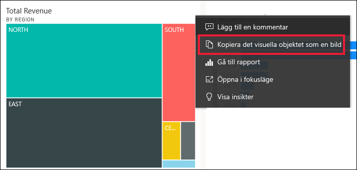

3. När dialogrutan **Ditt visuella objekt är redo att kopieras** visas väljer du **Kopiera till Urklipp**.

    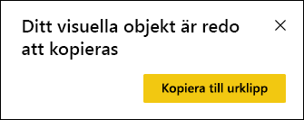

4. När det visuella objektet är redo klistrar du in det i ett annat program genom att trycka på **CTRL + V** eller högerklicka > Klistra in. I skärmbilden nedan har vi klistrat in det visuella objektet i Microsoft Word. 

    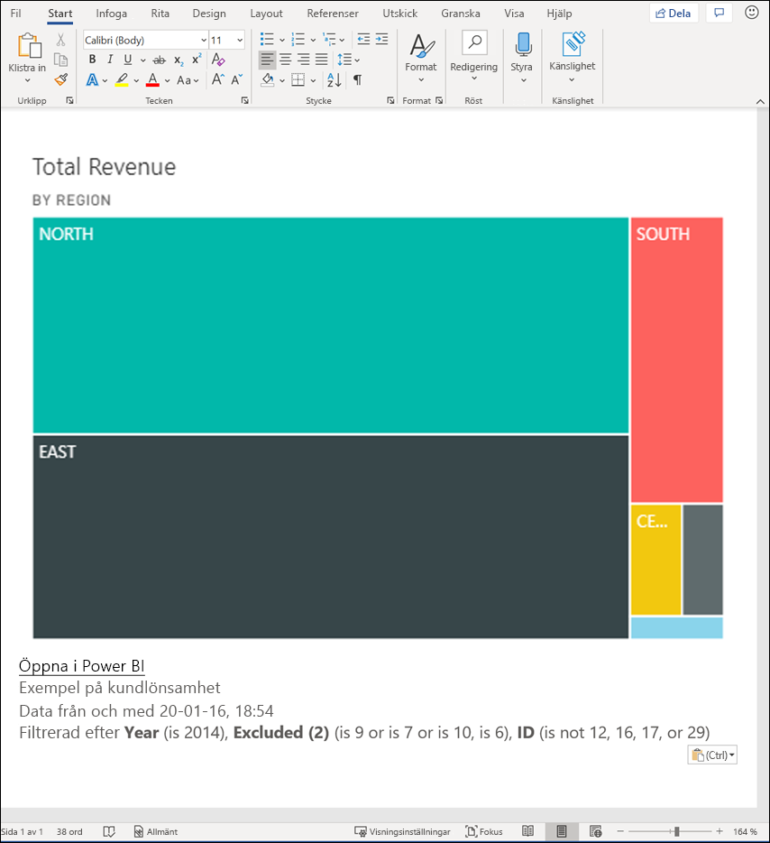

### Kopiera från ett visuellt rapportobjekt 

1. Gå till den rapport som du vill kopiera från.

2. I det övre högra hörnet av det visuella objektet väljer du ikonen för **Kopiera visuellt objekt som bild**. 

    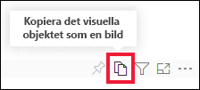

3. När dialogrutan **Ditt visuella objekt är redo att kopieras** visas väljer du **Kopiera till Urklipp**.

    

4. När det visuella objektet är redo klistrar du in det i ett annat program genom att trycka på **CTRL + V** eller högerklicka > Klistra in. I skärmbilden nedan har vi klistrat in det visuella objektet i ett e-postmeddelande.

    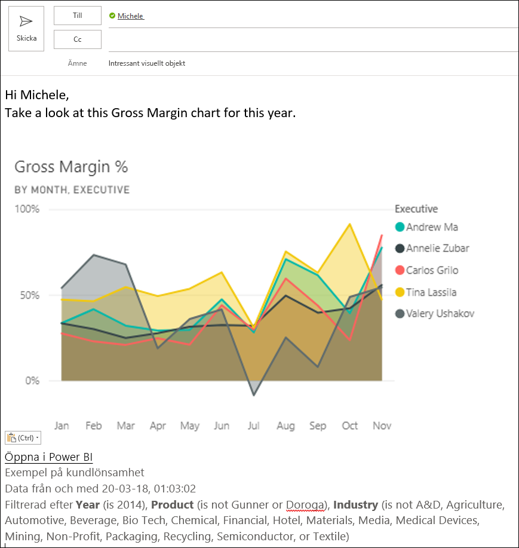

5. Om det finns en datakänslighetsetikett tillämpad på rapporten visas en varning när du väljer kopieringsikonen.  

    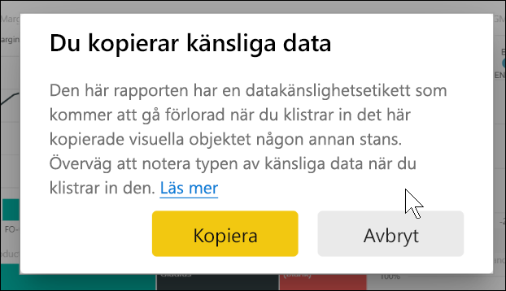

    Dessutom läggs en känslighetsetikett till i metadata nedanför det inklistrade visuella objektet. 

    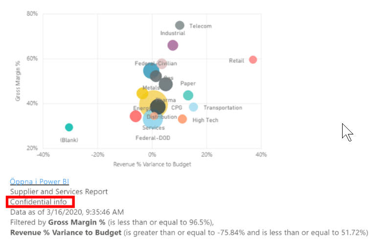

### Hantera användning av kopiering av ett visuellt objekt som en bild
Om du äger innehållet eller är administratör för klientorganisationen kan du kontrollera huruvida ett visuellt objekt kan kopieras som en bild från en rapport eller en instrumentpanel.

#### Inaktivera Kopiera som en bild för ett specifikt visuellt objekt
Om du inte vill att användare ska kunna kopiera ett specifikt visuellt objekt kan du ta bort kopieringsikonen från det visuella objektet.
1. Välj färgrollerikonen för att öppna formateringsfönstret. 

1. Öppna kortet **Visuell formatering**.
1. Rulla ned till **Sidhuvud för visuellt objekt**, expandera kortet och inaktivera **Kopieringsikon**.

    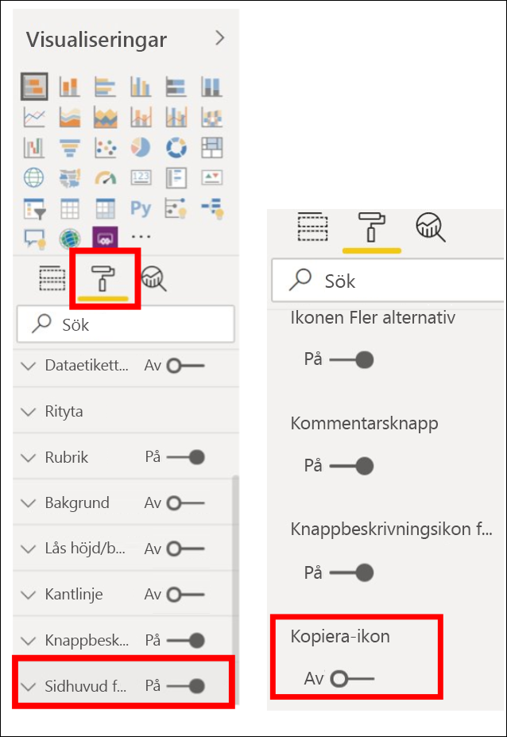

1. Om du inte hittar inställningen **Sidhuvud för visuellt objekt** aktiverar du alternativet för modernt sidhuvud för visuellt objekt under **Rapportinställningar**. 

    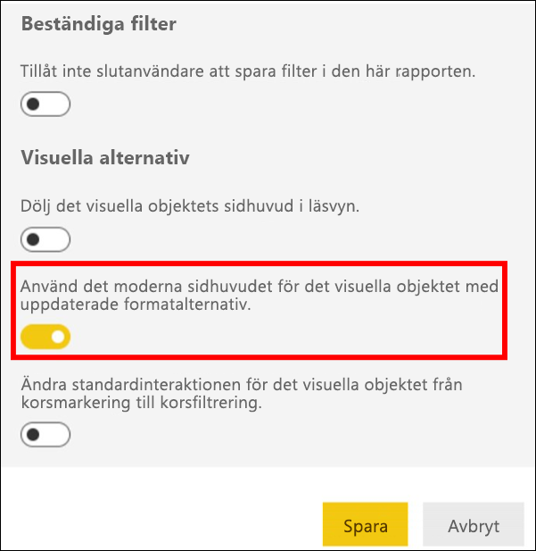

1. Spara ändringar. Dela igen och publicera igen efter behov.

#### Inaktivera Kopiera som en bild för en grupp med användare

Om du äger innehållet eller är administratör för klientorganisationen kan du kontrollera vem som kan kopiera visuella objekt. Den här inställningen inaktiverar *kopiera visuellt objekt som bild* för allt innehåll som användaren har åtkomst till i Power BI-klientorganisationen.
  
1. Gå till administratörsportalen.

1. Under **Klientorganisationsinställningar** väljer du **Inställningar för export och delning**. 

    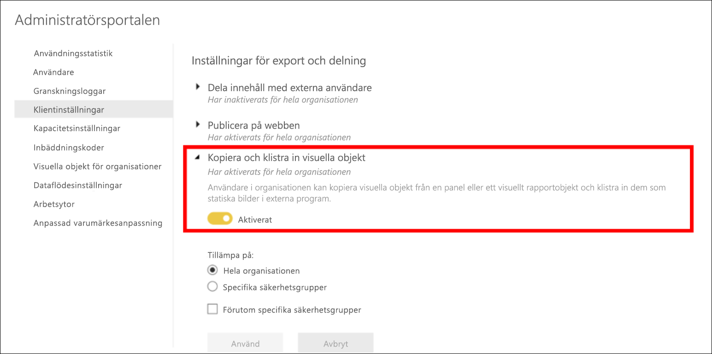

1. Inaktivera **Kopiera och klistra in visuella objekt** för de valda användargrupperna. 

1. Spara ändringar. De angivna grupperna kommer inte att kunna använda **Kopiera visuellt objekt som bild** i Power BI. 
  

## Överväganden och felsökning

   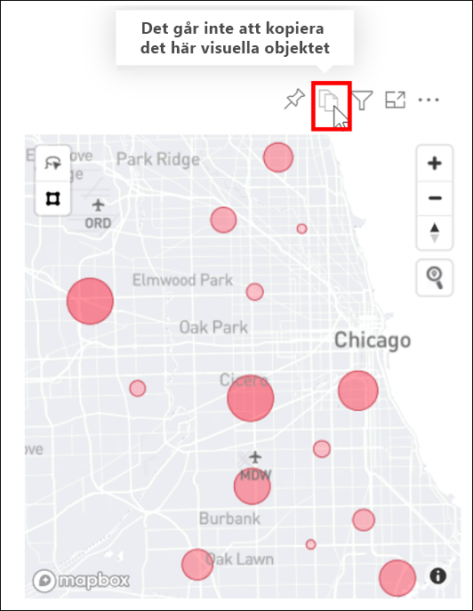

F: Varför är kopieringsikonen inaktiverad i ett visuellt objekt?    
S: Vi stöder för närvarande inbyggda visuella Power BI-objekt och certifierade visuella objekt. Det finns begränsat stöd för vissa visuella objekt, inklusive: 
- ESRI och andra kartvisualiseringar 
- Visuella Python-objekt 
- R-visualiseringar 
- PowerApps 
- Icke-certifierade anpassade visuella objekt Läs mer om hur ditt anpassade visuella objekt kan stödjas i [så certifierar du ditt anpassade visuella objekt](../developer/visuals/power-bi-custom-visuals-certified.md). 

F: Varför klistras mitt visuella objekt inte in på rätt sätt?    
S: Det finns begränsningar för kopiering av visuella objekt som en bild, inklusive: 
- För anpassade visuella objekt 
    - Visuella objekt med tillämpade teman och färger 
    - Panelskalning vid inklistring 
    - Anpassade visuella objekt med animeringar 
- Begränsningar av kopiering 
    - Det går inte att kopiera en nyligen fäst instrumentpanelsruta 
    - Det går inte att omdirigera användare till innehåll med OData-filter och fäststatus såsom personliga bokmärken 
- Program med begränsat stöd för inklistring av HTML-formaterat innehåll från Urklipp renderar kanske inte allt som kopierats från det visuella objektet 

## Nästa steg
Mer om [Visualiseringar i Power BI-rapporter](power-bi-report-visualizations.md)

Har du fler frågor? [Prova Power BI Community](https://community.powerbi.com/)

