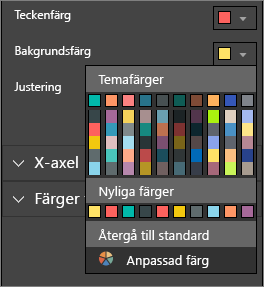
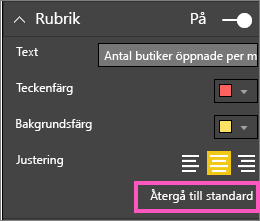
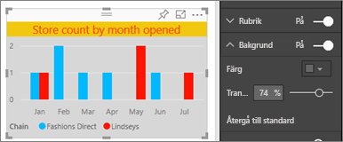
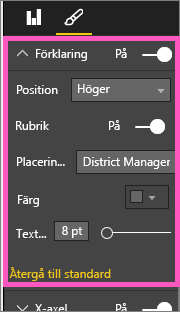

# Anpassa visualiseringens rubrik, bakgrund och förklaring

I de här självstudierna kommer du att få lära dig några olika metoder för att anpassa dina visualiseringar. Det finns många alternativ att välja mellan för att anpassa visualiseringar. Det bästa sättet att lära dig om alla är genom att utforska fönstret **Format** (välj rollerikonen). Om du vill komma igång visar i den här artikeln hur du anpassar en visualiserings rubrik, förklaring och bakgrund.

Du kan inte anpassa alla visualiseringar. Se den [fullständiga listan](#visualization-types-that-you-can-customize) över visualiseringar för mer information.

Spola framåt till 4:50 i videon för en demonstration av hur du anpassar visualiseringar:

<iframe width="560" height="315" src="https://www.youtube.com/embed/IkJda4O7oGs" frameborder="0" allowfullscreen></iframe>

Följ sedan instruktionerna nedan för att prova själv med dina egna data.

## Förutsättningar

- Power BI-tjänsten eller Power BI Desktop

- Rapporten Exempel på detaljhandelsanalys

## Anpassa visualiseringstitlar i rapporter

Om du vill följa med loggar du in till [Power BI-tjänsten](https://app.powerbi.com) och öppnar rapporten [Exempel på detaljhandelsanalys](../sample-datasets.md) i vyn [Redigera rapport](../service-interact-with-a-report-in-editing-view.md).

> [!NOTE]
> När du fäster en visualisering på en instrumentpanel blir den en panel på instrumentpanelen. Panelerna själva kan också anpassas med [nya rubriker, undertexter och hyperlänkar och du kan även ändra storleken](../service-dashboard-edit-tile.md).

1. Gå till sidan **Nya butiker** i rapporten **Exempel på detaljhandelsanalys**.

1. Välj det grupperade kolumndiagrammet **Antal öppna butiker efter öppningsmånad och kedja**.

1. I fönstret **Visualiseringar** väljer du rollerikonen för att visa formatalternativen.

1. Välj **Rubrik** att expandera avsnittet.

   

1. Flytta skjutreglaget för **Rubrik** till **På**.

   

1. Ändra rubriken genom att ange *Antal butiker efter öppningsmånad* i fältet **Rubriktext**.

1. Ändra **Teckenfärg** till orange och **Bakgrundsfärg** till gul.

    1. Välj listrutan och en färg från **Temafärger**, **Senaste färger** eller **Anpassad färg**.

        

    1. Välj i listrutan för att stänga färgfönstret.

       Spara de ändringar som du har gjort.

       Om du någon gång behöver återställa alla ändringarna, kan du återgå till standardfärgerna genom att välja **Återgå till standard** i färgfönstret.

1. Öka textstorleken till **12 punkter**.

1. Den sista anpassningen av diagramrubriken är att justera den så att den befinner sig i mitten av visualiseringen.

    

I det här steget i självstudierna ser rubriken till ditt grupperade kolumndiagram ut ungefär så här:

Spara de ändringar som du har gjort och gå vidare till nästa avsnitt.

Om du vill återställa alla anpassningar väljer du **Återgå till standard** längst ned i anpassningsfönstret för **Rubrik**.

## Anpassa visualiseringens bakgrund

Expandera alternativen för **Bakgrund** med samma grupperade kolumndiagram valt.

1. Flytta skjutreglaget för **Bakgrund** till **På**.

1. Välj en grå färg i listrutan.

1. Ändra **genomskinligheten** till **74 %** .

I det här steget i självstudierna ser bakgrunden till ditt grupperade kolumndiagram ut ungefär så här:

Spara de ändringar som du har gjort och gå vidare till nästa avsnitt.

Om du vill återställa alla ändringarna väljer du **Återgå till standard** längst ned i anpassningsfönstret för **Bakgrund**.

## Anpassa visualiseringens förklaringar

1. Öppna rapportsidan **Översikt** och välj diagrammet **Total försäljningsvarians efter FiscalMonth och distriktschef**.

1. På fliken **Visualisering** väljer du rollerikonen för att öppna formatfönstret.

1. Visa alternativen för **Förklaring**:

      

1. Flytta skjutreglaget för **Förklaring** till **På**.

1. Flytta förklaringen till vänster sida av visualiseringen.

1. Lägg till en förklaringsrubrik genom att ändra **Rubrik** till **På**.

1. Ange *Chefer* i fältet **Förklaringsnamn**.

I det här steget i självstudierna ser förklaringen till ditt grupperade kolumndiagram ut ungefär så här:

Spara de ändringar som du har gjort och gå vidare till nästa avsnitt.

Om du någonsin behöver återställa alla ändringarna väljer du **Återgå till standard** längst ned i anpassningsfönstret för **Förklaring**.

## Visualiseringstyper som kan anpassas

Här är en lista över visualiseringarna och vilka anpassningsalternativ som är tillgängliga för dem:

| Visualisering | Rubrik | Bakgrund | Förklaring |
|:--- |:--- |:--- |:--- |
| Område | ja | ja |ja |
| Stapel | ja | ja |ja |
| Kort | ja | ja |saknas |
| Flerradskort | ja | ja | saknas |
| Kolumn | ja | ja | ja |
| Kombination | ja | ja | ja |
| Ring | ja | ja | ja |
| Ifylld karta | ja | ja | ja |
| Tratt | ja | ja | saknas |
| Mätare | ja | ja | saknas |
| KPI | ja | ja | saknas |
| Linje | ja | ja | ja |
| Karta | ja | ja | ja |
| Matris | ja | ja | saknas |
| Cirkel | ja | ja | ja |
| Punkt | ja | ja | ja |
| Utsnitt | ja | ja | saknas |
| Tabell | ja | ja | saknas |
| Textruta | nej | ja | saknas |
| Trädkarta | ja | ja | ja |
| Vattenfall | ja | ja | ja |

## Nästa steg

- [Anpassa egenskaper för X-axel och Y-axel](power-bi-visualization-customize-x-axis-and-y-axis.md)

- [Komma igång med färgformatering och axelegenskaper](service-getting-started-with-color-formatting-and-axis-properties.md)

- [Grundläggande begrepp för Power BI-tjänstens användare](../consumer/end-user-basic-concepts.md)

Har du fler frågor? [Prova Power BI Community](https://community.powerbi.com/)
