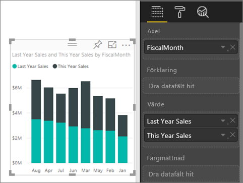
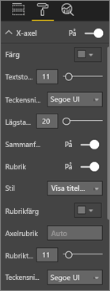
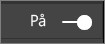
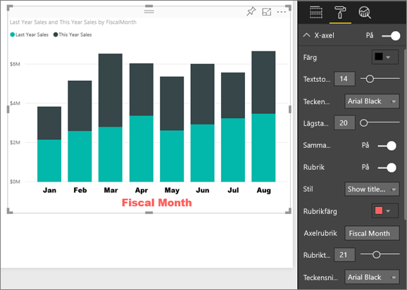
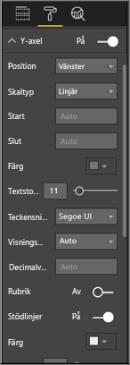
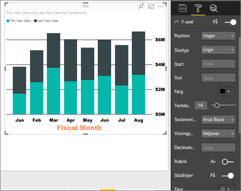
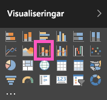
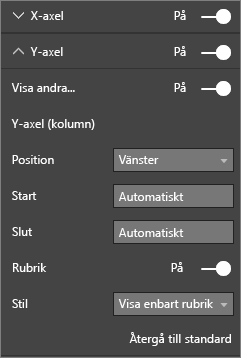

# Anpassa egenskaper för X-axeln och Y-axeln

I den här kursen lär du dig många olika sätt att anpassa X-axeln och Y-axeln i visuella objekt. Inte alla visuella objekt har axlar. Cirkeldiagram har till exempel inte axlar. Och anpassningsalternativen varierar från ett visuellt objekt till ett annat. Det finns alltför många alternativ för att vi ska kunna ta upp alla i en enda artikel, så vi tar en titt på några av de mest använda axelanpassningarna så att du kan vänja dig vid att använda panelen för **visuell formatering** i arbetsytan för Power BI-rapporter.  

> [!NOTE]
> Det här avsnittet gäller för både Power BI-tjänsten och Power BI Desktop. Dessa anpassningar, som är tillgängliga när **Format** (rollerikonen ) är markerad, är också tillgängliga i Power BI Desktop.

Se hur Amanda anpassar sina X- och Y-axlar. Hon kommer att demonstrera de olika sätten att styra sammanlänkning vid minskning och ökning av detaljnivån.

<iframe width="560" height="315" src="https://www.youtube.com/embed/9DeAKM4SNJM" frameborder="0" allowfullscreen></iframe>

## Förutsättningar

- Power BI-tjänsten

- Rapporten Exempel på detaljhandelsanalys

## Anpassa X- och Y-axlar för visualiseringar i rapporter

Om du vill följa med loggar du in till [Power BI-tjänsten](https://app.powerbi.com) och öppnar rapporten [Exempel på detaljhandelsanalys](../sample-datasets.md) i vyn [Redigera rapport](../service-interact-with-a-report-in-editing-view.md).

### Skapa en visualisering av ett staplat kolumndiagram

Du måste skapa din visualisering innan du kan anpassa den.

1. Visa **Min arbetsyta** i Power BI-tjänsten.

1. Bläddra nedåt och välj **Exempel på detaljhandelsanalys** från listan över **datamängder**.

1. På panelen **Visualiseringar** väljer du ikonen för staplat kolumndiagram.

    

1. Välj **Tid** > **FiscalMonth** (Räkenskapsmånad) för att ange X-axelns värden i fönstret **Fält**.

1. För att ställa in Y-axelvärdena på panelen **Fält**, väljer du **Försäljning** > **Senaste årets försäljning** och **Försäljning** > **Försäljning detta år** > **Värde**.

    

### Anpassa X-axeln

Nu kan du anpassa din X-axel.

1. I fönstret **Visualiseringar** väljer du **Format** (rollerikonen) ) för att visa anpassningsalternativen.

1. Alternativ för att expandera X-axlarna.

   

1. Flytta skjutreglaget för **X-axeln** till läget **På**.

    

    Du kanske vill inaktivera X-axeln för att spara utrymme för mer data.

1. Formatera textfärg, storlek och teckensnitt:

    - **Färg**: Välj svart

    - **Textstorlek**: Ange *14*

    - **Teckensnittsfamilj**: Välj **Arial Black**

1. Dra alternativet **Rubrik** till **På** för att visa namnet på X-axeln. I det här fallet är det **FiscalMonth** (Räkenskapsmånad).

1. Formatera rubrikens textfärg, storlek och teckensnitt:

    - **Rubrikfärg**: Välj orange

    - **Axelrubrik**: Ange *Räkenskapsmånad*

    - **Storlek för rubriktext** : Ange *21*

När du är klar med anpassningarna ser det staplade kolumndiagrammet ut ungefär så här:

Spara de ändringar som du har gjort och gå vidare till nästa avsnitt.

Om du vill återställa alla ändringar, väljer du **Återgå till standard** längst ned i anpassningsfönstret **X-axel**.

### Anpassa Y-axeln

Nu ska du anpassa Y-axeln.

1. Alternativ för att expandera Y-axeln.

   

1. Flytta skjutreglaget för **Y-axeln** till läget **På**.  

    

    Du kan vilja stänga av Y-axeln för att spara utrymme för mer data.

1. Ange Y-axelns **Position** som **Höger**.

1. Formatera textfärg, storlek och teckensnitt:

    - **Färg**: Välj svart

    - **Textstorlek**: Ange *14*

    - **Teckensnittsfamilj**: Välj **Arial Black**

1. Ställ in **Visningsenheter** på **Miljoner** och **Decimaler för värdet** på *0*.

1. För det här visuella objektet förbättras inte visualiseringen av en rubrik för Y-axeln, så vi **inaktiverar** **Rubrik**.  

1. Nu ska vi få stödlinjerna att stå ut genom att ändra färgen och öka bredden på dem:

    - **Färg**: Välj mörkgrå

    - **Linjebredd**: Ange *2*

Efter dessa anpassningar bör ditt stående stapeldiagram se ut ungefär så här:

## Anpassa visualiseringar med dubbla Y-axlar

Först måste du skapa ett kombinationsdiagram som visar hur antalet butiker påverkar försäljningen. Det här är samma diagram som har skapats i [självstudierna om kombinationsdiagram](power-bi-visualization-combo-chart.md). Sedan ska du formatera de två Y-axlarna.

### Skapa ett diagram med två Y-axlar

1. Skapa ett nytt linjediagram som spårar **Försäljning >Bruttomarginal %** förra året per **Tid > bokföringsmånad**.

    

    > [!NOTE]
    > För hjälp med att sortera efter månad, läs vidare under [Sortera med andra kriterier](../consumer/end-user-change-sort.md#other).

    I januari var bruttomarginalprocenten 35 % med en topp i april på 45 % varefter den sjönk i juli och nådde ytterligare en topp i augusti. Ser vi ett liknande mönster för försäljningen föregående år och det här året?

1. Lägg till **This Year Sales (Årets försäljning) > Värde** och **Last Years Sales (Förra årets försäljning)** till linjediagrammet.

    

    Skalan för **Bruttomarginal förra året i %** (den blå linjen som löper längs med stödlinjen för **0M %** ) är mycket mindre än skalan för **Försäljning**, vilket gör det svårt att jämföra. Och Y-axelns etikettprocenttal är märkliga.

1. Konvertera linjediagrammet till ett linje- och staplat kolumndiagram om du vill göra det visuella objektet lättare att läsa och tolka.

   

1. Dra **Gross Margin% Last Year (Bruttomarginal % förra året)** från **Kolumnvärde** till **Radvärden**.

    

    Nu har du det staplade kolumndiagram som du skapade i det första avsnittet med ett linjediagram lagt över det. Du kan också använda vad du lärde dig ovan för att formatera axlarnas teckenfärg och storlek.

   

   Power BI skapar två Y-axlar, vilket gör att datamängderna kan skalas på olika sätt. Den vänstra mäter försäljningen i dollar och den högra procentandelen.

### Formatera den sekundära Y-axeln

1. I fönstret **Visualiseringar** väljer du rollerikonen för att visa formatalternativen.

1. Alternativ för att expandera Y-axeln.

1. Rulla nedåt tills du hittar alternativet **Visa sekundär**. Kontrollera att det är **På**.

   

1. (Valfritt) Anpassa två axlar. Om du växlar **Position** för axelns kolumn eller radaxeln. Det går de två axlarna att växla sidor.

### Lägga till rubriker på axlarna

Med ett så komplicerat visuellt objekt hjälper det att lägga till axelrubriker.  Med rubriker blir det lättare för dina kollegor att förstå vad du försöker berätta med ditt visuella objekt.

1. Växla **Rubrik** till **På** för **Y-axeln (kolumn)** och **X-axeln (rad)** .

1. Ange **Stil** till **Visa enbart rubrik** för båda.

   

1. Kombinationsdiagrammet visar nu dubbla axlar, båda med rubriker.

   

Mer information finns i [Tips för färgformatering i Power BI](service-tips-and-tricks-for-color-formatting.md).

## Överväganden och felsökning

Om X-axeln kategoriseras av rapportägaren som av datumtyp, kommer alternativet **Typ** att visas och du kan välja mellan kontinuerlig eller kategorisk.

## Nästa steg

- [Visualiseringar i Power BI-rapporter](power-bi-report-visualizations.md)

- [Anpassa visualiseringens rubriker, bakgrunder och förklaringar](power-bi-visualization-customize-title-background-and-legend.md)

- [Komma igång med färgformatering och axelegenskaper](service-getting-started-with-color-formatting-and-axis-properties.md)

- [Grundläggande begrepp för Power BI-tjänstens användare](../consumer/end-user-basic-concepts.md)

Har du fler frågor? [Prova Power BI Community](http://community.powerbi.com/)
