# Anpassa egenskaper för X-axel och Y-axel

[!INCLUDE [power-bi-visuals-desktop-banner](../includes/power-bi-visuals-desktop-banner.md)]

I den här självstudien lär du dig flera olika sätt för att anpassa X-axeln och Y-axeln i visuella objekt. Inte alla visuella objekt har axlar. Cirkeldiagram har till exempel inte axlar. Och anpassningsalternativen varierar från ett visuellt objekt till ett annat. Det finns alltför många alternativ för att vi ska kunna ta upp alla i en enda artikel, så vi tar en titt på några av de mest använda anpassningarna så att du lär dig panelen för visuell **formatering** i Power BI-rapportarbetsytan.  

Se hur Amanda anpassar sina X- och Y-axlar. Hon kommer också att visa olika sätt att styra sammanlänkning på när man minskar eller ökar detaljnivån.

> [!NOTE]
> I den här videon används en äldre version av Power BI.

<iframe width="560" height="315" src="https://www.youtube.com/embed/9DeAKM4SNJM" frameborder="0" allowfullscreen></iframe>

## Förutsättningar

- Power BI Desktop

- [Exempel på detaljhandelsanalys ](https://download.microsoft.com/download/9/6/D/96DDC2FF-2568-491D-AAFA-AFDD6F763AE3/Retail%20Analysis%20Sample%20PBIX.pbix)

## Lägg till en ny visualisering

Du måste skapa din visualisering innan du kan anpassa den.

1. Öppna exemplet på detaljhandelsanalys i Power BI Desktop.  

2. Längst ned väljer du den gula plusikonen för att lägga till en ny sida. 

    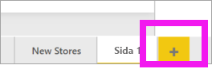

1. På panelen **Visualiseringar** väljer du ikonen för staplat kolumndiagram. En tom mall läggs till i din rapportarbetsyta.

    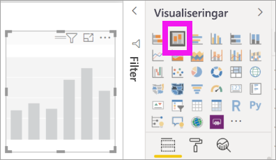

1. Ange X-axelns värden i fönstret **Fält** genom att välja **Tid** > **FiscalMonth**.

1. Ställ in Y-axelvärdena från fönstret **Fält** genom att välja **Försäljning** > **Fjolårets försäljning** och **Försäljning** > **Årets försäljning** > **Värde**.

    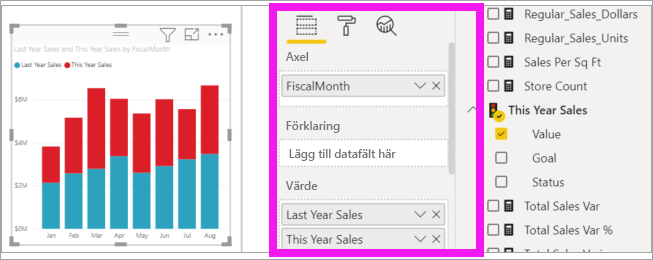

    Nu kan du anpassa din X-axel. Power BI ger dig nästan obegränsade alternativ för formatering av visualiseringen. 

## Anpassa X-axeln
Det finns många funktioner som kan anpassas för X-axeln. Du kan lägga till och ändra dataetiketterna och rubriken för X-axeln. I kategorierna kan du ändra bredd, storlek och utfyllnad för staplar, kolumner, rader och områden. För värden kan du också ändra visningsenheter, decimaler och stödlinjer. I följande exempel visas anpassningen av ett stapeldiagram. Nu ska vi lägga till några anpassningar för att visa dig alternativen och sedan kan du utforska resten på egen hand.

### Anpassa X-axelns etiketter
X-axelns etiketter visas under staplarna i diagrammet. Just nu är de ljusgrå, små och svåra att läsa. Vi ändrar det.

1. I fönstret **Visualiseringar** väljer du **Format** (rollerikonen)  ) för att se anpassningsalternativen.

2. Alternativ för att expandera X-axeln.

   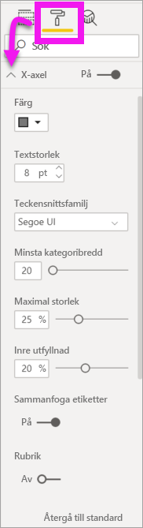

3. Flytta skjutreglaget för **X-axeln** till läget **På**.

    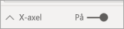

    Några orsaker till att du kanske vill ange **Av** för X-axeln, är om visualiseringen är självförklarande utan etiketter eller om du har en full rapportsida och behöver frigöra utrymme för att kunna visa mer data.

4. Formatera textfärg, storlek och teckensnitt:

    - **Färg**: Välj svart

    - **Textstorlek**: Ange *14*

    - **Teckensnittsfamilj**: Välj **Arial Black**

    - **Inre utfyllnad**: Ange *40 %*

        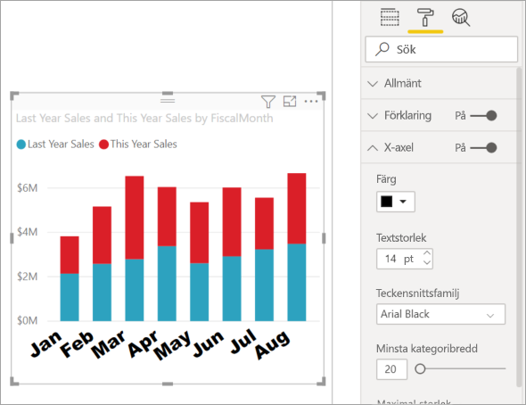
    
5. Du kanske inte tycker om att X-axelns text visas diagonalt. Det finns flera alternativ. 
    - Ändra textstorleken till något som är mindre än 14.
    - Gör visualiseringen större. 
    - Visa färre kolumner och lägg till en rullningslist genom att öka **Minsta kategoribredd**. 
    
    Här har vi valt det andra alternativet och drar i en av ramarna för att göra visualiseringen bredare. Nu får texten på 14 punkter plats utan att visas diagonalt eller med en rullningslist. 

   

### Anpassa X-axelns rubrik
När X-axelns rubrik är **På** visas den under etiketterna på X-axeln. 

1. Börja med att växla X-axelns rubrik till **På**.  

    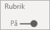

    Det första du ser är att visualiseringen nu har en standardrubrik på X-axeln.  I det här fallet är det **FiscalMonth** (Räkenskapsmånad).

   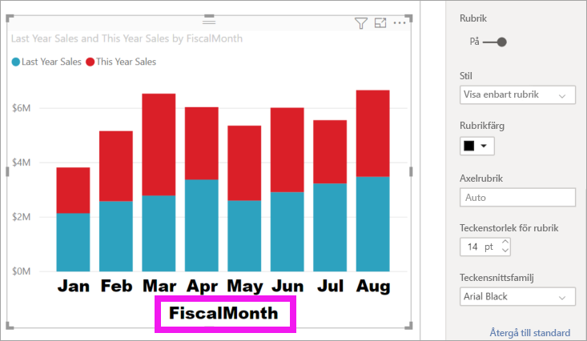

1. Formatera rubrikens textfärg, storlek och teckensnitt:

    - **Rubrikfärg**: Välj orange

    - **Axelrubrik**: Skriv *Räkenskapsmånad*

    - **Storlek för rubriktext**: Ange *18*

    När du är klar med anpassningarna ser det stående stapeldiagrammet ut ungefär så här:

    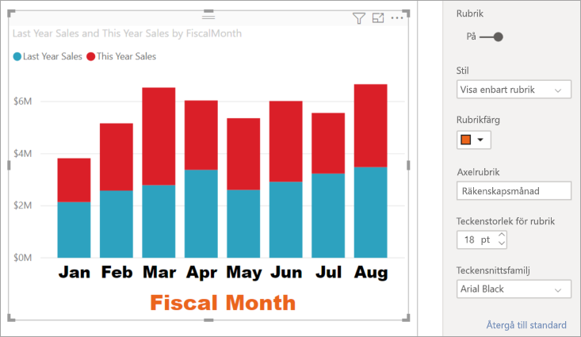

1. Spara de ändringar som du har gjort och gå vidare till nästa avsnitt. Om du vill återställa alla ändringar, väljer du **Återgå till standard** längst ned i anpassningsfönstret **X-axel**. Nu ska du anpassa Y-axeln.

## Anpassa Y-axeln
Det finns många funktioner som kan anpassas för Y-axeln. Du kan lägga till och ändra dataetiketterna, rubriken för Y-axeln och stödlinjerna. För värdena kan du även ändra visningsenheter, decimaler, startpunkt och slutpunkt. För kategorier kan du ändra bredd, storlek och utfyllnad för staplar, kolumner, rader och områden. 

I följande exempel fortsätter vi att anpassa ett stapeldiagram. Nu ska vi göra några ändringar för att visa dig alternativen och sedan kan du utforska resten på egen hand.

### Anpassa Y-axelns etiketter
Y-axelns etiketter visas till vänster som standard. Just nu är de ljusgrå, små och svåra att läsa. Vi ändrar det.

1. Alternativ för att expandera Y-axeln.

   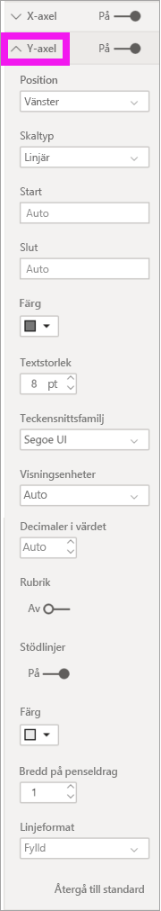

1. Flytta skjutreglaget för **Y-axeln** till läget **På**.  

    

    En orsak till att vilja stänga av Y-axeln är för att få plats med mer data.

1. Formatera textfärg, storlek och teckensnitt:

    - **Färg**: Välj svart

    - **Textstorlek**: Ange *10*

    - **Visningsenheter**: Välj **Miljoner**

    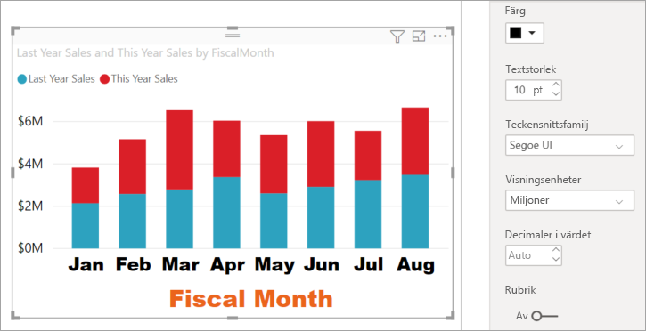

### Anpassa Y-axelns rubrik
När Y-axelns rubrik är **På** visas rubriken på Y-axeln bredvid etiketterna för Y-axeln. För det här visuella objektet förbättras inte visualiseringen av en rubrik för Y-axeln, så vi **inaktiverar** **Rubrik**. Vi kommer att lägga till Y-axelns rubriker i ett visuellt objekt med dubbla axlar senare i den här självstudien. 

### Anpassa stödlinjerna
Nu ska vi få stödlinjerna att stå ut genom att ändra färgen och öka bredden på dem:

- **Färg**: Välj orange

- **Linjebredd**: Ange *2*

Efter dessa anpassningar bör ditt stående stapeldiagram se ut ungefär så här:

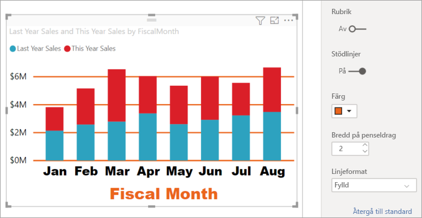

## Anpassa visualiseringar med dubbla Y-axlar

Vissa visualiseringar kan bli bättre med två Y-axlar. Kombinationsdiagram är ett bra exempel på detta. Innan vi kan formatera dubbla Y-axlar, skapar vi ett kombinationsdiagram som jämför trender för försäljning och bruttomarginal.  

### Skapa ett diagram med två Y-axlar

1. Välj stapeldiagrammet och ändra det till ett *Linjediagram och stående stapeldiagram*. Den här typen av visualisering har stöd för ett enda linjediagramsvärde och flera staplade kolumnvärden. 

    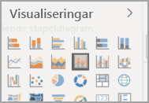
   

2. Dra **Försäljning** > **Bruttomarginal förra året i %** från fönstret Fält till bucketen **Radvärden**.

    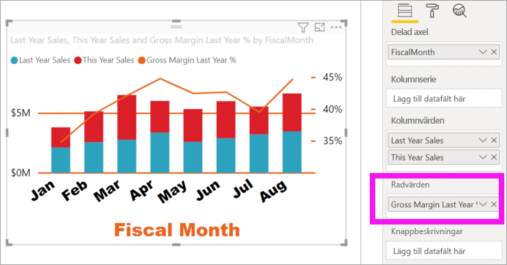

    
3. Formatera om visualiseringen för att ta bort de vinklade etiketterna på X-axeln. 

   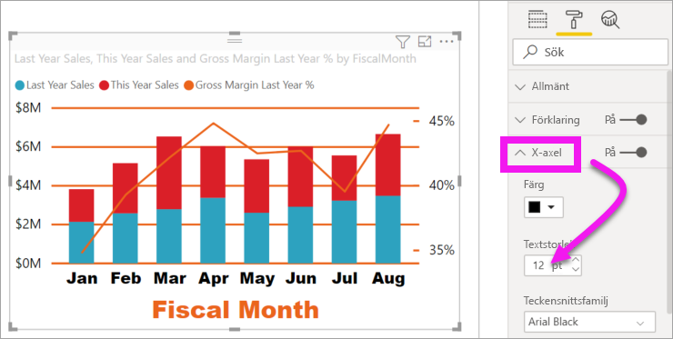

   Power BI skapar två Y-axlar, vilket gör att värdena kan skalas på olika sätt. Den vänstra axeln mäter försäljningen i dollar och den högra procentandelen av bruttomarginalen.

### Formatera den andra Y-axeln
Eftersom vi började med en visualisering med en formaterad Y-axel, skapade Power BI den andra Y-axeln med samma inställningar. Men vi kan ändra det. 

1. I fönstret **Visualiseringar** väljer du rollerikonen för att visa formatalternativen.

1. Alternativ för att expandera Y-axeln.

1. Rulla nedåt tills du hittar alternativet **Visa sekundär**. Kontrollera att det är **På**. Vår andra Y-axel motsvarar linjediagrammet.

   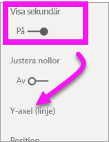

1. (Valfritt) Anpassa teckenfärg, storlek och visningsenheter för de två axlarna. Om du växlar **Position** för axelns kolumn eller radaxeln. Det går de två axlarna att växla sidor.

### Lägga till rubriker på axlarna

I en så komplicerad visualisering underlättar det med axelrubriker.  Med titlar kan dina kollegor förstå vad ditt visuella objekt försöker berätta.

1. Växla **Rubrik** till **På** för **Y-axeln (kolumn)** och **X-axeln (rad)** .

1. Ange **Stil** till **Visa enbart rubrik** för båda.

   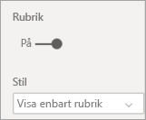

1. Kombinationsdiagrammet visar nu dubbla axlar, båda med rubriker.

   

1. Formatera rubrikerna. I det här exemplet har vi förkortat en av rubrikerna och minskat teckenstorleken för båda. 
    - Teckenstorlek: **9**
    - **Axelrubriken** för den första Y-axeln (stapeldiagrammet) har förkortats: Fjolårets och årets försäljning

    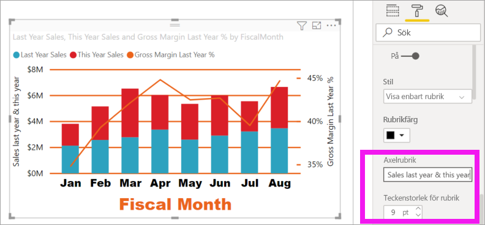

Mer information finns i [Tips för färgformatering i Power BI](service-tips-and-tricks-for-color-formatting.md) och [Anpassa visualiseringens rubrik, bakgrund och förklaring](power-bi-visualization-customize-title-background-and-legend.md). Håll utkik efter nya uppdateringar av rubrikformatering som kommer snart. 

## Nästa steg

- [Visualiseringar i Power BI-rapporter](power-bi-report-visualizations.md)

Har du fler frågor? [Prova Power BI Community](https://community.powerbi.com/)
