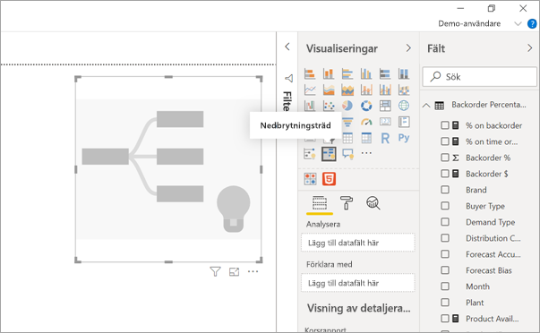
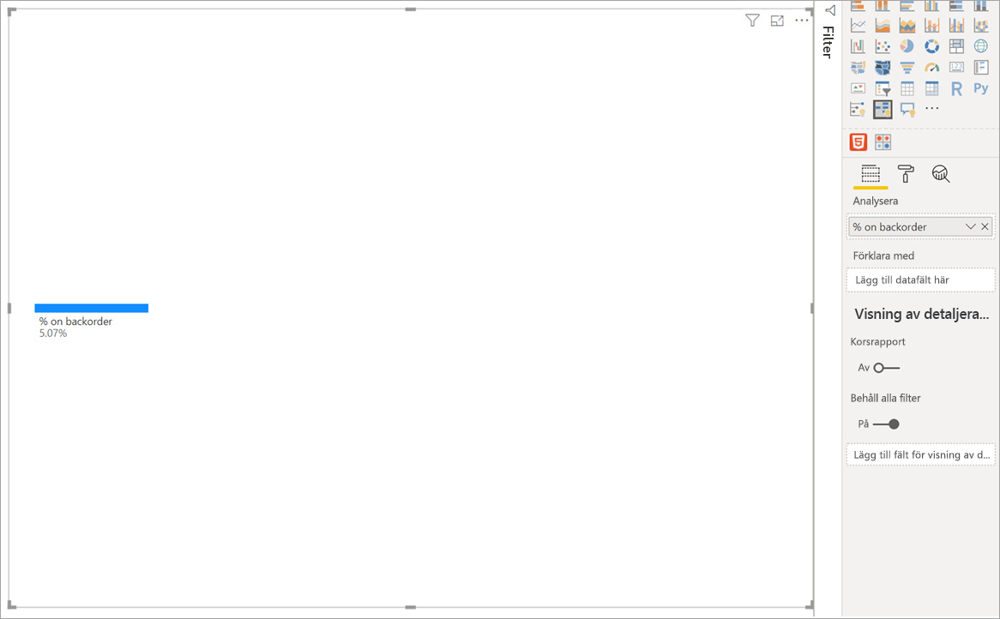
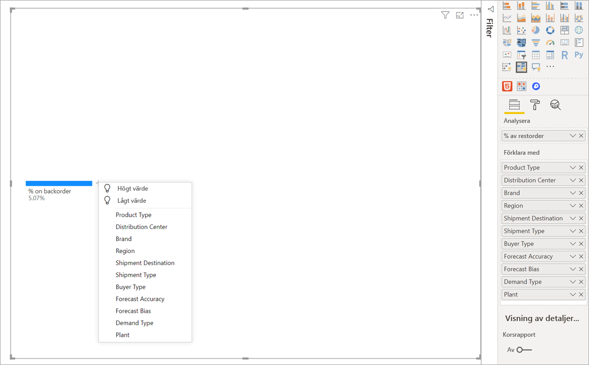
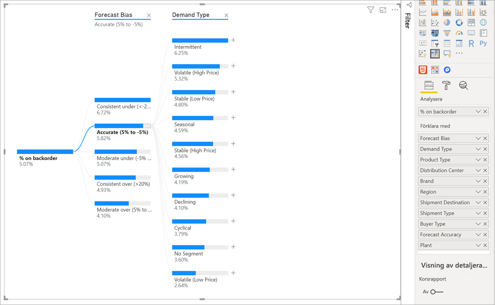
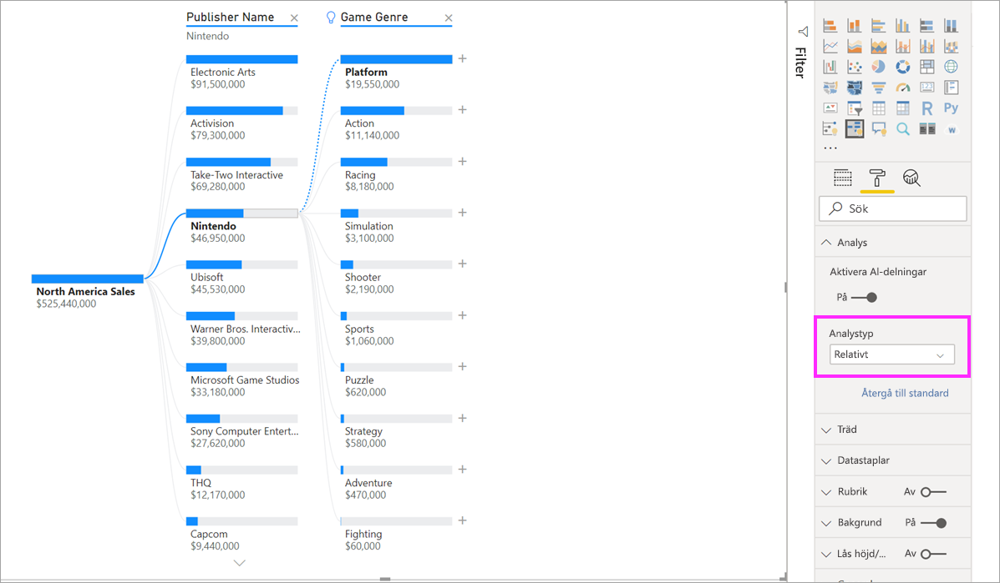
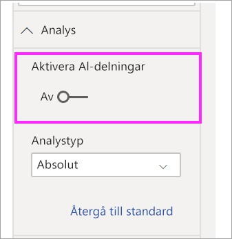

# Skapa och visa det visuella objektet för nedbrytningsträd i Power BI (förhandsversion)
[!INCLUDE [power-bi-visuals-desktop-banner](../includes/power-bi-visuals-desktop-banner.md)]

I det visuella objekt för nedbrytningsträd i Power BI kan du visualisera data i flera dimensioner. Data sammanställs automatiskt och du kan öka detaljnivån i dimensionerna i valfri ordning. Det är också en AI-visualisering (artificiell intelligens), så du kan be den hitta nästa dimension som du vill öka detaljnivån för utifrån vissa kriterier. Detta gör det till ett värdefullt verktyg för ad hoc-utforskning och för att genomföra rotorsaksanalyser.

I den här självstudien används två exempel:

- Ett scenario med en leveranskedja som analyserar procentandelen produkter som ett företag har som restorder (slut i lager).  
- Ett försäljningsscenario som delar upp videospelsförsäljning efter olika faktorer som spelgenre och utgivare.

## Kom igång
Välj ikonen för nedbrytningsträd i fönstret Visualiseringar.

Visualiseringen kräver två typer av indata.

**Analysera** – Måttet som du vill analysera. Detta måste vara ett mått eller ett aggregat.  
**Förklara med** – En eller flera dimensioner som du vill öka detaljnivån för.

När du har dragit ditt mått till fältkällan visar uppdateringen av det visuella objektet det aggregerade måttet. I exemplet nedan visualiserar vi genomsnittet i % för produkterna på restorder (5,07 %) 

Nästa steg är att ta med en eller flera dimensioner som du vill öka detaljnivån för. Lägg till dessa fält i bucketen **Förklara med**. Lägg märke till att ett plustecken visas bredvid rotnoden. Om du väljer + kan du välja vilket fält du vill detaljgranska i (du kan öka detaljnivån för fälten i valfri ordning).

Om du väljer **Prognosens bias** expanderas trädet och måttet delas upp i kolumnens värden. Den här processen upprepas om du väljer en annan nod.

Om du väljer en nod på den sista nivån korsfiltreras datan. Om du väljer en nod från en tidigare nivå ändras sökvägen.

Om du interagerar med andra visuella objekt korsfiltreras nedbrytningsträdet. Ordningen för noderna på de olika nivåerna kan komma att ändras till följd av detta.
I exemplet nedan har vi korsfiltrerat trädet med Ubisoft. Sökvägen uppdateras och Xbox-försäljningen flyttas från första till andra plats, där den passeras av PlayStation. 

Om vi sedan korsfiltrerar trädet med Nintendo, är Xbox-försäljningen tom eftersom det inte finns några Nintendo-spel utvecklade för Xbox. Xbox, tillsammans med den efterföljande sökvägen, filtreras bort från vyn.

Trots att sökvägen försvinner, förblir de befintliga nivåerna (i det här fallet Spelgenre) fastsatta i trädet. Om Nintendo-noden väljs expanderas därför trädet automatiskt till Spelgenre.

## AI-delningar

Du kan använda ”AI-delningar” om du behöver hjälp med vad du ska titta efter härnäst i dina data. Dessa delningar visas överst i listan och är markerade med en glödlampa. Delningarna kan hjälpa dig att hitta höga och låga värden i datan automatiskt.

Analysen kan fungera på två sätt beroende på dina inställningar. Standardbeteendet är följande:

**Högt värde**: Tar hänsyn till alla tillgängliga fält och bestämmer vilka som ska genomsökas för att kunna hämta det högsta värdet för måttet som analyseras.  
**Lågt värde**: Tar hänsyn till alla tillgängliga fält och bestämmer vilka som ska genomsökas för att kunna hämta det lägsta värdet för måttet som analyseras.  

Om du väljer **Högt värde** i restorderexemplet får du följande resultat: 

En glödlampa visas bredvid **Produkttyp** och anger att detta är en ” AI-delning”. Trädet visar också en prickad linje som rekommenderar noden **Patientövervakning**, eftersom den innehåller det högsta värdet med restordrar (9,2 %). 

Hovra över glödlampan för att se en knappbeskrivning. I det här exemplet är knappbeskrivningen ”% av restorder är högst när produkttypen är Patientövervakning”.

Du kan konfigurera att det visuella objektet söker **Relativa** AI-delningar i stället för **Absoluta**. 

Det relativa läget söker efter höga värden som utmärker sig (jämfört med resten av datan i kolumnen). Vi illustrerar detta med ett exempel: 

I skärmbilden ovan tittar vi på Nordamerikas försäljning av videospel. Först delar vi upp trädet efter **Utgivarnamn** och söker sedan i Nintendo. Om vi väljer **Högt värde** expanderas **Plattformen är Nintendo**. Eftersom Nintendo (utgivaren) bara utvecklar spel för Nintendo-konsoler finns det bara ett värde som är tillgängligt och som därför är det högsta värdet.

En mer intressant delning skulle dock vara att se vilket högt värde som utmärker sig jämfört med andra värden i samma kolumn. Om vi ändrar analystypen från **Absolut** till **Relativ** får vi följande resultat för Nintendo: 

Den här gången är det rekommenderade värdet **Plattform i Spelgenre**.  Plattformen visar inte något högre absolut värde än Nintendo (19 950 000 USD jämfört med 46 950 000 USD). Det är dock ett värde som utmärker sig.

Eftersom det finns 10 värden i Spelgenre, skulle det förväntade värdet för Plattform vara 4,6 miljoner USD om de var jämnt fördelade. Men Plattform har ett värde på nästan 20 miljoner USD, vilket är ett intressant resultat eftersom det är fyra gånger högre än det förväntade resultatet.

Beräkningen är följande:

Nordamerikas försäljning för Plattform/ Abs(Avg(Nordamerikas försäljning för Spelgenre))  
jämfört med  
Nordamerikas försäljning för Nintendo / Abs(Avg(Nordamerikas försäljning för Plattform))  

Vilket blir:

19 550 000 / (19 550 000 + 11 140 000 + ... + 470 000 + 60 000 /10) = 4,25x  
jämfört med  
46 950 000/ (46 950 000/1) = 1x  

Om du föredrar att inte använda några AI-delningar i trädet, kan du välja att inaktivera dem under alternativen för **Analysformatering**:  

## Trädinteraktioner med AI-delningar

Du kan ha flera efterföljande AI-nivåer. Du kan också blanda olika typer av AI-nivåer (gå från Högt värde till Lågt värde och tillbaka till Högt värde): 

Om du väljer en annan nod i trädet räknas AI-delningen om från början. I exemplet nedan ändrade vi den valda noden i nivån **Prognosens bias**. De efterföljande nivåerna ändras till korrekta höga och låga värden 

AI-nivåer räknas också om när du korsfiltrerar nedbrytningsträdet med ett annat visuellt objekt. I exemplet nedan kan vi se att vår restorder-% är störst för Fabrik 0477.

Men om vi väljer **April** i stapeldiagrammet, är de största ändringarna i **Produkttyp Avancerad kirurgi**. I det här fallet är det inte bara de noder som har sorterats om, utan en helt annan kolumn har valts. 

Om du vill att AI-nivåer ska fungera som icke-AI-nivåer, väljer du glödlampan för att återställa beteendet till standard. 

Flera AI-nivåer kan sammanfogas, men en icke-AI-nivå kan inte följa en AI-nivå. Om vi gör en manuell delning efter en AI-delning, försvinner glödlampan från AI-nivån och nivån omvandlas till en normal nivå. 

## Låsning

En innehållsskapare kan låsa nivåer för rapportanvändarna. När en nivå är låst kan den inte tas bort eller ändras. Användarna kan utforska olika sökvägar på den låsta nivån, men de kan inte ändra själva nivån. Som skapare kan du hovra över befintliga nivåer för att se låsikonen. Du kan låsa så många nivåer du vill, men du kan inte ha upplåsta nivåer före låsta nivåer.

I exemplet nedan är de två första nivåerna låsta. Det innebär att rapportanvändarna kan ändra nivå 3 och 4, och till och med lägga till nya nivåer efter dem. De första två nivåerna kan dock inte ändras:

## Kända begränsningar

Det maximala antalet nivåer för trädet är 50. Det maximala antalet datapunkter som kan visualiseras samtidigt i trädet är 5 000. Vi trunkerar nivåerna så att vi ser de n översta. För närvarande är n översta per nivå inställt på 10. 

Nedbrytningsträd stöds inte i följande scenarier:  
-   Lokal Analysis Services

AI-delningar stöds inte i följande scenarier:  
-   Azure Analysis Services
-   Direct Query
-   Power BI-rapportserver
-   Publicera på webben
-   Komplexa mått och mått från tilläggsscheman i ”Analysera”

Andra begränsningar i förhandsversionen:
- Power BI Mobile  
- Fästa på instrumentpanelen
- Visa datafunktioner
- Support i Frågor och svar

## Nästa steg

[Ringdiagram i Power BI](power-bi-visualization-doughnut-charts.md)

[Visualiseringar i Power BI](power-bi-report-visualizations.md)

