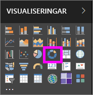
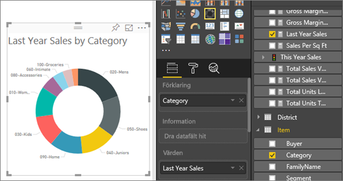

# Ringdiagram i Power BI
Ett ringdiagram liknar ett cirkeldiagram såtillvida att det visar förhållandet mellan delarna och helheten. Den enda skillnaden är att mitten är tom och har utrymme för en etikett eller ikon.

## Skapa ett ringdiagram
De här anvisningarna använder exemplet på detaljhandelsanalys för att skapa ett cirkeldiagram som visar försäljning detta år efter kategori. Om du vill följa med kan du [hämta exemplet](../sample-datasets.md) för Power BI-tjänsten eller Power BI Desktop.

1. Börja med en tom rapportsida. Om du inte använder Power BI-tjänsten, se till att du öppnar rapporten i [Redigeringsvyn](../service-interact-with-a-report-in-editing-view.md).

2. I Fält-panelen, väljer du **Försäljning** \> **Senaste årets försäljning**.  
   
3. I fönstret visualiseringar, väljer du ikonen för cirkeldiagrammet  för att konvertera ditt stapeldiagram till ett cirkeldiagram. Om **Fjolårets försäljning** inte är i **Värden**-området, drar du det dit.
     
   

4. Välj **Objekt** \> **Kategori** för att lägga till den i området **Förklaring**. 
     
    

5. Du kan också [justera storlek och färg för diagramtexten](power-bi-visualization-customize-title-background-and-legend.md). 

## Överväganden och felsökning
* Summan av ringdiagrammets värden måste uppgå till 100 %.
* För många kategorier gör det svårt att läsa och tolka översikten.
* Ringdiagram är bättre för att jämföra en särskild sektion med helheten än för att jämföra enskilda sektioner med varandra. 

## Nästa steg
[Trattdiagram i Power BI](power-bi-visualization-funnel-charts.md)

[Visualiseringstyper i Power BI](power-bi-visualization-types-for-reports-and-q-and-a.md)

