# Exportera data som används för att skapa en visualisering

> [!IMPORTANT]
> Inte alla data kan visas eller exporteras av alla användare. Det finns skyddsmekanismer som rapportutvecklare och administratörer använder när de skapar instrumentpaneler och rapporter. Vissa data är begränsade, dolda eller konfidentiella och kan inte visas eller exporteras utan särskilda behörigheter. 

## Vem kan exportera data

Om du har behörighet till data kan du se och exportera de data som Power BI använder för att skapa en visualisering. Data är ofta konfidentiella eller begränsade till vissa användare. I dessa fall kommer du inte att kunna se eller exportera dessa data. Mer information finns i avsnittet **Begränsningar och överväganden** i slutet av det här dokumentet. 

## Visa och exportera data

Om du vill se de data som Power BI använder för att skapa en visualisering, [kan du visa dessa data i Power BI](service-reports-show-data.md). Du kan också exportera dessa data till Excel som en *.xlsx*- eller *.csv-fil*. Alternativet för att exportera data kräver en Pro- eller Premium-licens samt redigeringsbehörigheter för datamängden och rapporten. <!--If you have access to the dashboard or report but the data is classified as *highly confidential*, Power BI will not allow you to export the data.-->

Här kan du se Will exportera data från en visualisering i sin rapport, spara den som *.xlsx-fil* och öppna den i Excel. Prova sedan själv genom att följa de stegvisa anvisningarna under videon. Observera att en äldre version av Power BI används i den här videon.

<iframe width="560" height="315" src="https://www.youtube.com/embed/KjheMTGjDXw" frameborder="0" allowfullscreen></iframe>

## Exportera data från en Power BI-instrumentpanel

1. Välj Fler åtgärder (...) i det övre högra hörnet i visualiseringen.

    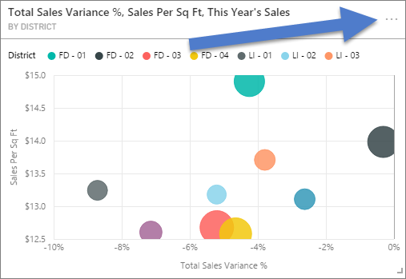

1. Välj alternativet **Exportera till .csv**.

    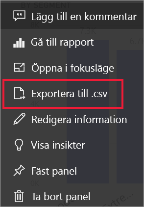

1. Power BI exporterar aktuella data till en *.csv-fil*. Om du har filtrerat visualiseringen filtreras även .csv-exporten. 

1. Din webbläsare uppmanar dig att spara filen.  När du har sparat *.csv-filen*, öppnar du den i Excel.

    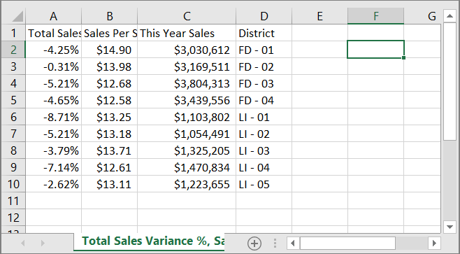

## Exportera data från en rapport

Om du vill följa med kan du öppna [exempelrapporten för anskaffningsanalys](../sample-procurement.md) i redigeringsvyn i Power BI-tjänsten. Lägg till en ny tom rapportsida. Följ sedan stegen nedan för att lägga till en sammansättning, en hierarki och ett filter på visualiseringsnivå.

### Skapa ett staplat kolumndiagram

1. Skapa ett nytt**staplat kolumndiagram**.

    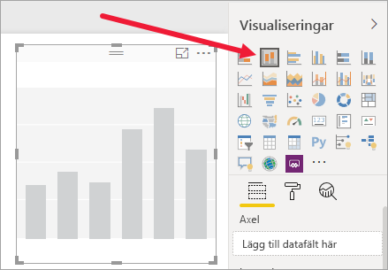

1. I fönstret **Fält** väljer du **Plats > Stad**, **Plats > Land/region** och **Faktura > Rabattprocent**.  Du kan behöva flytta **Rabattprocent** till området **Värde**.

    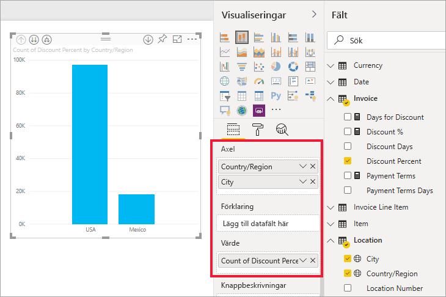

1. Ändra sammanställningen för **Rabattprocent** från **Antal** till **Medelvärde**. I området **Värde** väljer du pilen till höger om **Rabattprocent** (det kan stå **Mängd rabattprocent**) och sedan **Medelvärde**.

    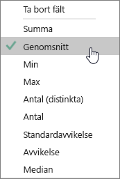

1. Lägg till ett filter till **Stad**, välj alla städer och ta sedan bort **Atlanta**.

    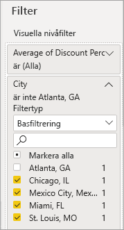

   
1. Öka detaljnivån en nivå nedåt i hierarkin. Aktivera ökad detaljnivå och öka detaljnivån till nivån **Stad**. 

    

Vi är nu redo att testa båda alternativen för dataexport.

### Exportera ***sammanfattade*** data
Välj alternativet för **Sammanfattade data** om du vill exportera data för det som visas i visualiseringen.  Den här typen av export visar bara de data (kolumner och mått) som används för att skapa det visuella objektet.  Om visualiseringen har en aggregering exporterar du aggregerade data. Om du till exempel har ett stapeldiagram med fyra staplar får du fyra rader med Excel-data. Sammanfattade data är tillgängliga i Power BI-tjänsten som *.xlsx* och *.csv* samt i Power BI Desktop som .csv.

1. Välj ellipsen i det övre högra hörnet av visualiseringen. Välj **Exportera data**.

    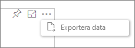

    Eftersom visualiseringen har ett aggregat (du ändrade **Antal** till *genomsnitt*) har du två alternativ i Power BI-tjänsten:

    - **Sammanfattade data**

    - **Underliggande data**

    För mer information om att förstå mängder kan du läsa [Mängder i Power BI](../service-aggregates.md).

    > [!NOTE]
    > I Power BI Desktop har du endast alternativet att exportera sammanfattade data som en .csv-fil. 
    
    
1. För **Exportera data** väljer du **Sammanfattade data** och antingen *.xlsx* eller *.csv* och sedan **Exportera**. Power BI exporterar data.

    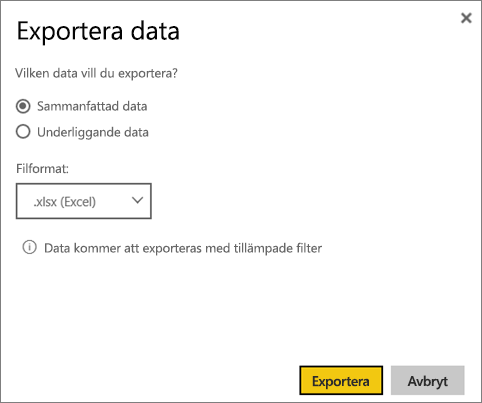

1. När du väljer **Exportera** får du ett meddelande om att spara filten från webbläsaren. Öppna filen i Excel när du har sparat den.

    

    I det här exemplet visar vår Excel-export en summa för varje ort. Atlanta ingår inte i resultaten eftersom vi har filtrerat bort det. Den första raden i vårt kalkylblad visar de filter som Power BI använde vid extraheringen av data.
    
    - Alla data som används av hierarkin exporteras, inte bara de data som används för den aktuella detaljnivån för det visuella objektet. Till exempel hade vi ökat detaljnivån ned till stadsnivå, men vår export innehåller även landsdata.  

    - Våra exporterade data aggregeras. Vi får en totalsumma, en rad, för varje stad.

    - Eftersom vi tillämpade filter på visualiseringen exporteras data enligt filtret. Observera att den första raden visar **Applied filters: City is not Atlanta, GA** (Tillämpade filter: Stad är inte Atlanta, GA). 

### Exportera ***underliggande*** data

Välj det här alternativet om du vill se data i det visuella objektet ***och*** ytterligare data från datamängden (mer information finns i diagrammet nedan). Om din visualisering har en aggregering tas den bort om du väljer **Underliggande data**. I det här exemplet visar Excel-exporten en rad för varje Stadsrad i vår datamängd och rabattprocenten för varje post. Power BI plattar ut data i stället för att aggregera dem.  

När du väljer **Exportera**, exporterar Power BI aktuella data till en *xlsx-fil* och webbläsaren uppmanar dig att spara filen. Öppna filen i Excel när du har sparat den.

1. Välj ellipsen i det övre högra hörnet av det visuella objektet. Välj **Exportera data**.

    

    Eftersom visualiseringen har ett aggregat (du ändrade **Antal** till **genomsnitt**) har du två alternativ i Power BI-tjänsten:

    - **Sammanfattade data**

    - **Underliggande data**

    För mer information om att förstå mängder kan du läsa [Mängder i Power BI](../service-aggregates.md).

    > [!NOTE]
    > I Power BI Desktop har du endast alternativet att exportera sammanfattade data. 
    
    
1. Från **Exportera data** väljer du **Underliggande data** och sedan **Exportera**. Power BI exporterar data.

    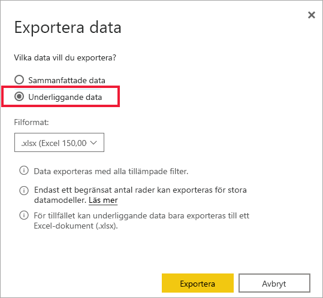

1. När du väljer **Exportera** får du ett meddelande om att spara filten från webbläsaren. Öppna filen i Excel när du har sparat den.

    
    
    - Den här skärmbilden visar bara en liten del av Excel-filen. Det innehåller fler än 100 000 rader.  
    
    - Alla data som används av hierarkin exporteras, inte bara de data som används för den aktuella detaljnivån för det visuella objektet. Till exempel hade vi ökat detaljnivån ned till stadsnivå, men vår export innehåller även landsdata.  

    - Eftersom vi tillämpade filter på visualiseringen exporteras data enligt filtret. Observera att den första raden visar **Applied filters: City is not Atlanta, GA** (Tillämpade filter: Stad är inte Atlanta, GA). 

## Skydda upphovsrättsskyddade data

Din datamängd kan ha innehåll som inte bör ses av alla användare. Om du inte är försiktig kan export av underliggande data göra så att användare kan se alla detaljerade data för det visuella objektet – alla kolumner och rader i dessa data. 

Det finns flera strategier som Power BI-administratörer och designers bör använda för att skydda upphovsrättsskyddade data. 

- Designers [bestämmer vilka *exportalternativ*](#set-the-export-options) som är tillgängliga för användare.  

- Power BI-administratörer kan inaktivera dataexport för sin organisation. 

- Datamängdsägare kan ange säkerhet på radnivå (RLS). RLS begränsar åtkomsten till skrivskyddade användare. Men om du har konfigurerat en apparbetsyta och gett medlemmar redigeringsbehörighet tillämpas inte RLS-roller för dem. Mer information finns i [Säkerhet på radnivå](../service-admin-rls.md).

- Rapportdesigners kan dölja kolumner så att de inte visas i listan **Fält**. Mer information finns i [Egenskaper för datamängd](../developer/automation/api-dataset-properties.md)

- Power BI-administratörer kan lägga till [känslighetsetiketter](../admin/service-security-data-protection-overview.md) till instrumentpaneler, rapporter, datamängder och dataflöden. De kan sedan framtvinga skyddsinställningar såsom kryptering eller vattenstämplar vid export av data. 

- Power BI-administratörer kan använda [Microsoft Cloud App Security](../admin/service-security-data-protection-overview.md) för att övervaka användarnas åtkomst och aktiviteter, utföra riskanalyser i realtid och ange etikettspecifika kontroller. Organisationer kan till exempel använda Microsoft Cloud App Security till att konfigurera en princip som förhindrar att användare laddar ned känsliga data från Power BI till ohanterade enheter. 

## Exportera underliggande data

Vad som visas när du väljer **Underliggande data** kan variera. Du kanske behöver hjälp från din administratör eller IT-avdelning för att förstå den här informationen. 

>

| Visualiseringen innehåller | Vad som visas i exporten  |
|---------------- | ---------------------------|
| Aggregeringar | Den *första* aggregeringen och icke-dolda data från hela tabellen för den aggregeringen. |
| Aggregeringar | Relaterade data – om det visuella objektet använder data från andra datatabeller som är *relaterade* till datatabellen som innehåller samlingen (så länge relationen är \*:1 eller 1:1). |
| Mått* | alla mått i visualiseringen *och* alla mått från datatabeller som innehåller något mått som används i visualiseringen |
| Mått* | alla icke-dolda data från tabeller som innehåller måttet (så länge relationen är \*:1 eller 1:1) |
| Mått* | alla data från alla tabeller som är relaterade till tabeller som innehåller mått via en kedja av \*: 1 av 1:1) |
| Endast mått | alla icke-dolda kolumner från alla relaterade tabeller (för att expandera måttet) |
| Endast mått | sammanfattade data för alla dubblettrader för modellmått |

\* I rapportvyn i Power BI Desktop eller -tjänsten visas ett *mått* i listan **Fält** med en kalkylatorikon . Mått kan skapas i Power BI Desktop.

### Ange exportalternativ för

Power BI-rapportdesigners styr vilka typer av alternativ för export av data som är tillgängliga för deras kunder. Alternativen är:

- Tillåt slutanvändarna att exportera sammanfattade data från Power BI-tjänsten eller Power BI-rapportservern

- Tillåt slutanvändarna att exportera sammanfattade och underliggande data från tjänsten eller rapportservern

- Tillåt inte slutanvändare att exportera alla data från tjänsten eller rapportservern

    > [!IMPORTANT]
    > Vi rekommenderar att rapportdesigner går tillbaka till gamla rapporter och återställer exportalternativet manuellt, om det behövs.

För att ange de här alternativen:

1. Börja i Power BI Desktop.

1. I det övre vänstra hörnet, väljer du alternativet **Fil** > **och alternativet** > **Inställningar**.

1. Under **AKTUELL FIL** väljer du **Rapportinställningar**.

    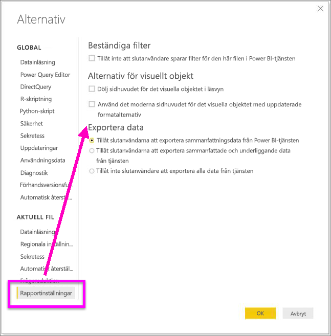

1. Gör ditt val från avsnittet **Exportera data**.

Du kan även uppdatera den här inställningen i Power BI-tjänsten.

Det är viktigt att observera att om Power BI-administratörens portalinställningar är i konflikt med rapportinställningarna för Exportera data, åsidosätter administratörsinställningarna inställningarna för dataexport.

## Begränsningar och överväganden
Dessa begränsningar och överväganden gäller för Power BI Desktop och Power BI-tjänsten, inklusive Power BI Pro och Premium.

- Om du vill exportera data från ett visuellt objekt, måste du ha [Skapa-behörighet för den underliggande datamängden](https://docs.microsoft.com/power-bi/service-datasets-build-permissions).

-  Det maximala antal rader som **Power BI Desktop** och **Power BI-tjänsten** kan exportera från en **rapport i importläge** till en *.csv-fil* är 30 000.

- Det maximala antal rader som programmen kan exportera från en **rapport i importläge** till en *.xlsx-fil* är 150 000.

- Exportera med hjälp av *Underliggande data* fungerar inte om:

  - versionen är äldre än från 2016.

  - tabellerna i modellen saknar en unik nyckel.
    
  -  en administratör eller rapportdesigner har inaktiverat den här funktionen.

- Export med *Underliggande data* fungerar inte om alternativet *Visa objekt utan data* är aktiverat för den visualisering som Power BI exporterar.

- När du använder DirectQuery är den maximala mängd data som Power BI kan exportera 16 MB okomprimerade data. Ett oönskat resultat kan vara att du exporterar mindre än det maximala antalet rader. Det är troligt om

    - det finns många kolumner

    - det finns data som är svåra att komprimera

    - andra faktorer är inblandade som påverkar filstorleken och minskar antalet rader som Power BI kan exportera.

- Om visualiseringen använder data från mer än en datatabell och det inte finns någon relation för dessa tabeller i datamodellen, exporterar Power BI endast data för den första tabellen.

- Anpassade visuella objekt och visuella R-objekt stöds inte för tillfället.

- I Power BI kan du byta namn på ett fält (en kolumn) genom att dubbelklicka på fältet och skriva ett nytt namn. Power BI refererar till det nya namnet som ett *alias*. Ibland kan det hända att en Power BI-rapport innehåller dubbla fältnamn, men Excel tillåter inte dubbletter. Så när Power BI exporterar data till Excel, återställs ett fältalias till de ursprungliga fältnamnen (kolumnnamnen).  

- Om det finns Unicode-tecken i *.csv-filen*, visas texten inte korrekt i Excel. Valutasymboler och främmande ord är exempel på Unicode-tecken. Du kan öppna filen i Anteckningar, då visas Unicode korrekt. Om du vill öppna filen i Excel, är lösningen att importera *.csv-filen*. För att importera filen till Excel:

  1. Öppna Excel.

  1. Gå till fliken **Data**.
  
  1. Välj **Hämta externa data** > **Från text**.
  
  1. Gå till den lokala mappen där filen lagras och välj *.csv-filen*.

- Power BI-administratörer kan inaktivera export av data.

Har du fler frågor? [Fråga Power BI Community](https://community.powerbi.com/)
