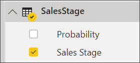
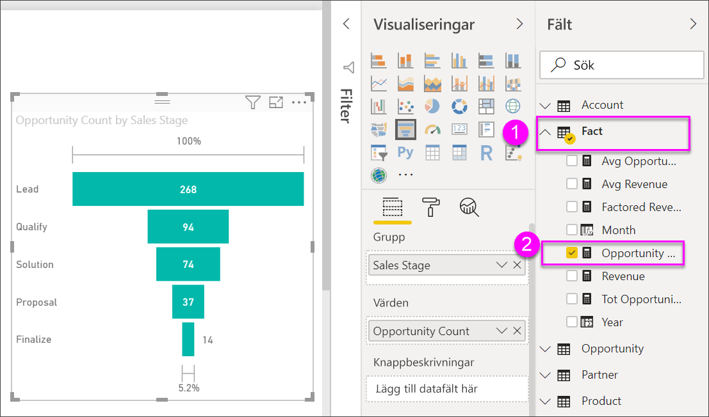

# Skapa och använda trattdiagram

[!INCLUDE[consumer-appliesto-nyyn](../includes/consumer-appliesto-nyyn.md)]

[!INCLUDE [power-bi-visuals-desktop-banner](../includes/power-bi-visuals-desktop-banner.md)]

Med ett trattdiagram kan du visualisera en linjär process med intilliggande steg. Till exempel en försäljningstratt som spårar kunderna genom stadier: Lead \> kvalificerat lead \> potentiell kund \> avtal \> avslut.  Trattens form ger en översikt över processens tillstånd.

Varje steg i trattens motsvarar en procentandel av det totala antalet. I de flesta fallen är ett trattdiagram format som en tratt, där det första stadiet är störst och varje följande steg är mindre än det föregående.  En päronformad tratt kan också vara användbar – den kan identifiera ett problem i processen.  Men vanligtvis är det första stadiet, ”intaget”, det största.

> [!NOTE]
> För att dela en rapport med en Power BI-kollega krävs att du både har individuella Power BI Pro-licenser eller att rapporten har sparats med Premium-kapacitet.    

## När du ska använda ett trattdiagram
Trattdiagram är ett bra alternativ:

* När data är sekventiella och går genom minst 4 steg.
* När antalet ”objekt” i det första steget förväntas vara större än antalet i det sista steget.
* Om du vill beräkna potential (intäkter, försäljning, erbjudanden osv) i etapper.
* Om du vill beräkna och spåra konvertering och kvarhållning.
* Om du vill avslöja flaskhalsar i en linjär process.
* Om du vill spåra arbetsflödet i en kundvagn.
* Om du vill spåra förloppet och resultaten a en klickbaserad reklam-/marknadsföringskampanj.

## Arbeta med trattdiagram
Trattdiagram:

* Kan sorteras.
* Stöd för multipler.
* Kan markeras och korsfiltreras mot andra visualiseringar på samma rapportsida.
* Kan användas för markera och korsfiltrera andra visualiseringar på samma rapportsida.
   > [!NOTE]
   > Se hur Will skapar ett trattdiagram med exemplet på försäljning och marknadsföring i den här videon. Följ sedan stegen under videon för att prova själv med hjälp av PBIX-filen Exempel på Affärsmöjlighetsanalys
   > 
   > 
## Förutsättning

De här självstudierna använder sig av [PBIX-filen Exempel på Affärsmöjlighetsanalys](https://download.microsoft.com/download/9/1/5/915ABCFA-7125-4D85-A7BD-05645BD95BD8/Opportunity%20Analysis%20Sample%20PBIX.pbix
).

1. Välj **Arkiv** > **Öppna** uppe till vänster på menyraden
   
2. Hitta din kopia av **PBIX-filen Exempel på Affärsmöjlighetsanalys**

1. Öppna **PBIX-filen Exempel på Affärsmöjlighetsanalys** i rapportvyn .

1. Välj  för att lägga till en ny sida.

## Skapa ett enkelt trattdiagram
Se hur Will skapar ett trattdiagram med exemplet på försäljning och marknadsföring i den här videon.

<iframe width="560" height="315" src="https://www.youtube.com/embed/qKRZPBnaUXM" frameborder="0" allow="autoplay; encrypted-media" allowfullscreen></iframe>

Nu kan du skapa ett eget trattdiagram som visar antalet möjligheter i varje försäljningsstadium.

1. Börja med en tom rapportsida och välj fältet **SalesStage** \> **Försäljningssteg**.
   
    

1. Välj trattikonen  för att konvertera kolumndiagrammet till ett trattdiagram.

2. I fönstret **Fält** väljer du **Fakta** \> **Antal affärsmöjligheter**.
   
    
4. Håll muspekaren över en stapel för att visa en mängd information.
   
   * Stegets namn
   * Antalet affärsmöjligheter som finns i det här steget just nu
   * Övergripande konverteringstakt (% av leads) 
   * Steget-till-steg (kallas även förlusttakt) som är % av det föregående steget (i det här fallet förslagssteg/lösningssteg)
     
     

6. [Spara rapporten](../create-reports/service-report-save.md).

## Markering och korsfiltrering
Information om hur du använder filterfönstret finns i [Lägg till ett filter i en rapport](../create-reports/power-bi-report-add-filter.md).

Om du markerar ett fält i trattdiagrammet korsfiltreras de övriga visualiseringarna på rapportsidan, och vice versa. Följ med och lägg till ytterligare några visuella objekt på rapportsidan som innehåller trattdiagrammet.

1. Välj fältet **Förslag** i trattdiagrammet. Detta korsmarkerar de övriga visualiseringarna på sidan. Använd CTRL för att välja flera.
   
   
2. För att hantera hur diagram korsmarkeras och korsfiltrerar varandra, se [Visualiseringsinteraktioner i en Power BI-rapport](../create-reports/service-reports-visual-interactions.md)

## Nästa steg

[Mätare i Power BI](power-bi-visualization-radial-gauge-charts.md)

[Visualiseringstyper i Power BI](power-bi-visualization-types-for-reports-and-q-and-a.md)

