# Visualisering av viktiga influencers
De visuella påverka hjälper dig att förstå faktorerna som används i ett mått som du är intresserad av. Den analyserar dina data, rangordnar de faktorer som är viktiga och visar dem som viktiga influencers. Anta exempelvis att du vill ta reda på vilken påverkan personalomsättning, vilket är så kallade omsättning. En faktor kanske anställning kontrakt längd och en annan faktor kanske medarbetare ålder. 
 
## När du ska använda påverka 
Det påverka visuella objektet är ett bra alternativ om du vill: 
- Se vilka faktorer påverkar måttet som analyseras.
- Jämföra den relativa prioriteten för de här faktorerna. Har till exempel korta avtalstider större effekt på personalomsättningen än långa avtalstider? 

## Krav för viktiga influencers 
Mått som du analyserar måste vara antingen kategoriska eller numeriska fält (samlingar och åtgärder ännu stöds inte).

## Funktioner i de visuella påverka

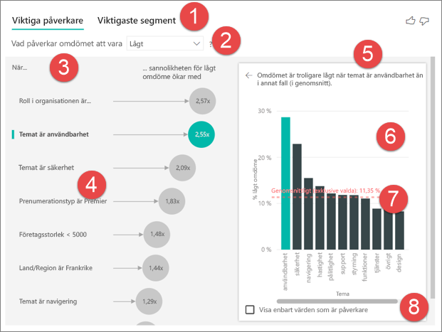

1. **Flikarna**: Välj en flik för att växla mellan vyer. **Nyckeln Påverkare** visar de viktigaste deltagarna till det valda måttet värdet. **De främsta segment** visar de översta segment som bidrar till den valda måttvärde. Ett *segment* består av en kombination av värden. Ett segment kan exempelvis vara konsumenter som kunder har minst 20 år och live i region Väst. 

2. **Listrutan**: Värdet för måttet under undersökningen. Titta på måttet i det här exemplet **omdöme**. Det valda värdet är **låg**.

3. **Omformuleringen**: Det hjälper dig att tolka det visuella objektet i den vänstra rutan.

4. **Vänster**: Den vänstra panelen innehåller ett visuellt objekt. I det här fallet visar den vänstra rutan en lista över de främsta påverka.

5. **Omformuleringen**: Det hjälper dig att tolka det visuella objektet i den högra rutan.

6. **Högra rutan**: Den högra rutan innehåller ett visuellt objekt. I det här fallet stapeldiagrammet visar alla värden för viktiga Påverkare **tema** som valdes i det vänstra fönstret. Det specifika värdet av **användbarhet** i den vänstra rutan visas i grönt. Alla andra värden för **tema** visas i svart.

7. **Medellinje**: Genomsnittliga beräknas för alla andra möjliga värden för **tema** utom **användbarhet**. Så beräkningen gäller för alla värden i svart. Du kan ta reda vilken procentandel av den andra **teman** gav dig ett låga omdömet. Med andra ord, när en klassificering gavs av en kund beskriver som kunden också orsaken eller temat för omdömet. Några teman är användbarhet, hastighet och säkerhet. 

   **Temat är användbarhet** är den näst högsta viktiga Påverkare för ett låga omdömet enligt det visuella objektet i den vänstra rutan. Om du genomsnittlig alla andra teman och deras bidrag till en klassificering på **låg**, du får de resultat som visas i rött. Alla andra teman beroende, endast 11.35% är högre än **användbarhet**.

8. **Markera kryssrutan**: **Visa endast värden som är Påverkare**.

## Skapa ett visuellt objektet av viktiga influencers 
 
Den här videon om du vill veta hur du skapar en påverka visual. Följ stegen nedan för att skapa en. 

<iframe width="560" height="315" src="https://www.youtube.com/embed/fDb5zZ3xmxU" frameborder="0" allow="accelerometer; autoplay; encrypted-media; gyroscope; picture-in-picture" allowfullscreen></iframe>

Product Manager vill du ta reda på vilka faktorer lead-kunder om du vill lämna negativt granskningar om din molntjänst. Öppna [PBIX-filen med kundfeedback](https://github.com/Microsoft/powerbi-desktop-samples/blob/master/2019/customerfeedback.pbix) i Power BI Desktop. Du kan också hämta den [kundernas Feedback Excel-fil för Power BI-tjänsten eller Power BI Desktop](https://github.com/Microsoft/powerbi-desktop-samples/blob/master/2019/customerfeedback.xlsx). 

> [!NOTE]
> Kundfeedback uppgifter som är baserat på [Moro et al., 2014] S. Moro s. Cortez och s. Rita. ”Ett databaserat förfarande att förutsäga framgången för Bank Telemarketing”. *Decision Support Systems*, Elsevier, 62:22-31, June 2014. 

1. Öppna rapporten och välj den **nyckeln Påverkare** ikon. 

    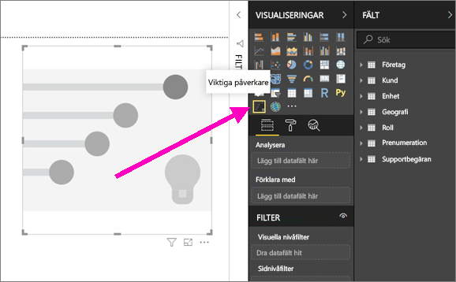

2. Flytta mått som du vill undersöka i den **analysera** fält. Den **analysera** fält stöder endast kategoriska eller icke kontinuerliga, variabler. Se en kund som styr klassificering på att tjänsten är låg, Välj **kundtabell** > **klassificering**. 
3. Flytta fält som du tror skulle kunna påverka **omdöme** till den **förklarar genom** fältet. Du kan flytta så många fält som du vill. I det här fallet, börja med:
    - Land/Region 
    - Roll i organisationen 
    - Prenumerationstyp 
    - Företagsstorlek 
    - Tema 
1. Om du vill fokusera på klassificeringarna som negativt, Välj **låg** i den **vad påverkar omdöme ska** nedrullningsbara listrutan.  

    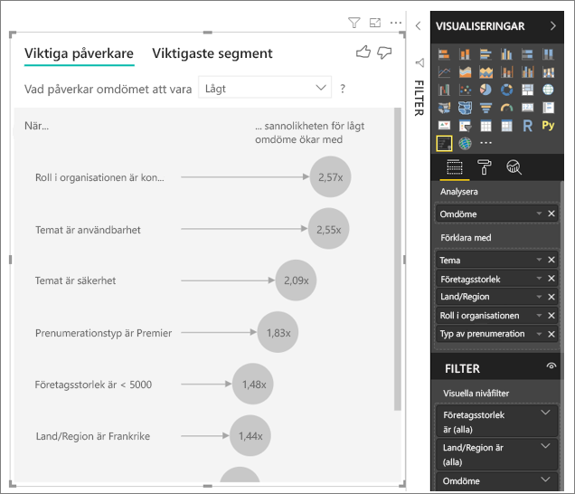

Analysen körs på tabellnivå för det fält som analyseras. I det här fallet den har den **omdöme** mått. Det här måttet har definierats på en kund-nivå. Varje kund har gett en Poängrekord eller en låg poäng. De förklarande faktorerna måste definieras på nivån kunden för det visuella objektet att utnyttja dem. 

I föregående exempel har alla förklarande faktorer en eller en många-till-en-relation med måttet. I det här fallet har varje poäng exakt ett tema som är kopplade till den. Den här tema var huvudsakliga temat för kund-granskningen. På samma sätt kan kommer kunderna från ett land har en typ av medlemskap och utföra en roll i organisationen. De förklarande faktorerna är redan attribut för en kund och som krävs för att definiera några transformationer. Det visuella objektet kan göra omedelbart att använda. 

Senare under kursen titta på mer komplexa exempel som har en-till-många-relationer. I sådana fall kan behöva kolumnerna först aggregeras kund-nivå innan du kan köra analysen. 

Mått och aggregeringar som används som förklarande faktorer är också kommer att utvärderas för den tabell i **analysera** mått. Nedan visas några exempel. 

## Tolka kategoriska påverka 
Låt oss ta en titt på påverka för låg betygsättning. 

### Främsta en faktor som påverkar köpbeteendet sannolikheten för ett låga omdömet

Organisationen i det här exemplet har tre roller: konsument, administratör och utgivare. Att en konsument är den viktigaste faktorn som bidrar till ett låga omdömet. 

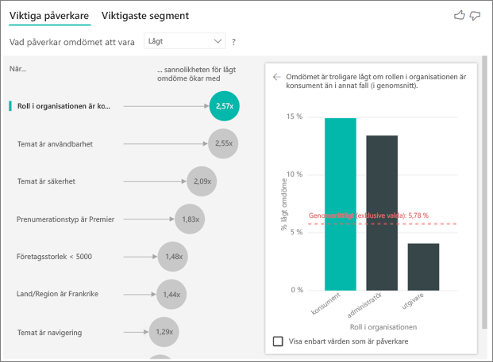

Konsumenterna är mer exakt 2,57 gånger mer sannolikt att ge ett negativt värde för din tjänst. Påverka diagrammets listor **roll i organisationen är konsument** först i listan till vänster. Genom att välja **roll i organisationen är konsument**, Power BI visar ytterligare information i den högra rutan. Jämförande effekten av varje roll på sannolikheten för ett låga omdömet visas.
  
- 14.93% av konsumenter ge en låg poäng. 
- Alla andra roller ger i genomsnitt en låg poäng 5.78% av tiden.
- Konsumenterna är 2,57 gånger mer troligt att ge en låg poäng jämfört med andra roller. Du kan fastställa det här genom att dividera grönt fält med den röda streckade linjen. 

### En andra faktor som påverkar köpbeteendet sannolikheten för ett låga omdömet

De visuella påverka Jämför och rankar faktorer från många olika variabler. Andra Påverkare har inget samband med **roll i organisationen**. Välj andra Påverkare i listan, vilket är **temat är användbarhet**. 

Den andra viktigaste faktorn är relaterat till temat för kundens granskning. Kunder som har kommenterats om användbarheten av produkten har 2.55 gånger mer troligt att ge en låg poäng jämfört med kunder som har kommenterats på andra teman, till exempel tillförlitlighet, design eller hastighet. 

Mellan de visuella objekten, medelvärde, vilket visas med den röda streckade linjen kan ändras från 5.78% till 11.34%. Genomsnittet är dynamisk eftersom den är baserad på medelvärdet av alla andra värden. För den första Påverkare inte medelvärdet kundrollen. För andra Påverkare utesluta den temat användbarhet. 
 
Välj den **endast visa värden som är Påverkare** kryssrutan för att filtrera med endast inflytelserika värdena. I det här fallet är de roller som driver en låg poäng. Tolv teman minskas till de fyra som Power BI identifieras som teman som driver låg betyg. 

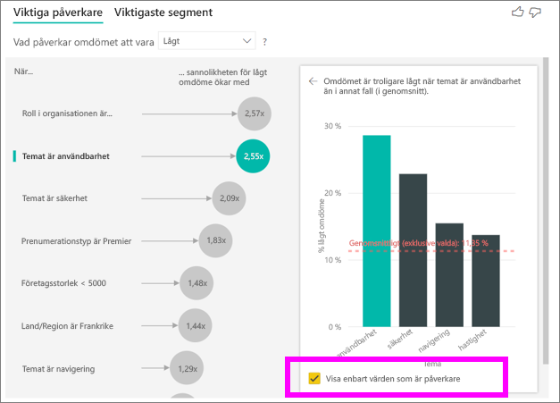

## Interagera med andra visuella objekt 
 
Varje gång du väljer ett utsnitt, filtrera eller andra visuella objekt på arbetsytan, produktmiljö de visual påverka analys på den nya delen av data. Du kan till exempel flytta **företagsstorlek** i rapporten och använda den som ett utsnitt. Du kan använda den för att se om påverka för enterprise-kunder skiljer sig från allmänheten. En enterprise företagets storlek är större än 50 000 anställda.
 
Att välja **> 50 000** repriser analysen och du kan se att Påverkare ändrats. För stora företagskunder har översta Påverkare för låg klassificeringar ett tema som är relaterade till säkerhet. Du kanske vill undersöka ytterligare till se om det finns specifika säkerhetsfunktioner som kunderna stor är missnöjda om. 

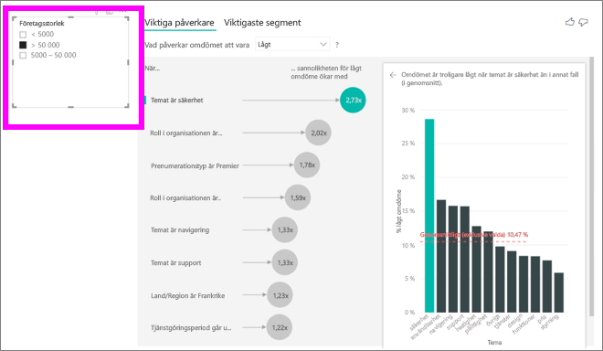

## Tolka kontinuerlig påverka 
 
Hittills har du sett hur du använder det visuella objektet för att utforska hur olika kategoriska fält påverka låg betyg. Det är också möjligt att ha kontinuerlig faktorer som ålder, höjd och priset i den **förklarar genom** fältet. Nu ska vi titta på vad som händer när **tjänstgöringsperiod i** flyttas från kundtabellen till **förklarar av**. Tjänstgöringsperiod i visar hur lång tid en kund har använt tjänsten. 
 
När tjänstgöringsperiod i ökar, ökar även risken för att få en lägre klassificering. Denna trend föreslår att långsiktiga kunder är mer troligt att ge ett negativt värde. Den här informationen är intressant, och en som du kan följa upp senare. 
 
Visualiseringen visar att varje gång tjänstgöringsperiod i går upp med 13.44 månader, i genomsnitt sannolikheten för ett låga omdömet ökar med 1,23 gånger. I det här fallet motsvarar 13,44 månader standardavvikelsen för nyttjandeperioden. Så att de insikter du får en titt på hur öka tjänstgöringsperiod i genom att ett fast belopp som är standardavvikelsen för tjänstgöringsperiod i, påverkar sannolikheten för att ta emot ett låga omdömet. 
 
Spridningsdiagrammet i rutan till höger visar den genomsnittliga procentandelen av låg klassificering för varje värde i tjänstgöringsperiod i. Den går igenom lutningen med en trendlinje.

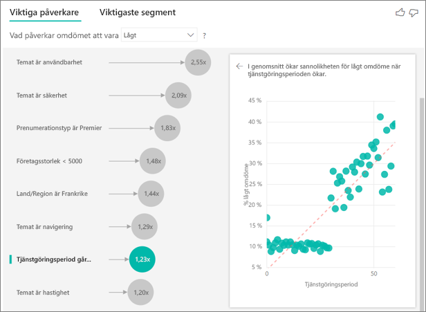

## Tolka mått och aggregeringar som påverka 
 
Du kan använda mått och aggregeringar som förklarande faktorer i dina analyser. Du kan till exempel vill se vilken effekt antalet supportbegäranden för kunden eller den genomsnittliga varaktigheten för en öppen biljett har på poängen felmeddelandet. 
 
I detta fall använder vill du se om antalet supportbegäranden som kunden har påverkar de ger poängen. Nu du hämta **stöder biljett-ID** från tabellen support-ärende. Eftersom en kund kan ha flera supportärenden, aggregera ID till kund-nivå. Aggregering är viktigt eftersom analysen körs på kund-nivå, så att alla drivrutiner måste definieras på den precisionsnivå. 
 
Låt oss titta på antalet ID: N. Varje kund raden har antalet supportbegäranden som är kopplade till den. I det här fallet, som antal support biljetter ökar går sannolikheten för klassificering som låg upp 5.51 gånger. Det visuella objektet till höger visar det genomsnittliga antalet supportbegäranden av olika **omdöme** evalueras på nivån för kunden. 

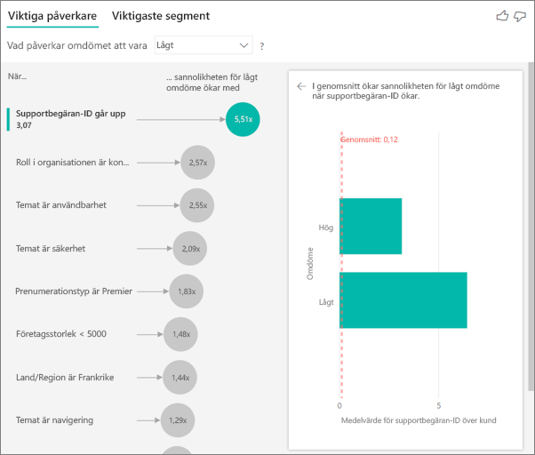

## Tolka resultaten: Viktigaste segment 
 
Du kan använda den **nyckeln Påverkare** flik för att utvärdera varje faktor individuellt. Du kan också använda den **viktigaste segment** flik för att se hur en kombination av faktorer påverkar det mått som du analyserar. 
 
Främsta segment i början visa en översikt över alla segment som identifierats av Power BI. I följande exempel visas att sex segment hittades. Dessa segment rankade efter procentandelen låg betyg i segmentet. 1, till exempel har 74.3% kunden klassificeringar som är låg. Ju högre bubbla, desto högre andel låga omdömen. Storleken på bubblorna motsvarar hur många kunder är i segmentet. 

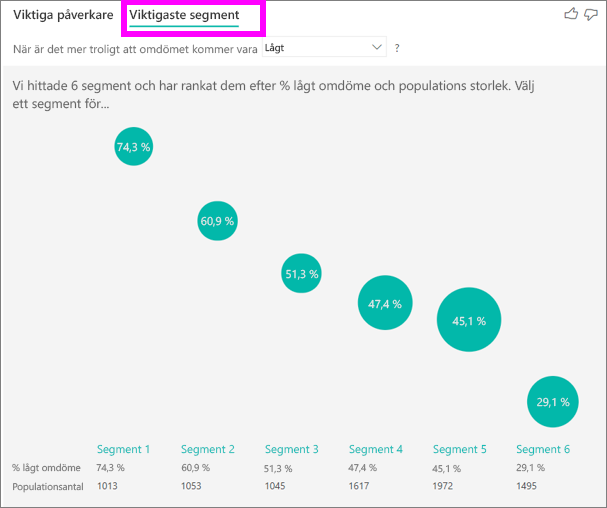

Om du markerar en bubbla visas mer detaljerad information om det segmentet. Om du väljer Segment 1, exempelvis kan hitta du att det består av relativt etablerade kunder. De har varit kunder än 29 månader och har fler än fyra supportärenden. Slutligen kan de inte är utgivare, så att de blir användare eller administratörer. 
 
I den här gruppen gav 74.3 kunderna procent av ett låga omdömet. Genomsnittlig kunden gav låg omdöme 11,7% av tiden, så det här segmentet har en större del av låg betyg. Det är högre 63 procentenheter. Segmentet 1 innehåller också ungefär 2.2% av data, så att den motsvarar en adresserbara del av populationen. 

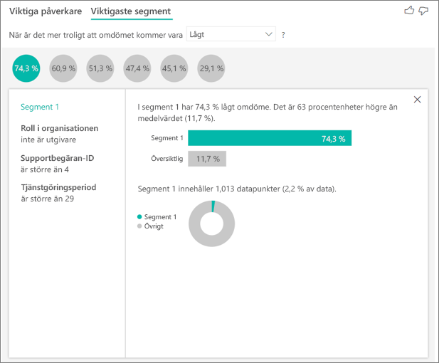

## Arbeta med numeriska data

Om du flyttar ett numeriskt fält till den **analysera** fält, du kan välja hur du hanterar det scenariot. Du kan ändra beteendet för det visuella objektet genom att gå till den **formatering fönstret** och växla mellan **Kategoriska Analysis-typen** och **kontinuerlig analystyp**.

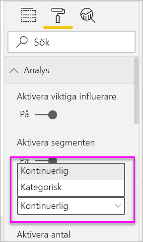

En **Kategoriska Analysis-typen** fungerar enligt beskrivningen ovan. Till exempel om du tidigare såg undersökningen resultat mellan 1 och 10, kan be ”'vad påverkar undersökningen poäng vara 1?

En **kontinuerlig analystyp** ändrar frågan till en kontinuerlig. I exemplet ovan är skulle vår nya fråga vara ”vad påverkar undersökningen poäng att öka/minska”?

Denna skillnad är mycket användbart när du har massor av unika värden i fältet som du analyserar. I exemplet nedan tittar vi på house priser. Det är mycket olämpligt att be ”vad påverkar House priset vara 156,214”? eftersom det är mycket förmodligen specifik och vi inte har tillräckligt med data för att härleda ett mönster.

I stället kan vi vill att fråga, ”vad påverkar House priset att öka”? vilket gör att vi kan behandla house priser som en rad i stället för distinkta värden.

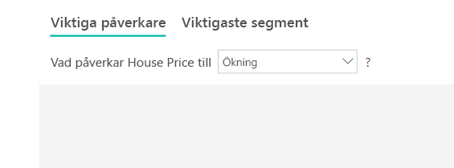

## Tolka resultaten: Viktiga påverkare 

I det här scenariot kan vi titta på ”vad påverkar House priset att öka”. Vi tittar på ett antal förklarande faktorer som kan påverka ett house pris som **år bygger** (år i huset skapades), **KitchenQual** (se kvalitet) och **YearRemodAdd** (år i huset har remodeled). 

I exemplet nedan är vi titta på våra främsta Påverkare som är Se kvalitet som utmärkt. Resultatet liknar de som vi såg när vi analysera kategoriska mått med några viktiga skillnader:

- Stapeldiagrammet till höger tittar på medelvärden i stället för procenttal. Det därför visar genomsnittlig house priset på ett hus med en utmärkt Se Nyheter (grön liggande) jämfört med genomsnittlig house priset på ett hus utan en utmärkt Se (streckade linjen)
- Talet i bubbeldiagrammet fortfarande är skillnaden mellan red prickad linje och grönt fält men det uttrycks som ett tal ($158. 49K) i stället för en sannolikhet (1.93 x). Så vidare genomsnittlig, datahus med utmärkt kök är nästan $160K dyrare än datahus utan utmärkt kök.

I exemplet nedan vi tittar på påverkan har en kontinuerlig faktor (år house har remodeled) på house pris. Skillnader jämfört med hur vi analyserar kontinuerligt Påverkare för kategoriska mått är följande:

-   Spridningsdiagrammet i den högra rutan visar genomsnittlig house priset för varje distinkt värde årets remodeled. 
-   Värdet i bubbeldiagrammet visar av hur mycket den genomsnittliga house tillägg (i det här fallet $2. 87k) när året i huset har remodeled ökar av dess standardavvikelse (i det här fallet 20 år)

Slutligen, om det finns åtgärder som vi tittar på det genomsnittliga året ett hus har skapats. Analysen här är följande:

-   Spridningsdiagrammet i den högra rutan visar genomsnittlig house priset för varje distinkt värde i tabellen
-   Värdet i bubbeldiagrammet visar av hur mycket den genomsnittliga house tillägg (i det här fallet $1. 35K) när den genomsnittliga år ökar med dess standardavvikelse (i det här fallet 30 år)

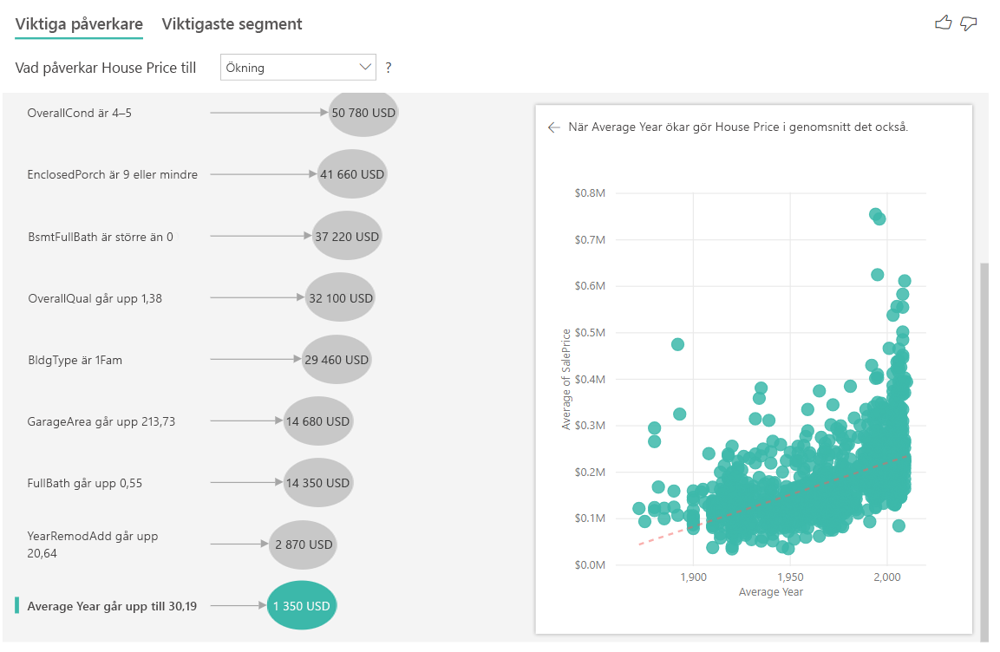

## Tolka resultaten: Främsta segment

Främsta segment är för numeriska mål visa grupper där huset priser i genomsnitt högre än i den övergripande datamängden. Till exempel nedan vi se att **Segment 1** består av datahus där **GarageCars** (antal bilar garaget rymmer) är större än 2 och **RoofStyle** har hängt. Datahus med denna ha ett genomsnittligt pris på $355K jämfört med det totala medelvärdet i data som är $180 kB.

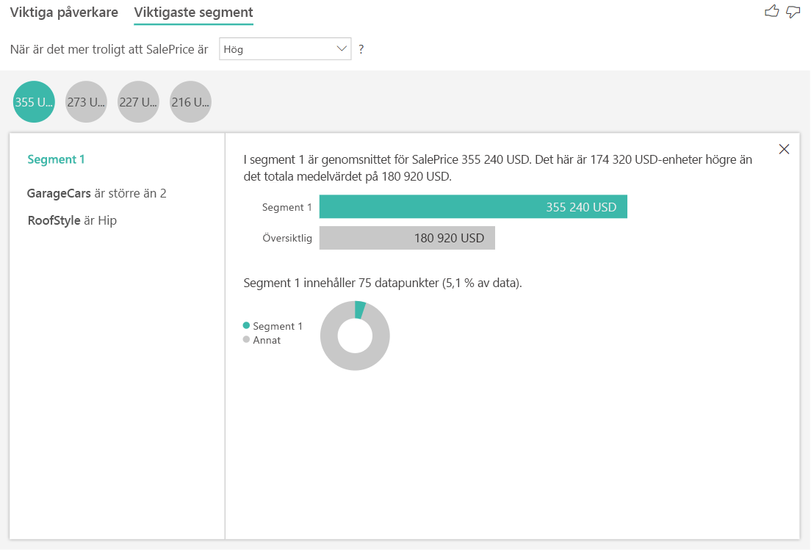

## Överväganden och felsökning 
 
**Vilka är begränsningarna för förhandsversionen?** 
 
De visuella påverka är för närvarande i offentlig förhandsversion och den har vissa begränsningar. Funktioner som inte finns för närvarande innehåller: 
- Analysera mått som är aggregat eller åtgärder.
- Använda det visuella objektet i Power BI Embedded.
- Använda det visuella objektet på Power BI-appar.
- Stöd för RLS.
- Direct Query-stöd.
- Live-stöd för anslutning.

**Jag ser ett fel som inga Påverkare eller segment hittades. Varför?** 

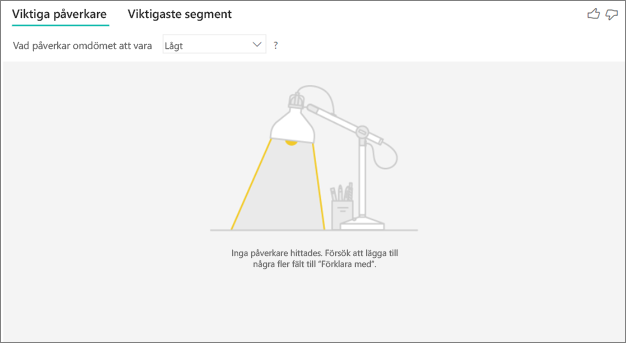

Det här felet uppstår när du har tagit med fält i **förklarar av** men ingen Påverkare hittades. 
- Du ingår det mått som du analysera i både **analysera** och **förklarar av**. Ta bort den från **förklarar av**. 
- Dina förklarande fält har för många kategorier med få observationer. Detta gör det svårt för visualisering för att avgöra vilka faktorer som Påverkare. Det är svårt att generalisera baserat på bara några få observationer. Om du analyserar ett numeriskt fält kanske du vill växla från **Kategoriska Analysis** till **kontinuerlig analys** i den **formatering fönstret** under den  **Analysis** kort.
- Din förklarande faktorer har tillräckligt med observationer att generalisera, men visualiseringen kunde inte hitta korrelationer meningsfulla till rapporten.
 
**Jag ser ett fel som att det mått som jag analyserar inte har tillräckligt med data för analys körs. Varför?** 

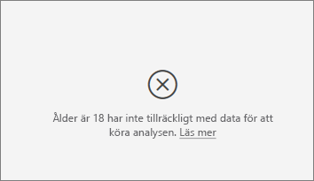

Visualiseringen fungerar genom att titta på mönster i data för en grupp och andra grupper. Till exempel ser ut för kunder som gav låg klassificeringarna jämfört med kunder som gav höga betyg. Om data i din modell har bara ett par observationer, är det svårt att hitta mönster. Om visualiseringen inte har tillräckligt med data för att hitta meningsfulla Påverkare, indikerar det att mer data behövs för att köra analysen. 

Vi rekommenderar att du har minst 100 observationer för det valda tillståndet. I det här fallet är tillståndet kunder som omsättningsuppdateringar. Du måste också minst 10 observationer för de tillstånd som du använder för jämförelse. I det här fallet är tillståndet jämförelse kunder som inte omsättningsuppdateringar.

Om du analyserar ett numeriskt fält kanske du vill växla från **Kategoriska Analysis** till **kontinuerlig analys** i den **formatering fönstret** under den  **Analysis** kort.

**Ett felmeddelande visas som ett fält i *förklarar av* är inte unikt relaterade till den tabell som innehåller det mått som jag analyserar. Varför?**
 
Analysen körs på tabellnivå för det fält som analyseras. Till exempel om du analysera kundfeedback för din tjänst, kanske en tabell som anger om en kund gav en hög klassificering eller ett låga omdömet. I det här fallet körs dina analyser på tabellnivå kund. 

Om du har en relaterad tabell som har definierats på en mer detaljerad nivå än den tabell som innehåller dina mått kan se du det här felet. Här är ett exempel: 
 
- Du kan analysera styr kunder att ge låg betyg på din tjänst.
- Du vill se om enheten där kunden använder din tjänst påverkar granskningar som de ger.
- En kund kan använda tjänsten på flera olika sätt.
- I följande exempel använder kund 10000000 både en webbläsare och en surfplatta för att interagera med tjänsten.

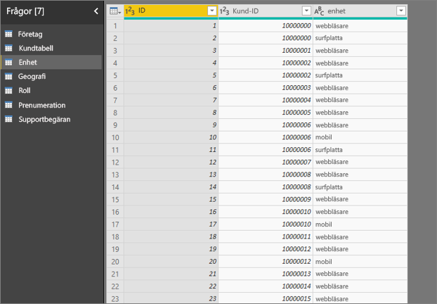

Om du försöker använda kolumnen enhet som en förklarande faktor, kan du se följande fel: 

Det här felet visas eftersom enheten inte är definierad på nivån för kunden. En kund kan använda tjänsten på flera enheter. Enheten måste vara ett attribut för kunden för visualisering att hitta mönster. Det finns flera lösningar som beror på din förståelse för verksamheten: 
 
- Du kan ändra sammanfattningen av enheter som ska räknas. Använd till exempel antal om antalet enheter som kan påverka poängsättningen som ger en kund. 
- Du kan pivotera kolumnen enhet för att se om använder tjänsten på en specifik enhet påverkar en kunds klassificering.
 
I det här exemplet var data pivoteras för att skapa nya kolumner för webbläsare, mobil- och surfplattor. Du kan nu använda dessa enheter i **förklarar av**. Alla enheter sig innehålla Påverkare och webbläsaren har en mycket stor påverkan på poäng för kunden.

Kunder som inte använder webbläsaren för att använda tjänsten är mer exakt 3.79 gånger mer sannolikt att ge en låg poäng än de kunder som gör. Lägre nedåt i listan för mobil inversen är true. Kunder som använder den mobila appen är mer troligt att ge en låg poäng än de kunder som inte. 

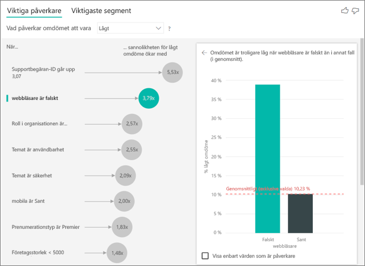

**Jag ser en varning om att åtgärder som inte ingår i min analys. Varför?** 

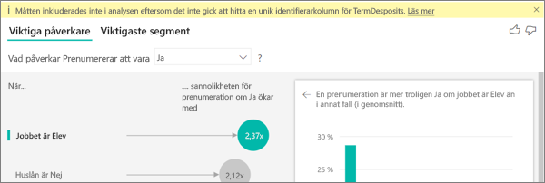

Analysen körs på tabellnivå för det fält som analyseras. Om du analysera kundomsättning, kan du ha en tabell som anger om en kund churned eller inte. I det här fallet körs dina analyser på nivån för kund-tabellen.
 
Mått och aggregeringar är som standard som analyseras på tabellnivå. Om det finns ett mått för genomsnittliga månatliga utgifter, skulle de analyseras på tabellnivå kund. 

Om kundtabellen inte har en unik identifierare, du kan inte utvärdera måttet och ignoreras av analysen. Kontrollera att tabellen med din mått har en unik identifierare för att undvika detta. I det här fallet är det kundtabellen och den unika identifieraren är kund-ID. Det är också lätt att lägga till en indexkolumn med Power Query.
 
**Jag ser en varning om att det mått som jag analyserar har fler än 10 unika värden och att den här mängden kan påverka kvaliteten på min analys. Varför?** 

AI-visualisering kan analysera kategoriska fält och numeriska fält. När det gäller kategoriska fält, ett exempel kan vara omsättning är Ja eller Nej, och kundnöjdhet är hög, medel eller låg. Öka antalet kategorier för att analysera innebär att det finns färre observationer per kategori. Detta gör det svårare för visualisering för att hitta mönster i data. 

När du analyserar numeriska fält du kan välja mellan behandlar numeriska fält som text i vilket fall du kör samma analysen som du gör kategoridata (**Kategoriska Analysis**). Om du har massor av distinkta värden som vi rekommenderar att du växla analysen ska **kontinuerlig analys** som det innebär att vi kan hämta mönster från när siffror öka eller minska snarare än de behandlas som distinkta värden. Du kan växla från **Kategoriska Analysis** till **kontinuerlig analys** i den **formatering fönstret** under den **Analysis** kort.

För att hitta starkare Påverkare, rekommenderar vi att du grupperar liknande värden till en enda enhet. Till exempel om du har ett mått för pris kan sannolikt du kommer att få bättre resultat genom att gruppera liknande priserna i hög, medel och låg kategorier och att använda enskilda prispunkter. 

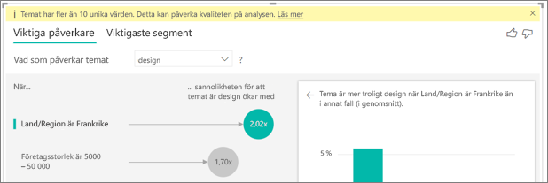

**Det finns faktorer i Mina data som ser ut som om de ska vara påverka, men de inte. Hur kan det bli så?**

I följande exempel driva kunder som är konsumenter låg klassificeringar, med 14.93% av klassificeringar som är låg. Administratörsrollen har också en hög andel låg betyg på 13.42%, men det är inte anses vara en Påverkare. 

Orsaken till detta är att visualiseringen också tar hänsyn till antalet datapunkter när den hittar Påverkare. I följande exempel har mer än 29,000 konsumenter och 10 gånger färre administratörer, ungefär 2,900. Endast 390 av dem gav ett låga omdömet. Det visuella objektet har inte tillräckligt med data för att fastställa om det finns ett mönster med administratören betyg eller om det är bara en chans att söka efter. 

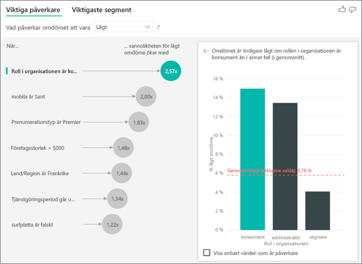

**Hur du för att beräkna påverka för kategoriska analys?**

I bakgrunden AI-visualisering använder [ML.NET](https://dotnet.microsoft.com/apps/machinelearning-ai/ml-dotnet) att köra en logistisk regression för att beräkna påverka. En logistisk regression är en statistisk modell som jämför olika grupper med varandra. 

Om du vill se låg klassificeringar som styr kontrollerar logistic regression hur kunder som gav en låg poäng skiljer sig från de kunder som gav en Poängrekord. Om du har flera kategorier, till exempel hög, neutral och låg poäng titta du på hur de kunder som gav ett låga omdömet skiljer sig från de kunder som inte tilldelar ett låga omdömet. I så fall hur de kunder som gav en låg poäng skiljer sig från de kunder som gav en hög klassificering eller en neutral klassificering? 
 
Logistic regression söker efter mönster i data och söker efter hur kunder som gav ett låga omdömet kan skilja sig från de kunder som gav en höga omdömet. Det kanske, till exempel att kunder med mer supportärenden ger en högre procentandel låg klassificeringarna än kunder med få eller inga supportärenden.
 
Logistic regression tittar också hur många datapunkter finns. Om kunder som spela upp en administratörsroll ge proportionellt mer negativt poäng, men det finns bara ett par administratörer, kallas inte detta bra. Detta görs eftersom det inte finns tillräckligt många datapunkter som är tillgängliga för att härleda ett mönster. Ett statistiska test som kallas ett Wald test används för att avgöra om en Påverkare betraktas som en faktor. Det visuella objektet använder p-värdet 0,05 för att fastställa tröskelvärdet. 

**Hur du för att beräkna påverka för numeriska analys?**

I bakgrunden AI-visualisering använder [ML.NET](https://dotnet.microsoft.com/apps/machinelearning-ai/ml-dotnet) att köra en linjär regression för att beräkna påverka. En linjär regression är en statistisk modell som visar hur resultatet av fältet som du analyserar ändras baserat på din förklarande faktorer.

Till exempel om vi analyserar house priser, kommer en linjär regression titta på inverkan med ett utmärkt köket har på house-priset. Har datahus med utmärkt kök Allmänt lägre eller högre house priser jämfört med datahus utan utmärkt kök?

Den linjära regressionen tar även hänsyn till antalet datapunkter. Till exempel om datahus med tennisbanor har högre priser, men vi har mycket få datahus som har en Tennisplan kan anses detta inte bra. Detta görs eftersom det inte finns tillräckligt många datapunkter som är tillgängliga för att härleda ett mönster. Ett statistiska test som kallas ett Wald test används för att avgöra om en Påverkare betraktas som en faktor. Det visuella objektet använder p-värdet 0,05 för att fastställa tröskelvärdet. 

**Hur beräknas segment?**

I bakgrunden AI-visualisering använder [ML.NET](https://dotnet.microsoft.com/apps/machinelearning-ai/ml-dotnet) att köra ett beslutsträd för att hitta intressant undergrupper. Beslutsträdet syftar till att få en undergrupp till datapunkter som är relativt hög i mått som du är intresserad av. Det kan kunder med låg betyg eller datahus med höga priser.

Beslutsträdet tar varje förklarande faktor och försöker att avgöra vilka faktor ger den bästa *dela*. Till exempel om du filtrerar data om du vill inkludera endast stora företagskunder som separeras ut kunder som gav en höga omdömet jämfört med ett låga omdömet? Eller kanske är det bättre att filtrera data om du vill inkludera endast de användare som har kommenterats om säkerhet? 

När beslutsträdet gör en delning, tar undergrupp av data och anger nästa bästa delningen för dessa data. I det här fallet är undergruppen kunder som har kommenterats på säkerhet. Efter varje delning tittar den också om det finns tillräckligt många datapunkter för den här gruppen ska vara tillräckligt representant för att härleda ett mönster från eller om den är avvikelser i data och inte en verklig segment. Ett annat statistiska test används för att söka efter statistisk betydelsen av villkoret dela med p-värde på 0,05. 

När beslutsträdet är klar tar alla delningen, till exempel säkerhet kommentarer och stora företag, och skapar Power BI-filter. Den här filterkombinationen paketeras som ett segment i det visuella objektet. 
 
**Varför göra vissa faktorer blir Påverkare eller stoppa som Påverkare när jag över flera fält i den *förklarar genom* fältet?**

Visualiseringen utvärderar alla förklarande faktorer tillsammans. En faktor kanske en Påverkare påverkar i sig, men när den betraktas som med andra faktorer också inte. Anta att du vill analysera ett house pris vara hög, med sovrum och house storlek som förklarande faktorer som styr:

- Separat för att ge kanske mer sovrum en drivrutin för house priserna är hög.
- Inklusive house storlek i analysen innebär att du nu titta på vad som händer med sovrum medan house storleken är konstant.
- Om house storlek vara högst 1 500 kvadratfot, är det troligt att en kontinuerlig ökning i antalet sovrum dramatiskt ökar house-priset. 
- Sovrum kanske inte är lika viktigt för en faktor som den var innan ansågs house storlek. 

## Nästa steg
- [Kombinationsdiagram i Power BI](power-bi-visualization-combo-chart.md)
- [Visualiseringstyper i Power BI](power-bi-visualization-types-for-reports-and-q-and-a.md)
