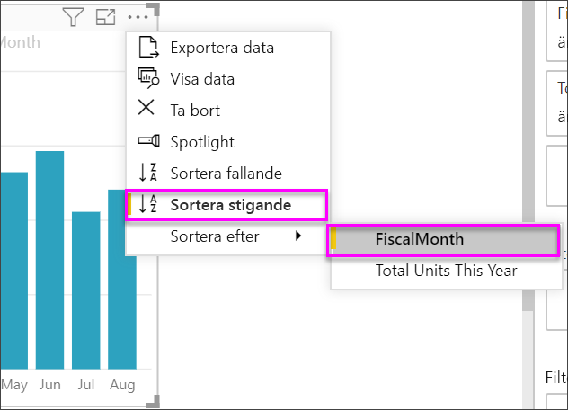

# Visuella KPI-objekt (Key Performance Indicator)

[!INCLUDE [power-bi-visuals-desktop-banner](../includes/power-bi-visuals-desktop-banner.md)]

En KPI (Key Performance Indicator) är en visuell ledtråd som kommunicerar de framsteg som gjorts mot ett mätbart mål. Mer information om KPI:er finns i [Key Performance Indicators (KPI:er) i PowerPivot](/previous-versions/sql/sql-server-2012/hh272050(v=sql.110)).

Du kan också titta på när Will visar hur du skapar enskilda visuella måttobjekt: måttdiagram, kort och KPI:er.
   > [!NOTE]
   > Den här videon använder en äldre version av Power BI Desktop.
   > 
   > 
<iframe width="560" height="315" src="https://www.youtube.com/embed/xmja6EpqaO0?list=PL1N57mwBHtN0JFoKSR0n-tBkUJHeMP2cP" frameborder="0" allowfullscreen></iframe>

## När du ska använda KPI:er

KPI:er är ett bra alternativ

* för att mäta framsteg. Besvarar frågan ”Vad ligger jag före eller efter med”?.

* för att mäta avståndet till ett mål. Besvarar frågan ”Hur långt före eller efter ligger jag”?.

## KPI-krav

En designer baserar ett visuellt KPI-objekt på ett visst mått. Avsikten med KPI:et är att hjälpa dig att utvärdera det aktuella värdet och statusen för ett mått mot ett definierat mål. Ett visuellt KPI-objekt ett *grundläggande* mått som utvärderas mot ett värde och ett *målmått* eller -värde samt ett *tröskelvärde* eller *mål*.

En KPI-datamängd måste innehålla målvärden för en KPI. Om din datamängd inte innehåller målvärden, kan du skapa dem genom att lägga till ett Excel-blad med mål till din datamodell eller PBIX-fil.

## Förutsättningar

De här självstudierna använder sig av [PBIX-filen Exempel på detaljhandelsanalys](https://download.microsoft.com/download/9/6/D/96DDC2FF-2568-491D-AAFA-AFDD6F763AE3/Retail%20Analysis%20Sample%20PBIX.pbix).

1. Välj **Arkiv** > **Öppna** uppe till vänster på menyraden

1. Leta reda på kopian av **PBIX-filen Exempel för detaljhandelsanalys**

1. Öppna **PBIX-filen Exempel på detaljhandelsanalys** i rapportvy. 

1. Välj **+** för att lägga till en ny sida. 

## Så här skapar du en KPI

I det här exemplet skapar du en KPI som mäter de framsteg som du har gjort mot ett försäljningsmål.

1. Välj **Försäljning > Totalt antal enheter i år** i fönstret **Fält**.  Det här värdet är indikatorn.

1. Lägg till **Tid > FiscalMonth (Räkenskapsmånad)** .  Det här värdet representerar trenden.

1. Välj ellipsen i det övre högra hörnet av det visuella objektet och kontrollera att Power BI sorterade kolumnerna i stigande ordning efter **FiscalMonth** (Räkenskapsmånad).

    > [!IMPORTANT]
    > När du har konverterat visualiseringen till en KPI, går det **inte** att sortera. Du måste sortera det korrekt nu.

    

    När ditt visuella objekt har sorterats korrekt kommer det att se ut så här:

    

1. Konvertera det visuella objektet till en KPI genom att välja **KPI-ikonen** i fönstret **Visualisering**.

    

1. Dra **Totalt antal enheter förra året** till fältet **Målsättningar**.

    

1. Du kan som alternativ formatera KPI:n genom att välja färgrollerikonen för att öppna panelen Formatering.

    * **Indikator** – styr indikatorns visningsenheter och decimalplaceringar.

    * **Trendaxel** – när denna är **På**, visar det visuella objektet trendaxeln som bakgrund till det visuella KPI-objektet.  

    * **Mål** – när detta är inställt till **På**, visar det visuella objektet målet och avståndet till målet i procent.

    * **Färgkodning > Riktning** – vissa KPI:er anses som bättre för *högre* värden och andra anses som bättre för *lägre* värden. Intäkter kontra väntetid till exempel. Vanligtvis är ett högre värde för intäkter bättre jämfört med ett högre värde för väntetid. Välj **Högt är bra** och ändra eventuellt färginställningarna.

KPI:er är också tillgängliga i Power BI-tjänsten och på din mobila enhet. Det ger dig möjligheten att alltid vara ansluten och uppdaterad om vad som händer i företaget.

## Överväganden och felsökning

Om din KPI inte ser ut som den på bilden ovan, kan det bero på att du inte har sorterat efter **FiscalMonth** (Räkenskapsmånad). KPI:er saknar sorteringsalternativ. Du måste börja om och sortera efter **FiscalMonth** (Räkenskapsmånad) *innan* du konverterar visualiseringen till en KPI.

## Nästa steg

* [Tips för Power BI-kartvisualiseringar](power-bi-map-tips-and-tricks.md)

* [Visualiseringstyper i Power BI](power-bi-visualization-types-for-reports-and-q-and-a.md)

Har du fler frågor? [Prova Power BI Community](https://community.powerbi.com/)
