# Självstudie: Bädda in ett visuellt objekt från Power Apps i en Power BI-rapport

I den här självstudien använder du visuella objekt i Power Apps för att skapa en ny app som är inbäddad i en exempelrapport i Power BI. Appen samverkar med andra visuella objekt i rapporten.

Om du inte har någon Power Apps-prenumeration kan du [skapa ett kostnadsfritt konto](https://web.powerapps.com/signup?redirect=marketing&email=) innan du börjar.

I de här självstudierna får du lära dig att
> [!div class="checklist"]
> * Lägga till ett visuellt Power Apps-objekt i en Power BI-rapport
> * Arbeta i Power Apps för att skapa en ny app som använder data från Power BI-rapporten
> * Visa och interagera med det visuella objektet från Power Apps i rapporten

## Förutsättningar

* Någon av webbläsarna [Google Chrome](https://www.google.com/chrome/browser/) eller [Microsoft Edge](https://www.microsoft.com/windows/microsoft-edge)
* En [Power BI-prenumeration](https://docs.microsoft.com/power-bi/service-self-service-signup-for-power-bi) med rapporten [Exempel på affärsmöjlighetsanalys](https://docs.microsoft.com/power-bi/sample-opportunity-analysis#get-the-content-pack-for-this-sample) installerad
* Kunskap om hur du [skapar appar i Power Apps](https://docs.microsoft.com/powerapps/maker/canvas-apps/data-platform-create-app-scratch) och hur du [redigerar Power BI-rapporter](https://docs.microsoft.com/power-bi/service-the-report-editor-take-a-tour)

## Skapa en ny app
När du lägger till det visuella Power Apps-objektet i din rapport startas PowerApps Studio med en anslutning för realtidsdata mellan PowerApps och Power BI.

1. Öppna rapporten Exempel för affärsmöjlighetsanalys och välj sidan *Kommande affärsmöjligheter*. 

2. Flytta och ändra storlek på några av panelerna i rapporten så att det nya visuella objektet får plats.

    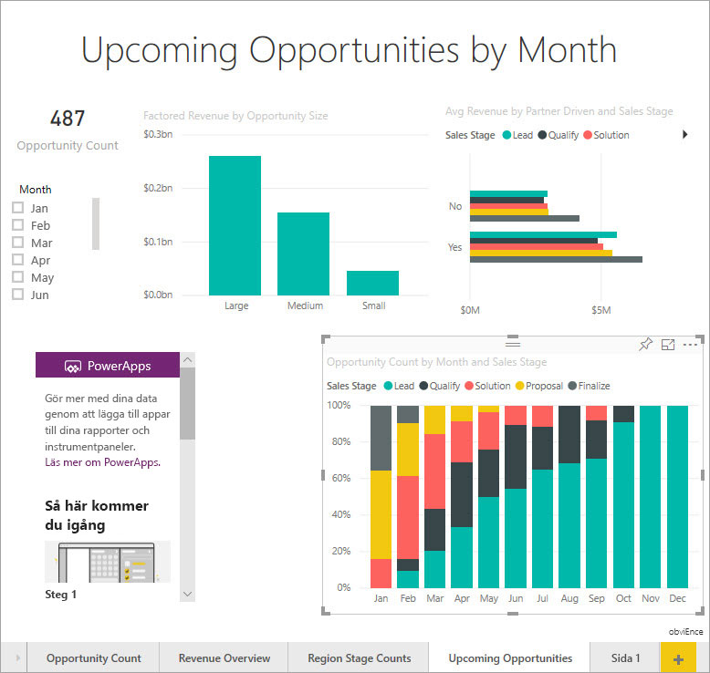

2. I fönstret Visualiseringar väljer du ikonen Power Apps och ändrar sedan storleken på det visuella objektet så att det passar det utrymme du har gjort.

    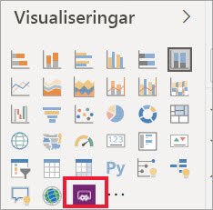

3. I panelen **Fält** väljer du **Namn**, **Produktkod** och **Försäljningsfas**. 

    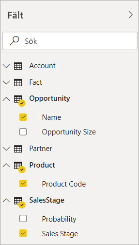

4. På det visuella objektet från Power Apps väljer du den Power Apps-miljö där du vill skapa appen och väljer sedan **Skapa ny**.

    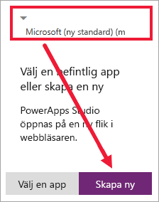

    I Power Apps Studio ser du att en grundläggande app har skapats, med ett *galleri* som visar något av de fält du valt i Power BI.

    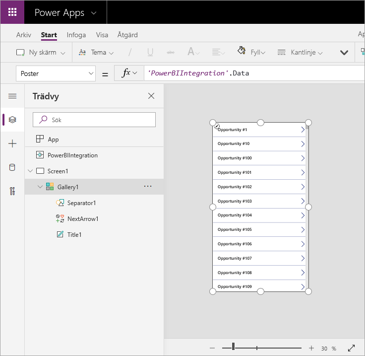

5.  Ändra storlek på galleriet så att det bara upptar ena halvan av skärmen. 

6. Välj **Screen1** i det vänstra fönstret och ange ”LightBlue” för egenskapen **Fyllning** (så att den visas bättre i rapporten).

    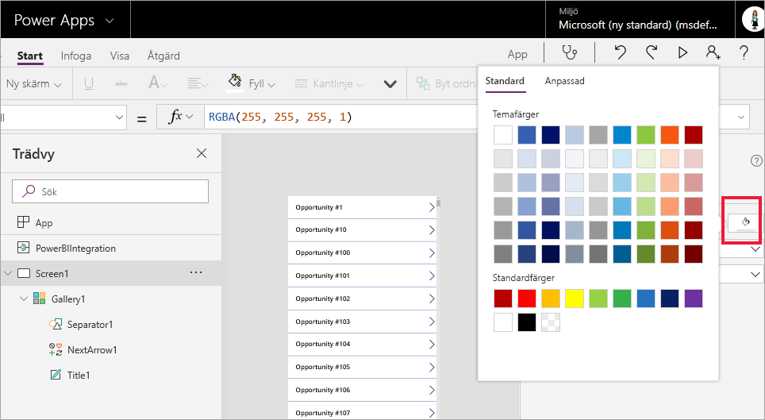

6. Gör lite utrymme för en etikettkontroll. 

    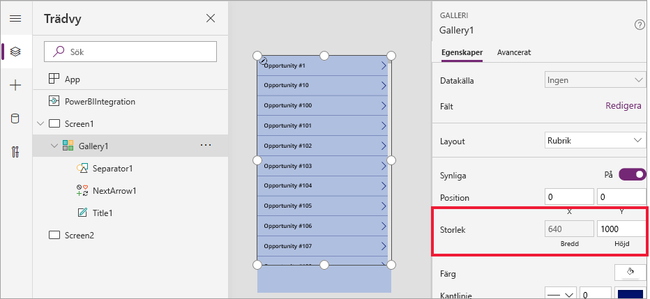

8. Under **Galleri**infogar du en textetikettskontroll.

   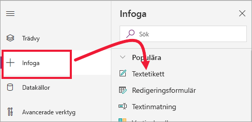

7. Dra etiketten till slutet av ditt visuella objekt. Ange egenskapen **Text** som `"Opportunity Count: " & CountRows(Gallery1.AllItems)`. Nu visas det totala antalet affärsmöjligheter i datauppsättningen.

    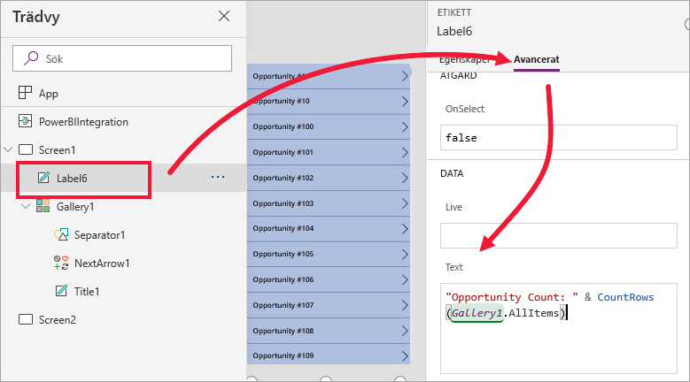

    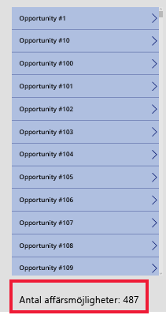

7. Spara appen med namnet ”App för affärsmöjligheter”. 

    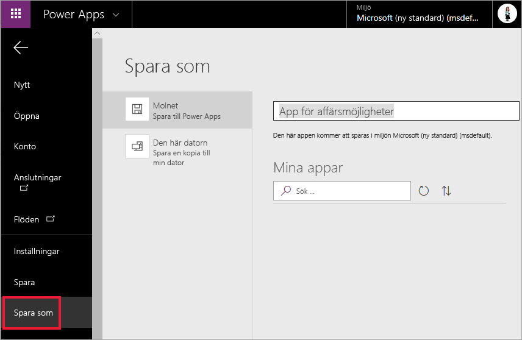

## Visar appen i rapporten
Appen finns nu tillgänglig i Power BI-rapporten och samverkar med andra visuella objekt eftersom den delar samma datakälla.

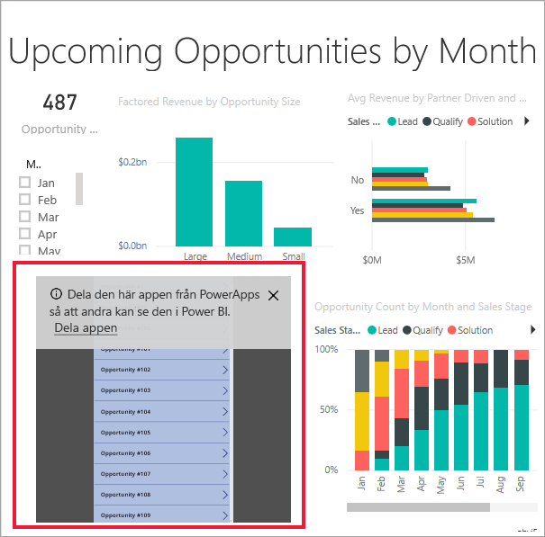

Välj **Jan** i utsnittet i Power BI-rapporten. Då filtreras hela rapporten, inklusive data i appen.

Observera att antalet affärsmöjligheter i appen matchar antalet i det övre vänstra hörnet i rapporten. Du kan välja andra objekt i rapporten, så uppdateras data i appen.

## Rensa resurser
Om du inte vill använda rapporten Exempel på affärsmöjlighetsanalys längre kan du ta bort instrumentpanelen, rapporter och datauppsättningen.

## Nästa steg
[Visuella frågor och svar](power-bi-visualization-types-for-reports-and-q-and-a.md)    
[Självstudie: Bädda in ett visuellt objekt från Power Apps i en Power BI-rapport](https://docs.microsoft.com/powerapps/maker/canvas-apps/powerapps-custom-visual)