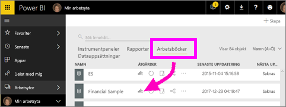
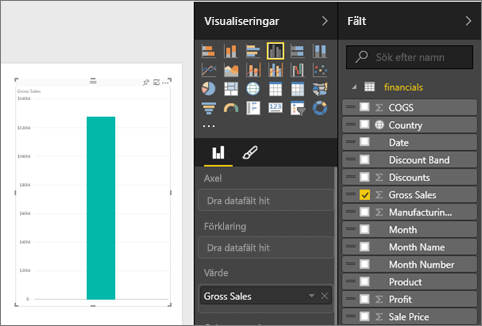
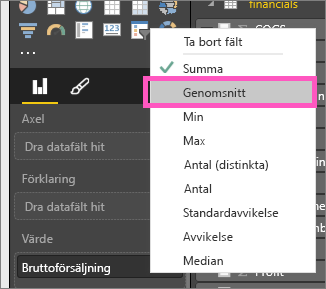
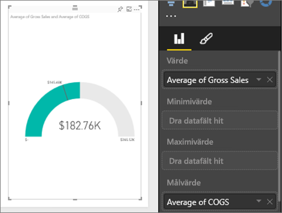
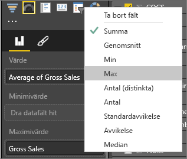
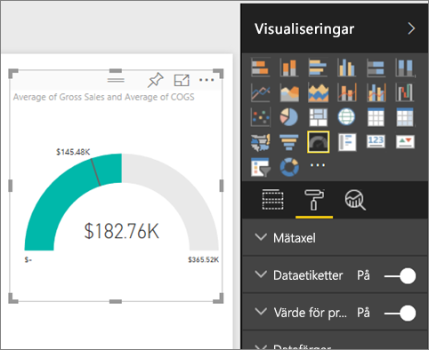
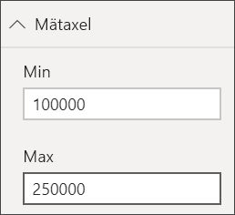
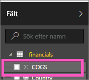
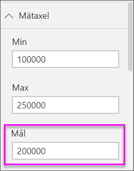

# Diagram med radiella mätare i Power BI
Ett diagram med radiell mätare har en cirkelformad båge och visar ett värde som mäter framsteg på ett mål/KPI.  Målet, eller målvärdet, representeras av strecket (nålen). Framsteg mot målet representeras av skuggningen.  Och det värde som representerar förloppet visas i fetstil i bågen. Alla möjliga värden är jämnt fördelade längs bågen, från det lägsta (värdet längst till vänster) värdet till det högsta (värdet längst till höger).

I exemplet nedan är vi en bilåterförsäljare som spårar våra säljares genomsnittliga försäljning per månad. Vårt mål är 140, vilket representeras av den svarta nålen.  Minsta möjliga genomsnittlig försäljning är 0 och högsta har konfigurerats som 200.  Den blå skuggningen visar att det aktuella medelvärdet är cirka 120 försäljningar denna månad. Som tur är ha vi fortfarande ytterligare en vecka till vårt mål.

## När är det bra att använda en radiell mätare
Radiella mätare är ett bra val för att:

* visa förlopp mot ett mål.
* representera ett procentmått, t.ex. ett KPI.
* visa hälsotillståndet för ett enda mått.
* visa information som går snabbt att genomsöka och förstå.

### Förutsättningar
 - Power BI-tjänsten eller Power BI Desktop
 - Excel-arbetsboken finansiellt exempel: [hämta exempelfilerna direkt](http://go.microsoft.com/fwlink/?LinkID=521962).

## Skapa en grundläggande radiell mätare
De här anvisningarna använder Power BI-tjänsten. Om du vill följa med kan du logga in på Power BI och öppna Excel finansiella exempelfilen.  

Du kan också titta på när Will visar hur du skapar ett enskilt visuellt måttobjekt: måttdiagram, kort och KPI:er.

<iframe width="560" height="315" src="https://www.youtube.com/embed/xmja6EpqaO0?list=PL1N57mwBHtN0JFoKSR0n-tBkUJHeMP2cP" frameborder="0" allowfullscreen></iframe>

### Steg 1: Öppna Excel-filen med finansexemplet
1. [Hämta Excel-filen med finansexemplet](../sample-financial-download.md) om du inte redan gjort det. Kom ihåg var du sparade den.

2. Öppna filen i ***Power BI-tjänsten*** genom att välja **Hämta data \> Filer** och bläddra till den plats där du sparade filen. Välj **Importera**. Finansexemplet läggs till på din arbetsyta som en datauppsättning.

3. Från innehållslistan **Datauppsättning**, väljer du **Finansexempel** för att öppna det i Utforska-läge.

    

### Steg 2: Skapa en mätare för att spåra bruttomarginalförsäljning
1. Välj **bruttomarginalförsäljning** i rutan **Fält**.
   
   
2. Ändra aggregering till **Genomsnitt**.
   
   
3. Välj mätarikonen  för att konvertera stapeldiagrammet till en mätare.
   
   Som standard skapar Power BI ett mätardiagram där det aktuella värdet (i det här fallet genomsnittlig bruttomarginalförsäljning) antas vara mätarens mittpunkt. Eftersom den genomsnittliga bruttomarginalförsäljningen är 182 760 $ är startvärdet (minst) 0 och slutvärdet (max) dubbla det aktuella värdet.
   
   

### Steg 3: Ange ett målvärde
1. Dra **kostnad för sålda varor** till den **Målvärde**.
2. Ändra aggregering till **Genomsnitt**.
   Power BI lägger till en nål som representerar vårt målvärde på **145 480 $** . Observera att vi har överskridit våra mål.
   
   
   
   > [!NOTE]
   > Du kan också ange ett målvärde manuellt.  Se ”Använd formateringsalternativ för att ange värden manuellt för lägsta, högsta och mål” nedan.
   > 
   > 

### Steg 4: Ange ett maxvärde
I steg 2 använde Power BI fältet Värde för att automatiskt ange minimi- och maxvärde.  Men vad händer om du vill ange ett eget maxvärde?  Anta att du i stället för att använda dubbla det aktuella värdet som största möjliga värde vill ange högsta bruttoförsäljningsmarginal i datauppsättningen. 

1. Dra **bruttoförsäljningsmarginal** från listan **Fält** till brunnen **Maxvärde**.
2. Ändra aggregering till **Maxvärde**.
   
   
   
   Mätaren ritas om med ett nytt slutvärde på 1,21 miljoner i bruttoförsäljning.
   
   

### Steg 5: Spara rapporten
1. [Spara rapporten](../service-report-save.md).
2. [Lägga till mätardiagrammet som en panel på instrumentpanelen](../service-dashboard-pin-tile-from-report.md). 

## Använd formateringsalternativ för att ange värden manuellt för lägsta, högsta och mål
1. Ta bort **Maxvärde för bruttoförsäljning** från brunnen **Maxvärde**.
2. Välj rollerikonen för att öppna formateringsfönstret.
   
   
3. Expandera **Mätaraxeln** och ange värden för **Min** och **Max**.
   
    
4. Ta bort det aktuella värdet för målet genom att ta bort markeringen bredvid **kostnad för sålda varor**.
   
    
5. När fältet **Mål** visas under **Mätaraxeln** och ange ett värde.
   
    
6. Du kan också fortsätta formatera ditt mätardiagram.

## Nästa steg

[Mätare i Power BI](power-bi-visualization-kpi.md)

[Visualiseringstyper i Power BI](power-bi-visualization-types-for-reports-and-q-and-a.md)
