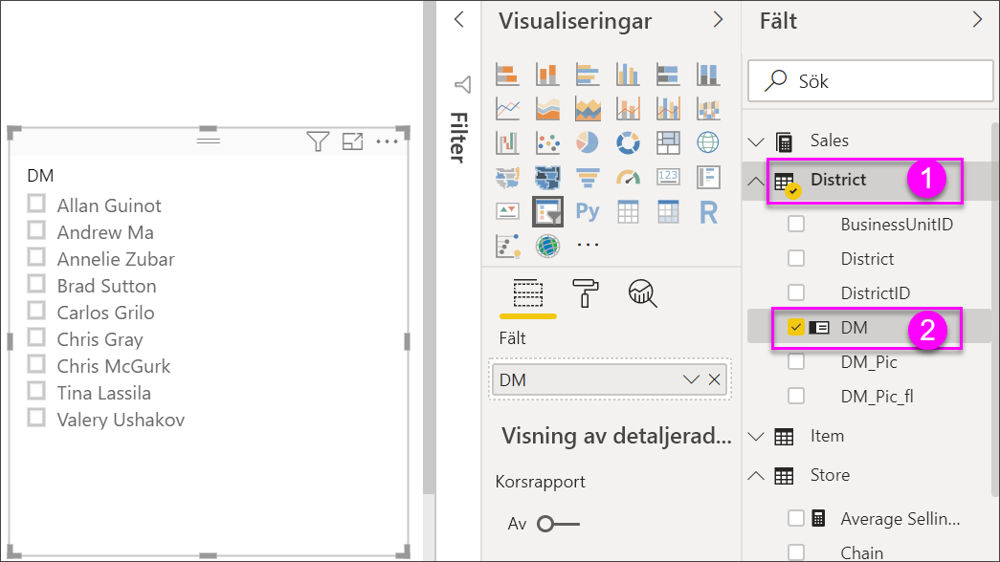
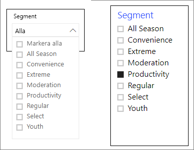
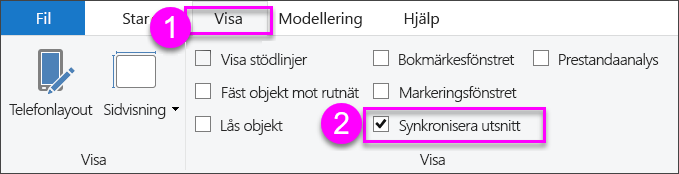
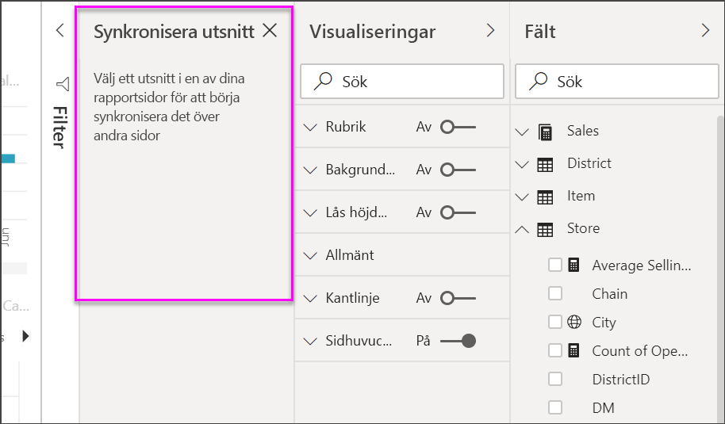
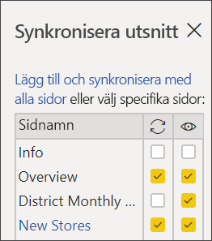

# Utsnitt i Power BI

[!INCLUDE [applies-to](../includes/applies-to.md)] [!INCLUDE [yes-desktop](../includes/yes-desktop.md)] [!INCLUDE [yes-service](../includes/yes-service.md)]

Anta att du vill att rapportens läsare ska kunna se övergripande försäljningsmått, men också att de ska kunna lyfta fram prestanda för enskilda distriktschefer och olika tidsramar. Du kan skapa separata rapporter eller jämförande diagram. Du kan också använda *utsnitt*. Ett utsnitt är en alternativ filtreringsmetod som begränsar den del av datauppsättningen som visas i övriga visualiseringar i en rapport. 

I den här artikeln beskrivs hur du skapar och formaterar ett grundläggande utsnitt med hjälp av det kostnadsfria [exemplet om detaljhandelsanalys](../sample-retail-analysis.md). Dessutom får du se hur du kan styra vilka visuella objekt som påverkas av ett utsnitt och hur du synkroniserar med utsnitt på andra sidor. Här är några andra artiklar som förklarar hur du skapar vissa typer av utsnitt:

- [Numeriska intervallutsnitt](../desktop-slicer-numeric-range.md).
- [Relativa datumutsnitt](desktop-slicer-filter-date-range.md).
- Dynamiska, [storlekskänsliga utsnitt](../power-bi-slicer-filter-responsive.md).
- [Hierarkiutsnitt](../create-reports/power-bi-slicer-hierarchy-multiple-fields.md) med flera fält.

## När ska du använda ett utsnitt
Utsnitt är ett bra val när du vill:

* Visa vanliga eller viktiga filter på rapportarbetsytan för enklare åtkomst.
* Göra det lättare att se det aktuella filtrerade tillståndet utan att öppna listrutan. 
* Filtrera efter kolumner som är onödiga och dolda i datatabellerna.
* Skapa mer fokuserade rapporter genom att placera utsnitt bredvid viktiga visuella objekt.

Power BI-utsnitt stöder inte:

- Indatafält
- Detaljgranskning

## Skapa ett utsnitt

Det här utsnittet filtrerar data efter distriktschef. Om du vill följa med i den här proceduren laddar du ned [filen Retail Analysis sample PBIX](https://download.microsoft.com/download/9/6/D/96DDC2FF-2568-491D-AAFA-AFDD6F763AE3/Retail%20Analysis%20Sample%20PBIX.pbix).

1. Öppna Power BI Desktop och välj **Arkiv** > **Öppna** på menyraden.
   
1. Bläddra till **.pbix-filen Retail Analysis sample PBIX** och välj **Öppna**.

1. I den vänstra rutan väljer du **rapportikonen** för att öppna filen i rapportvyn.

1. På **översiktssidan**, utan något markerat på rapportarbetsytan, väljer du ikonen **Utsnitt** i fönstret **Visualiseringar** för att skapa ett nytt utsnitt. 

1. Med det nya utsnittet markerat väljer du **Distrikt** > **DM** från fönstret **Fält** för att fylla utsnittet. 

    Nu fylls det nya utsnittet med en lista över namnen på distriktscheferna och deras markeringsrutor.
    
    
    
1. Ändra storlek på och dra elementen på arbetsytan för att göra plats för utsnittet. Observera att objekten klipps av om du ändrar storlek på utsnittet så att det blir för litet. 

1. Välj namn i utsnittet och notera effekterna på sidans övriga visualiseringar. Välj namn igen för att avmarkera dem, eller håll ned **CTRL**-tangenten om du vill markera mer än ett namn. Om du väljer alla namn har det samma effekt som om du inte hade valt något namn. 

1. Alternativt väljer du **Format** (ikonen av en målningsrulle) i fönstret **Visualiseringar** för att formatera utsnittet. 

   Det finns för många alternativ för att beskriva alla här. Experimentera och skapa ett utsnitt som passar dina behov. I följande bild har det första utsnittet vågrät orientering, och objekten har färgade bakgrunder. Det andra utsnittet har lodrät orientering och mer av ett standardutseende med färgad text.

   

   >[!TIP]
   >Objekten i en utsnittslista sorteras i stigande ordning som standard. Om du vill ändra sorteringsordningen till fallande väljer du ellipsen ( **...** ) i utsnittets övre högra hörn och väljer **Sortera fallande**.

## Kontrollera vilka visuella objekt på sidan som påverkas av utsnitten
Normalt påverkar utsnitt på rapportsidorna alla övriga visualiseringar på sidan, inklusive varandra. Observera effekten på de andra visualiseringarna när du väljer värden i list- och datumutsnitten som du precis skapat. Filtrerade data utgör en skärningspunkt för de värden som du har valt i båda utsnitten. 

Använd visuella interaktioner om du vill undanta vissa sidvisualiseringar så att de inte påverkas av andra. På sidan **Översikt** visar diagrammet **Total försäljningsvarians efter FiscalMonth och Distriktschef** övergripande jämförelsedata för distriktschefer per månad, som ska vara synliga hela tiden. Du kan använda visuella interaktioner för att förhindra att utsnittsval filtrerar det här diagrammet. 

1. Gå till sidan **Översikt** i rapporten och välj sedan **DM**-utsnittet som du skapade tidigare.

1. På Power BI Desktop-menyn väljer du **Formatera**-menyn under **Visuella verktyg** och väljer sedan **Redigera interaktioner**.
   
   Filterkontroller , var och en med ett **Filter** och alternativet **Inget**, visas ovanför alla visuella objekt på sidan. Alternativet **Filter** är förvalt för alla kontroller.
   
1. Välj alternativet **Inget** i filterkontrollen ovanför diagrammet **Total försäljningsvarians efter FiscalMonth och Distriktschef** för att hindra **DM**-utsnittet från att filtrera det. 

1. Välj **OpenDate**-utsnittet och välj sedan alternativet **Inget** ovanför diagrammet **Total försäljningsvarians efter FiscalMonth och Distriktschef** för att hindra det här utsnittet från att filtrera det. 

   När du nu väljer namn och datumintervall i utsnitten så förändras inte diagrammet **Total försäljningsavvikelse efter FiscalMonth och distriktschef**.

Mer information om hur du redigerar interaktioner finns i [Ändra hur visuella objekt interagerar i en Power BI-rapport](../service-reports-visual-interactions.md).

## Synkronisera och använda utsnitt på andra sidor
Från och med Power BI-uppdateringen från februari 2018 kan du synkronisera ett utsnitt och använda det på några eller alla sidor i en rapport. 

I den aktuella rapporten har sidan **Månadsvis försäljning för distriktet** utsnittet **Distriktschef**, men tänk om vi även vill ha det utsnittet på sidan **Nya butiker**? Sidan **Nya butiker** har ett utsnitt, men det visar bara information om **butiksnamn**. Med fönstret **Synkronisera utsnitt** kan du synkronisera **Distriktschef**-utsnittet med dessa sidor så att utsnittsvalen på en av sidorna påverkar visualiseringarna på alla tre sidor.

1. Välj **Synkronisera utsnitt** på **Visa**-menyn i Power BI Desktop.

    

    Fönstret **Synkronisera utsnitt** visas mellan fönstren **Filter** och **Visualiseringar**.

    

1. Välj utsnittet **Distriktschef** på sidan **Månadsförsäljning för distrikt** för rapporten. 

    Eftersom du redan har skapat ett segment för **Distriktschef** (**DM**) på sidan **Översikt** visas fönstret **Synkronisera utsnitt** på följande sätt:
    
    
    
1. I kolumnen **Synkronisera** i fönstret **Synkronisera utsnitt** väljer du sidorna **Översikt**, **Månadsförsäljning för distrikt** och **Nya butiker**. 

    När du gör det synkroniseras utsnittet **Månadsförsäljning för distrikt** mellan de tre sidorna. 
    
1. I kolumnen **Synlig** i fönstret **Synkronisera utsnitt** väljer du sidan **Nya butiker**. 

    När du gör det visas utsnittet **Månadsförsäljning för distriktet** på de tre sidorna. Nu visas fönstret **Synkronisera utsnitt** så här:

    

1. Observera vilka effekterna blir när du synkroniserar utsnittet och gör det synligt på de övriga sidorna. Som du ser på sidan **Månadsförsäljning för distrikt** visar utsnittet **Distriktschef** nu samma val som på sidan **Översikt**. Nu visas utsnittet **Distriktschef** på sidan **Nya butiker** och de val som görs i utsnittet påverkar valen som visas i utsnittet **Butiksnamn**. 
    
    >[!TIP]
    >Även om utsnittet till att börja med visas på de synkroniserade sidorna med samma storlek och placering som på den ursprungliga sidan, så kan du flytta, ändra storlek på och formatera synkroniserade utsnitt på de olika sidorna oberoende av varandra. 

    >[!NOTE]
    >Om du synkroniserar ett utsnitt till en sida, men inte gör det synligt på sidan, så filtrerar fortfarande de utsnittsval som gjorts på de övriga sidorna informationen på sidan.
 
## Filtrera utsnitt
Du kan använda filter på visuell nivå för utsnitt för att minska listan med värden som visas i utsnittet. Du kan till exempel filtrera bort tomma värden från ett listutsnitt, eller filtrera bort vissa datum från ett intervallutsnitt. När du gör detta påverkar det bara *värden som visas i utsnittet*, inte *filtret som utsnittet gäller för andra visuella objekt* när du gör ett val. Anta till exempel att du använder ett filter till ett intervallutsnitt för att endast visa vissa datum. Valet i utsnittet visar bara de första och sista datumen från intervallet, men du ser fortfarande andra datum i dina andra visuella objekt. När du har ändrat det valda intervallet i utsnittet visas den andra uppdateringen för visuella objekt. Om du avmarkerar utsnittet visas alla datum igen.

Se [Filtertyper](../power-bi-report-filter-types.md) för mer information om filter på visuell nivå.

## Formatutsnitt
Olika formateringsalternativ är tillgängliga beroende på vilken utsnittstyp det rör sig om. Med hjälp av **vågrät** orientering **dynamisk** layout och **objekt**färger kan du skapa knappar och paneler istället för standardlistobjekt och ändra storlek på utsnittsobjekt så att de passar olika skärmstorlekar och layouter.  

1. Med utsnittet **Distriktschef** markerat på valfri sida väljer du **Formatera**-ikonen  i fönstret **Visualiseringar** för att visa formateringskontrollerna. 
    
    
    
1. Välj listrutepilarna bredvid respektive kategori om du vill visa och redigera motsvarande alternativ. 

### Allmänna alternativ
1. Under **Formatera** väljer du **Allmänt**, väljer en röd färg under **Konturfärg** och ändrar sedan **Konturtjocklek** till *2*. 

    Den här inställningen ändrar färgen och tjockleken för konturer och understrykningar för sidhuvuden och objekt.

1. För **Orientering** är **Lodrät** markerat som standard. Välj **Vågrät** om du vill skapa ett utsnitt med vågrätt ordnade paneler eller knappar, och rullningspilar för att komma åt objekt som inte får plats i utsnittet.
    
    
    
1. **Aktivera** **Dynamisk layout** om du vill ändra utsnittsobjektens storlek och placering beroende på skärmvy och utsnittsstorlek. 

    För listutsnitt förhindrar en dynamisk layout att objekt klipps av på små skärmar. Alternativet är endast tillgängligt med vågrät orientering. När det gäller intervallskjutreglage ändrar dynamisk formatering skjutreglagets format och ger möjlighet till mer flexibel storleksändring. Båda typerna av utsnitt visas som filterikoner på små skärmar.
    
    
    
    >[!NOTE]
    >Ändringar av dynamisk layout kan åsidosätta specifik rubrik- och objektformatering som du anger. 
    
1. Under **X-position**, **Y-position**, **Bredd** och **Höjd** anger du utsnittets position och storlek med numerisk precision eller flyttar och ändrar storlek på utsnittet direkt på arbetsytan. 

    Experimentera med olika objektstorlekar och arrangemang, och observera hur den dynamiska formateringen ändras. De här alternativen är bara tillgängliga när du väljer vågrät orientering. 

    

Mer information om vågrät orientering och dynamisk layout finns i [Skapa ett dynamiskt utsnitt som du kan ändra storlek på i Power BI](../power-bi-slicer-filter-responsive.md).

### Markeringsalternativ (endast listutsnitt)
1. Under **Markeringskontroller** **aktiverar** du **Visa alternativet Markera allt** för att lägga till ett **Markera allt**-objekt till utsnittet. 

    **Visa alternativet Markera allt** är **inaktiverat** som standard. När det här alternativet är aktiverat markeras eller avmarkeras alla objekt när du växlar inställning. Om du markerar alla objekt avmarkeras ett objekt om du väljer det, vilket innebär att du kan använda ett filter av typen *är inte*.
    
    
    
1. **Inaktivera** **Markera enstaka** om du vill markera flera objekt utan att behöva hålla ned **CTRL**-tangenten. 

    **Markera enstaka** är **aktiverat** som standard. Om du markerar ett objekt markeras det, och om du håller ned **CTRL**-tangenten markeras flera objekt. Om du markerar objektet igen, avmarkeras det.

### Rubrik alternativ
**Rubrik** är **aktiverat** som standard. Det här alternativet visar namnet på datafält överst i utsnittet. 
- I den här artikeln ska du formatera rubriktexten så här: 
   - **Teckenfärg**: röd
   - **Textstorlek**: **14 pt**
   - **Justering**: **Centrera**
   - **Teckensnittsfamilj**: **Arial Black**

### Objektalternativ (endast listutsnitt)
1. I den här artikeln ska du formatera **objektalternativen** så här:
    - **Teckenfärg**: svart
    - **Bakgrund**: ljusröd
    - **Textstorlek**: **10 pt**
    - **Teckensnittsfamilj**: **Arial**
 
1. Välj **Ram** för **Kontur** om du vill rita en kantlinje runt varje objekt med den storlek och färg du anger under alternativet **Allmänt**. 
    
    
    
    >[!TIP]
    >- Med **Allmänt** > **Orientering** > **Vågrät** visas avmarkerade objekt med valda text- och bakgrundsfärger, medan markerade objekt använder systemstandard, vanligtvis svarta bakgrunder med vit text.
    >- När **Allmänt** > **Orientering > Vågrät** är valt, visas objekt alltid med de valda färgerna, och kryssrutorna är alltid svarta när de är markerade. 

### Datum/numeriska indata och skjutreglagealternativ (endast utsnitt med skjutreglage för intervall)
- För listutsnitt är alternativen för datum/numeriska indata samma som alternativen för **Objekt**, förutom att det inte finns några kontur- eller understrykningsalternativ.
- Med **skjutreglagealternativen** kan du välja färg för intervallskjutreglaget eller **inaktivera** skjutreglaget, så att endast numeriska indata är möjligt.

### Andra formateringsalternativ
De andra formateringsalternativen är **inaktiverade** som standard. **Aktivera** följande alternativ om du vill ändra dem: 
- **Bakgrund**: Lägg till en bakgrundsfärg till utsnittet och ställ in transparensen.
- **Lås höjd/bredd**: Bevara utsnittets form om utsnittets storlek ändras.
- **Kantlinje**: Lägg till en kantlinje runt utsnittet och ange kantlinjens färg. Den här utsnittskantlinjen är separat från och påverkas inte av de **allmänna** konturinställningarna. 

## Nästa steg
Mer information finns i följande artiklar:

- [Visualiseringstyper i Power BI](power-bi-visualization-types-for-reports-and-q-and-a.md)

- [Tabeller i Power BI](power-bi-visualization-tables.md)

