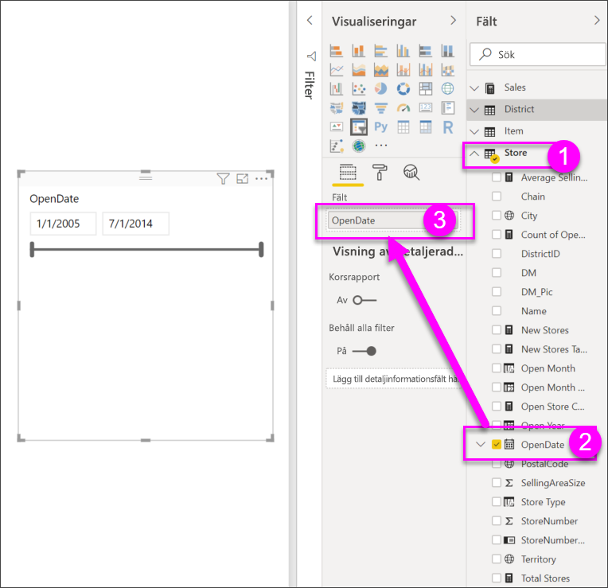
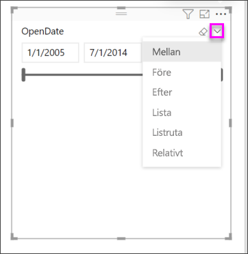

# Utsnitt i Power BI

[!INCLUDE [power-bi-visuals-desktop-banner](../includes/power-bi-visuals-desktop-banner.md)]

Du vill att rapportens läsare ska kunna se övergripande försäljningsmått, men också att de ska kunna lyfta fram prestanda för enskilda distriktschefer och olika tidsramar. Du kan skapa separata rapporter eller jämförande diagram, eller så kan du använda utsnitt. Ett utsnitt är en alternativ filtreringsmetod som begränsar den del av datauppsättningen som visas i övriga visualiseringar i en rapport. 

I den här självstudien används kostnadsfria [Exempel på detaljhandelsanalys](../sample-retail-analysis.md) för att visa hur du kan skapa, formatera och använda utsnitt för listor och datumutsnitt. Du kommer att upptäcka nya sätt att formatera och använda utsnitt. 

## När ska du använda ett utsnitt
Utsnitt är ett bra val när du vill:

* Visa vanliga eller viktiga filter på rapportarbetsytan för enklare åtkomst.
* Göra det lättare att se det aktuella filtrerade tillståndet utan att öppna listrutan. 
* Filtrera efter kolumner som är onödiga och dolda i datatabellerna.
* Skapa mer fokuserade rapporter genom att placera utsnitt bredvid viktiga visuella objekt.

Power BI-utsnitt har följande begränsningar:

- Utsnitt stöder inte indatafält.
- Det stöds inte att gå in på detaljnivå för utsnitt.

## Skapa utsnitt

**Skapa ett nytt utsnitt och filtrera data efter distriktschef**

De här självstudierna använder sig av [PBIX-filen Exempel på detaljhandelsanalys](http://download.microsoft.com/download/9/6/D/96DDC2FF-2568-491D-AAFA-AFDD6F763AE3/Retail%20Analysis%20Sample%20PBIX.pbix).

1. Välj **Arkiv** > **Öppna** uppe till vänster på menyraden
   
2. Leta reda på kopian av **PBIX-filen Exempel för detaljhandelsanalys**

1. Öppna **PBIX-filen Exempel för detaljhandelsanalys** i rapportvyn .

1. Välj  för att lägga till en ny sida.

2. På översiktssidan, utan något markerat på kanvaset, väljer du ikonen **Utsnitt**  i **Visualiseringar**-fönstret för att skapa ett nytt utsnitt. 
3. Med det nya utsnittet markerat, från Fält-fönstret, väljer du **Distrikt** > **DM** för att fylla i utsnittet. Det nya utsnittet är en lista med markeringsrutor framför namnen. 
    
    
    
4. Ändra storlek och dra utsnittet och andra element på arbetsytan så att du frigör utrymme för utsnittet. Observera att utsnittsobjekten klipps av om du gör utsnittet för litet. 
5. Välj namn för utsnittet och notera effekterna på sidans övriga visualiseringar. Avmarkera namnen och välj mer än ett namn genom att hålla ned **Ctrl**-tangenten. Om du väljer alla namn har det samma effekt som om du inte hade valt något namn. 

6. Alternativt kan du välja färgvalsikonen för att formatera utsnittet. Det finns helt enkelt för många alternativ för att beskriva alla här. Experimentera och skapa ett utsnitt som passar dina behov. I exemplen nedan använder det första utsnittet en vågrät orientering och färgade bakgrunder för objekten. Det andra utsnittet har hållits lodrätt och färglägger i stället texten för ett mer standardutseende.

   
>[!TIP]
>Listans utsnittsobjekt sorteras som standard i stigande alfanumerisk ordning. Om du vill ändra sorteringsordningen till fallande väljer du ellipsen ( **...** ) i utsnittets övre högra hörn och väljer **Sortera fallande**.

**Skapa ett nytt utsnitt och filtrera data efter datumintervall**

1. Utan något markerat på kanvaset, släpper du **Affär** i Fält-fönstret och drar **OpenDate** till **Värden**-brunnen i Visualiseringar-fönstret för att skapa en ny visualisering.
2. Konvertera den nya visualiseringen till ett utsnitt genom att markera den nya visualiseringen och välja ikonen **Utsnitt**. Den här utsnittet är ett skjutreglage med ifyllt datumintervall.
    
    

    
4. Ändra storlek och dra utsnittet och andra element på arbetsytan så att du frigör utrymme för utsnittet. Observera att skjutreglaget anpassas efter utsnittets storlek, men det försvinner och datumen klipps bort om du gör utsnittet för litet. 
4. Välj olika datumintervall med skjutreglaget eller välj ett datumfält så att du kan skriva in ett värde eller öppna en kalender om du vill göra med precisa val. Observera effekterna på de övriga visualiseringarna på sidan.
    
    >[!NOTE]
    >Numeriska datatyper och datum-/tiddatatyper producerar skjutreglageutsnitt som standard. Från och med Power BI-uppdateringen i februari 2018 fäster skjutreglage för heltalsdata nu till helstalsvärden istället för att visa decimaler. 

5. Om du vill ändra utsnittstyp för ett markerat utsnitt hovrar du över utsnittets övre högra område, släpper cirkumflexet som visas och väljer något av de andra alternativen, t.ex. **Lista** eller **Före**. Observera hur utsnittsalternativen och urvalsalternativen ändras. 
 
    

Mer information om hur du skapar utsnitt för datum och numeriska intervall finns i följande video och [Använda utsnittet för numeriska intervall i Power BI Desktop](../desktop-slicer-numeric-range.md).
   > [!NOTE]
   > Den här videon använder en äldre version av Power BI Desktop.
   > 
   > 
<iframe width="560" height="315" src="https://www.youtube.com/embed/zIZPA0UrJyA" frameborder="0" allowfullscreen></iframe> 

## Kontrollera vilka visuella objekt på sidan som påverkas av utsnitten
Normalt påverkar utsnitt på rapportsidorna alla övriga visualiseringar på sidan, inklusive varandra. När du väljer värden i listan och datumskjutreglagen som du just har skapat kan du se vilken inverkan de har på de övriga visualiseringarna. Filtrerade data utgör en skärningspunkt för de värden som du har valt i båda utsnitten. 

Du kan använda **Visuella interaktioner** om du vill förhindra att vissa sidvisualiseringar påverkas av andra. Diagrammet ”Total försäljningsvarians per FiscalMonth och distriktschef” hanteraren” på sidan **Översikt** visar övergripande jämförelsedata för distriktschefer per månad, vilket du vill alltid ska visas. Du kan använda **Visuella interaktioner** för att förhindra att utsnittsurval filtrerar det här diagrammet. 

1. Med utsnittet distriktschef på sidan **Månadsvis försäljning för distriktet** markerad:
    - Välj menyn **Format** under **Visuella verktyg** i Power BI Desktop och välj sedan **Redigera interaktioner**.
   
   Filterkontroller  visas ovanför alla andra visuella objekt på sidan. Alla **filter**ikoner är markerade initialt.
   
2. Välj ikonen **Ingen** ovanför diagrammet **Total försäljningsavvikelse efter FiscalMonth och distriktschef**, vilket förhindrar att utsnittet filtrerar det. 
3. Välj utsnittet **Månad** och sedan återigen ikonen **Ingen** ovanför diagrammet **Total försäljningsavvikelse efter FiscalMonth och distriktschef**, vilket förhindrar att utsnittet filtrerar det. När du nu väljer namn och datumintervall i utsnitten så förändras inte diagrammet Total försäljningsavvikelse efter FiscalMonth och distriktschef. 

Mer information om hur du redigerar interaktioner finns i [Visuella interaktioner i en Power BI-rapport](../service-reports-visual-interactions.md).

## Synkronisera och använda utsnitt på andra sidor
Från och med Power BI-uppdateringen från februari 2018 kan du synkronisera ett utsnitt och använda det på några eller alla sidor i en rapport. 

I den aktuella rapporten har sidan **Månadsvis försäljning för distriktet** även utsnittet **Distriktschef** men tänk om vi även vill ha det utsnittet på **Översikt**-sidan? Sidan **Nya butiker** har också ett utsnitt men det erbjuder bara **Butiksnamn**-information. Med fönstret **Synkronisera utsnitt** kan vi synkronisera **Distriktschef**-utsnittet till dessa sidor så att utsnittets val på alla sidor påverkar visualiseringarna på alla tre sidorna.

1. På menyn **Visa** väljer du **Synkronisera utsnitt** i Power BI Desktop.

    

1.  Fönstret **Synkronisera utsnitt** visas mellan fönstren **Filter** och **Visualiseringar**.  

    

1. På sidan **Månadsvis försäljning för distriktet** väljer du utsnittet **Distriktschef**. 
    
    
    
3. I kolumnen **Synkronisera** väljer du sidan **Nya butiker** och därefter **Översikt** för att synkronisera utsnittet **Månadsvis försäljning för distriktet** till de sidorna. 
    
3. I kolumnen **Synliga** väljer du sidan **Nya butiker** och därefter **Översikt**. Ditt fönster för **Synkronisera utsnitt** bör nu se ut som bilden nedan:

    

1. Observera vilka effekterna blir när du synkroniserar utsnittet och gör det synligt på de övriga sidorna. Utsnittet **Distriktschef** på sidan **Månatlig distriktsförsäljning** visar samma val som på sidan **Översikt**. Urvalen i utsnittet **Distriktschef** på sidan **Nya butiker** påverkar de urval som är tillgängliga i utsnittet **Arkivnamn**. 
    
    >[!TIP]
    >Även om utsnittet till att börja med visas på de synkroniserade sidorna med samma storlek och placering som på den ursprungliga sidan, så kan du flytta, ändra storlek på och formatera synkroniserade utsnitt på de olika sidorna oberoende av varandra. 

>[!NOTE]
>Om du synkroniserar ett utsnitt till en sida, men inte gör det synligt på sidan, så filtrerar fortfarande de utsnittsurval som gjorts på de övriga sidorna informationen på sidan.
 
## Formatutsnitt
Olika formateringsalternativ är tillgängliga beroende på vilken utsnittstyp det rör sig om. Med hjälp av **vågrät** orientering **dynamisk** layout och **objekt**färger kan du skapa knappar och paneler istället för standardlistobjekt och ändra storlek på utsnittsobjekt så att de passar olika skärmstorlekar och layouter.  

1. Med utsnittet **Distriktschef** markerat på valfri sida, i fönstret **Visualiseringar**, väljer du **Formatera**-ikonen  för att visa formateringskontrollerna. 
    
    
    
2. Välj listrutepilarna bredvid respektive kategori om du vill visa och redigera motsvarande alternativ. 

### Allmänna alternativ
1. Välj rött under **Konturfärg** och ändra **Konturtjocklek** till ”2”. Då ställer du in färg och tjocklek för konturer eller understrykningar för rubrik och objekt, när det är aktiverat. 
2. **Lodrät** är standard under **Orientering**. Välj **Vågrät** om du vill skapa ett utsnitt med vågrätt ordnade paneler eller knappar, och rullningspilar om du vill få åtkomst till objekt som inte passar in i utsnittet.
    
    
    
3. Aktivera **Dynamisk** layout om du vill ändra utsnittsobjektens storlek och placering beroende på skärmvy och utsnittsstorlek. Dynamisk layout för listutsnitt finns bara i vågrät orientering och förhindrar objekten från att beskäras på mindre skärmar. När det gäller intervallskjutreglage ändrar dynamisk formatering skjutreglagets format och ger möjlighet till mer flexibel storleksändring. Båda typerna av utsnitt bli filterikoner vid mycket små storlekar. 
    
    
    
    >[!NOTE]
    >Ändringar av dynamisk layout kan åsidosätta specifik rubrik- och objektformatering som du anger. 
    
4. Ange utsnittets position och storlek med numerisk precision under **X-position**, **Y-position**, **Bredd** och **Höjd**, eller flytta och ändra storlek på utsnittet direkt på arbetsytan. Experimentera med olika objektstorlekar och arrangemang, och observera hur den dynamiska formateringen ändras.  

    

Mer information om vågrät orientering och dynamisk layout finns i [Skapa ett dynamiskt utsnitt som du kan ändra storlek på i Power BI](../power-bi-slicer-filter-responsive.md).

### Markeringsalternativ (endast listutsnitt)
1. **Visa Markera alla** har inställningen **Av** som standard. Ändra inställningen till **På** om du vill lägga till ett **Markera alla**-objekt i utsnittet som markerar eller avmarkerar alla objekt när det växlas. När alla objekt har markerats kan du avmarkera ett objekt genom att klicka eller trycka på det, vilket ger ett filter av ”är-inte”-typ. 
    
    
    
2. **Markera enstaka** har inställningen **På** som standard. Du kan markera ett objekt genom att klicka eller trycka på det och markera flera objekt genom att hålla ned **Ctrl**-tangenten och klicka eller trycka på dem. Ändra **Markera enstaka** till **Av** om du vill att det ska gå att markera flera objekt utan att hålla ned **Ctrl**-tangenten. Du avmarkerar ett objekt genom att klicka eller trycka på det igen. 

### Rubrik alternativ
**Rubrik** är **På** som standard och visar datafältsnamnet överst i utsnittet. 
1. Formatera rubriktexten för att göra **Teckenfärgen** röd, **Textstorleken** 14 pt, centrera **Justering** och **Teckensnittsfamiljen** Arial Black. 

### Objektalternativ (endast listutsnitt)
1. Formatera objekttext och -bakgrund med **Teckenfärg** svart, **Bakgrund** ljusröd, **Textstorlek** 10 pt och **Teckensnittsfamilj** Arial. 
2. Välj **Ram** under **Kontur** om du vill rita en kantlinje runt varje objekt med den storlek och färg du anger under alternativet **Allmänt**. 
    
    
    
    >[!TIP]
    >- Med **Orientering > Vågrät** visas avmarkerade objekt med valda text- och bakgrundsfärger, medan markerade objekt använder systemstandard, vanligtvis svarta bakgrunder med vit text.
    >- Med **Orientering > Lodrät** visas objekt alltid med angivna färger, och markeringsrutor är alltid svarta när de är markerade. 

### Datum/numeriskt indata och skjutreglagealternativ (endast intervallskjutreglage för utsnitt)
- Alternativ för datum/numeriska indata är desamma som **Objekt**-alternativen för listutsnitt, med undantag för att det inte finns någon **Disposition** eller understrykning.
- Med skjutreglagealternativen kan du ange intervallskjutreglagets färg eller ställa in skjutreglaget på **Av**, vilket endast möjliggör numeriska indata.

### Andra formateringsalternativ
De andra formateringsalternativen är inaktiverade som standard. När de ändras till **På**: 
- **Bakgrund:** En bakgrundsfärg läggs till i det övergripande utsnittet och dess transparens anges.
- **Lås höjd/bredd:** Utsnittets form behålls om dess storlek ändras.
- **Kantlinje:** En kantlinje på 1 bildpunkt läggs till runt utsnittet och dess färg anges. (Den här utsnittskantlinjen är separat från och påverkas inte av de allmänna konturinställningarna.) 

## Nästa steg
[Visualiseringstyper i Power BI](power-bi-visualization-types-for-reports-and-q-and-a.md)

[Tabeller i Power BI](power-bi-visualization-tables.md)

