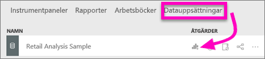

# Tabeller i Power BI-rapporter och instrumentpaneler
En tabell är ett rutnät som innehåller relaterade data i en logisk serie med rader och kolumner. Det kan också innehålla rubriker och en rad för summor. Tabeller fungerar bra med kvantitativa jämförelser där du tittar på många värden för en enskild kategori. I den här tabellen visas till exempel 5 olika mått för **Kategori**.

Skapa tabeller i rapporter och markera flera element i tabellen med andra visuella objekt på samma rapportsida.  Dessutom kan du välja rader, kolumner och även enskilda celler och korsmarkeringar. Du kan kopiera enskilda celler och markeringar av flera celler och klistra in dem i andra program.

## När du ska en tabell
Tabeller är ett bra alternativ:

* för att visa och jämföra detaljerade data och exakta värden (istället för visuella representationer)
* för att visa data i tabellformat
* att visa numeriska data efter kategorier   

> [!NOTE]
> Om en tabell har för många värden, bör du omvandla den till en matris och/eller ändra detaljnivån. Det högsta antalet datapunkter som går att visa i en tabell är 3 500.

## Förutsättningar
- Power BI-tjänsten eller Power BI Desktop
- Exempel på detaljhandelsanalys

## Skapa en tabell
Vi ska skapa tabellen som visas ovan för att visa försäljningsvärden efter kategori för objektet. Om du vill följa med, loggar du in i Power BI-tjänsten och väljer **Hämta data\> Exempel \> Exempel på detaljhandelsanalys > Anslut** och välj **Gå till instrumentpanel**. För att skapa en visualisering krävs behörighet att redigera datauppsättningen och rapporten. Som tur är kan alla Power BI-exemplen redigeras. Om en rapport har delats med dig, kan du inte skapa visualiseringar i rapporten.

1. I det vänstra navigeringsfönstret väljer du **Arbetsytor > Min arbetsyta**.    
2. Välj fliken Datauppsättningar och rulla till Exempel på detaljhandelsanalys som du precis la till.  Välj ikonen **Skapa rapport**.

    
2. I rapportredigeraren väljer du **Objekt** > **Kategori**.  Power BI skapar automatiskt en tabell som listar alla kategorier.

    
3. Välj **Försäljning > Genomsnittligt enhetspris** och **Försäljning > Senaste årets försäljning** och **Försäljning > Försäljning detta år** och välja alla 3 alternativ (värde, mål, status).   
4. Identifiera **Värden** i fönstret visualiseringar och dra och släpp värdena tills ordningen på diagramkolumnerna matchar den första bilden på den här sidan.  Dina värden bör se ut så här.

    
5. Fäst tabellen på instrumentpanelen genom att välja häftstift-ikonen  

     

## Formatera tabellen
Du kan formatera en tabell på många sätt och vi beskriver endast några här. Ett bra sätt att lära dig om de andra formateringsalternativen är att öppna fönstret formatering (färgrollerikonen ) och utforska.

* Försök att formatera tabellrutnätet. Här vi har lagt till ett blått lodrätt rutnät, lagt till utrymme i raderna, ökat kantlinjen och ändra textstorleken något.

    

    
* För kolumnrubrikerna har vi ändrat bakgrundsfärgen, lagt till en kantlinje och ökat teckenstorleken. 

    

    

* Du kan även formatera enskilda kolumner och kolumnrubriker. Starta genom att utvidga **Fältformatering** och markera den kolumn som ska formateras från listrutan. Med Fältformatering kan du, beroende på kolumnvärdena, t.ex. ange visningsenheter, teckensnittsfärg, antal decimaler, bakgrund, justering och mycket mer. När du har justerat inställningarna kan du ange om dessa inställningar även ska tillämpas på rubrik och summarad.

    

* Här är vår slutliga tabell efter ytterligare lite formatering. Eftersom det finns så många formateringsalternativ är det bästa sättet att lära dig är att börja med standardformateringen, öppna formateringsfönstret  och börja utforska. 

    

### Villkorsstyrd formatering
En typ av formatering kallas *villkorsstyrd formatering* och denna tillämpas på fälten i **Värden** i fönstret **Visualiseringar** i Power BI-tjänsten eller Desktop. 

Med villkorsstyrd formatering för tabeller kan du specificera anpassade cellbakgrundsfärger och teckenfärg baserat på cellvärden, inklusive toningar. 

1. I fönstret **Visuella objekt** i Power BI Desktop väljer du nedpilen bredvid värdet i brunnen **Värden** som du vill formatera (eller högerklicka på fältet). Du kan endast hantera villkorsstyrd formatering för fälten i området **Värden** i brunnen **Fält**.

    
2. Välj **Skalor för bakgrundsfärg**. I dialogrutan som visas kan du konfigurera färgen, samt *minimi-* och *max*värden. Om du väljer rutan **Avvikande** kan du konfigurera ett valfritt *Centrumvärde*.

    

    Vi kan lägga till anpassad formatering våra värden för Genomsnittligt enhetspris. Välj **Divergerande**, lägg till färger och välj **OK**. 

    
3. Lägg till ett nytt fält i tabellen som innehåller både positiva och negativa värden.  Välj **Försäljning > Total försäljningsvarians**. 

    
4. Lägg till datastapeln villkorsstyrd formatering genom att välja nedåtpilen bredvid **Total försäljningsvarians** och välja **Villkorsstyrd formatering > Datastaplar**.

    
5. I dialogrutan som visas, ange färger för **Positiv stapel**, **Negativ stapel**, markera bredvid **Visa endast liggande** och gör eventuella andra ändringar.

    

    När du väljer **OK** ersätter datastaplar de numeriska värdena i tabellen, vilket gör den lättare att söka igenom.

    
6. Om du vill ta bort villkorlig formatering från en visualisering, bara högerklickar du på fältet igen och väljer **ta bort villkorsstyrd formatering**.

> [!TIP]
> Villkorsstyrd formatering är också tillgängligt från fönstret formatering (rollerikonen). Välj värdet att formatera och växla sedan **färgskalor** eller **datastaplar** till **På** för att använda standardinställningarna eller, om du vill anpassa inställningarna, välj **Avancerade kontroller**.
> 
## Kopiera värden från Power BI-tabeller så att du kan använda dem i andra program

Din tabell eller matris kan ha innehåll som du vill använda i andra program som Dynamics CRM eller Excel eller t.o.m. i andra Power BI-rapporter. Genom att högerklicka i Power BI kan du kopiera en cell eller ett cellurval till Urklipp och klistra in informationen i det andra programmet.

* Om du vill kopiera en enskild cells värde markerar du cellen, högerklickar och väljer **Kopiera värde**. Med det oformaterade cellvärdet i Urklipp kan du nu klistra in det i ett annat program.

    

* Om du vill kopiera mer än en enskild cell markerar du ett cellområde eller markerar en eller flera celler med hjälp av CTRL. Kopian inkluderar kolumn- och radrubrikerna.

    

    Kopian inkluderar kolumn- och radrubrikerna.

    

## Justera kolumnbredden i en tabell
Power BI trunkerar ibland en kolumnrubrik i en rapport eller på en instrumentpanel. Om du vill visa hela kolumnnamnet håller du muspekaren över utrymmet till höger om rubriken för att visa dubbelpilarna, markera och dra.

## Överväganden och felsökning
* Om du lägger till kolumnformatering kan du bara välja ett justeringsalternativ per kolumn: automatisk justering, vänsterjustering, centrering eller högerjustering. Oftast innehåller en kolumn antingen text eller tal, inte en blandning av både text och tal. Om en kolumn innehåller både tal och text vänsterjusteras texten och talen högerjusteras om du väljer **automatisk justering**. Det här beteendet används med ”vänster till höger”-språk.   

## Nästa steg

[Trädkartor i Power BI](power-bi-visualization-treemaps.md)

[Visualiseringstyper i Power BI](power-bi-visualization-types-for-reports-and-q-and-a.md)