# Tabeller i Power BI-rapporter och instrumentpaneler

[!INCLUDE [power-bi-visuals-desktop-banner](../includes/power-bi-visuals-desktop-banner.md)]

En tabell är ett rutnät som innehåller relaterade data i en logisk serie med rader och kolumner. Det kan också innehålla rubriker och en rad för summor. Tabeller fungerar bra med kvantitativa jämförelser där du tittar på många värden för en enskild kategori. I den här tabellen visas till exempel fem olika mått för **Kategori**.

Skapa tabeller i rapporter och korsmarkera flera element i tabellen med andra visuella objekt på samma rapportsida. Du kan välja rader, kolumner och även enskilda celler och korsmarkeringar. Du kan också kopiera och klistra in enskilda celler och markeringar av flera celler i andra program.

## När du ska en tabell

Tabeller är ett bra alternativ:

* för att visa och jämföra detaljerade data och exakta värden (istället för visuella representationer)

* för att visa data i tabellformat

* för att visa numeriska data efter kategorier.

## Förutsättning

De här självstudierna använder sig av [PBIX-filen Exempel på detaljhandelsanalys](https://download.microsoft.com/download/9/6/D/96DDC2FF-2568-491D-AAFA-AFDD6F763AE3/Retail%20Analysis%20Sample%20PBIX.pbix).

1. Välj **Arkiv** > **Öppna** uppe till vänster på menyraden
   
2. Leta reda på kopian av **PBIX-filen Exempel för detaljhandelsanalys**

1. Öppna **PBIX-filen Exempel för detaljhandelsanalys** i rapportvyn .

1. Välj  för att lägga till en ny sida.

## Skapa en tabell

Du ska skapa tabellen som visas i början av artikeln för att visa försäljningsvärden efter objektskategori.

1. I fönstret **Fält** väljer du **Objekt** > **Kategori**.

    Power BI skapar automatiskt en tabell som listar alla kategorier.

    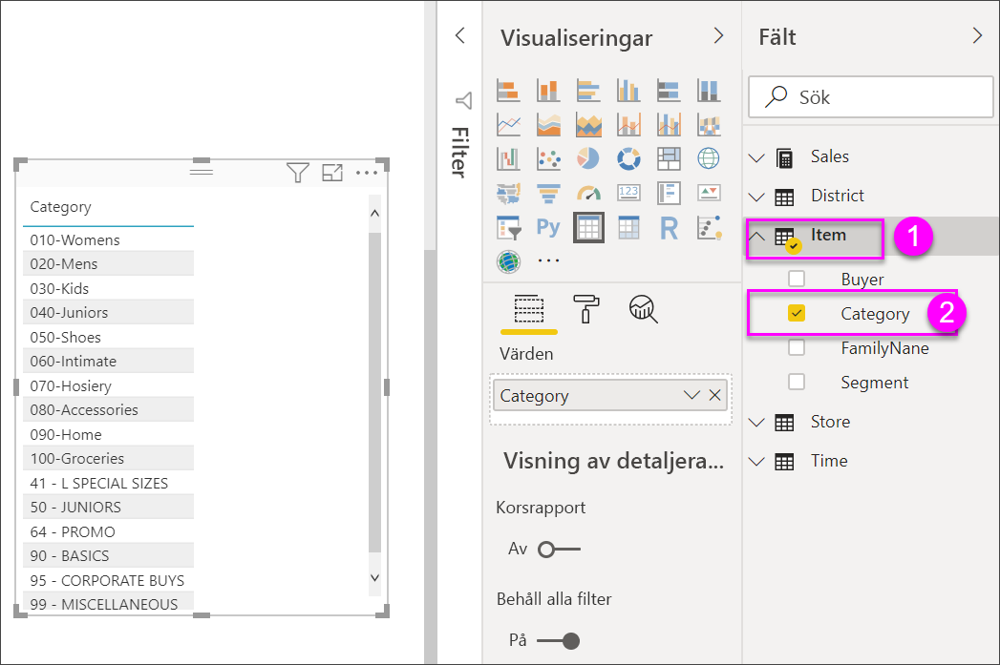

1. Välj **Försäljning > Genomsnittligt enhetspris** och **Försäljning > Senaste årets försäljning**.

1. Välj sedan **Försäljning > Försäljning detta år** och välj alla tre alternativen: **Värde**, **Mål** och **Status**.

1. Identifiera området **Värden** i fönstret **Visualiseringar** och markera värdena tills ordningen på diagramkolumnerna matchar den första bilden på den här sidan. Dra värdena i området vid behov. Området **Värden** bör se ut så här:

    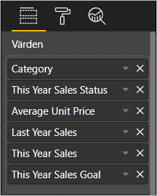

## Formatera tabellen

Det finns många sätt för att formatera en tabell. Här beskrivs bara några av dem. Ett bra sätt att lära sig mer om de andra formateringsalternativen är att öppna fönstret **Format** (rollerikonen ) och utforska det.

* Försök att formatera tabellrutnätet. Här lägger du till ett blått lodrätt rutnät, lägger till utrymme i raderna och ökar kantlinjen och textstorleken.

    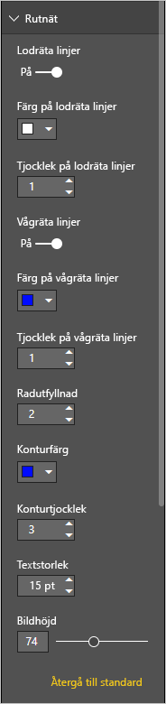

    

* Ändra bakgrundsfärgen för kolumnrubrikerna, lägg till en kantlinje och öka teckenstorleken.

    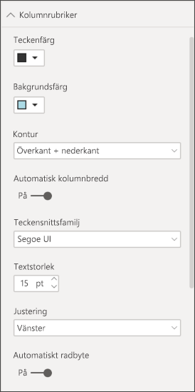

    

* Du kan även formatera enskilda kolumner och kolumnrubriker. Starta genom att utvidga **Fältformatering** och markera den kolumn som ska formateras från listrutan. Med **Fältformatering** kan du, beroende på kolumnvärdena, t.ex. ange visningsenheter, teckensnittsfärg, antal decimaler, bakgrund, justering och mycket mer. När du har justerat inställningarna kan du ange om dessa inställningar även ska tillämpas på rubrik och summarad.

    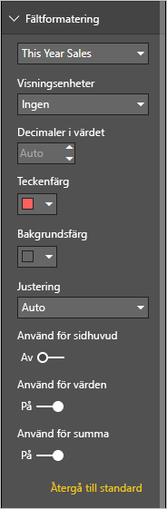

    

* Här är vår slutliga tabell, efter ytterligare lite formatering.

    

### Villkorsstyrd formatering

*Villkorsstyrd formatering* är en typ av formatering. Power BI använder villkorsstyrd formatering för fälten i området **Värden** i fönstret **Visualiseringar**.

Med villkorsstyrd formatering för tabeller kan du specificera anpassade cellbakgrundsfärger och teckenfärg baserat på cellvärden, inklusive toningar.

1. I fönstret **Visualiseringar** väljer du ikonen **Fält**.

1. Välj nedpilen bredvid värdet i området **Värden** som du vill formatera (eller högerklicka på fältet).

    > [!NOTE]
    > Du kan endast hantera villkorsstyrd formatering för fälten i området **Värden** i brunnen **Fält**.

    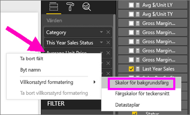

1. Välj **Bakgrundsfärg**.

1. I dialogrutan som visas kan du konfigurera färgen samt **min-** och **max**-värden. Om du väljer alternativet **Divergerande** kan du även konfigurera ett valfritt **centreringsvärde**.

    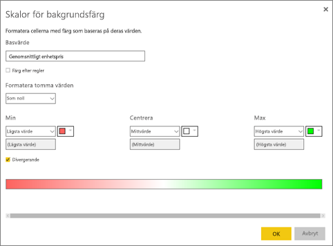

    Vi kan lägga till anpassad formatering våra värden för Genomsnittligt enhetspris. Välj **Divergerande**, lägg till några färger och välj **OK**.

    
1. Lägg till ett nytt fält i tabellen som innehåller både positiva och negativa värden. Välj **Försäljning > Total försäljningsvarians**.

    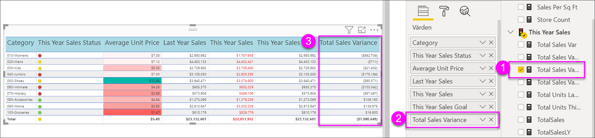

1. Lägg till datastapeln villkorsstyrd formatering genom att välja nedåtpilen bredvid **Total försäljningsvarians** och välja **Villkorsstyrd formatering > Datastaplar**.

    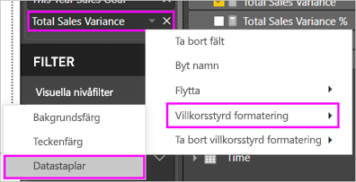

1. I dialogrutan som visas anger du färger för **Positiv stapel** och **Negativ stapel**, markerar alternativet **Visa enbart stapel** och gör eventuella andra ändringar som du önskar.

    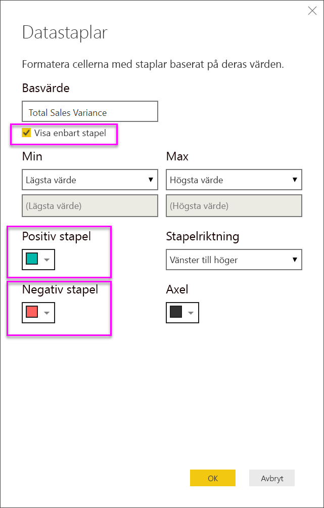

1. Välj **OK**.

    Datastaplar ersätter de numeriska värdena i tabellen, vilket gör den lättare att söka igenom.

    

Om du vill ta bort villkorlig formatering från en visualisering, bara högerklickar du på fältet igen och väljer **Ta bort villkorsstyrd formatering**.

> [!TIP]
> Villkorsstyrd formatering är också tillgängligt från fönstret **Format**. Välj värdet att formatera och växla sedan **färgskalor** eller **datastaplar** till **På** för att använda standardinställningarna eller, om du vill anpassa inställningarna, välj **Avancerade kontroller**.

## Kopiera värden från Power BI-tabeller så att du kan använda dem i andra program

Din tabell eller matris kan ha innehåll som du vill använda i andra program som Dynamics CRM eller Excel eller t.o.m. i andra Power BI-rapporter. Genom att högerklicka i en cell i Power BI kan du kopiera de data som finns i cellen, eller ett urval av celler, till Urklipp och sedan klistra in informationen i de andra programmen.

För att kopiera värdet i en cell:

1. Markera den cell som du vill kopiera.

1. Högerklicka i cellen.

1. Välj **Kopiera** > **Kopiera värde**.

    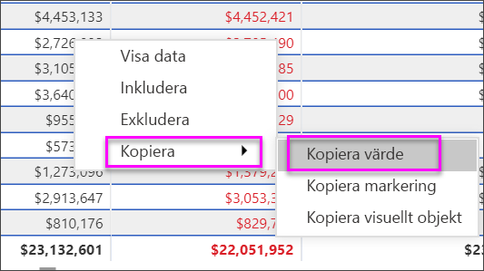

    Med det oformaterade cellvärdet i Urklipp kan du nu klistra in det i ett annat program.

För att kopiera fler än en cell:

1. Markera ett område med celler eller använd **Ctrl** för att välja en eller flera celler.

1. Högerklicka i en av cellerna som du har valt.

1. Välj **Kopiera** > **Kopiera markering**.

    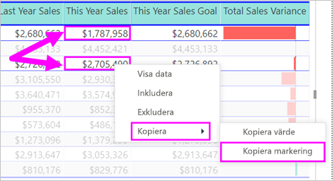

## Justera kolumnbredden i en tabell

Power BI trunkerar ibland en kolumnrubrik i en rapport eller på en instrumentpanel. Om du vill visa hela kolumnnamnet håller du muspekaren över utrymmet till höger om rubriken för att visa dubbelpilarna, markerar och drar.

## Överväganden och felsökning

Om du lägger till kolumnformatering kan du bara välja ett justeringsalternativ per kolumn: **automatisk justering**, **vänsterjustering**, **centrering**, **högerjustering**. Oftast innehåller en kolumn antingen text eller tal, inte en blandning av både text och tal. Om en kolumn innehåller både tal och text, vänsterjusteras texten och talen högerjusteras om du väljer **Auto**. Det här beteendet används med ”vänster till höger”-språk.

## Nästa steg

* [Trädkartor i Power BI](power-bi-visualization-treemaps.md)

* [Visualiseringstyper i Power BI](power-bi-visualization-types-for-reports-and-q-and-a.md)
