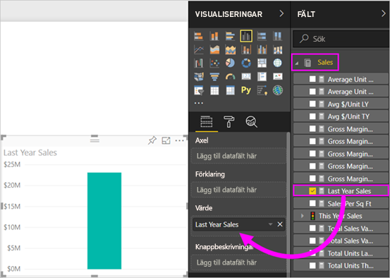
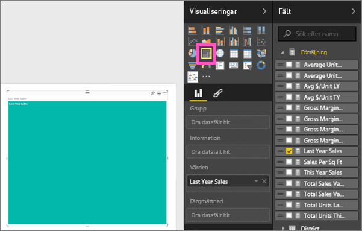
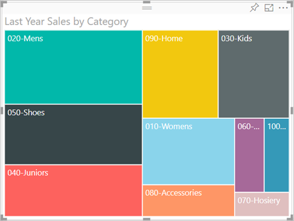
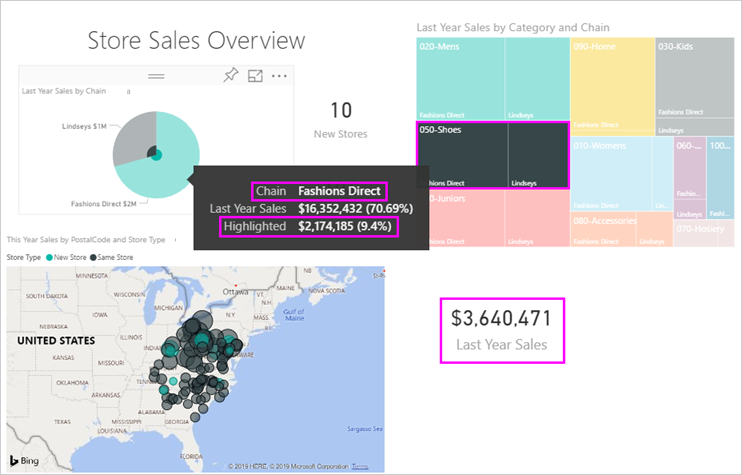

# Trädkartor i Power BI
Trädkartor visar hierarkiska data som en uppsättning kapslade rektanglar.  Varje nivå i hierarkin representeras av en färgad rektangel (som ofta kallas en ”gren”) som innehåller andra rektanglar (”löv”).  Utrymmet i varje rektangel fördelas utifrån vilka värden som mäts. Rektanglarna ordnas i storleksordning med de största överst till vänster och de minsta längst ned till höger.

Om jag till exempel analyserar min försäljning, kan jag ha rektanglar på översta nivån, kallas*grenar*, för klädkategorierna: **Staden**, **landet**, **ungdom** och **blandat**.  Mina kategorirektanglar delas upp i mindre rektanglar som kallas *löv*, och som representerar olika klädtillverkare inom den kategorin. De mindre rektanglarna får sin storlek och färgning baserat på antalet sålda artiklar.  

I grenen **Urbant** ovan, såldes massor kläder från `Maximus`, mindre från `Natura` och `Fama`, och få från `Leo`.  Grenen **Urbant** i min trädkarta har därmed:
* den största rektangeln för `Maximus` i det övre vänstra hörnet
* något mindre rektanglar för `Natura` och `Fama`
* massor av andra rektanglar för alla andra sålda kläder 
* en liten rektangel för `Leo`.  

Och jag skulle kunna jämföra antalet sålda artiklar med de övriga klädkategorierna genom att jämföra storlek och färgning för varje lövnod; ju större rektangel och ju mörkare färg, desto högre värde.

## När du ska använda en trädkarta
Trädkartor är ett bra alternativ:

* för att visa stora mängder hierarkiska data,
* när ett stapeldiagram inte på ett effektivt sätt kan hantera ett stort antal värden,
* för att visa proportionerna mellan delarna och helheten,
* för att visa distributionsmönstret för mätvärdena för varje nivå av kategorier i hierarkin,
* för att visa attribut med hjälp av storlek och färgkodning,
* för att upptäcka mönster, avvikande värden, de viktigaste bidragande faktorerna och undantag.

### Förutsättningar
 - Power BI-tjänsten eller Power BI Desktop
 - Exempel på detaljhandelsanalys

## Skapa en grundläggande trädkarta
Vill du först se någon annan skapa en trädkarta?  Hoppa till 2:10 i det här videoklippet och se Amanda skapa en trädkarta.

<iframe width="560" height="315" src="https://www.youtube.com/embed/IkJda4O7oGs" frameborder="0" allowfullscreen></iframe>

Eller skapa en egen trädkarta. Dessa anvisningar använder sig av Exempel på detaljhandelsanalys. Logga in i Power BI-tjänsten och välj **Hämta data \> Exempel \> Exempel på detaljhandelsanalys \> Anslut \> Gå till instrumentpanel**. För att skapa visualiseringar i en rapport måste du ha redigeringsbehörigheter för datauppsättningen och rapporten. Som tur är kan Power BI-exemplen redigeras. Men du kan inte lägga till visualiseringar i en rapport som någon har delat med dig.  

1. Välj panelen ”Totalt antal butiker” för att öppna rapporten Exempel på detaljhandelsanalys.    
2. Öppna [Redigeringsvyn](../service-interact-with-a-report-in-editing-view.md) och välj måttet **Försäljning** > **Förra årets försäljning**.   
      
3. Konvertera diagrammet till en trädkarta.  
      
4. Dra **Artikel** > **Kategori** till området **Grupp**. Power BI skapar en trädkarta där storleken på rektanglarna bygger på total försäljning och färgen representerar kategorin.  I princip har du skapat en hierarki som visuellt beskriver den relativa storleken för den totala försäljningen per kategori.  Kategorin **Mens (Herr)** har den högsta försäljningen och kategorin **Hosiery (Trikå)** har den lägsta.   
      
5. Dra **Store** > **kedjan** till den **information** bra för att slutföra din treemap. Nu kan du jämföra förra årets försäljning efter kategori och kedja.   
   
   
   > [!NOTE]
   > Färgmättnad och Information kan inte användas samtidigt.
   > 
   > 
5. Hovra över ett **kedjeområde** för att visa verktygstips för den delen av **kategorin**.  Om du exempelvis hovrar över **Fashions Direct** i rektangeln **090-Home** visas en knappbeskrivning för delen Fashions Direct i kategorin Home.  
   
6. [Lägg till trädkartan som en panel på instrumentpanelen (fäst det visuella objektet)](../service-dashboard-tiles.md). 
7. [Spara rapporten](../service-report-save.md).

## Markering och korsfiltrering
Information om hur du använder filterfönstret finns i [Lägg till ett filter i en rapport](../power-bi-report-add-filter.md).

Om du markerar en kategori eller information i en trädkarta, korsmarkeras och korsfiltreras de övriga visualiseringarna på rapportsidan ... och vice versa. Lägg till några visuella objekt på den här rapportsidan eller kopiera trädkartan till någon av de andra icke-tomma sidorna i den här rapporten.

1. Välj en kategori eller en kedja inom en kategori på trädkarta.  Detta korsmarkerar de övriga visualiseringarna på sidan. Om du till exempel väljer **050-Shoes (050-Skor)**, får du veta att förra årets skoförsäljning uppgick till USD 3 640 471 varav USD 2 174 185 kom från Fashions Direct.  
   

2. I om du väljer delen **Fashions Direct** i cirkeldiagrammet **Senaste årets försäljning per kedja**, korsfiltreras trädkartan.  
       

3. För att hantera hur diagram korsmarkeras och korsfiltrerar varandra, se [Visualiseringsinteraktioner i en Power BI-rapport](../service-reports-visual-interactions.md)

## Nästa steg

[Vattenfallsdiagram i Power BI](power-bi-visualization-waterfall-charts.md)

[Visualiseringstyper i Power BI](power-bi-visualization-types-for-reports-and-q-and-a.md)