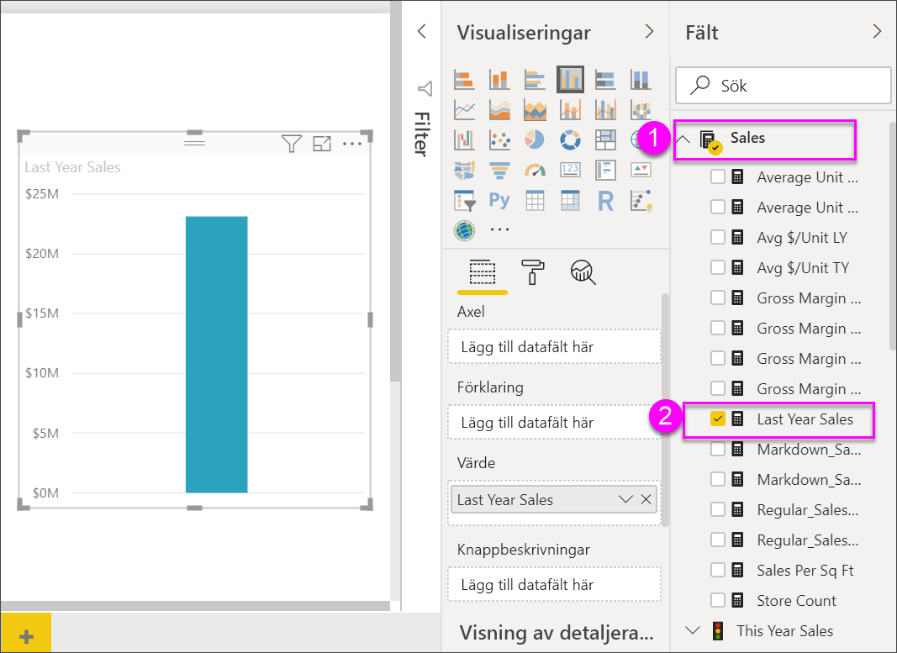

# Trädkartor i Power BI

[!INCLUDE[consumer-appliesto-nyyn](../includes/consumer-appliesto-nyyn.md)]

[!INCLUDE [power-bi-visuals-desktop-banner](../includes/power-bi-visuals-desktop-banner.md)]

Trädkartor visar hierarkiska data som en uppsättning kapslade rektanglar. Varje nivå i hierarkin representeras av en färgad rektangel (gren) som innehåller mindre rektanglar (löv). Power BI baserar storleken på utrymmet i varje rektangel på det uppmätta värdet. Rektanglarna ordnas i storleksordning med de största överst till vänster och de minsta längst ned till höger.

Om du analyserar er försäljning kanske ni till exempel har grenar på högsta nivån för klädkategorierna **Staden**, **landet**, **ungdom** och **blandat**. Power BI skulle dela era kategorirektanglar i blad för klädtillverkarna i den här kategorin. Löven skulle få sin storlek och skuggning baserat på antalet sålda artiklar.

I grenen **Urbant** ovan, såldes massor av **VanArsdel**-kläder. Mindre med **Natura** och **Fama** såldes. Och bara några **Leo** såldes. Så, grenen **Urbant** i din trädkarta har

* den största rektangeln för **VanArsdel** i det övre vänstra hörnet

* något mindre rektanglar för **Natura** och **Fama**

* massor av andra rektanglar för alla andra sålda kläder

* en liten rektangel för **Leo**.

Du skulle kunna jämföra antalet sålda artiklar med de övriga klädkategorierna genom att jämföra storlek och färg för varje lövnod; ju större rektangel och ju mörkare färg, desto högre värde.

## När du ska använda en trädkarta

Trädkartor är ett bra alternativ:

* för att visa stora mängder hierarkiska data

* när ett stapeldiagram inte på ett effektivt sätt kan hantera ett stort antal värden

* för att visa proportionerna mellan delarna och helheten

* för att visa distributionsmönstret för mätvärdena för varje nivå av kategorier i hierarkin

* för att visa attribut med hjälp av storlek och färgkodning

* för att upptäcka mönster, avvikande värden, de viktigaste bidragande faktorerna och undantag.

## Förutsättning

De här självstudierna använder sig av [PBIX-filen Exempel på detaljhandelsanalys](https://download.microsoft.com/download/9/6/D/96DDC2FF-2568-491D-AAFA-AFDD6F763AE3/Retail%20Analysis%20Sample%20PBIX.pbix).

1. Välj **Arkiv** > **Öppna** uppe till vänster på menyraden
   
2. Leta reda på kopian av **PBIX-filen Exempel för detaljhandelsanalys**

1. Öppna **PBIX-filen Exempel för detaljhandelsanalys** i rapportvyn .

1. Välj  för att lägga till en ny sida.

> [!NOTE]
> För att dela en rapport med en Power BI-kollega krävs att du både har individuella Power BI Pro-licenser eller att rapporten har sparats med Premium-kapacitet.    

När du har hämtat datamängden **Exempel på detaljhandelsanalys** kan du sätta igång.

## Skapa en grundläggande trädkarta

Du skapar en rapport och lägger till en grundläggande trädkarta.

1. I fönstret **Fält** väljer du måtten **Försäljning** > **Senaste årets försäljning**.

   

1. Välj trädkartsikonen  för att konvertera diagrammet till en trädkarta.

   

1. Välj **Artikel** > **Kategori** som lägger till **Kategori** i området **Grupp**.

    Power BI skapar en trädkarta där storleken på rektanglarna bygger på total försäljning och färgen representerar kategorin. I princip har du skapat en hierarki som visuellt beskriver den relativa storleken för den totala försäljningen per kategori. Kategorin **Mens (Herr)** har den högsta försäljningen och kategorin **Hosiery (Trikå)** har den lägsta.

    

1. Välj **Butik** > **Kedja** som lägger till **Kedja** i området **Information** för att slutföra trädkartan. Nu kan du jämföra förra årets försäljning efter kategori och kedja.

   

   > [!NOTE]
   > Färgmättnad och Information kan inte användas samtidigt.

1. Hovra över ett **kedjeområde** för att visa verktygstips för den delen av **kategorin**.

    Om du exempelvis hovrar över **Fashions Direct** i rektangeln **090-Home** visas en knappbeskrivning för delen Fashions Direct i kategorin Home.

   

## Markering och korsfiltrering

Om du markerar en **kategori** eller **information** i en trädkarta, korsmarkeras och korsfiltreras de övriga visualiseringarna på rapportsidan. Lägg till några visuella objekt på den här rapportsidan eller kopiera trädkartan till någon av de andra sidorna i den här rapporten. Bilden nedan på trädkartan kopierades över till sidan **Översikt**. 

1. Välj en **Kategori** eller en **Kedja** inom en **Kategori** på trädkartan. Detta korsmarkerar de övriga visualiseringarna på sidan. Om du till exempel väljer **050-Skor**, får du veta att förra årets skoförsäljning uppgick till **USD 16 352 432** varav **USD 2 174 185** kom från **Fashions Direct**.

   

1. I om du väljer delen **Fashions Direct** i cirkeldiagrammet **Senaste årets försäljning per kedja**, korsfiltreras trädkartan.
   

1. För att hantera hur diagram korsmarkeras och korsfiltrerar varandra, se [Ändra hur visuella objekt interagerar i en Power BI-rapport](../service-reports-visual-interactions.md).

## Nästa steg

* [Vattenfallsdiagram i Power BI](power-bi-visualization-waterfall-charts.md)

* [Visualiseringstyper i Power BI](power-bi-visualization-types-for-reports-and-q-and-a.md)
