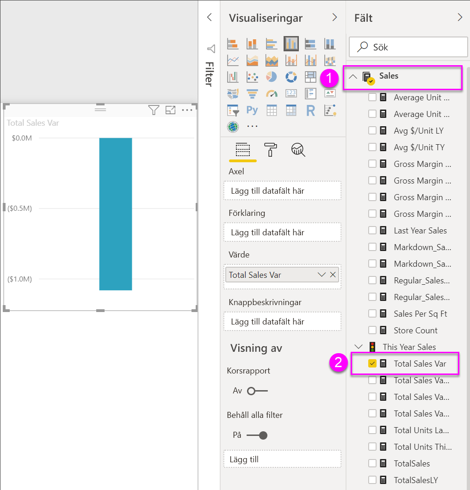
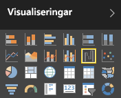
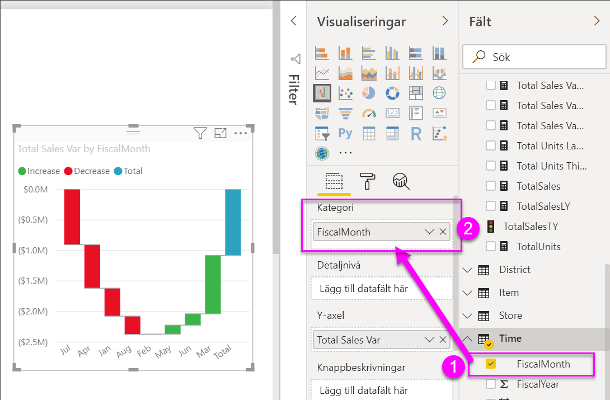
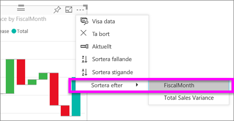
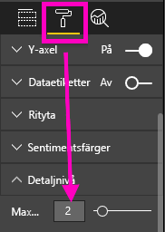

# Vattenfallsdiagram i Power BI

Vattenfallsdiagram visar löpande summa efter hand som Power BI adderar eller subtraherar värden. Det är användbara för att förstå hur ett startvärde (som nettointäkter) påverkas av en serie positiva eller negativa förändringar.

Kolumnerna är färgkodade så att du snabbt kan se ökningar och minskningar. Kolumnerna med start- och slutvärde [startar ofta på den horisontella axeln](https://support.office.com/article/Create-a-waterfall-chart-in-Office-2016-for-Windows-8de1ece4-ff21-4d37-acd7-546f5527f185#BKMK_Float "startar ofta på den horisontella axeln"), medan de mellanliggande värdena är flytande kolumner. På grund av det här utseendet kallas också vattenfallsdiagram ibland för brodiagram.

<iframe width="560" height="315" src="https://www.youtube.com/embed/qKRZPBnaUXM" frameborder="0" allow="autoplay; encrypted-media" allowfullscreen></iframe>

## När du ska använda ett vattenfallsdiagram

Vattenfallsdiagram är ett bra alternativ

* när ändringar inträffar för måttet över tid, i serie eller för olika kategorier

* för att granska de viktigaste ändringarna som bidrar till det totala värdet

* för att rita företagets årliga vinst genom att visa olika intäktskällor och komma fram till den totala vinsten (eller förlusten)

* för att illustrera inledande och avslutande personalstyrka för ditt företag under ett år

* för att visualisera hur mycket pengar ni tjänar och spenderar varje månad och den löpande balansen för räkenskaperna.

## Förutsättningar

* Power BI-tjänsten eller Power BI Desktop

* Rapporten Exempel på detaljhandelsanalys

## Hämta rapporten Exempel på detaljhandelsanalys

Dessa anvisningar använder sig av Exempel på detaljhandelsanalys. För att skapa en visualisering krävs behörighet att redigera datauppsättningen och rapporten. Som tur är kan alla Power BI-exemplen redigeras. Om någon delar en rapport med dig, kan du inte skapa visualiseringar i rapporter. Om du vill följa med, kan du hämta [rapporten Exempel på detaljhandelsanalys](../sample-datasets.md).

När du har hämtat datamängden **Exempel på detaljhandelsanalys** kan du sätta igång.

## Skapa ett vattenfallsdiagram

Du ska skapa ett vattenfallsdiagram som visar försäljningsvarians (uppskattad försäljning jämfört med faktisk försäljning) per månad.

1. Från **Min arbetsyta** väljer du **Datamängder** > **Skapa en rapport**.

    

1. Välj **Försäljning** > **Total försäljningsvarians** på panelen **Fält**.

   

1. Välj vattenfallsikonen  för att konvertera diagrammet till en trädkarta.

    Om **Total försäljningsvarians** inte finns i **Y-axelområdet**, drar du den dit.

    

1. Välj **Tid**  >  **FiscalMonth (Räkenskapsmånad)** och lägg till det i området **Kategori**.

    

1. Kontrollera att Power BI sorterade vattenfallsdiagrammet kronologiskt. Välj ellipsen (...) i det övre högra hörnet i diagrammet.

    Kontrollera att det finns en gul indikator till vänster om alternativen **Sortera stigande** och **FiscalMonth** (Räkenskapsmånad).

    

    Du kan också titta på X-axelns värden och se att de är i ordning från **Jan** till **Aug**.

    Gräv lite djupare för att se vad som bidrar mest till ändringarna månad för månad.

1. Dra **Butik** > **Territorium** till bucketen **Detaljnivå**.

    

    Som standard lägger Power BI till de fem främsta bidragande faktorerna för ökning eller minskning per månad.

    

    Du är bara intresserad av de två främsta.

1. Välj **Detaljnivå** på panelen **Format** och ange **Max uppdelningar** till **2**.

    

    En snabb genomgång visar att territorierna Ohio och Pennsylvania står för de största rörelserna, både negativa och positiva, i vårt vattenfallsdiagram.

    

    Det är ett intressant fynd. Har Ohio och Pennsylvania så stor inverkan eftersom försäljningen i dessa två områden är mycket högre än i de andra områdena? Du kan kontrollera det.

1. Skapa en karta som visar försäljningen per territorium för det här och det senaste året.

    

    Kartan stöder din teori. Den visar att de här två områdena hade det högsta försäljningsvärdet förra året (bubbelstorlek) och det här året (bubbelskuggning).

## Markering och korsfiltrering

Information om hur du använder fönstret **Filter** finns i artikeln om att [lägga till ett filter i en rapport i redigeringsvyn](../power-bi-report-add-filter.md).

Om du markerar en kolumn i ett vattenfallsdiagram, korsfiltreras de övriga visualiseringarna på rapportsidan, och vice versa. Kolumnen **Totalt** utlöser dock ingen markering och svarar inte på korsfiltrering.

## Nästa steg

* [Ändra hur visuella objekt interagerar i en Power BI-rapport](../service-reports-visual-interactions.md)

* [Visualiseringstyper i Power BI](power-bi-visualization-types-for-reports-and-q-and-a.md)
