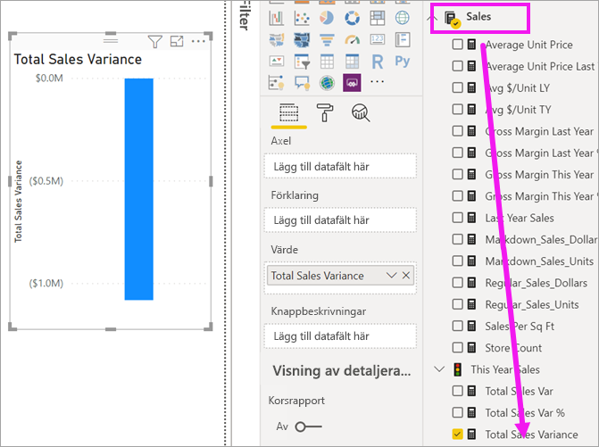
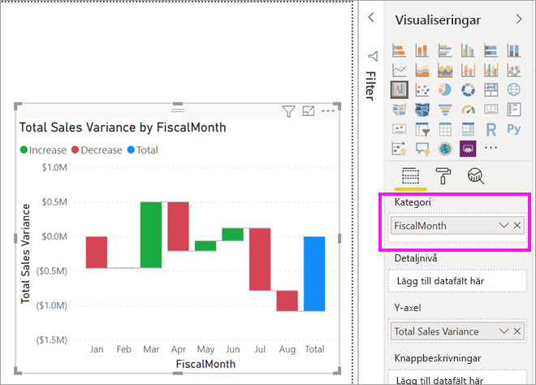
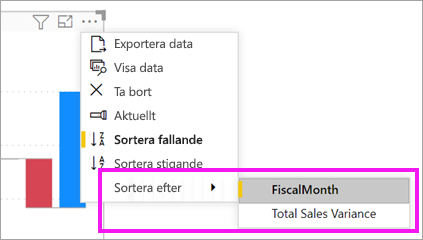
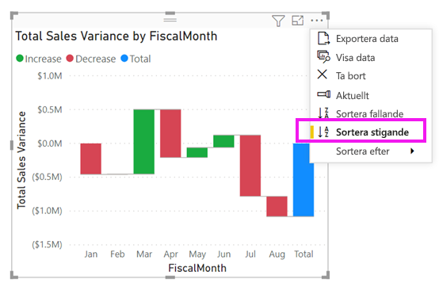
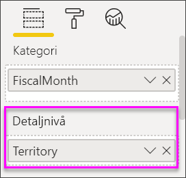
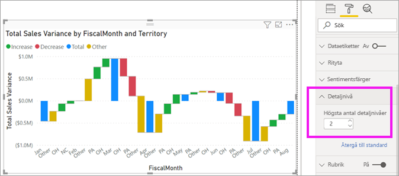

# Vattenfallsdiagram i Power BI

[!INCLUDE [power-bi-visuals-desktop-banner](../includes/power-bi-visuals-desktop-banner.md)]

Vattenfallsdiagram visar löpande summa efter hand som Power BI adderar eller subtraherar värden. Det är användbara för att förstå hur ett startvärde (som nettointäkter) påverkas av en serie positiva eller negativa förändringar.

Kolumnerna är färgkodade så att du snabbt kan se ökningar och minskningar. Kolumnerna med start- och slutvärde [startar ofta på den vågräta axeln](https://support.office.com/article/Create-a-waterfall-chart-in-Office-2016-for-Windows-8de1ece4-ff21-4d37-acd7-546f5527f185#BKMK_Float "börja på den vågräta axeln"), medan de mellanliggande värdena är flytande kolumner. På grund av det här utseendet kallas också vattenfallsdiagram ibland för brodiagram.

   > [!NOTE]
   > Den här videon använder en äldre version av Power BI Desktop.
   > 
   > 

<iframe width="560" height="315" src="https://www.youtube.com/embed/qKRZPBnaUXM" frameborder="0" allow="autoplay; encrypted-media" allowfullscreen></iframe>

## När du ska använda ett vattenfallsdiagram

Vattenfallsdiagram är ett bra alternativ

* när ändringar inträffar för måttet över tid, i serie eller för olika kategorier

* för att granska de viktigaste ändringarna som bidrar till det totala värdet

* för att rita företagets årliga vinst genom att visa olika intäktskällor och komma fram till den totala vinsten (eller förlusten)

* för att illustrera inledande och avslutande personalstyrka för ditt företag under ett år

* för att visualisera hur mycket pengar ni tjänar och spenderar varje månad och den löpande balansen för räkenskaperna.

## Förutsättning

De här självstudierna använder sig av [PBIX-filen Exempel på detaljhandelsanalys](https://download.microsoft.com/download/9/6/D/96DDC2FF-2568-491D-AAFA-AFDD6F763AE3/Retail%20Analysis%20Sample%20PBIX.pbix).

1. Välj **Arkiv** > **Öppna** uppe till vänster på menyraden
   
2. Leta reda på kopian av **PBIX-filen Exempel för detaljhandelsanalys**

1. Öppna **PBIX-filen Exempel för detaljhandelsanalys** i rapportvyn .

1. Välj  för att lägga till en ny sida.

## Skapa ett vattenfallsdiagram

Du ska skapa ett vattenfallsdiagram som visar försäljningsvarians (uppskattad försäljning jämfört med faktisk försäljning) per månad.

### Skapa vattenfallsdiagrammet

1. Välj **Försäljning** > **Total försäljningsvarians** på panelen **Fält**.

   

1. Välj vattenfallsikonen 

    

1. Välj **Tid** > **FiscalMonth (Räkenskapsmånad)** och lägg till det i området **Kategori**.

    

### Sortera vattenfallsdiagrammet

1. Se till att Power BI sorterar vattenfallsdiagrammet kronologiskt efter månad. Välj **Fler alternativ** (...) uppe till höger i diagrammet.

    I det här exemplet väljer du **Sortera efter** och sedan **FiscalMonth**. En gul indikator bredvid valet anger när urvalsalternativet används.

    
    
    Om du vill visa månaderna i kronologisk ordning väljer du **Sortera stigande**. Precis som i föregående steg kontrollerar du att det visas en gul indikator till vänster om **Sortera stigande**. Det här anger att ditt valda alternativ används.

    

    

    Observera att diagrammet sorteras från januari till augusti för FiscalMonth.  

### Utforska vattenfallsdiagrammet

Gräv lite djupare för att se vad som bidrar mest till ändringarna månad för månad.

1.  Välj **Butik** > **Område**. Då läggs **Område** till i bucketen **Detaljnivå**.

    

    Power BI använder värdet i **Detaljnivå** för att lägga till ytterligare data i visualiseringen. Som standard läggs de fem främsta bidragande faktorerna för ökning eller minskning till per månad. Det innebär till exempel att februari nu har sex datapunkter i stället för bara en.  

    

    Vi antar att du bara är intresserad av de två främsta faktorerna.

1. Välj **Detaljnivå** på panelen **Format** och ange **Max uppdelningar** till **2**.

    

    En snabb genomgång visar att territorierna Ohio och Pennsylvania står för de största rörelserna, både negativa och positiva, i vårt vattenfallsdiagram.

    

## Nästa steg

* [Ändra hur visuella objekt interagerar i en Power BI-rapport](../service-reports-visual-interactions.md)

* [Visualiseringstyper i Power BI](power-bi-visualization-types-for-reports-and-q-and-a.md)
