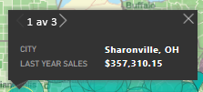
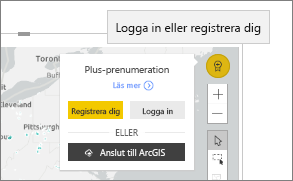

# Interagera med ArcGIS-kartor i Power BI
Det här avsnittet skrivs utifrån perspektivet av en person som använder en ArcGIS-karta i Power BI-tjänsten, Desktop eller i en mobil lösning. När en designer har delat en ArcGIS-karta för visuellt Power BI-objekt med dig finns det många sätt att interagera med det.  Mer information om hur du skapar en ArcGIS-karta finns i [självstudierna om ArcGIS-kartor från Esri](../visuals/power-bi-visualization-arcgis.md).

Kombinationen av ArcGIS-kartor och Power BI tar mappning längre än till bara presentation av punkter på en karta – helt enkelt till en helt ny nivå. Rapportdesigners börjar med en karta och kopplar lager med demografiska data till kartan. Kombinationen av de här platsbaserade dataskikten (som insamlade data) på en karta med spatial analys ger en bättre förståelse av dina data i visualiseringen.

> [!TIP]
> GIS står för Geographic Information System.
> 

Den här ArcGIS-kartan för visuella Power BI-objekt visar förra årets försäljning per stad och använder en gatukarta och ett genomsnittligt referensskikt för hushållsinkomst. Kartan innehåller två stift (rött och gult) och en körtidsradie (i lila).

> [!TIP]
> Besök [Esris sida om Power BI](https://www.esri.com/powerbi) för att visa de många exemplen eller läsa kundutlåtanden. Gå sedan till Esris [startsida för att komma igång med ArcGIS Maps for Power BI](https://doc.arcgis.com/en/maps-for-powerbi/get-started/about-maps-for-power-bi.htm).
> 
> 

## Användargodkännande

Första gången en kollega delar en ArcGIS-karta med dig, visar Power BI en fråga om medgivande. ArcGIS Maps for Power BI tillhandahålls av Esri (https://www.esri.com) och din användning av ArcGIS Maps for Power BI gäller enligt Esris villkor och sekretesspolicy. Power BI-användare som vill använda de visuella objekten i ArcGIS Maps för Power BI måste ge sitt godkännande i dialogrutan.

## Förstå skikten

En visuellt ArcGIS Maps for Power BI-objekt kan ha flera olika typer av skikt med demografisk platsinformation.

### Grundläggande kartor

Varje visuellt ArcGIS Maps for Power BI-objekt börjar med en bas karta. Tänk på baskartor som arbetsytan för data. En baskarta kan vara en grundläggande mörk eller ljus arbetsyta,

 

eller en arbetsyta med gatu- och transportinformation. 

  

Baskartan tillämpas på hela arbetsytan, och när du panorerar och zoomar uppdateras kartan. Zooma in för att se mer detaljerad information om gata och transport. När du panorerar från en kontinent till en annan är detaljnivån konstant. Här har vi panorerat från Porto till Beijing.

  

### Referenslager

En *rapportdesigner* kan lägga till ett referensskikt. Referenskikt är värdar för ESRI och ger ett ytterligare lager med demografisk information om en plats. Exemplet nedan har ett referensskikt för populationstäthet. Mörkare färger representerar högre densitet.

  

### Informationsgrafik

En *rapportdesigner* kan lägga till många informationsgrafiklager. Informationsgrafik är snabb visuella indikatorer som visas längs höger sida av den visuella arbetsytan. Informationsgrafik finns i Esri och ger ytterligare ett lager med demografisk information om en plats. I exemplet nedan används tre informationsgrafiker. De visas inte på själva kartan, utan på kort. Informationsgrafikkorten uppdateras när du zoomar, panorerar och väljer områden på kartan.

  

### Stift

Stift representerar exakta platser, som en stad eller en adress. Ibland använder *rapportdesigners* stift med körtidsradier. I det här exemplet visas butiker inom en radie på 50 miles i Charlotte i North Carolina.

 

## Interagera med ett visuellt ArcGIS Maps for Power BI-objekt
Vilka funktioner som är tillgängliga beror på hur rapporten delades med dig och din Power BI-kontotyp. Kontakta system administratören om du har frågor. Visuella ArcGIS Maps for Power BI-objekt fungerar ungefär som andra visuella objekt i en rapport. Du kan [visa de data som används för att skapa visualiseringen](../consumer/end-user-show-data.md), se kartan i [fokusläge och fullskärmsläge](../consumer/end-user-focus.md), [lägga till kommentarer](../consumer/end-user-comment.md), [interagera med de filter](../consumer/end-user-report-filter.md) som anges av *rapportdesignern* med mera. Visuella ArcGIS-objekt kan korsfiltrera andra visuella objekt på rapportsidan och vice versa.

Hovra över baskartplatser (till exempel ett bubbeldiagram) för att visa knappbeskrivningar. Använd dessutom ArcGIS visuella markeringsverktyg för att visa fler knappbeskrivningar och för att göra vissa val på baskartan eller referensskiktet.  

### Valverktyg

Du finns fem lägen för att välja datapunkter i ArcGIS Maps för Power BI. Du kan välja högst 250 datapunkter i taget.

#### Enkelvalsverktyget

 

Välj en datapunkt, ett bubbeldiagram, ett stift eller en enskild datapunkt från referensskiktet. Power BI visar en knappbeskrivning med information om ditt val. Enkelval korsfiltrerar de andra visuella objekten på rapportsidan baserat på ditt val och uppdaterar informationsgrafikkorten för det valda området. 

Här har vi valt en brun bubbeldiagram-datapunkt från vår baskarta. Power BI:
- markerar vårt val,
- visar en knappbeskrivning för datapunkten, 
- uppdaterar informationsgrafikkorten för att visa data för bara vårt val och
- korsmarkerar stapeldiagrammet.

Om kartan har ett referensskikt kan du välja platser där du vill visa detaljer i en knappbeskrivning. Här har vi valt countyt Seneca och ser data från referensskiktet (populationstäthet) som *rapportdesignern* lagt till på kartan. I det här exemplet innehåller vår datapunkt två olika regioner, så vår knappbeskrivning har två sidor. Varje sida har ett diagram. Välj en stapel i diagrammet för att visa mer information. 

> [!TIP]
  > Ibland kan du minska antalet knappbeskrivningssidor genom att zooma in för att välja en bestämd plats.  Annars kan det hända att Power BI, om det finns överlappande platser, kan visa dig mer än en knappbeskrivning i taget. Välj pilarna för att flytta mellan knappbeskrivningarna.
  > 
  > 

#### Flervalsverktyget

 

Ritar en rektangel på kartan och väljer de inneslutna datapunkterna. Håll ned CTRL om du vill välja fler än ett rektangulärt område. Flerval uppdaterar informationsgrafik-korten för det valda området och korsmarkerar de andra visuella objekten på rapportsidan baserat på ditt val.

 

#### Referensskiktsverktyget

 

Medför att gränser eller polygoner inom referensskikt kan användas för att markera inneslutna datapunkter. Det är svårt att se, men det finns en gul kontur i referensskiktet. Till skillnad från enkelvalsverktyget får vi ingen knappbeskrivning. I stället får vi data om alla datapunkter som finns i kantlinjerna i dispositionen. I det här exemplet innehåller vårt val en datapunkt – den är för en Lindseys-butik i Winston Salem.

 

#### Buffertverktyg

 

Tillåter val av datapunkter med hjälp av ett buffertskikt. Använd exempelvis det här verktyget för att välja en körtidsradie och fortsätta att interagera med resten av rapporten. Enhetens körtidsradie är aktiv och informationsgrafikkorten fortsätter att avspegla körtidsradien, men om du väljer andra datapunkter på kartan korsfiltreras de andra visuella objekten på rapportsidan.

 

#### Verktyget för att hitta liknande

 

Gör att du kan hitta platser med liknande attribut. Du börjar med att välja en eller flera platser av intresse, eller referensplatser, som definierar upp till fem dimensioner som du vill använda i analyser. Verktyget för att hitta liknande beräknar sedan 10 platser på kartan som mest liknar de referensplatser som du har definierat. Du kan sedan använda informationsgrafikkort för att lära dig mer om var och en av dina resultat, skapa körtidsområden för att få en uppfattning om vad som ligger inom avståndet mellan var och en av dessa platser eller till och med använda verktyget för att hitta liknande för att filtrera rapporten och få mer insikter. Det viktigaste är att all beräkning utförs lokalt på din dator, så att du kan vara säker på att dina konfidentiella data förblir skyddade.

## Överväganden och begränsningar
ArcGIS Maps för Power BI finns tillgängligt i följande tjänster och appar:

|Tjänst/app  |Tillgängligt  |
|---------|---------|
|Power BI Desktop     |     Ja    |
|Power BI-tjänsten (app.powerbi.com)     |    Ja     |
|Power BI Mobile-appar     |  Ja      |
|Power BI Publicera på webben     |  Nej       |
|Power BI Embedded     |     Nej    |
|Power BI-tjänstinbäddning (PowerBI.com)  | Nej |

## Hur fungerar ArcGIS Maps for Power BI?
ArcGIS Maps for Power BI tillhandahålls av Esri(https://www.esri.com). Din användning av ArcGIS Maps for Power BI är föremål för Esris [villkor](https://go.microsoft.com/fwlink/?LinkID=8263222) och [sekretesspolicy](https://go.microsoft.com/fwlink/?LinkID=826323). Power BI-användare som vill använda de visuella objekten i ArcGIS Maps for Power BI måste ge sitt godkännande i dialogrutan (mer information finns i avsnittet Användargodkännande).  Användningen av ArcGIS Maps for Power BI från Esri är föremål för Esris villkor och sekretesspolicy. Det finns länkar till dessa från dialogrutan för godkännande. Alla användare måste ge sitt godkännande innan de kan börja använda ArcGIS Maps for Power BI. När användaren gett sitt godkännande skickas data som är kopplade till den visuella informationen till Esris tjänster för geokodning (eller mer), vilket innebär att platsinformationen omvandlas till latitud- och longitudinformation som kan visas på en karta. Utgå från att alla data som är kopplade till datavisualiseringen kan skickas till Esris tjänster. Esri tillhandahåller tjänster som grundläggande kartor, spatialanalyser, geokodning osv. De visuella objekten i ArcGIS Maps for Power BI samverkar med dessa tjänster genom en SSL-anslutning som skyddas av ett certifikat som tillhandahålls och hanteras av Esri. Mer information om ArcGIS Maps for Power BI finns på Esris [produktsida för ArcGIS Maps for Power BI](https://www.esri.com/powerbi).

### Power BI Plus

När användare registrerar sig för en Plus-prenumeration på ArcGIS Maps for Power BI från Esri, upprättar de en direkt relation med Esri. Power BI skickar ingen personlig information om användaren till Esri. Användaren loggar in i och har förtroende för ett AAD-program som tillhandahålls av Esri med sin egen AAD-identitet. Därmed delar användaren sin personliga information direkt med Esri. När användaren lägger till Plus-innehåll till ett visuellt objekt i ArcGIS Maps for Power BI behöver kollegor som vill kunna visa eller redigera innehållet också en Plus-prenumeration från Esri. 

Kontakta Esri via deras supportwebbplats om du har frågor som rör mer detaljerad teknisk information om hur Esris ArcGIS Maps for Power BI fungerar.

## Överväganden och felsökning

**ArcGIS-kartan visas inte**    
I tjänster eller program där ArcGIS Maps för Power BI inte är tillgängligt, visas visualiseringen som ett tomt visuellt objekt med Power BI-logotypen.

**Jag kan inte se all min information på kartan**    
När du geokodar latituden/longituden på kartan visas upp till 30 000 datapunkter. Vid geokodning av datapunkter som postnummer eller gatuadresser geokodas bara de första 15 000 datapunkterna. Geokodning av platsnamn eller länder omfattas inte av gränsen på 1 500 adresser.

**Kostar det något att använda ArcGIS Maps för Power BI?**

ArcGIS Maps för Power BI är tillgängligt för alla Power BI-användare utan extra kostnad. Det är en komponent som tillhandahålls av **Esri** och din användning är föremål för de villkor och den sekretesspolicy som tillhandahålls av **Esri**, i enlighet med vad som nämnts tidigare i den här artikeln. Om du prenumererar på ArcGIS **Plus** tas en avgift ut.

**Jag får ett felmeddelande om att mitt cacheminne är fullt**

Detta är en bugg som vi håller på att åtgärda.  Välj under tiden länken som visas i felmeddelandet för anvisningar om hur du rensar ditt Power BI-cacheminne.

**Kan jag visa mina ArcGIS-kartor offline?**

Nej, Power BI behöver nätverksanslutning för att visa kartor.

## Nästa steg
Få hjälp: **Esri** tillhandahåller [omfattande dokumentation](https://go.microsoft.com/fwlink/?LinkID=828772) om funktionsuppsättningen i **ArcGIS Maps för Power BI**.

Du kan ställa frågor, hitta den senaste informationen, rapportera problem och få svar i Power BI-[communityns tråd om **ArcGIS Maps för Power BI**](https://go.microsoft.com/fwlink/?LinkID=828771).

[Produktsida för ArcGIS Maps för Power BI](https://www.esri.com/powerbi)
